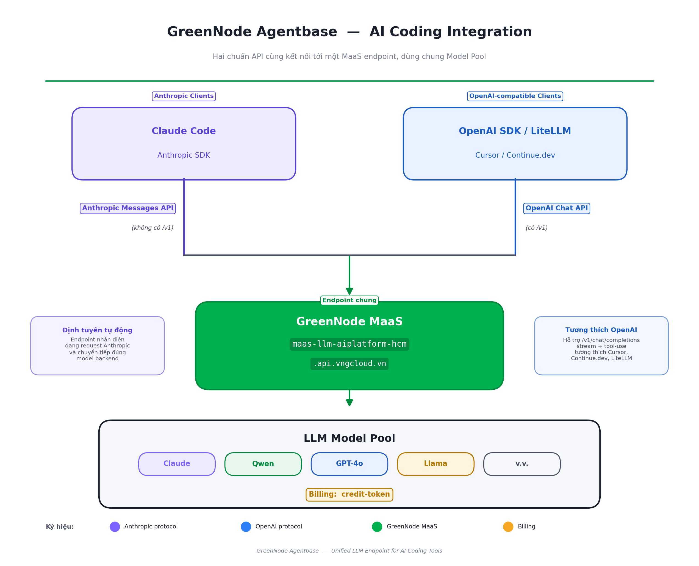

# AI Coding

AI Coding cho phép kết nối các AI coding tool phổ biến — Claude Code, OpenAI SDK, IDE extension — trực tiếp với GreenNode MaaS, dùng model cloud mà không cần tự quản lý key từ các provider ngoài.

---

## Kiến trúc

Request từ tool của bạn được redirect sang GreenNode MaaS endpoint. MaaS expose hai protocol song song để tương thích với mọi client hiện có:

<figure><figcaption>
Hai chuẩn API cùng kết nối tới một MaaS endpoint, dùng chung Model Pool
</figcaption></figure>

Một API key từ AI Platform dùng được cho cả hai protocol.


LLM URL khác nhau theo protocol — xem bảng bên dưới. Dùng sai URL sẽ gây lỗi 404 hoặc request không được parse đúng.


---

## Protocol và LLM URL

| Client | Protocol | LLM URL |
|---|---|---|
| Claude Code, Anthropic SDK | Anthropic Messages API | `https://maas-llm-aiplatform-hcm.api.vngcloud.vn` |
| OpenAI SDK, LiteLLM, Cursor, Continue.dev | OpenAI-compatible | `https://maas-llm-aiplatform-hcm.api.vngcloud.vn/v1` |

---

## Công cụ được hỗ trợ

### Claude Code

Claude Code CLI hỗ trợ override `ANTHROPIC_BASE_URL` — trỏ về GreenNode MaaS thay vì Anthropic trực tiếp. Toàn bộ session, tool call và subagent đều đi qua endpoint GreenNode, billing hiển thị trên AI Platform Console.

### OpenAI-compatible client

Bất kỳ tool nào cho phép set custom `base_url` theo OpenAI SDK format đều hoạt động — OpenAI Python/Node.js SDK, LiteLLM, Cursor, Continue.dev, và các IDE extension khác. Chỉ cần đổi base URL và API key, không cần thay đổi code logic.

---

## Billing

- **Credit-token:** 1 credit = 1 VND
- **Prepaid:** credit bị trừ mỗi chu kỳ collect 5 phút. Khi hết credit → model bị tắt tự động
- **Postpaid:** usage được ghi nợ, không giới hạn quota
- Xem usage real-time tại [AI Platform Console → Usage](https://aiplatform.console.vngcloud.vn/)

---

## Bắt đầu

| Tôi muốn... | Đi đến |
|---|---|
| Chuẩn bị API key, Base URL, chọn model | [Bắt đầu với AI Coding](bat-dau.md) |
| Dùng công cụ có giao diện (GUI) | [Nhóm Có giao diện](co-giao-dien/README.md) |
| Dùng công cụ dòng lệnh (CLI) | [Nhóm Dòng lệnh](dong-lenh/README.md) |
| Gắn MCP server cho agent | [Dùng MCP Server với AI Coding](mcp-openrouter.md) |
| Lấy API key | [AI Platform Console](https://aiplatform.console.vngcloud.vn/) |
