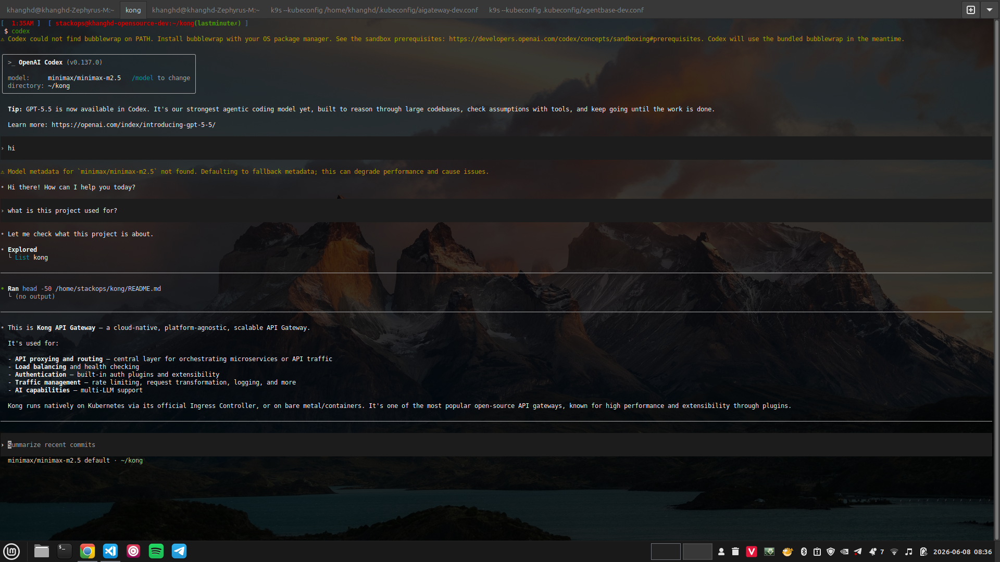

# Dùng Codex với Minimax qua GreenNode MaaS

> Hướng dẫn cấu hình [OpenAI Codex CLI](https://github.com/openai/codex) để gọi model Minimax qua GreenNode MaaS — sử dụng Responses API thông qua custom provider `maas` định nghĩa trong `codex.toml`.

***

## Điều kiện cần (Prerequisites)

* Đã có tài khoản [AI Platform](https://aiplatform.console.vngcloud.vn/)
* Đã tạo API key (token `vn-...`) với status **ACTIVE**
* Node.js ≥ 22 đã cài đặt

***

## Bước 1 — Cài đặt Codex CLI

```bash
npm install -g @openai/codex
```

Xác nhận cài thành công:

```bash
codex --version
```

***

## Bước 2 — Lấy API key từ AI Platform

1. Đăng nhập [AI Platform Console](https://aiplatform.console.vngcloud.vn/)
2. Vào **API Keys** → **Create API Key**
3. Đặt tên key (5–50 ký tự, chữ thường + số + gạch ngang)
4. Copy API key (`vn-...`) vừa tạo


API key mới tạo ở trạng thái `pending`. Đợi đến khi status = `ACTIVE` mới dùng được.


***

## Bước 3 — Cấu hình `codex.toml`

Tạo hoặc chỉnh sửa file `~/.codex/config.toml` (cấu hình toàn hệ thống) hoặc `codex.toml` tại thư mục gốc project (chỉ áp dụng cho project đó):

```toml
# API key — export trước khi chạy Codex
# export MAAS_API_KEY="vn-...your-gateway-token..."

model_provider = "maas"
model = "minimax/minimax-m2.5"

# Cần thiết vì MAAS không trả metadata model — tránh context bị cắt sai
model_context_window = 204800
model_max_output_tokens = 16400

# MAAS backend là stateless — Codex phải gửi lại toàn bộ conversation mỗi turn
disable_response_storage = true

[model_providers.maas]
name = "MAAS AI Gateway"

# base_url KHÔNG có trailing /responses — Codex tự append (→ .../v1/responses)
base_url = "https://maas-llm-aiplatform-hcm.api.vngcloud.vn/v1"
env_key = "MAAS_API_KEY"
wire_api = "responses"
request_max_retries = 3
```

**Giải thích các field quan trọng:**

| Field | Mục đích |
|---|---|
| `model_provider` | Key của provider trong `[model_providers.*]` |
| `model` | Model ID gửi lên MaaS |
| `model_context_window` | Khai báo thủ công vì MaaS không expose metadata model |
| `disable_response_storage` | Bắt buộc cho backend stateless — gửi lại full conversation mỗi turn |
| `base_url` | MaaS endpoint có `/v1` — Codex tự thêm `/responses` phía sau |
| `env_key` | Tên biến môi trường chứa API key |
| `wire_api` | Protocol sử dụng — `responses` tương ứng OpenAI Responses API |

***

## Bước 4 — Set API key và chạy Codex

Export API key trong shell:

```bash
export MAAS_API_KEY="vn-xxxxxxxxxxxxxxxxxxxxxxxxxxxxxxxx"
```

Để tự động mỗi lần mở terminal, thêm vào `~/.zshrc` hoặc `~/.bashrc`:

```bash
echo 'export MAAS_API_KEY="vn-xxxx..."' >> ~/.zshrc
source ~/.zshrc
```

Chạy Codex trong thư mục project:

```bash
codex
```

Codex sẽ hiển thị provider và model đang dùng tại header session:

```
model:     minimax/minimax-m2.5   /model to change
directory: ~/your-project
```

<figure><figcaption><p>Codex chạy với model minimax/minimax-m2.5 qua GreenNode MaaS</p></figcaption></figure>

***

## Troubleshooting

| Triệu chứng | Nguyên nhân | Cách xử lý |
|---|---|---|
| `401 Unauthorized` | API key sai, thiếu, hoặc chưa ACTIVE | Re-export `MAAS_API_KEY`; kiểm tra status key tại AI Platform Console |
| `404` khi gửi request | `base_url` sai hoặc thiếu `/v1` | Đảm bảo `base_url` kết thúc bằng `/v1` (không có `/responses`) |
| Context bị cắt sai | Model metadata không được khai báo | Kiểm tra `model_context_window` và `model_max_output_tokens` trong config |
| Mỗi turn mất context cũ | `disable_response_storage` chưa được set | Thêm `disable_response_storage = true` vào config |
| Connection timeout | Endpoint không truy cập được | Kiểm tra VPN / kết nối đến `*.api.vngcloud.vn` |

***

## Kết quả

Sau khi hoàn thành, Codex CLI route toàn bộ request qua GreenNode MaaS với model Minimax. Usage được ghi nhận trên [AI Platform Console → Usage](https://aiplatform.console.vngcloud.vn/).

| Tôi muốn tiếp theo...          | Đi đến                                                                                |
| ------------------------------ | ------------------------------------------------------------------------------------- |
| Dùng OpenCode với MaaS         | [Dùng OpenCode với GreenNode MaaS](opencode-with-maas-model.md)                      |
| Kết nối Claude Code với MaaS   | [Kết nối Claude Code với GreenNode MaaS](ket-noi-claude-code-voi-maas.md)            |
| Xem usage và billing           | [AI Platform Console](https://aiplatform.console.vngcloud.vn/)                        |
