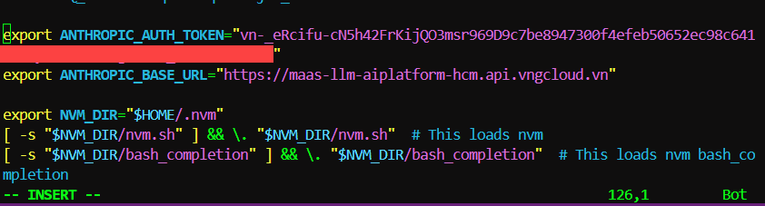

# Kết nối Claude Code với GreenNode MaaS

> Hướng dẫn định tuyến Claude Code CLI sang GreenNode MaaS endpoint thay vì Anthropic API trực tiếp — toàn bộ request đi qua hạ tầng GreenNode, thanh toán bằng credit-token nội bộ.

***

## Điều kiện cần (Prerequisites)

* Đã có tài khoản [AI Platform](https://aiplatform.console.vngcloud.vn/)
* Claude Code CLI đã cài đặt


LLM URL cho Claude Code dùng **Anthropic API protocol**: `https://maas-llm-aiplatform-hcm.api.vngcloud.vn` (không có `/v1`).


***

## Bước 1 — Lấy API key từ AI Platform

1. Đăng nhập [AI Platform Console](https://aiplatform.console.vngcloud.vn/)
2. Vào **API Keys** → **Create API Key**
3. Đặt tên theo format `claude-code-<tên-bạn>` (5–50 ký tự, chữ thường + số + gạch ngang)
4. Copy API key vừa tạo


API key mới tạo ở trạng thái `pending`. Poll `api-keys get <name>` cho đến khi status = `ACTIVE` mới dùng được.


***

## Bước 2 — Chọn model

Xem danh sách model Claude đang khả dụng:

```bash
bash .claude/skills/agentbase/scripts/aip.sh models list --providers anthropic --status ENABLED
```

Lấy giá trị `path` của model muốn dùng (ví dụ: `claude-sonnet-4-6`, `claude-opus-4-7`). Giá trị này sẽ điền vào biến môi trường model mapping ở bước sau.

***

## Bước 3 — Cấu hình

Chọn 1 trong 2 cách:

**Cách A — Shell profile (áp dụng toàn hệ thống)**

Thêm vào `~/.zshrc` hoặc `~/.bashrc`:

```bash
# GreenNode MaaS — Claude Code Integration
export ANTHROPIC_BASE_URL="https://maas-llm-aiplatform-hcm.api.vngcloud.vn"
export ANTHROPIC_AUTH_TOKEN="<your-api-key>"
export ANTHROPIC_API_KEY=""  # Phải để trống — tránh conflict với Anthropic trực tiếp

# Model mapping (dùng path từ bước 2)
export ANTHROPIC_DEFAULT_SONNET_MODEL="claude-sonnet-4-6"
export ANTHROPIC_DEFAULT_OPUS_MODEL="claude-opus-4-7"
export ANTHROPIC_DEFAULT_HAIKU_MODEL="claude-haiku-4-5-20251001"
export CLAUDE_CODE_SUBAGENT_MODEL="claude-sonnet-4-6"
```

Áp dụng ngay không cần restart terminal:

```bash
source ~/.zshrc
```

<figure><figcaption><p>Cấu hình ANTHROPIC_AUTH_TOKEN và ANTHROPIC_BASE_URL trong shell profile</p></figcaption></figure>

**Cách B — Project settings (chỉ áp dụng cho project cụ thể)**

Tạo file `.claude/settings.local.json` tại root của project:

```json
{
  "env": {
    "ANTHROPIC_BASE_URL": "https://maas-llm-aiplatform-hcm.api.vngcloud.vn",
    "ANTHROPIC_AUTH_TOKEN": "<your-api-key>",
    "ANTHROPIC_API_KEY": "",
    "ANTHROPIC_DEFAULT_SONNET_MODEL": "claude-sonnet-4-6",
    "ANTHROPIC_DEFAULT_OPUS_MODEL": "claude-opus-4-7",
    "ANTHROPIC_DEFAULT_HAIKU_MODEL": "claude-haiku-4-5-20251001",
    "CLAUDE_CODE_SUBAGENT_MODEL": "claude-sonnet-4-6"
  }
}
```


Claude Code không đọc file `.env` thông thường. Phải dùng `settings.local.json` hoặc shell profile.


***

## Bước 4 — Kiểm tra kết nối

Mở Claude Code và chạy:

```
/status
```

Kết quả mong đợi:

* Base URL trỏ đến `maas-llm-aiplatform-hcm.api.vngcloud.vn`
* Model hiển thị đúng với cấu hình

Xác nhận request được ghi nhận tại [AI Platform Console → Usage](https://aiplatform.console.vngcloud.vn/).

***

## Bảng biến môi trường

| Biến                             | Mục đích                          | Giá trị mẫu                                       |
| -------------------------------- | --------------------------------- | ------------------------------------------------- |
| `ANTHROPIC_BASE_URL`             | Redirect API calls sang GreenNode | `https://maas-llm-aiplatform-hcm.api.vngcloud.vn` |
| `ANTHROPIC_AUTH_TOKEN`           | API key xác thực                  | `<your-api-key>`                                  |
| `ANTHROPIC_API_KEY`              | Phải để trống (tránh conflict)    | `""`                                              |
| `ANTHROPIC_DEFAULT_SONNET_MODEL` | Model cho coding thông thường     | `claude-sonnet-4-6`                               |
| `ANTHROPIC_DEFAULT_OPUS_MODEL`   | Model cho reasoning phức tạp      | `claude-opus-4-7`                                 |
| `ANTHROPIC_DEFAULT_HAIKU_MODEL`  | Model cho completions nhanh       | `claude-haiku-4-5-20251001`                       |
| `CLAUDE_CODE_SUBAGENT_MODEL`     | Model khi spawn sub-agent         | `claude-sonnet-4-6`                               |

***

## Billing & Usage

* Request đi qua GreenNode MaaS được tính phí bằng credit-token (1 credit = 1 VND)
* Xem usage real-time trên [AI Platform Console → Usage](https://aiplatform.console.vngcloud.vn/)
* **Prepaid:** credit bị trừ mỗi chu kỳ collect 5 phút — khi hết credit, model bị tắt tự động
* **Postpaid:** usage được ghi nợ, không giới hạn quota

***

## Troubleshooting

| Triệu chứng                | Nguyên nhân                         | Cách xử lý                                      |
| -------------------------- | ----------------------------------- | ----------------------------------------------- |
| `401 Unauthorized`         | API key sai hoặc chưa ACTIVE        | Kiểm tra lại key, tạo key mới nếu cần           |
| `403 Forbidden`            | API key chưa ACTIVE                 | Poll `api-keys get <name>` đợi status = ACTIVE  |
| Model không phản hồi       | Credit hết, model bị tắt            | Nạp thêm credit tại AI Platform Console         |
| Request đi thẳng Anthropic | `ANTHROPIC_API_KEY` không để trống  | Đặt `ANTHROPIC_API_KEY=""`                      |
| Wrong model được dùng      | Model path không đúng               | Kiểm tra `path` field bằng `aip.sh models list` |
| `/status` báo lỗi URL      | Base URL sai hoặc có trailing slash | Đảm bảo `ANTHROPIC_BASE_URL` không có `/` cuối  |

***

## Kết quả

Sau khi hoàn thành, Claude Code CLI sẽ route toàn bộ request qua GreenNode MaaS. Usage được ghi nhận trên AI Platform Console và tính phí theo credit-token nội bộ.

<figure><figcaption><p>Claude Code chạy thành công qua GreenNode MaaS endpoint</p></figcaption></figure>

| Tôi muốn tiếp theo...                | Đi đến                                                                                |
| ------------------------------------ | ------------------------------------------------------------------------------------- |
| Dùng OpenAI-compatible tool với MaaS | [Kết nối OpenAI-compatible với GreenNode MaaS](ket-noi-openai-compatible-voi-maas.md) |
| Xem usage và billing                 | [AI Platform Console](https://aiplatform.console.vngcloud.vn/)                        |
