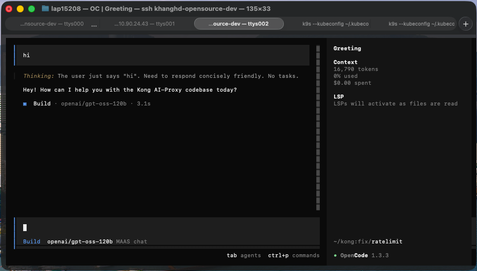

# Dùng OpenCode với GreenNode MaaS

> Hướng dẫn cấu hình [OpenCode](https://opencode.ai) — TUI coding assistant — để gọi model qua GreenNode MaaS thông qua provider `@ai-sdk/openai-compatible`, thanh toán bằng credit-token nội bộ.

***

## Điều kiện cần (Prerequisites)

* Đã có tài khoản [AI Platform](https://aiplatform.console.vngcloud.vn/)
* Đã tạo API key (token `vn-...`) với status **ACTIVE**
* Node.js đã cài đặt

***

## Bước 1 — Cài đặt OpenCode

```bash
npm install -g opencode-ai
```

Hoặc qua Homebrew (macOS):

```bash
brew install opencode
```

***

## Bước 2 — Lấy API key từ AI Platform

1. Đăng nhập [AI Platform Console](https://aiplatform.console.vngcloud.vn/)
2. Vào **API Keys** → **Create API Key**
3. Đặt tên key (5–50 ký tự, chữ thường + số + gạch ngang)
4. Copy API key (`vn-...`) vừa tạo


API key mới tạo ở trạng thái `pending`. Đợi đến khi status = `ACTIVE` mới dùng được.


***

## Bước 3 — Tạo file cấu hình `opencode.json`

Tạo file `opencode.json` tại thư mục gốc của project:

```json
{
  "$schema": "https://opencode.ai/config.json",
  "model": "MAAS-chat/openai/gpt-oss-120b",
  "provider": {
    "MAAS-chat": {
      "npm": "@ai-sdk/openai-compatible",
      "name": "MAAS chat",
      "options": {
        "baseURL": "https://maas-llm-aiplatform-hcm.api.vngcloud.vn/v1",
        "apiKey": "{env:MAAS_API_KEY}"
      },
      "models": {
        "openai/gpt-oss-120b": {
          "name": "openai/gpt-oss-120b"
        }
      }
    }
  }
}
```

**Giải thích các field:**

| Field | Mục đích |
|---|---|
| `$schema` | Bật autocomplete/validation trong editor |
| `model` | Model mặc định — format `<provider-key>/<model-id>` |
| `provider.MAAS-chat` | Provider key — phần trước `/` trong `model` phải khớp chính xác |
| `npm` | Adapter package — `@ai-sdk/openai-compatible` dùng được cho mọi endpoint OpenAI-style |
| `options.baseURL` | MaaS endpoint, có `/v1` ở cuối |
| `options.apiKey` | Token MaaS — dùng `{env:MAAS_API_KEY}` thay vì hardcode |
| `models` | Danh sách model expose từ provider này |


Lỗi phổ biến: đặt `"model"` thành tên không khớp với provider key đã đăng ký. OpenCode tách theo `/` đầu tiên để tìm provider — nếu không khớp, model không load được. Luôn dùng `MAAS-chat/openai/gpt-oss-120b`.


***

## Bước 4 — Cung cấp API key

Vì config dùng `{env:MAAS_API_KEY}`, key không nằm trong file mà được đọc từ biến môi trường lúc runtime. Có hai cách:

**Cách A — Export biến môi trường (khuyến nghị)**

Export key trong shell rồi chạy OpenCode trong cùng session:

```bash
export MAAS_API_KEY="vn-xxxxxxxxxxxxxxxxxxxxxxxxxxxxxxxx"
opencode
```

Để tự động mỗi lần mở terminal, thêm vào `~/.zshrc` hoặc `~/.bashrc`:

```bash
echo 'export MAAS_API_KEY="vn-xxxx..."' >> ~/.zshrc
source ~/.zshrc
```

Hoặc set inline cho một lần chạy duy nhất:

```bash
MAAS_API_KEY="vn-xxxx..." opencode
```

**Cách B — Dùng file `.env` gitignored trong project**

Tạo file `.env` (thêm vào `.gitignore`):

```bash
export MAAS_API_KEY="vn-xxxx..."
```

Chạy OpenCode bằng cách load `.env` trước:

```bash
source .env && opencode
```


Không hardcode API key trực tiếp vào `opencode.json` nếu file đó được commit. Nếu key đã bị commit, rotate ngay tại MAAS Console vì key đó phải coi là đã bị lộ.


***

## Bước 5 — Chạy OpenCode và chọn model

1. Di chuyển đến thư mục project và chạy:

   ```bash
   opencode
   ```

   OpenCode khởi động với `MAAS-chat/openai/gpt-oss-120b` là model mặc định.

2. Đổi model trong phiên bằng lệnh `/models`, sau đó chọn **MAAS chat → openai/gpt-oss-120b** từ danh sách.

<figure><figcaption><p>OpenCode chạy với model openai/gpt-oss-120b qua GreenNode MaaS</p></figcaption></figure>

***

## Thêm model MaaS khác

Để expose thêm model từ cùng endpoint MaaS, thêm entry vào `models`:

```json
"models": {
  "openai/gpt-oss-120b": { "name": "openai/gpt-oss-120b" },
  "openai/gpt-oss-20b":  { "name": "openai/gpt-oss-20b" }
}
```

Sau đó chọn qua `/models`, hoặc đổi `model` ở cấp top-level thành `MAAS-chat/<model-id>` mới.

***

## Troubleshooting

| Triệu chứng | Nguyên nhân | Cách xử lý |
|---|---|---|
| `provider not found` / model không load | Giá trị `model` không khớp provider key | Dùng `MAAS-chat/openai/gpt-oss-120b` |
| `401 Unauthorized` | API key sai, hết hạn, hoặc chưa ACTIVE | Re-export `MAAS_API_KEY`; rotate token tại MAAS Console |
| `404` khi gửi request | Base URL sai hoặc thiếu `/v1` | Kiểm tra `baseURL` kết thúc bằng `/v1` |
| Connection timeout | Endpoint không truy cập được từ network hiện tại | Kiểm tra VPN / kết nối đến `*.api.vngcloud.vn` |
| Model trả lỗi nhưng auth đúng | Sai model ID | Dùng đúng ID mà MaaS publish (`openai/gpt-oss-120b`) |

***

## Kết quả

Sau khi hoàn thành, OpenCode route toàn bộ request qua GreenNode MaaS. Usage được ghi nhận trên [AI Platform Console → Usage](https://aiplatform.console.vngcloud.vn/).

| Tôi muốn tiếp theo...           | Đi đến                                                                              |
| ------------------------------- | ----------------------------------------------------------------------------------- |
| Dùng Codex với Minimax qua MaaS | [Dùng Codex với Minimax qua GreenNode MaaS](hướng-dẫn-xài-codex-với-minimax.md)   |
| Kết nối Claude Code với MaaS    | [Kết nối Claude Code với GreenNode MaaS](ket-noi-claude-code-voi-maas.md)          |
| Xem usage và billing            | [AI Platform Console](https://aiplatform.console.vngcloud.vn/)                      |
