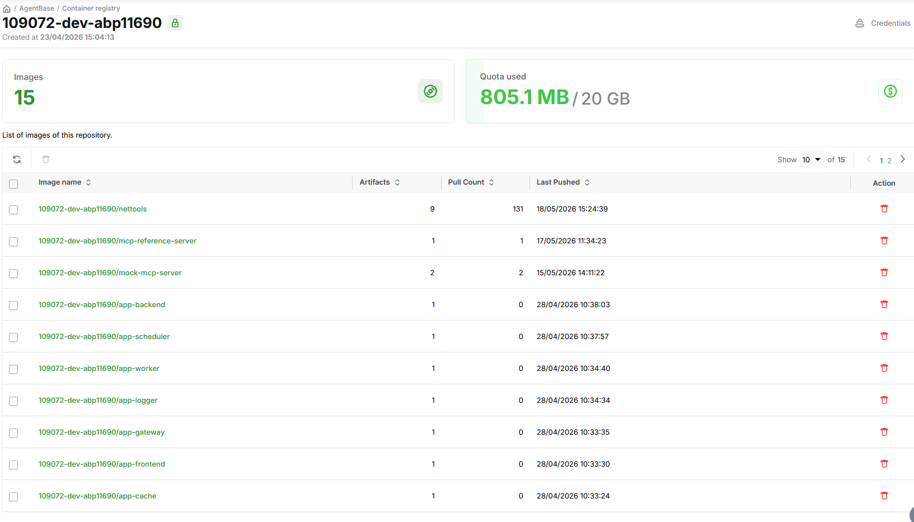

# Container Registry

GreenNode tự động tạo sẵn một repository riêng tư trong Container Registry cho tổ chức của bạn — lưu trữ container image an toàn và sử dụng trực tiếp khi triển khai Agent Runtime, không cần cấu hình registry bên ngoài.

---

## Tổng quan

Container Registry trong AgentBase được xây dựng trên [VNG Cloud Container Registry (vCR)](../../../../vcontainer-registry/README.md). Khi tổ chức của bạn được khởi tạo trên AgentBase, một repository riêng tư đã được tạo sẵn — bạn không cần tự tạo.

Xem danh sách image của tổ chức tại: [https://aiplatform.console.vngcloud.vn/container-registry/repository](https://aiplatform.console.vngcloud.vn/container-registry/repository)



**Lợi ích:**
- Image không thể truy cập công khai
- Kết hợp với Private VPC để pipeline deploy hoàn toàn nội bộ
- Tích hợp sẵn khi tạo Custom Agent Runtime — không cần cấu hình thêm

---

## Đẩy image lên registry

### Dùng AgentBase Skills (khuyến nghị)

Nếu bạn đã cài [AgentBase Skills](https://github.com/vngcloud/greennode-agentbase-skills), dùng script có sẵn — credentials được xử lý in-memory, không lộ ra terminal hay disk:

**Bước 1:** Lấy thông tin repository của tổ chức

```bash
bash .claude/skills/agentbase/scripts/cr.sh repo get
```

Kết quả trả về `registryUrl` (`vcr.vngcloud.vn`) và `name` (tên repo của tổ chức).

**Bước 2:** Đăng nhập Docker an toàn

```bash
bash .claude/skills/agentbase/scripts/cr.sh credentials docker-login
```

**Bước 3:** Tag và push image

```bash
docker tag my-agent:latest vcr.vngcloud.vn/<repoName>/my-agent:v1.0
docker push vcr.vngcloud.vn/<repoName>/my-agent:v1.0
```

### Dùng Docker CLI thủ công

**Bước 1:** Đăng nhập (dùng credentials từ Portal)

```bash
docker login vcr.vngcloud.vn
```

**Bước 2:** Tag image

```bash
docker tag my-agent:latest vcr.vngcloud.vn/<repoName>/my-agent:v1.0
```

**Bước 3:** Push image

```bash
docker push vcr.vngcloud.vn/<repoName>/my-agent:v1.0
```

---

## Sử dụng image khi tạo Runtime

**Dùng AgentBase Skills** — truyền cờ `--from-cr`, credentials được lấy tự động:

```bash
bash .claude/skills/agentbase/scripts/runtime.sh create \
  --image "vcr.vngcloud.vn/<repoName>/my-agent:v1.0" \
  --from-cr
```

**Dùng Portal** — khi tạo Custom Agent Runtime, nhập:
- **Image URL:** `vcr.vngcloud.vn/<repoName>/my-agent:v1.0`
- **Registry Auth:** bật → nhập robot account username và password

Xem hướng dẫn đầy đủ tại [Khởi tạo Runtime](../agent-runtime/khoi-tao-runtime.md).

---

## Quản lý nâng cao

Trang Container Registry trên AgentBase đủ để đẩy và dùng image với Runtime. Để quản lý đầy đủ (thêm repository, cấu hình phân quyền, xóa image theo policy...) → xem tài liệu [VNG Cloud Container Registry](../../../../vcontainer-registry/README.md).

---

## Bắt đầu

| Tôi muốn... | Đến |
|---|---|
| Tạo Runtime từ image trong registry này | [Khởi tạo Runtime](../agent-runtime/khoi-tao-runtime.md) |
| Quản lý Container Registry đầy đủ | [VNG Cloud Container Registry](../../../../vcontainer-registry/README.md) |