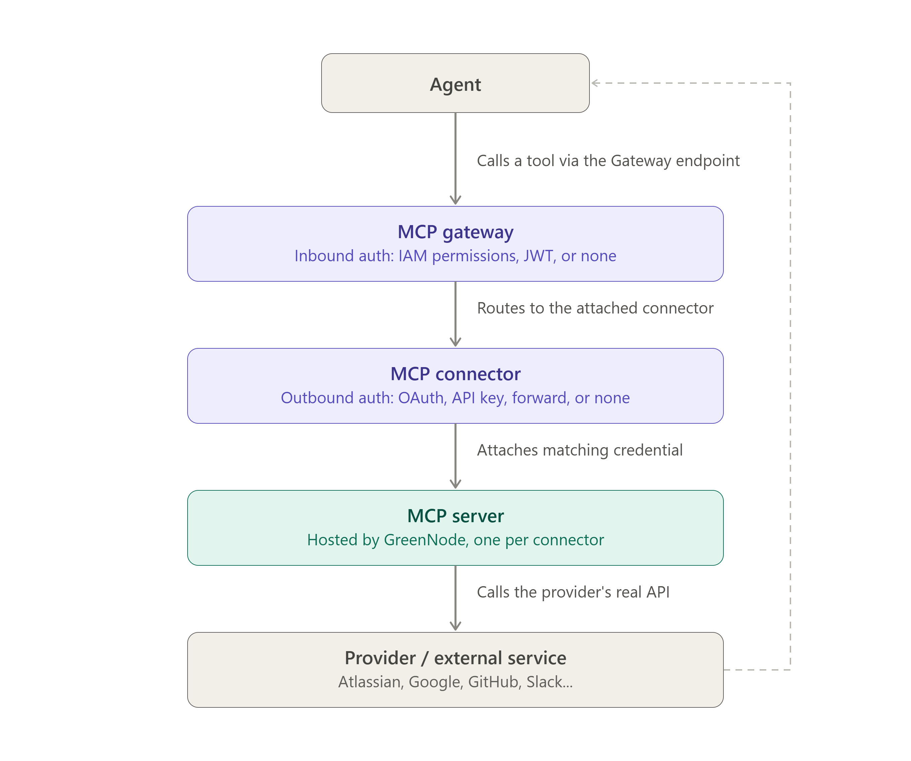

# MCP Connectors

**MCP Connectors** giúp bạn kết nối agent với các dịch vụ bên ngoài — GitHub, Slack, Microsoft 365... — chỉ trong vài phút, mà không cần tự dựng MCP server hay tự code OAuth từ đầu.

---

## Kiến trúc

Connector có 2 luồng tách biệt: **luồng kết nối** (thiết lập OAuth/API Key một lần khi bạn nhấn Connect) và **luồng gọi tool lúc runtime** (mỗi lần agent gọi tool qua Gateway).

### Luồng kết nối (Connect)

Bạn (Admin/Editor) là người thực hiện luồng này khi nhấn **Connect** trên 1 connector trong Catalog — xem từng bước UI chi tiết tại [Kết nối Connector](ket-noi-connector.md). Sơ đồ dưới đây minh hoạ ở mức kiến trúc cho trường hợp **OAuth 3LO** — mode có đầy đủ bước nhất vì cần bạn xác nhận qua browser:


Sơ đồ trên minh hoạ OAuth 3LO. Với **OAuth 2LO**, **API Key**, **Inbound forward** hoặc **No authorization**, không có bước consent screen — hệ thống lưu credential (nếu có) và tạo Connector ngay sau khi bạn nhấn **Connect**, không cần rời khỏi modal.



Connector được scope theo project — mọi thành viên có quyền truy cập project đều dùng chung 1 kết nối.


### Luồng gọi tool (Runtime)

Khi agent gọi 1 tool, request đi qua đúng các thành phần bạn đã cấu hình lúc Connect — MCP Gateway (Inbound Auth) → MCP Connector (Outbound Auth) → MCP Server → Provider:

| Outbound Auth mode | Credential lấy từ đâu |
|---|---|
| **OAuth** (2LO/3LO) | Secret Provider (Managed do GreenNode tạo sẵn, hoặc Custom tự cấu hình) qua **Access Control** |
| **API Key** (2LO/3LO) | Secret Provider (Managed/Custom) qua **Access Control**, hoặc API Key/Token dán trực tiếp |
| **Inbound forward** | Credential mà agent đã dùng ở bước Inbound Auth — yêu cầu Inbound Auth của Gateway ≠ **No authorization** |
| **No authorization** | Không đính kèm credential nào |

---

## Connector Catalog

Catalog hiển thị danh sách connector do AgentBase cung cấp sẵn, luôn có 1 card **Add Custom Connector** ở đầu grid để thêm MCP server tùy chỉnh. Mỗi card connector hiển thị tên, provider và các badge Auth Mode được hỗ trợ (ví dụ `OAuth 3LO`, `API Key 3LO`).


Số lượng connector prebuilt thay đổi theo thời gian khi AgentBase bổ sung provider mới — xem số liệu chính xác tại tab **Catalog**, mục "List catalog (N)".


Tại thời điểm viết tài liệu này, catalog gồm các connector sau (danh sách được AgentBase cập nhật dần theo thời gian):

| Connector | Provider  | Ghi chú                                                                                    |
| --------- | --------- | ------------------------------------------------------------------------------------------- |
| GitHub    | GitHub    |                                                                                             |
| Slack     | Slack     |                                                                                             |
| M365 VNG  | Microsoft | Gộp 4 dịch vụ Microsoft 365: SharePoint, Outlook Mail, Outlook Calendar, Microsoft Teams |

---

## Chế độ xác thực (Authentication Mode)

Modal Connect dùng chung cho mọi connector, với 4 chế độ xác thực:

| Mode                       | Mô tả                                                                                                                                                                            |
| -------------------------- | ---------------------------------------------------------------------------------------------------------------------------------------------------------------------------------- |
| **OAuth**            | Xác thực qua provider — có 2 sub-mode:**2LO** (server-to-server, không cần user consent) và **3LO** (yêu cầu user đồng ý qua consent screen của provider) |
| **API Key**          | Dán static API Key/Token đã lấy từ dịch vụ bên ngoài                                                                                                                      |
| **Inbound forward**  | Dùng lại chính credential**Inbound Auth** của MCP Gateway làm Outbound auth — chỉ khả dụng khi Inbound Auth của Gateway khác **No authorization**           |
| **No authorization** | Không yêu cầu xác thực                                                                                                                                                        |


Không phải connector nào cũng hỗ trợ cả 4 chế độ:

- Một số connector chỉ cho chọn **OAuth** hoặc **API Key**, không hỗ trợ **Inbound forward** và **No authorization**.
- **Inbound forward** chỉ dùng được khi **Inbound Auth** của MCP Gateway đã chọn khác **No authorization** (tức IAM Permissions hoặc JWT) — vì mode này forward chính credential Inbound đó sang làm Outbound auth gọi tới MCP server.


---

## Custom Connector

Nếu dịch vụ bạn cần không có sẵn trong catalog, nhấn card **Add Custom Connector** (luôn nằm đầu grid) để kết nối bất kỳ MCP-compatible server nào với cấu hình tùy chỉnh, qua cùng modal xác thực 4-mode ở trên.

---

## Bắt đầu với MCP Connectors

| Tôi muốn...                                                 | Đi đến                                                            |
| ------------------------------------------------------------- | -------------------------------------------------------------------- |
| Tìm connector trong Catalog                                  | [Tìm Connector trong Catalog](duyet-catalog-connector.md)            |
| Kết nối một connector vào project                         | [Kết nối Connector](ket-noi-connector.md)                           |
| Xem, chỉnh sửa hoặc ngắt kết nối connector đã connect | [Quản lý Connector đã kết nối](quan-ly-connector-da-ket-noi.md) |
