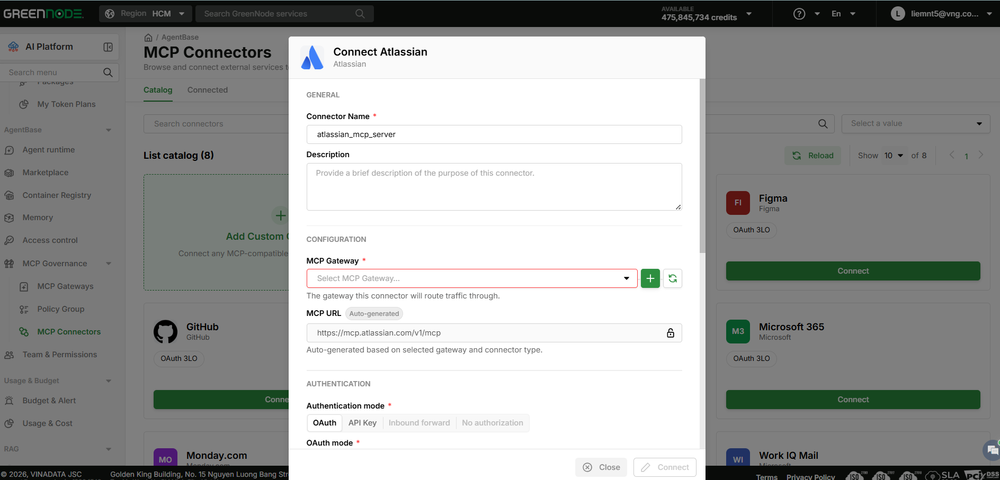
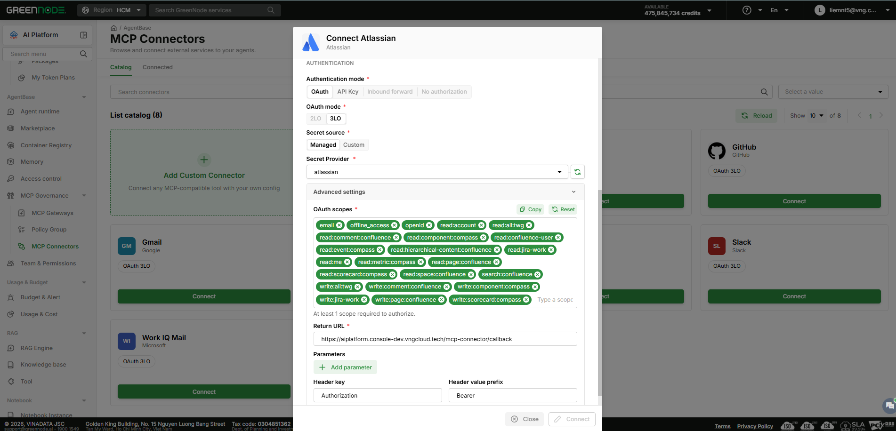

# Kết nối Connector

> Hướng dẫn này giúp bạn kết nối một connector trong Catalog vào project — cấu hình Gateway, chọn Authentication mode phù hợp và hoàn tất xác thực.

---

## Điều kiện cần

- Có quyền **Admin** hoặc **Editor** trong product AgentBase, hoặc được phân quyền tương ứng qua **IAM Policy**.
- Đã tạo sẵn ít nhất 1 **MCP Gateway** để attach connector vào.
- Với Authentication mode **OAuth** hoặc **API Key**: đã có sẵn Secret Provider tương ứng, hoặc dùng **Managed** secret do AgentBase cung cấp sẵn.

---

## Mở modal Connect

1. Nhấn **Connect** trên card connector cần kết nối trong Catalog.

Modal **Connect [Tên connector]** mở ra với 3 section cố định:

- **GENERAL** — **Connector Name** (bắt buộc), **Description** (tùy chọn)
- **CONFIGURATION** — **MCP Gateway** (bắt buộc chọn từ dropdown, hoặc nhấn **+** để tạo Gateway mới), **MCP URL** (tự sinh theo MCP Connector đã chọn, không chỉnh sửa được)
- **AUTHENTICATION** — chọn **Authentication mode**: **OAuth** / **API Key** / **Inbound forward** / **No authorization**


Một số Authentication mode có thể bị khoá (disabled):
- Tùy theo connector — một số connector chỉ cho chọn **OAuth** hoặc **API Key**, không hỗ trợ **Inbound forward** và **No authorization**.
- **Inbound forward** chỉ dùng được khi **Inbound Auth** của MCP Gateway đã chọn khác **No authorization** (tức IAM Permissions hoặc JWT) — vì mode này forward chính credential mà agent dùng để xác thực Inbound vào Gateway, sang làm Outbound auth gọi tới MCP server. Nếu Inbound Auth = No authorization thì không có credential nào để forward, nên mode này bị khoá.


---

## Cấu hình Authentication mode = OAuth

1. Chọn **OAuth** ở section AUTHENTICATION.
2. Chọn **OAuth mode**: **2LO** (server-to-server) hoặc **3LO** (yêu cầu user đồng ý qua consent screen của provider) — tùy connector hỗ trợ mode nào.
3. Chọn **Secret source**: **Managed** (dùng secret có sẵn do AgentBase quản lý) hoặc **Custom** (tự cung cấp Client ID/Secret riêng).
4. Chọn **Secret Provider** tương ứng trong dropdown.
5. Mở **Advanced settings** và điền:
   - **OAuth scopes** — danh sách scope pre-selected theo connector, có thể xoá bớt hoặc gõ thêm scope mới, tối thiểu phải giữ lại 1 scope; dùng **Copy** hoặc **Reset** để copy/khôi phục danh sách mặc định.
   - **Return URL** — URL callback OAuth, mặc định trỏ về domain AgentBase.
   - **Parameters** (tùy chọn) — nhấn **Add parameter** để thêm cặp **Header key** / **Header value prefix** tùy chỉnh (ví dụ `Authorization` / `Bearer`).
6. Nhấn **Connect** (hoặc **Authorize** với OAuth 3LO) sau khi điền đầy đủ.


**Secret source** liên kết trực tiếp với tính năng [Access Control](../access-control/README.md) (Identity):
- **Managed** — chọn nhanh 1 Secret Provider do GreenNode tạo sẵn, không cần tự tạo OAuth App.
- **Custom** — nếu provider bạn cần chưa có sẵn ở chế độ Managed (ví dụ Slack), bạn phải tự tạo OAuth App trên nền tảng tương ứng, sau đó thêm nó làm OAuth Provider trong **Access Control** — lúc đó provider mới xuất hiện trong dropdown Secret Provider khi tạo MCP Gateway/Connector.
- Access Control cũng hỗ trợ **OAuth public client** — chỉ cần khai báo Client ID, không cần Client Secret.


Với **OAuth 3LO**, hệ thống mở tab/popup đến trang consent của provider — kiểm tra scope được yêu cầu rồi chấp nhận để hoàn tất.

---

## Cấu hình Authentication mode = API Key

1. Chọn **API Key** ở section AUTHENTICATION.
2. Chọn **API Key mode**: **2LO** hoặc **3LO**.
3. Dán **API Key/Token** đã lấy từ dịch vụ bên ngoài, hoặc chọn **Secret Provider** đã cấu hình sẵn.
4. Với **3LO**, điền thêm **Return URL**.
5. Nhấn **Connect**.

---

## Cấu hình Authentication mode = Inbound forward / No authorization

1. Chọn **Inbound forward** hoặc **No authorization** ở section AUTHENTICATION — **Inbound forward** chỉ dùng được khi **Inbound Auth** của MCP Gateway đã chọn khác **No authorization** (IAM Permissions hoặc JWT), vì mode này forward chính credential Inbound đó sang làm Outbound auth.
2. Nhấn **Connect** — không cần điền thêm credential.

---

## Kết quả

Connector xuất hiện trong tab **Connected** với trạng thái **ACTIVE**, sẵn sàng để attach vào agent.

| Tôi muốn tiếp theo...                                   | Đi đến                                                            |
| ---------------------------------------------------------- | -------------------------------------------------------------------- |
| Xem, chỉnh sửa hoặc ngắt kết nối connector vừa tạo | [Quản lý Connector đã kết nối](quan-ly-connector-da-ket-noi.md) |
