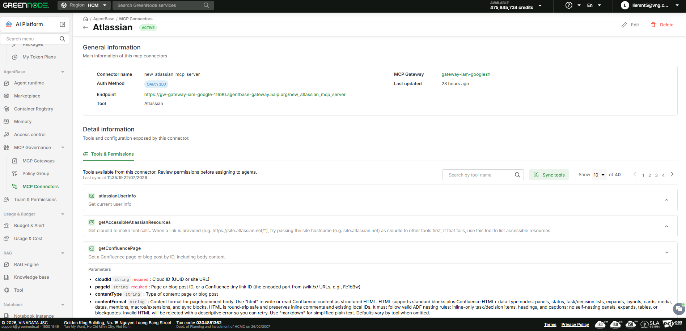

# Quản lý Connector đã kết nối

> Hướng dẫn này giúp bạn xem danh sách, xem chi tiết tool và chỉnh sửa/ngắt kết nối các connector đã connect trong project.

---

## Điều kiện cần

- Project đã có ít nhất 1 connector được kết nối.
- Có quyền **Admin** hoặc **Editor** để chỉnh sửa/xoá — role **Member** chỉ xem được danh sách.

---

## Xem danh sách connector đã kết nối

1. Nhấn tab **Connected** trong trang **MCP Connectors**.

Bảng hiển thị các cột: **Connector name**, **Tool**, **MCP Gateway**, **Auth Method**, **Endpoint**, **Last updated**, **Action (Edit/Delate)**. Bạn có thể lọc theo **MCP Gateway** hoặc **MCP Gateway status** ở phía trên bảng.


Để agent của bạn dùng được tool của connector này, copy giá trị cột **Endpoint** của connector tương ứng, rồi cấu hình/yêu cầu AI agent kết nối tới địa chỉ MCP đó.


---

## Xem trang chi tiết connector

1. Nhấn vào tên connector trong cột **Connector name** của bảng Connected.

Trang chi tiết mở ra với badge trạng thái (ví dụ **ACTIVE**) cạnh tên connector, cùng 2 button **Edit** và **Delete** ở góc phải. Section **General information** hiển thị Connector name, Auth Method, Endpoint, MCP Gateway, Last updated.

Section **Detail information** có tab **Tools & Permissions** — liệt kê toàn bộ tool mà connector này cung cấp, kèm mô tả và danh sách tham số (parameters) khi mở rộng từng tool. Nhấn **Sync tools** để đồng bộ lại danh sách tool mới nhất từ MCP server.

---

## Chỉnh sửa hoặc xoá connector

1. Mở trang chi tiết của connector cần thao tác (xem bước trên).
2. Nhấn **Edit** để chỉnh sửa cấu hình, hoặc nhấn **Delete** để ngắt kết nối.


Xoá connector là thao tác không thể hoàn tác. Kiểm tra kỹ agent nào đang dùng connector này trước khi xoá.


---

## Kết quả

Bạn nắm được toàn bộ connector đang kết nối trong project, biết chính xác mỗi connector cung cấp tool gì, và có thể chỉnh sửa hoặc ngắt kết nối khi cần.

| Tôi muốn tiếp theo...        | Đi đến                                             |
| ------------------------------- | ----------------------------------------------------- |
| Kết nối thêm connector khác | [Kết nối Connector](ket-noi-connector.md)            |
| Duyệt lại Catalog             | [Tìm Connector trong Catalog](duyet-catalog-connector.md) |
