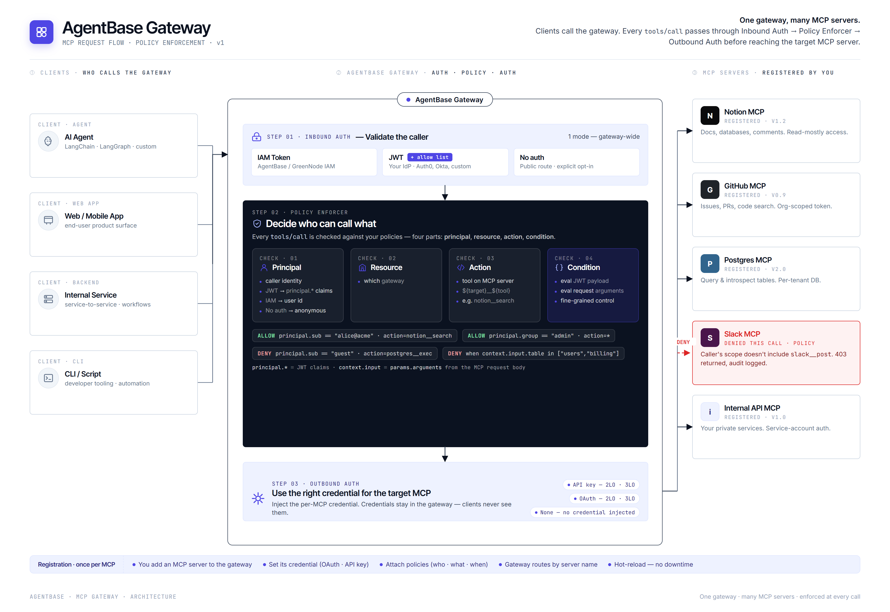

# MCP Gateway

MCP Gateway giúp bạn kiểm soát toàn bộ MCP tool calls từ agent đến external services — xác thực và phân quyền theo Policy Group — mà không cần thay đổi code agent.

---

## Kiến trúc

Mỗi MCP tool call từ agent đều đi qua MCP Gateway (Kong OSS) trước khi đến MCP Tool Server. LLM calls đi theo luồng riêng qua Sidecar LLM Proxy (auto-injected, không qua Kong).

---

## Thành phần chính

### Inbound Authentication

Kiểm soát cách agent xác thực khi gọi vào gateway. Hỗ trợ ba chế độ:

- **IAM Permissions** — dùng IAM token của GreenNode AI Platform
- **JSON Web Tokens (JWT)** — agent đính kèm JWT; gateway validate bằng Discovery URL (tự fetch public keys định kỳ) hoặc JWKS inline. Đây là chế độ mặc định.
- **No authorization** — gateway accessible công khai, không có access control

Claim trong JWT dùng làm principal khi enforce Policy Group được cấu hình qua trường **Principal claim** (mặc định `sub`).

### MCP Servers (Outbound)

Mỗi gateway có thể route đến nhiều MCP Tool Servers. Với mỗi server, bạn cấu hình:

- **MCP endpoint URL** — URL của MCP server
- **Outbound Auth** — cách gateway xác thực khi gọi ra ngoài: OAuth 2.0, API Key, hoặc No authentication
- **Mode** — `2LO (Machine to machine)` cho service-to-service; `3LO (User federation)` khi cần user redirect (bắt buộc có Return URL)

Secret (client credential) được lấy từ **Identity** component — gateway chỉ tham chiếu secret, không lưu trực tiếp.

### Policy Group

Policy Group là bộ rules xác định agent nào được gọi tool nào trong điều kiện nào. Một gateway attach tối đa **1 Policy Group**.

Mỗi MCP tool call đi qua pipeline đánh giá:
1. Validate API Key (Inbound Auth)
2. Evaluate Policy Group rules theo thứ tự `order`
3. Match đầu tiên thắng: **ALLOW** → forward đến MCP server; **DENY** → trả về 403
4. Không có rule nào match → hard-block 403


Nếu gateway không gắn Policy Group, **mọi** MCP tool call đều bị block 403 (`No policy allows this request`). Luôn gắn Policy Group trước khi agent bắt đầu gọi qua gateway.


`tools/list` luôn bypass policy — chỉ `tools/call` mới qua evaluation.

### Network & Compute

- **Public** — Hệ thống tự điều phối zone; không cần chọn zone thủ công
- **Private** — chọn VPC + Subnet; zone được xác định ngầm theo subnet; cần đảm bảo DNS resolution được bật trong VPC

Compute bao gồm **Flavor** (vCPU / RAM) và **Replicas** (1–10 instances) để đảm bảo HA và throughput.

---

## MCP Gateway và Sidecar LLM Proxy

| | MCP Gateway | Sidecar LLM Proxy |
|---|---|---|
| **Xử lý loại call** | MCP tool calls (`tools/call`) | LLM calls |
| **Hạ tầng** | Kong OSS, tạo theo yêu cầu | Auto-inject khi tạo agent |
| **Endpoint** | Cấu hình trên portal | `localhost:18080` (trong agent config) |
| **Policy enforcement** | Có — Policy Group | Không |

---

## Bắt đầu với MCP Gateway

| Tôi muốn... | Đi đến |
|---|---|
| Tạo MCP Gateway đầu tiên | [Quản lý MCP Gateway](quan-ly-mcp-gateway.md) |
| Hiểu MCP Governance gồm những gì | [MCP Governance](../README.md) |
