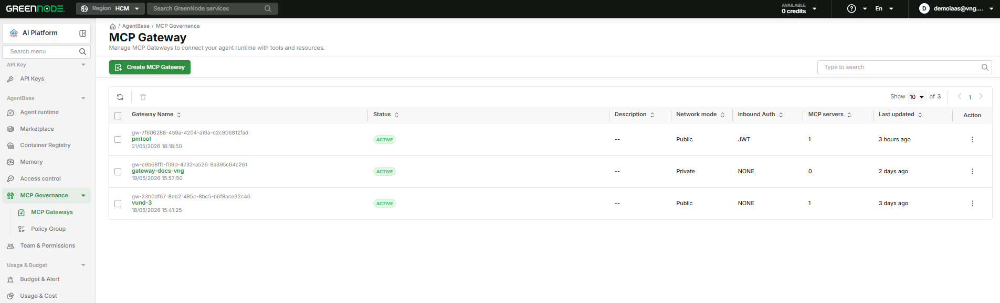
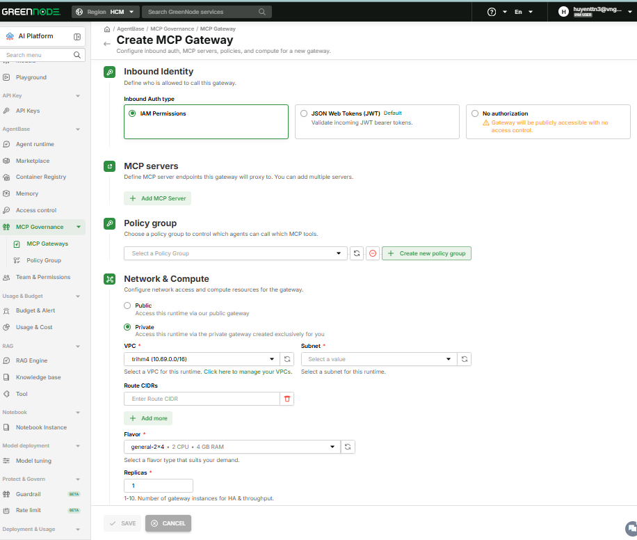
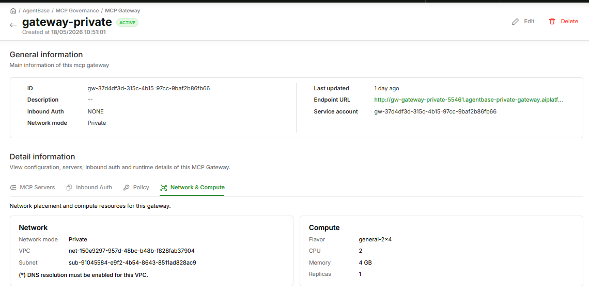
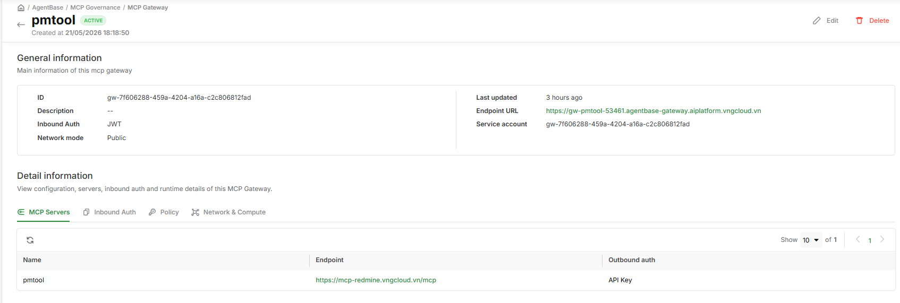
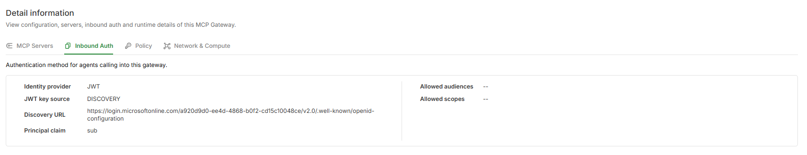
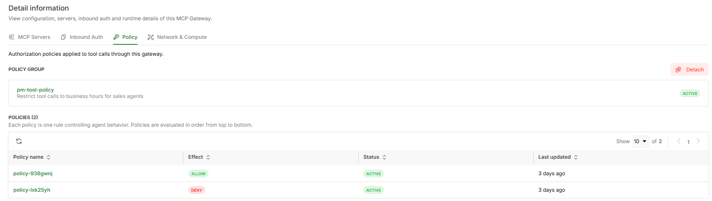

# Quản lý MCP Gateway

> Hướng dẫn tạo, xem, chỉnh sửa và xóa MCP Gateway trên GreenNode AI Platform Portal.

---

## Điều kiện cần

- Đã có tài khoản GreenNode AI Platform với role **Root** hoặc **Admin**
- Đã tạo ít nhất một Secret trong **Identity** component (cần thiết nếu dùng Outbound Auth = OAuth 2.0 hoặc API Key)
- Nếu dùng network **Private**: đã có VPC và Subnet với DNS resolution được bật

---

## Xem danh sách MCP Gateway

1. Đăng nhập vào [GreenNode AI Platform Portal](https://aiplatform.console.vngcloud.vn/mcp-gateway).
2. Chọn **AgentBase** trong menu trái.
3. Chọn **MCP Governance** → **MCP Gateway**.

Trang hiển thị bảng gồm các cột: **Gateway name**, **Description**, **Status**, **Inbound Auth**, **Targets**, **Creation time**, và **Actions**.

| Status | Ý nghĩa |
|---|---|
| **Active** | Gateway đang hoạt động bình thường |
| **Creating** | Đang được provision trên Kong (≤ 30 giây) |
| **Updating** | Đang cập nhật cấu hình (≤ 30 giây) |
| **Deleting** | Đang được xóa khỏi Kong |
| **Error** | Provision thất bại — hover vào badge để xem lỗi |

---

## Tạo MCP Gateway

**Bước 1: Mở form tạo gateway**

1. Trên trang **MCP Gateway**, nhấn **Create Gateway**.
2. Trang **Create MCP Gateway** hiển thị form 5 bước theo chiều dọc.

---

**Bước 2: Cấu hình cơ bản (① Basic Configuration)**

1. Điền **Gateway name** — bắt buộc, chỉ dùng ký tự `a–z`, `A–Z`, `0–9`, dấu gạch ngang; tối thiểu 5 ký tự, tối đa 50 ký tự; phải duy nhất trong org.
2. Điền **Description** (tùy chọn).

---

**Bước 3: Cấu hình xác thực đầu vào (② Inbound Identity)**

1. Chọn **Inbound Auth type**:
   - **JSON Web Tokens (JWT)** *(mặc định)* — agent đính kèm JWT khi gọi vào gateway
   - **IAM Permissions** — dùng IAM token của GreenNode AI Platform
   - **No authorization** — gateway accessible công khai


Chọn **No authorization** sẽ khiến gateway accessible công khai mà không có access control. Chỉ dùng trong môi trường development hoặc khi network đã được bảo vệ ở lớp khác.


2. Nếu chọn **JWT**, cấu hình thêm:
   - **JWT key source**: chọn **Discovery URL** (gateway tự fetch public keys định kỳ từ OIDC well-known endpoint) hoặc **JWKS** (paste JSON trực tiếp — phải là JSON hợp lệ có field `keys`)
   - **Audience** (tùy chọn) — JWT audience claim
   - **Allowed clients** (tùy chọn) — danh sách client ID được phép, nhập và nhấn Enter để thêm từng tag
   - **Allowed scopes** (tùy chọn) — các scope được phép, nhập và nhấn Enter để thêm từng tag
   - **Principal claim** — claim trong JWT dùng làm principal khi enforce Policy; mặc định `sub`

---

**Bước 4: Thêm MCP Servers (③ MCP Servers)**

1. Card **MCP Server 1** được tạo sẵn. Điền các trường:

| Trường | Bắt buộc | Ghi chú |
|---|---|---|
| **MCP Server name** | Có | Tên định danh cho server này |
| **MCP endpoint URL** | Có | URL HTTPS của MCP server |
| **Outbound Auth** | Có | OAuth 2.0 / API Key / No authentication |
| **Mode** | Khi dùng OAuth 2.0 hoặc API Key | 2LO (Machine to machine) hoặc 3LO (User federation) |
| **Secret Provider** | Khi dùng OAuth 2.0 hoặc API Key | Chọn từ danh sách secrets trong Identity |
| **Scopes** | Khi dùng OAuth 2.0 | Nhập và nhấn Enter để thêm scope |
| **Return URL** | Khi Mode = 3LO | URL callback sau user redirect |
| **Header key** | Khi dùng OAuth 2.0 hoặc API Key | Mặc định `Authorization` |
| **Header value prefix** | Khi dùng OAuth 2.0 hoặc API Key | Mặc định `Bearer ` (có dấu cách cuối) |

2. Để thêm MCP server khác, nhấn **+ Add MCP Server**.

---

**Bước 5: Gắn Policy Group (④ Policy group)**

1. Mở dropdown **Choose a policy group...** và chọn Policy Group muốn gắn.
2. Nếu chưa có Policy Group, nhấn **+ Create new policy group** để tạo mới (mở tab mới), sau đó quay lại và refresh dropdown.


Policy Group là tùy chọn khi tạo gateway, nhưng nếu không gắn, **mọi MCP tool call qua gateway đều bị block 403**. Gắn Policy Group trước khi agent bắt đầu sử dụng gateway.


---

**Bước 6: Cấu hình Network & Compute (⑤ Network & Compute)**

1. Chọn **Network mode**:
   - **Public** — Hệ thống tự điều phối zone; không cần cấu hình thêm
   - **Private** — chọn **VPC** và **Subnet** (format hiển thị: `<subnet-name> · Zone: <zone-name>`); đảm bảo DNS resolution được bật trong VPC

2. Chọn **Flavor** từ dropdown.
3. Đặt số **Replicas** (1–10, mặc định 1).

---

**Bước 7: Tạo gateway**

1. Nhấn **Create Gateway** ở footer.
2. Gateway được tạo với Status = **Creating**.
3. Sau tối đa 30 giây, Status chuyển sang **Active** — IAM Service Account `sa-gateway-<id>` được tự động tạo và gắn vào gateway.

---

## Xem chi tiết MCP Gateway

1. Trên trang **MCP Gateway**, nhấn vào tên gateway (hyperlink).
2. Trang **Gateway Detail** hiển thị:
   - **General information**: ID, Description, Inbound Auth, Network mode, Created on, Last updated, Endpoint URL, Service account
   - **Detail information** gồm 4 tab:

| Tab | Nội dung |
|---|---|
| **MCP Servers** | Danh sách MCP servers gắn với gateway; Root/Admin có thể thêm, sửa, xóa server |
| **Inbound Auth** | Cấu hình xác thực đầu vào; Root/Admin có thể chỉnh sửa |
| **Policy** | Policy Group đang gắn và danh sách policies (với trạng thái ENABLE/DISABLE/DENY) |
| **Network & Compute** | Thông tin network mode, VPC, Subnet, Flavor, Replicas và estimated cost |

---

## Chỉnh sửa MCP Gateway

1. Trên trang **MCP Gateway**, nhấn **⋮** trên row muốn sửa, chọn **Edit**.
2. Form Edit Gateway hiển thị với thông tin đã điền sẵn — chỉnh sửa các trường cần thay đổi.
3. Nhấn **Save**.
4. Gateway chuyển sang Status = **Updating**, sau đó về **Active** trong tối đa 30 giây.


Nếu đổi sang một Policy Group mới trong khi gateway đang có traffic, hệ thống hiển thị cảnh báo xác nhận trước khi apply. Policy mới có hiệu lực trong vòng 30 giây sau khi save.


---

## Xóa MCP Gateway

1. Trên trang **MCP Gateway**, tick checkbox trên row muốn xóa.
2. Nhấn **Delete** trên toolbar (icon màu đỏ).
3. Xác nhận trong dialog.
4. Gateway chuyển sang Status = **Deleting** và bị xóa khỏi danh sách sau khi Kong deprovision xong (tối đa 30 giây).


Xóa gateway không thể hoàn tác. Các agent đang gọi qua gateway này sẽ nhận lỗi ngay sau khi gateway bị xóa. Đảm bảo không có agent nào đang dùng gateway trước khi xóa.


---

## Kết quả

Sau khi tạo thành công, gateway ở trạng thái **Active** và agent có thể gọi MCP tool calls qua Endpoint URL hiển thị trong phần General information.

| Tôi muốn tiếp theo... | Đi đến |
|---|---|
| Tìm hiểu Policy Group để kiểm soát quyền truy cập | [MCP Governance](../README.md) |
| Hiểu kiến trúc MCP Gateway | [MCP Gateway](README.md) |
