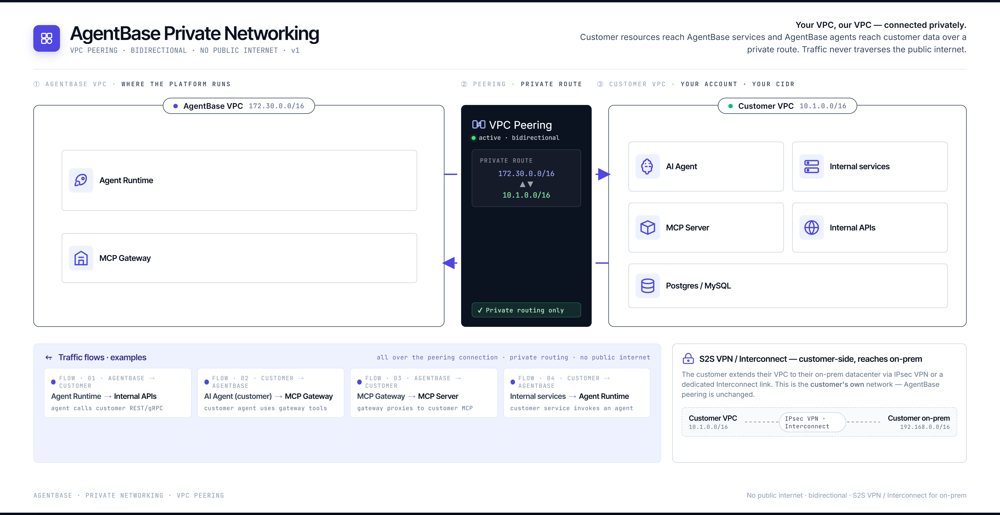
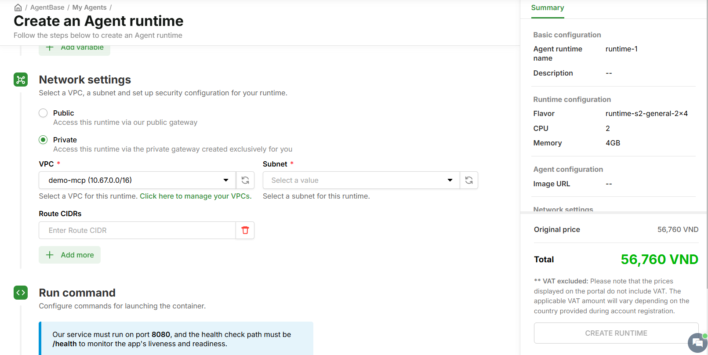
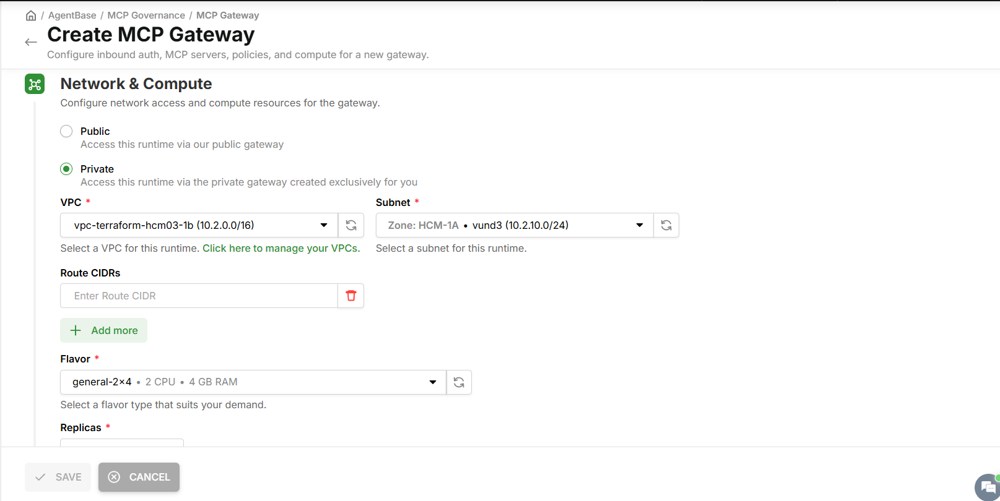

# Mạng riêng tư (Private Networking)

Kết nối VPC của bạn với AgentBase qua VPC Peering — cho phép Agent Runtime và MCP Gateway gọi thẳng vào database, API nội bộ, MCP Server trong hạ tầng của bạn mà không đi qua internet công cộng.

---

## Public và Private — sự khác biệt

AgentBase hỗ trợ hai chế độ mạng khi tạo Agent Runtime và MCP Gateway:

| | **Public** | **Private** |
|---|---|---|
| **Truy cập** | Qua public gateway của AgentBase | Qua private gateway riêng cho org |
| **Traffic** | Qua internet | Nội bộ — không qua internet |
| **Gọi tài nguyên nội bộ** | Không thể | Có — agent/gateway gọi thẳng vào VPC của bạn |
| **Yêu cầu** | Không | VPC Peering giữa VPC của bạn và AgentBase |

Khi chọn **Private**, AgentBase tạo một private gateway riêng cho org và định tuyến traffic qua VPC Peering — đảm bảo toàn bộ luồng dữ liệu giữa agent và hạ tầng nội bộ của bạn không bao giờ rời khỏi mạng riêng.


Để sử dụng chế độ **Private**, VPC Peering giữa VPC của bạn và AgentBase VPC phải được kích hoạt trước. Liên hệ GreenNode support để thiết lập.


---

## Cấu hình Private cho Agent Runtime

> Thực hiện tại bước **Network settings** trong luồng tạo Agent Runtime.

**Bước 1: Chọn chế độ Private**

1. Mở luồng tạo Agent Runtime — tham khảo [Khởi tạo Runtime](agent-runtime/khoi-tao-runtime.md)
2. Tại bước **Network settings**, chọn **Private**
3. Màn hình hiển thị thêm các trường **VPC**, **Subnet**, **Route CIDRs**

**Bước 2: Chọn VPC và Subnet**

1. Chọn **VPC** từ dropdown — chỉ liệt kê các VPC đã được peer với AgentBase
2. Nhấn biểu tượng làm mới nếu VPC vừa tạo chưa xuất hiện
3. Chọn **Subnet** phù hợp cho Runtime

| Trường | Bắt buộc | Ghi chú |
|---|---|---|
| **VPC** | Có | VPC đã thiết lập VPC Peering với AgentBase |
| **Subnet** | Có | Subnet trong VPC đã chọn |
| **Route CIDRs** | Không | Thêm CIDR range nếu Runtime cần định tuyến đến subnet khác trong hạ tầng của bạn |

**Bước 3: Hoàn tất Runtime**

Điền các thông tin còn lại (Run command, Flavor, biến môi trường...) và nhấn **CREATE RUNTIME**.

---

## Cấu hình Private cho MCP Gateway

> Thực hiện tại bước **Network & Compute** trong luồng tạo MCP Gateway.

**Bước 1: Chọn chế độ Private**

1. Mở luồng tạo MCP Gateway — tham khảo [Quản lý MCP Gateway](mcp-governance/mcp-gateway/quan-ly-mcp-gateway.md)
2. Tại bước **Network & Compute**, chọn **Private**
3. Màn hình hiển thị các trường **VPC**, **Subnet**, **Route CIDRs**, **Flavor**, **Replicas**

**Bước 2: Chọn VPC, Subnet và Flavor**

1. Chọn **VPC** đã được peer với AgentBase
2. Nhấn biểu tượng làm mới nếu VPC chưa xuất hiện trong danh sách
3. Chọn **Subnet** — hiển thị Zone và CIDR của từng subnet
4. Điền **Route CIDRs** nếu Gateway cần định tuyến đến thêm các subnet khác
5. Chọn **Flavor** phù hợp với tải của Gateway
6. Điền số **Replicas**

| Trường | Bắt buộc | Ghi chú |
|---|---|---|
| **VPC** | Có | VPC đã thiết lập VPC Peering với AgentBase |
| **Subnet** | Có | Subnet trong VPC đã chọn, hiển thị Zone và CIDR |
| **Route CIDRs** | Không | CIDR bổ sung nếu Gateway cần tiếp cận thêm subnet |
| **Flavor** | Có | Cấu hình compute cho Gateway — ví dụ: `general-2×4` (2 CPU, 4 GB RAM) |
| **Replicas** | Có | Số instance Gateway chạy song song |

**Bước 3: Hoàn tất Gateway**

Điền các thông tin còn lại (Inbound Auth, MCP Servers, Policy Group...) và nhấn **SAVE**.

---

## Kết quả

Sau khi tạo thành công với chế độ Private:

- **Agent Runtime**: chạy trong mạng riêng, gọi trực tiếp đến database, API nội bộ trong VPC của bạn — không qua internet
- **MCP Gateway**: nhận MCP tool calls từ agent và forward đến MCP Server trong VPC của bạn qua kết nối riêng

| Tôi muốn... | Đi đến |
|---|---|
| Tạo Agent Runtime với Private network | [Khởi tạo Runtime](agent-runtime/khoi-tao-runtime.md) |
| Tạo MCP Gateway với Private network | [Quản lý MCP Gateway](mcp-governance/mcp-gateway/quan-ly-mcp-gateway.md) |
| Hiểu cách MCP Gateway kiểm soát tool calls | [MCP Governance](mcp-governance/README.md) |
