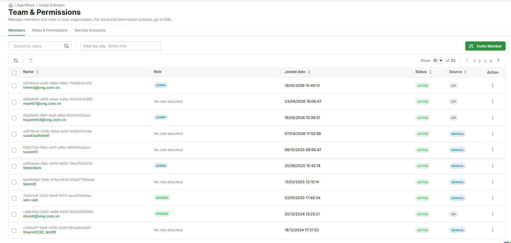

# Quản lý thành viên

> Hướng dẫn Root và Admin xem danh sách thành viên, mời thành viên mới qua IDP Login URL, xóa thành viên và gán role trên tab **Members** của **Team & Permissions**.

---

## Điều kiện cần

- Đã đăng nhập với role **Root** hoặc **Admin**

---

## Mở tab Members

Vào [Team & Permissions](https://aiplatform.console.vngcloud.vn/team-permissions) — tab **Members** mở mặc định.

Danh sách hiển thị: **Name**, **Role**, **Joined Date**, **Status**, **Source**, **Action**

| Cột | Giá trị |
|---|---|
| **Role** | Badge màu: Root = tím, Admin = xanh dương, Member = xanh lá, Viewer = xám · "No role attached" nếu chưa gán |
| **Source** | `IDP` = đăng nhập qua Identity Provider · `MANUAL` = tạo thủ công qua IAM |
| **Action** | Icon ⋮ → menu **Change role** / **Delete** |

---

## Mời thành viên mới

Thành viên mới không cần tạo tài khoản — họ đăng nhập qua **IDP Login URL** được cấp.

**Bước 1:** Nhấp **Invite Member** (góc trên phải)

**Bước 2:** Popup hiển thị danh sách IDP đã cấu hình trong IAM:

| Trường hợp | Kết quả |
|---|---|
| **Chưa có IDP** | Popup thông báo — truy cập [IAM Identity Providers](https://iam.console.vngcloud.vn/identity-providers) để tạo IDP trước, sau đó quay lại mời thành viên |
| **Đã có IDP** | Popup danh sách IDP: Name / Type / Login URL / icon **Copy** |

**Bước 3:** Nhấp icon **Copy** → gửi Login URL cho thành viên mới

**Bước 4:** Thành viên truy cập link, xác thực qua IDP → tự động được thêm vào org với trạng thái "No role attached"

**Bước 5:** Root gán role cho thành viên vừa đăng nhập (xem mục **Đổi role** bên dưới)

---

## Xóa thành viên khỏi org

**Bước 1:** Tìm thành viên trong danh sách (dùng search bar hoặc filter by role)

**Bước 2:** Nhấp icon **⋮** trên row của thành viên → chọn **Delete**

**Bước 3:** Xác nhận dialog → nhấp **Confirm**


Root Account không thể bị xóa. Ownership transfer theo quy trình riêng tại IAM.


---

## Đổi role thành viên

**Bước 1:** Nhấp icon **⋮** trên row của thành viên → chọn **Change role**

**Bước 2:** Popup **Change role** hiện ra — chọn một hoặc nhiều role muốn gán:

| Role | Mô tả trong popup |
|---|---|
| **Admin** | Manage members, agents, and org config. No billing, quota, or model config permissions. |
| **Member** | Tạo và chạy agent của mình. Xem logs & traces. |
| **Viewer** | Read-only. View agent config, logs, and conversation history. Cannot perform any side-effect actions. |

**Bước 3:** Nhấp **Confirm** — thay đổi có hiệu lực ngay, không yêu cầu thành viên logout/login lại

---

## Kết quả

| Tôi muốn tiếp theo... | Đi đến |
|---|---|
| Hiểu chi tiết quyền của từng role | [Phân quyền theo role](phan-quyen-theo-role.md) |
| Xem Service Accounts của agent | [Quản lý Service Accounts](quan-ly-service-accounts.md) |