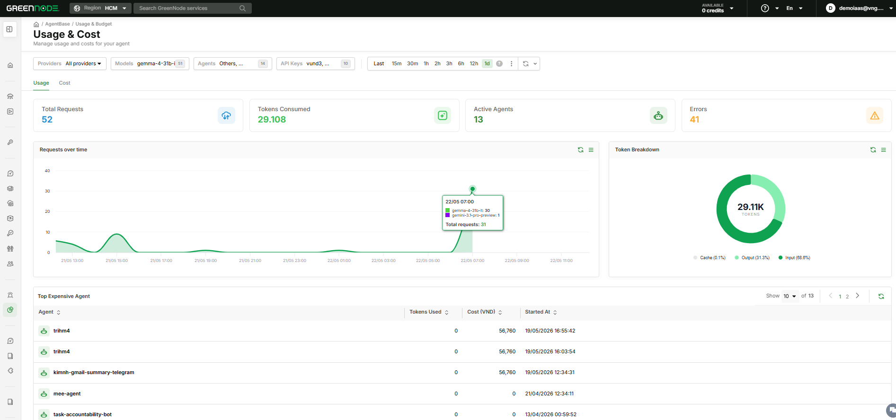
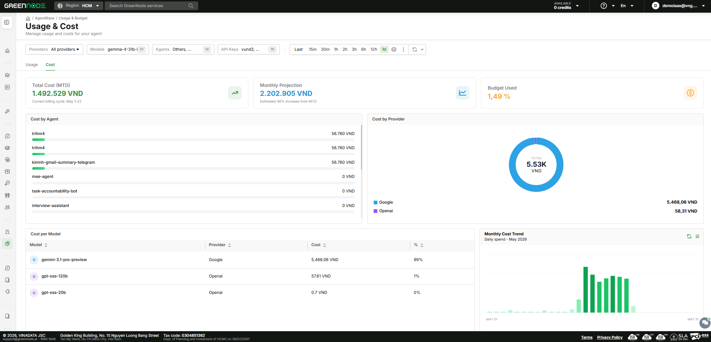

# Xem Usage & Cost

> Hướng dẫn Root, Admin và Viewer theo dõi mức tiêu thụ tài nguyên (MaaS và Runtime/Agent), cost breakdown và dự báo chi phí cuối tháng trên dashboard **Usage & Cost**.

---

## Điều kiện cần

- Đã đăng nhập với role **Root**, **Admin** hoặc **Viewer** để xem full org data
- Hoặc role **Member** để xem data của agent do mình tạo

---

## Mở Usage & Cost

1. Vào **AgentBase** → sidebar → **Usage & Budget** → **Usage & Cost**
2. Dashboard mở mặc định ở **Tab Usage** với Time Range = **Last 1h**

---

## Áp dụng Filter

Global filter bar nằm cố định ở đầu trang, áp dụng cho cả Tab Usage và Tab Cost:

| Filter | Mô tả |
|---|---|
| **Agent** | Multi-select — chọn agent cụ thể hoặc **Others** (MaaS gọi trực tiếp không qua agent) |
| **All Provider** | Multi-select — lọc theo nhà cung cấp LLM (OpenAI, Anthropic, VNG AIP,...) |
| **All Models** | Multi-select — lọc theo AI model (gpt-4o, claude-sonnet-4-6,...) |
| **All API Keys** | Single select — lọc theo API Key |
| **Time Range** | Quick bar + picker panel |

---

## Chọn Time Range

**Quick bar:** Nhấn trực tiếp một trong các preset: **15m · 30m · 1h · 2h · 3h · 6h · 12h · 1d**

**Picker panel** (nhấn **∨** để mở):

| Tab | Cách dùng |
|---|---|
| **Quick** | Chọn preset: Last 15 minutes → Last 6 months; Today, This week, This month, Last month,... |
| **Relative** | Nhập khoảng tương đối tùy chỉnh (ví dụ: Last 45 minutes) |
| **Absolute** | Chọn From date và To date cụ thể; validate: To ≥ From |

---

## Tab Usage — Xem Usage Metrics

Tab Usage hiển thị 4 KPI cards và 3 section chính:

**KPI cards:**

| Card | Mô tả |
|---|---|
| **Total Requests** | Tổng số API calls trong khoảng filter |
| **Tokens Consumed** | Tổng Input Tokens + Output Tokens (bao gồm cả Cache) |
| **Active Agents** | Số agent có ít nhất 1 request — không tính Others (MaaS) |
| **Errors** | Tổng số request bị lỗi trong khoảng filter |

**Biểu đồ:**

- **Requests over time**: Line chart — trục X theo giờ (≤ 1 ngày) hoặc theo ngày (> 1 ngày); hover tooltip hiển thị breakdown theo model và tổng request
- **Token Breakdown**: Doughnut chart phân tách Cache / Output / Input tokens — hover để xem giá trị và %

**Bảng Top Expensive Agent:**

Hiển thị top 10 agent có tổng chi phí cao nhất trong khoảng time range đang chọn:

| Cột | Mô tả |
|---|---|
| **Agent** | Tên agent kèm icon |
| **Tokens Used** | Tổng tokens đã dùng |
| **Cost (VND)** | Tổng chi phí (VND), sort giảm dần mặc định |
| **Started At** | Thời điểm bắt đầu phiên làm việc gần nhất |

Row **Others** xuất hiện ở cuối bảng nếu có usage MaaS không gắn với agent nào.

**Budget warning banner:**

Khi chi phí tháng hiện tại đạt ≥ 80% budget limit, banner cảnh báo cố định hiển thị đầu Tab Usage:
- **80–99%**: Banner vàng — "⚠️ Đã sử dụng X% ngân sách tháng này. Xem xét giảm tải hoặc kiểm tra lại các agent đang chạy." [link **Xem ngân sách**]
- **100%+**: Banner đỏ — "⚠️ Đã vượt ngân sách tháng này. Cần xử lý ngay."

---

## Tab Cost — Xem Cost Breakdown

Chuyển sang **Tab Cost** để xem phân tích chi phí chi tiết:

**KPI cards:**

| Card | Hiển thị khi |
|---|---|
| **Total Cost** | Luôn hiển thị |
| **Budget Used** | Chỉ hiển thị khi Root đã đặt budget limit |
| **Monthly Projection** | Luôn hiển thị (sau ≥ 3 ngày trong tháng) |

**Cost breakdown:**

- **Cost by Agent**: Bảng + biểu đồ; click vào row agent → filter toàn dashboard chỉ hiển thị agent đó
- **Cost by Provider**: Doughnut chart — OpenAI / Anthropic / VNG AIP với % contribution
- **Cost by Model**: Bảng + biểu đồ — Model Name, Provider, Total Cost, % of Total; sort theo cost giảm dần
- **Monthly Cost Trend**: Bar/line chart — cost theo ngày trong tháng hiện tại; hover tooltip hiển thị ngày, tổng cost, số request

---

## Phân quyền theo role

| Role | Dữ liệu xem được |
|---|---|
| **Root** | Full org data (tất cả agent, provider, model, MaaS/Runtime) + truy cập Budget & Alerts |
| **Admin** | Full org data — không truy cập Budget & Alerts |
| **Viewer** | Full org data — không truy cập Budget & Alerts |
| **Member** | Chỉ data của agent do mình tạo; không thấy option **Others** (MaaS) |

---

## Kết quả

| Tôi muốn tiếp theo... | Đi đến |
|---|---|
| Đặt hạn mức ngân sách và nhận cảnh báo | [Cấu hình Budget & Alerts](budget-alert.md) |
| Tổng quan Usage & Budget | [Usage & Budget](README.md) |
