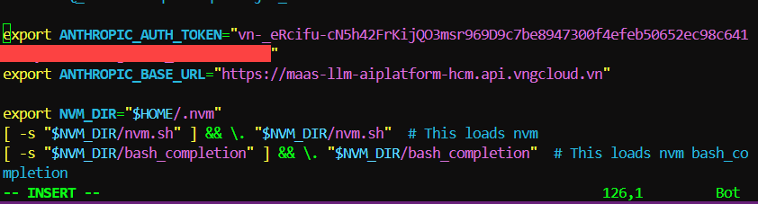
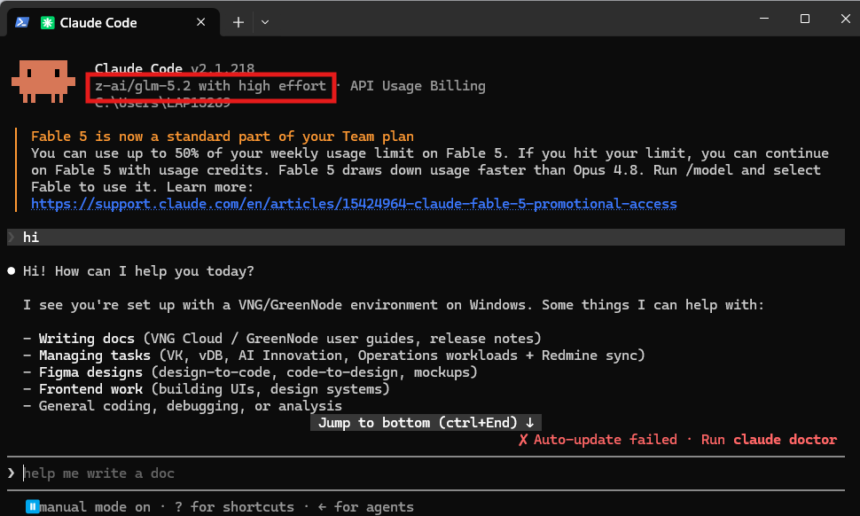

# Kết nối Claude Code với GreenNode MaaS (GLM 5.2)

> Dành cho người dùng terminal (macOS / Linux / WSL / Windows). Claude Code CLI sẽ dùng model **GLM 5.2** của GreenNode qua MaaS thay vì gọi thẳng Anthropic.


**Trước tiên hãy chuẩn bị [Điều kiện cần](../bat-dau.md):** key (ACTIVE), Base URL đúng loại dịch vụ, và model đã ENABLED.


---

## Chọn cấu hình theo loại dịch vụ

Claude Code dùng **chuẩn Anthropic** → Base URL **không** có `/v1` ở cả hai loại dịch vụ. Chỉ khác host và loại key:

| Loại dịch vụ | Base URL | Key | Model ID |
|---|---|---|---|
| **PAYG** | `https://maas-llm-aiplatform-hcm.api.vngcloud.vn` | API Key từ [trang API Keys](https://aiplatform.console.greennode.ai/keys) | `z-ai/glm-5.2` |
| **Token Plan** | `https://tokenplan.api.greennode.ai` | subscription-key từ Plan Detail → tab **Subscription keys** | Model code ở tab **Models** (ví dụ `glm-5.2`) |


**Key và Base URL phải cùng một loại dịch vụ.** API Key PAYG gửi tới host `tokenplan…` (hoặc ngược lại) trả về `401 Unauthorized` dù key vẫn còn hiệu lực. Không nhận biết loại key bằng mắt được — nhớ theo nơi bạn đã lấy key. Xem [Mục 2 của trang Điều kiện cần](../bat-dau.md).



**GLM 5.2 chỉ là model ví dụ.** GreenNode có nhiều model — bạn thay bằng model mình muốn. Với PAYG, Model ID xem trong [trang chi tiết model](https://aiplatform.console.greennode.ai/models); với Token Plan, xem tab **Models** của gói.


---

## Bước 1 — Cài Claude Code

```bash
npm install -g @anthropic-ai/claude-code
```

---

## Bước 2 — Khai báo Base URL & API key

Chọn đúng tab theo **loại dịch vụ** của bạn và **hệ điều hành**, rồi copy nguyên văn — chỉ thay giá trị key.



Chạy tạm cho phiên hiện tại:

```bash
export ANTHROPIC_BASE_URL="https://maas-llm-aiplatform-hcm.api.vngcloud.vn"
export ANTHROPIC_AUTH_TOKEN="<API-key-PAYG-của-bạn>"
```

Để tự động mỗi lần mở terminal, thêm 2 dòng trên vào cuối `~/.zshrc` (macOS) hoặc `~/.bashrc` (Linux/WSL), rồi nạp lại:

```bash
source ~/.zshrc      # hoặc: source ~/.bashrc
```



Chạy tạm cho cửa sổ PowerShell hiện tại:

```powershell
$env:ANTHROPIC_BASE_URL = "https://maas-llm-aiplatform-hcm.api.vngcloud.vn"
$env:ANTHROPIC_AUTH_TOKEN = "<API-key-PAYG-của-bạn>"
```

Để lưu vĩnh viễn cho tài khoản (chỉ chạy một lần, rồi **mở lại PowerShell**):

```powershell
[Environment]::SetEnvironmentVariable("ANTHROPIC_BASE_URL", "https://maas-llm-aiplatform-hcm.api.vngcloud.vn", "User")
[Environment]::SetEnvironmentVariable("ANTHROPIC_AUTH_TOKEN", "<API-key-PAYG-của-bạn>", "User")
```



Chạy tạm cho phiên hiện tại:

```bash
export ANTHROPIC_BASE_URL="https://tokenplan.api.greennode.ai"
export ANTHROPIC_AUTH_TOKEN="<subscription-key-của-bạn>"
```

Để tự động mỗi lần mở terminal, thêm 2 dòng trên vào cuối `~/.zshrc` (macOS) hoặc `~/.bashrc` (Linux/WSL), rồi nạp lại:

```bash
source ~/.zshrc      # hoặc: source ~/.bashrc
```



Chạy tạm cho cửa sổ PowerShell hiện tại:

```powershell
$env:ANTHROPIC_BASE_URL = "https://tokenplan.api.greennode.ai"
$env:ANTHROPIC_AUTH_TOKEN = "<subscription-key-của-bạn>"
```

Để lưu vĩnh viễn cho tài khoản (chỉ chạy một lần, rồi **mở lại PowerShell**):

```powershell
[Environment]::SetEnvironmentVariable("ANTHROPIC_BASE_URL", "https://tokenplan.api.greennode.ai", "User")
[Environment]::SetEnvironmentVariable("ANTHROPIC_AUTH_TOKEN", "<subscription-key-của-bạn>", "User")
```



<figure><figcaption><p>Cấu hình ANTHROPIC_AUTH_TOKEN và ANTHROPIC_BASE_URL trong shell profile</p></figcaption></figure>

---

## Bước 3 — Chạy Claude Code

Trong thư mục project, chạy lệnh ứng với loại dịch vụ của bạn:



```bash
claude --model z-ai/glm-5.2
```



```bash
claude --model glm-5.2
```

Thay `glm-5.2` bằng đúng **Model code** ở tab **Models** của gói bạn đã mua.




Cờ `--model` chỉ định model cho phiên hiện tại. Trong Claude Code bạn cũng có thể đổi model bằng lệnh `/model`.


---

## Bước 4 — Kiểm tra

Trong Claude Code, gõ `/status` và đối chiếu:

| Kiểm tra | PAYG | Token Plan |
|---|---|---|
| Base URL trỏ về | `maas-llm-aiplatform-hcm.api.vngcloud.vn` | `tokenplan.api.greennode.ai` |
| Model | `z-ai/glm-5.2` | Model code của gói (ví dụ `glm-5.2`) |

Sau đó vào **[AI Platform Console](https://aiplatform.console.greennode.ai/)** để thấy lượt gọi được ghi nhận.

<figure><figcaption><p>Claude Code chạy thành công với model z-ai/glm-5.2 qua GreenNode MaaS</p></figcaption></figure>

---

## Xử lý sự cố

| Hiện tượng | Nguyên nhân | Cách xử lý |
|------------|-------------|------------|
| `401` / "Unauthorized" | Key sai hoặc chưa ACTIVE | Kiểm tra `ANTHROPIC_AUTH_TOKEN`; đợi key **ACTIVE** |
| `401` dù key còn hiệu lực | **Key và Base URL lệch loại dịch vụ** — ví dụ API Key PAYG gửi tới host `tokenplan…` | Đối chiếu lại bảng ở đầu trang: key lấy ở trang **API Keys** → host `maas-llm-…`; key lấy ở tab **Subscription keys** → host `tokenplan…` |
| `403 Forbidden` (Token Plan) | Model không nằm trong gói | Chỉ gọi model có trong tab **Models** của gói |
| `402 Payment Required` (Token Plan) | Gói đã hết hạn hoặc bị xoá | Mua lại gói hoặc bật **Auto-renew** |
| `404` / "Not Found" | Base URL sai (thừa `/v1` hoặc `/` cuối) | Claude Code là chuẩn Anthropic — Base URL **không** có `/v1` |
| Request đi thẳng Anthropic | Còn biến `ANTHROPIC_API_KEY` cũ | Chạy `unset ANTHROPIC_API_KEY` (macOS/Linux) hoặc xoá biến đó trong Windows |
| Sai model được dùng | Thiếu cờ `--model`, hoặc dùng Model ID của loại dịch vụ khác | Chạy `claude --model <model-id-đúng-loại-dịch-vụ>` hoặc dùng `/model` để đổi |
| AI không phản hồi | PAYG hết credit, hoặc Token Plan hết hạn mức token | PAYG: nạp credit. Token Plan: đợi chu kỳ mới, mua thêm gói, hoặc tạm chuyển sang API Key PAYG |
| Connection timeout | Không ra được mạng tới endpoint | Kiểm tra VPN / mạng tới `*.api.vngcloud.vn` (PAYG) hoặc `tokenplan.api.greennode.ai` (Token Plan) |

---

| Tôi muốn tiếp theo... | Đi đến |
|------------------------|--------|
| Dùng OpenCode | [OpenCode](opencode.md) |
| Xem điều kiện cần | [Bắt đầu với AI Coding](../bat-dau.md) |
| Tìm hiểu gói Token Plan | [Token Plan](../../token-plan/README.md) |

---

## Cần hỗ trợ?

Nếu bạn làm theo mà vẫn chưa được, đừng ngại liên hệ bộ phận Hỗ trợ Khách hàng của GreenNode:

* Email: [support@greennode.ai](mailto:support@greennode.ai)
* Hotline: 19001549
* Trung tâm hỗ trợ: [helpdesk.greennode.ai](https://helpdesk.greennode.ai)

Cảm ơn bạn đã sử dụng dịch vụ của GreenNode.
