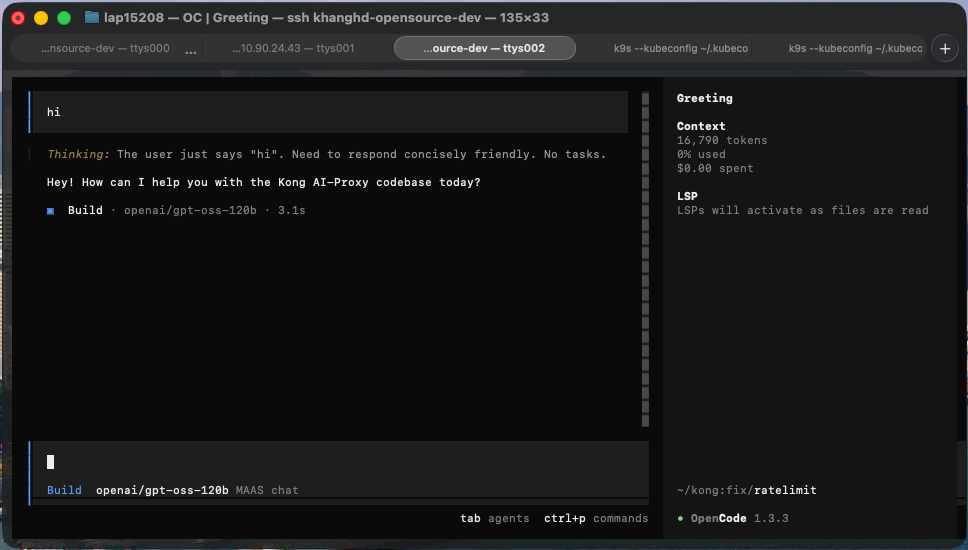

# Dùng OpenCode với GreenNode MaaS

> Hướng dẫn cấu hình [OpenCode](https://opencode.ai) — TUI coding assistant — để gọi model qua GreenNode MaaS thông qua provider `@ai-sdk/openai-compatible`.

***

## Điều kiện cần (Prerequisites)

* Chuẩn bị key, Base URL và model theo [Bắt đầu với AI Coding](../bat-dau.md)
* Node.js đã cài đặt

***

## Chọn cấu hình theo loại dịch vụ

OpenCode dùng **chuẩn OpenAI** → `baseURL` **có** `/v1` ở cả hai loại dịch vụ. Chỉ khác host và loại key:

| Loại dịch vụ | `baseURL` | Key | Model |
|---|---|---|---|
| **PAYG** | `https://maas-llm-aiplatform-hcm.api.vngcloud.vn/v1` | API Key từ [trang API Keys](https://aiplatform.console.greennode.ai/keys) | `openai/gpt-oss-120b` |
| **Token Plan** | `https://tokenplan.api.greennode.ai/v1` | subscription-key từ Plan Detail → tab **Subscription keys** | Model code ở tab **Models** của gói |


**Key và `baseURL` phải cùng một loại dịch vụ.** API Key PAYG gửi tới host `tokenplan…` (hoặc ngược lại) trả về `401 Unauthorized` dù key vẫn còn hiệu lực. Nhớ theo nơi bạn đã lấy key — xem [Mục 2 của trang Điều kiện cần](../bat-dau.md).


***

## Bước 1 — Cài đặt OpenCode

```bash
npm install -g opencode-ai
```

Hoặc qua Homebrew (macOS):

```bash
brew install opencode
```

***

## Bước 2 — Lấy key



1. Đăng nhập [AI Platform Console](https://aiplatform.console.greennode.ai/)
2. Vào **API Keys** → **Create API Key**
3. Đặt tên key (5–50 ký tự, chữ thường + số + gạch ngang)
4. Copy API key vừa tạo


API key mới tạo ở trạng thái `pending`. Đợi đến khi status = `ACTIVE` mới dùng được.




1. Vào **API Key** → **Token Plan** → **My Token Plans**, mở gói đã mua
2. Tab **Subscription keys** → copy `default-key` hoặc key bạn tự tạo
3. Tab **Models** → copy **Model code** của model muốn dùng

Chưa có gói? Xem [Mua gói Token Plan](../../token-plan/mua-goi-token-plan.md).



***

## Bước 3 — Tạo file cấu hình `opencode.json`

Tạo file `opencode.json` tại thư mục gốc của project. Copy đúng tab theo loại dịch vụ của bạn:



```json
{
  "$schema": "https://opencode.ai/config.json",
  "model": "MAAS-chat/openai/gpt-oss-120b",
  "provider": {
    "MAAS-chat": {
      "npm": "@ai-sdk/openai-compatible",
      "name": "MAAS chat",
      "options": {
        "baseURL": "https://maas-llm-aiplatform-hcm.api.vngcloud.vn/v1",
        "apiKey": "{env:MAAS_API_KEY}"
      },
      "models": {
        "openai/gpt-oss-120b": {
          "name": "openai/gpt-oss-120b"
        }
      }
    }
  }
}
```



```json
{
  "$schema": "https://opencode.ai/config.json",
  "model": "MAAS-chat/glm-5.2",
  "provider": {
    "MAAS-chat": {
      "npm": "@ai-sdk/openai-compatible",
      "name": "MAAS chat",
      "options": {
        "baseURL": "https://tokenplan.api.greennode.ai/v1",
        "apiKey": "{env:MAAS_API_KEY}"
      },
      "models": {
        "glm-5.2": {
          "name": "glm-5.2"
        }
      }
    }
  }
}
```


Thay `glm-5.2` (ở cả `model` và trong `models`) bằng đúng **Model code** ở tab **Models** của gói. Gọi model ngoài gói trả về `403 Forbidden`.




**Giải thích các field:**

| Field | Mục đích |
|---|---|
| `$schema` | Bật autocomplete/validation trong editor |
| `model` | Model mặc định — format `<provider-key>/<model-id>` |
| `provider.MAAS-chat` | Provider key — phần trước `/` trong `model` phải khớp chính xác |
| `npm` | Adapter package — `@ai-sdk/openai-compatible` dùng được cho mọi endpoint OpenAI-style |
| `options.baseURL` | Endpoint theo loại dịch vụ, có `/v1` ở cuối |
| `options.apiKey` | Key MaaS — dùng `{env:MAAS_API_KEY}` thay vì hardcode |
| `models` | Danh sách model expose từ provider này |


Lỗi phổ biến: đặt `"model"` thành tên không khớp với provider key đã đăng ký. OpenCode tách theo `/` đầu tiên để tìm provider — nếu không khớp, model không load được. Giá trị `model` luôn phải bắt đầu bằng `MAAS-chat/`.


***

## Bước 4 — Cung cấp key

Vì config dùng `{env:MAAS_API_KEY}`, key không nằm trong file mà được đọc từ biến môi trường lúc runtime. Dùng đúng key của loại dịch vụ đã khai trong `baseURL` ở Bước 3.

**Cách A — Export biến môi trường (khuyến nghị)**



```bash
export MAAS_API_KEY="<API-key-PAYG-của-bạn>"
opencode
```



```bash
export MAAS_API_KEY="<subscription-key-của-bạn>"
opencode
```



Để tự động mỗi lần mở terminal, thêm vào `~/.zshrc` hoặc `~/.bashrc`:

```bash
echo 'export MAAS_API_KEY="<key-của-bạn>"' >> ~/.zshrc
source ~/.zshrc
```

Hoặc set inline cho một lần chạy duy nhất:

```bash
MAAS_API_KEY="<key-của-bạn>" opencode
```

**Cách B — Dùng file `.env` gitignored trong project**

Tạo file `.env` (thêm vào `.gitignore`):

```bash
export MAAS_API_KEY="<key-của-bạn>"
```

Chạy OpenCode bằng cách load `.env` trước:

```bash
source .env && opencode
```


Không hardcode key trực tiếp vào `opencode.json` nếu file đó được commit. Nếu key đã bị commit, rotate ngay — API Key PAYG rotate tại [trang API Keys](https://aiplatform.console.greennode.ai/keys), subscription-key thu hồi và tạo lại tại tab **Subscription keys** của gói.


***

## Bước 5 — Chạy OpenCode và chọn model

1. Di chuyển đến thư mục project và chạy:

   ```bash
   opencode
   ```

   OpenCode khởi động với model mặc định khai trong `model` ở Bước 3.

2. Đổi model trong phiên bằng lệnh `/models`, sau đó chọn **MAAS chat →** model của bạn từ danh sách.

<figure><figcaption><p>OpenCode chạy với model openai/gpt-oss-120b qua GreenNode MaaS</p></figcaption></figure>

***

## Thêm model khác

Để expose thêm model từ cùng endpoint, thêm entry vào `models`:



```json
"models": {
  "openai/gpt-oss-120b": { "name": "openai/gpt-oss-120b" },
  "openai/gpt-oss-20b":  { "name": "openai/gpt-oss-20b" }
}
```



```json
"models": {
  "glm-5.2":       { "name": "glm-5.2" },
  "minimax-m2.5":  { "name": "minimax-m2.5" }
}
```

Chỉ thêm được model **nằm trong gói** — đối chiếu tab **Models** của gói.



Sau đó chọn qua `/models`, hoặc đổi `model` ở cấp top-level thành `MAAS-chat/<model-id>` mới.

***

## Troubleshooting

| Triệu chứng | Nguyên nhân | Cách xử lý |
|---|---|---|
| `provider not found` / model không load | Giá trị `model` không khớp provider key | Giá trị `model` phải bắt đầu bằng `MAAS-chat/` |
| `401 Unauthorized` | Key sai, hết hạn, hoặc chưa ACTIVE | Re-export `MAAS_API_KEY`; kiểm tra status key |
| `401` dù key còn hiệu lực | **Key và `baseURL` lệch loại dịch vụ** | Đối chiếu bảng đầu trang: key ở trang **API Keys** → host `maas-llm-…`; key ở tab **Subscription keys** → host `tokenplan…` |
| `403 Forbidden` (Token Plan) | Model không nằm trong gói | Chỉ khai model có trong tab **Models** của gói |
| `402 Payment Required` (Token Plan) | Gói hết hạn hoặc bị xoá | Mua lại gói hoặc bật **Auto-renew** |
| `404` khi gửi request | Base URL sai hoặc thiếu `/v1` | OpenCode là chuẩn OpenAI — `baseURL` phải kết thúc bằng `/v1` |
| Connection timeout | Endpoint không truy cập được từ network hiện tại | Kiểm tra VPN / kết nối đến `*.api.vngcloud.vn` (PAYG) hoặc `tokenplan.api.greennode.ai` (Token Plan) |
| Model trả lỗi nhưng auth đúng | Sai model ID | PAYG: dùng Model ID portal publish. Token Plan: dùng **Model code** ở tab **Models** |

***

## Kết quả

Sau khi hoàn thành, OpenCode route toàn bộ request qua endpoint GreenNode của loại dịch vụ bạn chọn. Usage được ghi nhận trên [AI Platform Console → Usage](https://aiplatform.console.greennode.ai/).

| Tôi muốn tiếp theo... | Đi đến |
|---|---|
| Dùng Codex với Minimax qua MaaS | [Dùng Codex với Minimax qua GreenNode MaaS](codex-cli.md) |
| Kết nối Claude Code với MaaS | [Kết nối Claude Code với GreenNode MaaS](claude-code.md) |
| Tìm hiểu gói Token Plan | [Token Plan](../../token-plan/README.md) |
| Xem usage và billing | [AI Platform Console](https://aiplatform.console.greennode.ai/) |

***

## Cần hỗ trợ?

Nếu bạn làm theo mà vẫn chưa được, đừng ngại liên hệ bộ phận Hỗ trợ Khách hàng của GreenNode:

* Email: [support@greennode.ai](mailto:support@greennode.ai)
* Hotline: 19001549
* Trung tâm hỗ trợ: [helpdesk.greennode.ai](https://helpdesk.greennode.ai)

Cảm ơn bạn đã sử dụng dịch vụ của GreenNode.
