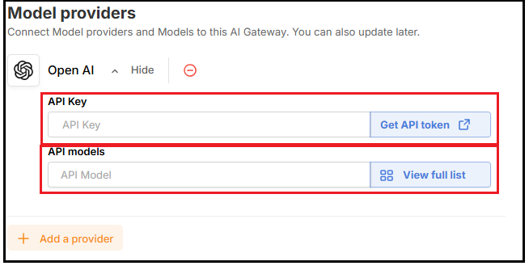

# Bắt đầu với AI Gateway

AI Gateway giúp bạn triển khai và quản lý các endpoint AI một cách dễ dàng, bảo mật và hiệu quả. Dưới đây là các bước cơ bản để bắt đầu

## **1. Khởi tạo AI Gateway**

1. **Truy cập AI Gateway trên VNG Cloud Console tại đây:** [**http://aigateway.console.vngcloud.vn/**](http://aigateway.console.vngcloud.vn/)
2. **Tạo Gateway mới**, nhập các thông tin sau:
   * **Tên AI Gateway:** Đặt tên dễ nhớ cho gateway của bạn.
   * **Model Provider: Chọn Model & Nhập API Key**
     * Model nội bộ từ AI Platform (Inference đã khởi tạo sẵn), hoặc
     * LLM từ các nhà cung cấp như OpenAI, Anthropic, Google, DeepSeek.
     * Nhập API Key dùng để xác thực từ phía Model Provider. 
   * **Config Gateway: Tạo Token xác thực**
     * Bật tính năng Authenticated Gateway, hệ thống sẽ sinh ra một authenticated token để bảo mật các request đến AI Gateway. .png>)
3. **Nhấn khởi tạo để hoàn tất quá trình**

_Sau khi hoàn tất, bạn sẽ có một AI Gateway sẵn sàng để sử dụng._

## 2. **Quản lý AI Gateway**

Trong phần quản lý Gateway, bạn có thể:

* **Cập nhật model đã kết nối:** Chuyển đổi giữa các model hoặc thay đổi key tương ứng cho model từ các provider khác nhau bằng cách truy cập vào gateway cần chỉnh sửa, chọn tab **Provider & Model (1)**, nhấn **Manage Provider & Model (2)**, sau đó **chỉnh sửa kết nối đến model/api key mong muốn (3)**. .png>)
* **Quản lý Token xác thực:** Truy cập vào trang chi tiết gateway cần chỉnh sửa&#x20;
  * Nhân **Create authentication token** để thêm mới token cho gateway **(1)**.
  * Chọn tab **Authentication token (2)**, nhấn biểu tượng **xóa (3)** tại token không còn sử dụng để đảm bảo bảo mật. .png>)

## 3. **Gửi Request đến AI Gateway**

Sử dụng endpoint đã được tạo, bạn có thể gọi Gateway bằng công cụ như Postman, curl hoặc từ backend ứng dụng của bạn.

* Bước 1: Truy cập vào gateway cần gửi request tới, chọn tab **Provider & Model (1)**, nhấn chọn **Model cần gửi request tới (2)**.
* Bước 2: Từ sample **CURL command (3)**, nhập authenticated token muốn sử dụng cho request này, và nhấn copy.
  * Format gateway endpoint: `https://user-{portalUserId}-{gatewayName}.aigateway.console.vngcloud.vn/{modelProvider}/chat/completions`
* Bước 3: Sử dụng Postman hoặc curl từ backend ứng dụng của bạn. .png>)

_AI Gateway sẽ tự động forward request đến model đã được kết nối và trả lại kết quả._

## 4. **Xem Log & Metrics**

Theo dõi hiệu suất và hoạt động của Gateway trong thời gian thực:

* **Logs chi tiết:** Xem nội dung request/response, thời gian xử lý, mã lỗi (nếu có).
* **Metrics tổng quan:** Gồm số lượng request, tỉ lệ lỗi, latency trung bình theo thời gian.

_Từ đó bạn có thể tối ưu hệ thống, điều chỉnh cấu hình hoặc giới hạn để phù hợp với nhu cầu._
