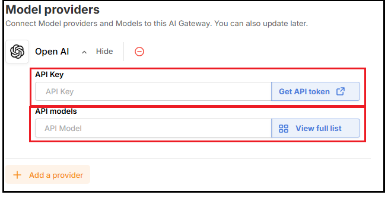

# Khởi tạo AI Gateway

Bên dưới là hướng dẫn khởi tạo AI Gateway:

**Bước 1:** Truy cập AI Gateway trên VNG Cloud Console tại đây: [http://aigateway.console.vngcloud.vn/](http://aigateway.console.vngcloud.vn/)

**Bước 2:** Chọn mục **AI Gateway** sau đó chọn button **Create an AI gateway**

**Bước 3:** Tại màn hình **Tạo Gateway mới**, nhập các thông tin sau:

* **AI Gateway Name:** Tên gợi nhớ cho gateway của bạn. Tên này sẽ bao gồm các ký tự a-z, A-Z, 0-9, '\_', '-' và có độ dài tối thiểu là 5, tối đa là 50 ký tự.
* **Model Provider:**&#x20;
  * Chọn nhà cung cấp như OpenAI, Anthropic, Google, DeepSeek.
  * Nhập API Key dùng để xác thΩΩực từ phía  
* **Config Gateway: Tạo Token xác thực**
  * Bật tính năng Authenticated Gateway, hệ thống sẽ sinh ra một authenticated token để bảo mật các request đến AI Gateway. .png>)

1. **Nhấn khởi tạo để hoàn tất quá trình**

_Sau khi hoàn tất, bạn sẽ có một AI Gateway sẵn sàng để sử dụng._
