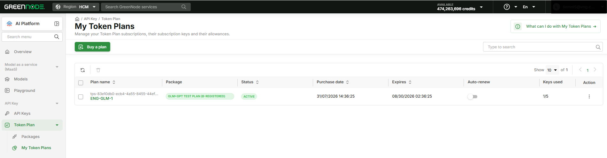
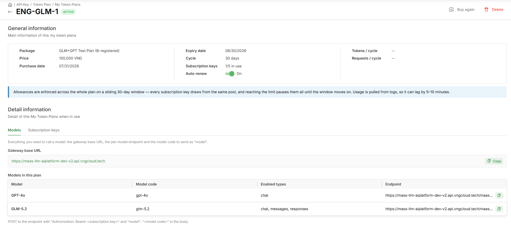
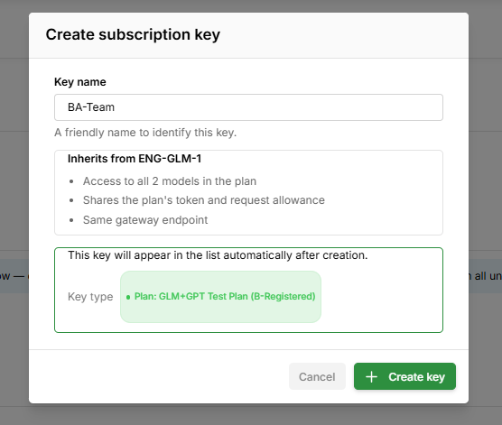

# Quản lý Token Plan

> Hướng dẫn xem danh sách gói đã mua, cấu hình Auto-renew, xóa/hủy gói, và tạo/quản lý subscription-key trong hạn mức gói.

---

## Điều kiện cần

- Đã mua ít nhất 1 gói Token Plan — xem [Mua gói Token Plan](mua-goi-token-plan.md)
- Vai trò **Root/Admin** để bật/tắt Auto-renew và xóa/hủy gói; **Developer** để tạo/quản lý subscription-key trong hạn mức gói; **Viewer** chỉ xem

---

## Cách tính hạn mức

Mỗi gói cấp thẳng một lượng **token và request cho mỗi model**, tính riêng theo từng model trong gói — **không** chia theo khung giờ (không có cửa sổ 6h/tuần) và **không bù trừ** giữa các model. Mọi subscription-key trong cùng 1 gói **dùng chung** hạn mức của model đó.

Ví dụ gói **Token Plan Alpha** (`1.080.000 VND / 30 ngày`, tối đa 5 subscription-key): model **GLM 5.2** được cấp **100.000.000 token/chu kỳ**. Mỗi request gọi API trừ dần vào pool này cho tới khi hết.


Khi pool của một model về 0, các request gọi model đó bị tạm ngưng cho tới khi gói vào chu kỳ mới (sau khi gia hạn). Muốn dùng tiếp ngay, mua thêm 1 gói khác hoặc chuyển sang gọi bằng API Key PAYG. Hệ thống vẫn áp rate limit riêng ở tầng model để bảo vệ hạ tầng chung, tách biệt với pool token/request của gói.


---

## Xem danh sách My Token Plans

**Bước 1: Mở trang**

1. Vào **AI Platform** → sidebar → **API Key** → **Token Plan** → **My Token Plans**
2. Mỗi gói hiển thị tên plan, Plan Type, trạng thái, ngày mua, ngày hết hạn (Expires), Auto-renew, và số subscription-key đang dùng (Keys used)

**Trạng thái gói:**

| Trạng thái | Ý nghĩa |
|---|---|
| `ACTIVE` | Gói đang hoạt động |
| `EXPIRED` | Gói đã hết hạn, không gia hạn |

**Action trên trang chi tiết (Plan Detail):** **Buy again** (mua lại cùng Plan Type) và **Delete** (xóa/hủy gói — xem mục dưới).

---

## Xem Plan Detail

1. Nhấn vào tên gói trong **My Token Plans**
2. Trang **Plan Detail** hiển thị **General information**: Package, Price, Purchase date, Expiry date, Cycle, số Subscription keys đang dùng (ví dụ `1/5 in use`), trạng thái Auto-renew, và hạn mức Tokens/cycle, Requests/cycle
3. Phần **Detail information** có 2 tab:

| Tab | Nội dung |
|---|---|
| **Models** | Gateway base URL dùng chung cho cả gói, và bảng model trong gói (Model, Model code, Enabled types, Endpoint riêng từng model) — dùng để gọi API |
| **Subscription keys** | Danh sách key đã tạo trong gói (Name, Status, Key, Created at) — tạo mới, enable/disable, rename, xóa |

---

## Xem usage chi tiết của gói

Plan Detail chỉ hiển thị hạn mức tổng (Tokens/cycle, Requests/cycle) — Token Plan hiện **chưa có** tab usage riêng. Để Admin xem usage chi tiết theo thời gian hoặc theo model của một gói, dùng dashboard [Usage & Cost](../usage-budget/xem-usage-cost.md) và lọc theo subscription-key của gói đó:

1. Vào [Usage & Cost](../usage-budget/xem-usage-cost.md)
2. Ở filter **All API Keys**, chọn subscription-key thuộc gói muốn xem — subscription-key hiển thị chung danh sách với API Key PAYG, phân biệt qua nhãn Key Type = `Plan: {tên gói}` trên trang [Access Control](../agent-base/access-control/README.md)
3. Dashboard hiển thị usage/cost đã lọc đúng theo gói tương ứng


Nếu gói có nhiều subscription-key, chọn từng key hoặc chọn tất cả key của gói trong filter để xem tổng usage của cả gói.


---

## Bật/tắt Auto-renew

1. Trong danh sách hoặc trong Plan Detail, nhấn toggle **Auto-renew**
2. Popup **Turn off auto-renew?** hiển thị rõ ảnh hưởng:
   - Gói sẽ **không** tự gia hạn — vẫn hoạt động (`ACTIVE`) đến đúng ngày hết hạn
   - Đến ngày hết hạn, toàn bộ subscription-key trong gói ngừng hoạt động ngay
   - Không trừ credit ngay lúc này, và **không hoàn tiền** cho việc tắt Auto-renew
   - Có thể bật lại Auto-renew, hoặc **Buy again**, bất cứ lúc nào trước khi gói hết hạn
3. Nhấn **Turn off auto-renew** để xác nhận, hoặc **Keep auto-renew on** để giữ nguyên


Khi Auto-renew bật (mặc định ON), hệ thống gia hạn trước hạn; nếu credit không đủ, hệ thống sẽ retry — nếu vẫn thất bại, gói chuyển `EXPIRED`.


---

## Xóa/hủy gói

1. Trong **Plan Detail**, nhấn **Delete** (góc trên phải) — hoặc trong **My Token Plans**, chọn checkbox 1/nhiều gói rồi nhấn icon thùng rác (bulk action)
2. Popup **Delete Token Plan** hiển thị rõ ảnh hưởng:
   - Toàn bộ subscription-key của gói bị vô hiệu và ngừng hoạt động **ngay lập tức**
   - Phần hạn mức **chưa dùng** của chu kỳ hiện tại được **hoàn lại theo tỷ lệ (pro rata)** vào Credits
   - Gói biến mất khỏi **My Token Plans**; lịch sử usage vẫn được giữ lại để đối soát
3. Nhấn **Delete** để xác nhận, hoặc **Keep plan** để giữ gói


Xóa gói là hành động **chạy nền và không thể hoàn tác** — không thể khôi phục lại gói sau khi xóa. Chỉ dùng khi chắc chắn muốn dừng gói giữa chu kỳ.


---

## Tạo subscription-key

**Bước 1: Mở Add key**

1. Vào **Plan Detail** → tab **Subscription keys** → nhấn **+ Add key**

**Bước 2: Đặt tên & tạo**

1. Điền **Key name** — tên gợi nhớ để nhận diện key
2. Popup hiển thị key sẽ kế thừa từ gói: quyền gọi toàn bộ model trong gói, dùng chung hạn mức token/request của gói, cùng 1 gateway endpoint
3. Nhấn **Create key**

Key mới xuất hiện trong tab **Subscription keys** với trạng thái `ACTIVE`, đồng thời tự động xuất hiện trên trang [Access Control](../agent-base/access-control/README.md) với nhãn Key Type = `Plan: {tên gói}` — cùng một bản ghi, không tạo trùng.


Gói mua mới luôn có sẵn 1 key mặc định tên `default-key` (đánh dấu **Default**) — không cần tạo key ngay để bắt đầu gọi model.



Gọi model nằm ngoài gói sẽ bị chặn ở gateway với lỗi `403 Forbidden`. Khi gói hết hạn hoặc bị xóa, mọi subscription-key trong gói ngừng hoạt động ngay — request tiếp theo nhận lỗi `402 Payment Required`.


---

## Quản lý subscription-key

1. Trong tab **Subscription keys**, nhấn icon **⋮** tại row key cần thao tác
2. Chọn **Enable** / **Disable**, **Rename**, hoặc **Delete**


Disable hoặc Delete một subscription-key sẽ vô hiệu hóa quyền gọi model ngay lập tức cho key đó.


---

## Dùng subscription-key với AI coding tool

Sau khi có subscription-key và model nằm trong gói, cách gọi model **hoàn toàn giống flow API Key PAYG hiện có** — chỉ khác `base_url` và key dùng:

| | API Key PAYG | Subscription-key (Token Plan) |
|---|---|---|
| Base URL — tool chuẩn **OpenAI** | GreenNode MaaS Endpoint + `/v1` | `https://tokenplan.api.greennode.ai/v1` |
| Base URL — tool chuẩn **Anthropic** | GreenNode MaaS Endpoint (**không** `/v1`) | `https://tokenplan.api.greennode.ai` (**không** `/v1`) |
| Key | API Key | Subscription-key |
| Tương thích | OpenAI SDK / Anthropic SDK | OpenAI SDK / Anthropic SDK |

Gửi request `POST` tới endpoint trên với header `Authorization: Bearer <subscription-key>` và trường `"model": "<model code>"` trong body (model code lấy từ tab **Models**, ví dụ `glm-5.2`).

### Hướng dẫn cấu hình theo từng tool

Khi cấp subscription-key cho một thành viên, gửi kèm link tương ứng để họ tự setup:

| Tool | Hướng dẫn cấu hình |
|---|---|
| Chưa biết chọn tool nào | [Bắt đầu với AI Coding](../ai-coding/bat-dau.md) |
| Tool OpenAI-compatible bất kỳ (Cursor, Continue.dev, LiteLLM, OpenAI SDK...) | [Kết nối OpenAI-compatible với GreenNode MaaS](../ai-coding/ket-noi-openai-compatible-voi-maas.md) |
| Nhóm dòng lệnh (CLI) | [Dòng lệnh (CLI)](../ai-coding/dong-lenh/README.md) — [Claude Code](../ai-coding/dong-lenh/claude-code.md), [Codex CLI](../ai-coding/dong-lenh/codex-cli.md), [OpenCode](../ai-coding/dong-lenh/opencode.md) |
| Nhóm có giao diện (GUI) | [Có giao diện (GUI)](../ai-coding/co-giao-dien/README.md) — [Codex Desktop](../ai-coding/co-giao-dien/codex-desktop.md) |
| Thêm MCP Server vào tool | [Dùng MCP Server với AI Coding](../ai-coding/mcp-openrouter.md) |

Các trang trên viết theo API Key PAYG — giữ nguyên mọi bước, chỉ đổi Base URL và API key theo bảng so sánh ở trên.


**Claude Code / Claude Desktop / Anthropic SDK** dùng chuẩn Anthropic: Base URL là `https://tokenplan.api.greennode.ai` — cùng host nhưng **không** có `/v1`, và dùng biến `ANTHROPIC_BASE_URL` / `ANTHROPIC_AUTH_TOKEN` thay vì `OPENAI_*`. Xem [Claude Code](../ai-coding/dong-lenh/claude-code.md).


---

## Kết quả

Bạn có thể theo dõi hạn mức từng gói, chủ động bật/tắt gia hạn hoặc xóa gói khi cần, và cấp subscription-key dùng chung hạn mức gói cho từng agent hoặc dev tool.

| Tôi muốn tiếp theo... | Đi đến |
|---|---|
| Mua thêm gói | [Mua gói Token Plan](mua-goi-token-plan.md) |
| Cấu hình tool AI coding cho thành viên | [Bắt đầu với AI Coding](../ai-coding/bat-dau.md) |
| Đi hết một vòng từ mua gói đến chạy được trên tool | [Hướng dẫn A-Z](huong-dan-a-z.md) |
| Xem usage & chi phí tổng | [Usage & Budget](../usage-budget/README.md) |
| Cấu hình Rate Limit | [Rate Limit](../agent-base/protect-govern/rate-limit.md) |
