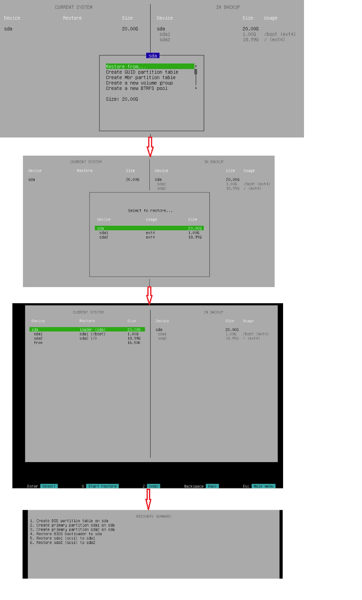

# Server Migration

## 1. VNG Cloud Migration Tool là gì?

**Migration Tool** tại VNG Cloud là một công cụ hỗ trợ người dùng di chuyển máy chủ (server) từ các cloud khác hoặc từ hệ thống on-premises lên hạ tầng VNG Cloud **một cách tự động, nhanh chóng và an toàn**.\
Các tính năng nổi bật bao gồm:

* **Hỗ trợ nhiều loại nguồn**: AWS, Azure, GCP, VMware, Hyper-V, và cả server vật lý.
* **Tự động hóa quá trình migrate**: Không cần can thiệp thủ công nhiều bước phức tạp.
* **Giảm thiểu downtime**: Quá trình chuyển đổi diễn ra mượt mà, hạn chế tối đa gián đoạn dịch vụ.
* **Đảm bảo tính toàn vẹn dữ liệu**: Dữ liệu được đồng bộ chính xác và bảo mật trong suốt quá trình.

> Với Migration Tool, người dùng có thể dễ dàng hiện thực hóa việc "lift and shift" hệ thống hiện tại sang VNG Cloud mà không cần phải xây dựng lại từ đầu.

## 2. Tại sao cần migrate server về VNG Cloud?

Việc migrate server từ các nền tảng cloud khác về VNG Cloud mang lại nhiều lợi ích vượt trội:

* **Tối ưu chi phí vận hành**: Các gói dịch vụ tại VNG Cloud được thiết kế linh hoạt, giúp bạn tiết kiệm đáng kể chi phí so với các cloud quốc tế.
* **Hỗ trợ kỹ thuật nhanh chóng**: Đội ngũ kỹ thuật hỗ trợ 24/7, giúp xử lý sự cố kịp thời, giảm thiểu downtime.
* **Hiệu suất cao, hạ tầng hiện đại**: Server tại VNG Cloud được vận hành trên hạ tầng đạt chuẩn quốc tế, đảm bảo tốc độ và độ ổn định vượt trội.
* **Đáp ứng yêu cầu pháp lý**: Dữ liệu được lưu trữ trong nước, phù hợp với các quy định về bảo mật và chủ quyền dữ liệu tại Việt Nam.

## 3. Các lưu ý quan trọng trước khi migrate

Để đảm bảo quá trình **server migration** diễn ra suôn sẻ, an toàn và không gây gián đoạn hệ thống, bạn cần lưu ý các điểm quan trọng sau:

**1. Cẩn trọng khi migrate vào server hiện hữu**

Việc **migrate server từ nền tảng cloud khác về một server hiện hữu tại VNG Cloud** có thể gây **mất toàn bộ dữ liệu và snapshot** đang có trên server đích.&#x20;

**Khuyến nghị**:

* **Backup toàn bộ dữ liệu** trên server đích trước khi thực hiện.
* **Tốt nhất nên tạo một server mới** để tiến hành migration, đảm bảo an toàn và dễ rollback nếu cần.

**2. Xác định cấu hình tài nguyên phù hợp**

Trước khi migration, bạn cần xác định rõ **cấu hình tài nguyên** của server nguồn để đảm bảo server đích có cấu hình **tương đương hoặc cao hơn**, tránh tình trạng thiếu hụt tài nguyên dẫn đến lỗi hoặc giảm hiệu suất:

* **CPU**
* **RAM**
* **Disk**

**3. Đồng bộ loại bảng phân vùng ổ đĩa (Partition Table)**

Trong hệ thống máy tính, hai loại bảng phân vùng phổ biến là:

* **MBR (Master Boot Record)**: Chuẩn cũ, hỗ trợ tối đa 2TB và 4 phân vùng chính.
* **GPT (GUID Partition Table)**: Chuẩn mới, hỗ trợ dung lượng lớn hơn và nhiều phân vùng hơn.

Khi thực hiện migration, ngoài việc dung lượng ổ đĩa đích **phải lớn hơn hoặc bằng ổ đĩa nguồn**, bạn cần đảm bảo:

* **Server nguồn và server đích sử dụng cùng loại bảng phân vùng (MBR hoặc GPT)**.

Việc không đồng bộ bảng phân vùng có thể khiến hệ điều hành không khởi động được sau khi restore. Bạn có thể sử dụng một trong các công cụ sau:

```bash
# Kiểm tra với fdisk
sudo fdisk -l /dev/sdX

# Kiểm tra với parted
sudo parted /dev/sdX print

# Kiểm tra nhanh với lsblk
lsblk -o NAME,PTTYPE
```

## 4. Các bước thực hiện migrate server

### 1. Tạo Veeam Account

* Khách hàng gửi request qua 247 hoặc tạo ticket [tại đây](https://helpdesk.vngcloud.vn/portal/en/newticket?departmentId=854860000000006907\&layoutId=854860000000074011) với nhu cầu migrate server từ hệ thống khác lên VNG Cloud.
* Sau khi nhận request, VNG Cloud sẽ hỗ trợ tạo account trên Veeam Portal và cung cấp thông tin user, password, endpoint và port của Veeam cloud repository cho khách hàng.

***

### 2. Tạo Backup cho Main VM thông qua Veeam Account

* Truy cập Veeam Portal sử dụng thông tin user/pass đã cung cấp.
* Cài đặt Management Agent trên Main Server:
  1.  Tải Management Agent.&#x20;

      <figure><figcaption></figcaption></figure>
  2.  Cài đặt Management Agent trên Main Server.&#x20;

      <figure><figcaption></figcaption></figure>
  3. Tạo và chạy backup job cho Main Server.
     *   [x] Tạo Backup Job&#x20;

         <figure><figcaption></figcaption></figure>
     *   [x] Run Backup Job&#x20;

         <figure><figcaption></figcaption></figure>

***

### 3. Khởi tạo Destination VM và bắt đầu migration

* 3.1 Truy cập [server portal](https://hcm-3.console.vngcloud.vn/vserver/v-server/cloud-server) để tạo mới Destination Server.&#x20;
*   3.2 Truy cập vào server vừa tạo, nhấn Migrate Server.&#x20;

    * 3.2.1 Nếu server chưa được shutdown, hệ thống sẽ yêu cầu bạn shutdown trước khi migrate.
    * 3.2.2 Giữ nguyên trạng thái hiện tại, sau đó bấm Set up migration để bắt đầu quá trình migrate.
    * 3.3.3 Sau khi hoàn tất Set up Migration, nhấn Start Server để bắt đầu Restore.

    <figure><figcaption><p>Step 3.2</p></figcaption></figure>

<figure><figcaption><p>Step 3.2.1</p></figcaption></figure>

<figure><figcaption><p>3.2.2</p></figcaption></figure>

* Restore từ Backup
  *   Truy cập Destination VM&#x20;

      <figure><figcaption></figcaption></figure>
  *   Chọn Restore volume&#x20;

      <figure><figcaption></figcaption></figure>
  *   Chọn Add Cloud Connect provider&#x20;

      <figure><figcaption></figcaption></figure>
  *   Nhập thông tin endpoint và port của Veeam cloud repository: E.g. veeam-gw.vngcloud.vn port 443&#x20;

      <figure><figcaption></figcaption></figure>
  *   Nhập username/password&#x20;

      <figure><figcaption></figcaption></figure>
  *   Chọn backup job và restore point cần restore. Nhấn enter&#x20;

      <figure><figcaption></figcaption></figure>
  *   Chọn sda, chọn restore from rồi nhấn enter. Kiểm tra lại thông tin mapping rồi nhấn enter.&#x20;

      <figure><figcaption></figcaption></figure>

***

### 4. Hoàn tất Migration

*   Truy cập Destination VM, nhấn Migrate Server và chọn kết quả thực tế sau khi Restore (Successed/Failed).&#x20;

    <figure><figcaption></figcaption></figure>
* Truy cập Server Migration tại Backup Center để kiểm tra logs migration[ tại đây](https://backupcenter.console.vngcloud.vn/server-migration).

## 5. Hiệu suất migration

Trong quá trình thử nghiệm thực tế với các cấu hình tối ưu từ VNG Cloud, kết quả cho thấy hiệu suất migration vượt trội:

* **IOPS**: Lên đến **60,000**
* **Throughput**: Đạt **800 MB/s**
* **Bandwidth trong nước**: Hỗ trợ **PAYG** linh hoạt theo nhu cầu

Đặc biệt, trong quá trình **restore dữ liệu**, tốc độ có thể đạt đến **1Gbps**, giúp tăng đáng kể tốc độ khôi phục và giảm thiểu thời gian downtime.

* Thời gian di chuyển thực tế: Với các thông số kỹ thuật như trên, trung bình quá trình di chuyển dữ liệu **20GB chỉ mất khoảng 2–3 phút**, cho thấy sự hiệu quả rõ rệt so với các giải pháp truyền thống hoặc hạ tầng không được tối ưu.

<figure><figcaption></figcaption></figure>
