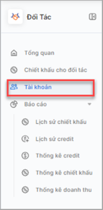
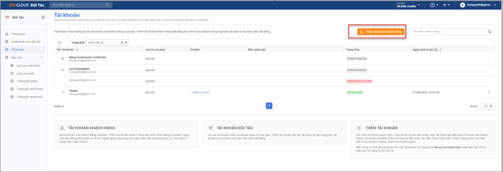
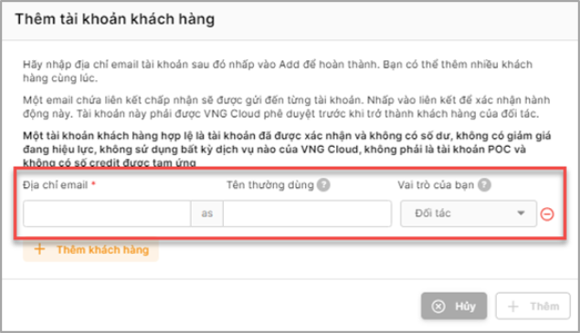
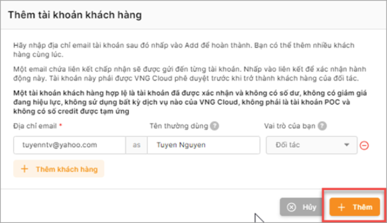

# Đăng ký tài khoản khách hàng

Đối tác có thể thực hiện đăng ký khách hàng ngay trên portal VNG Cloud nhằm mục đích

* Chính thức xác nhận khách hàng của đại lý (sau khi được VNG Cloud xác nhận)
* Quản lý được credit, giá bán cho khách hàng
* Quản lý được doanh số theo khách hàng đã đăng ký

**Bước 1**: Chọn menu menu “Tài Khoản” như hình
<figure><figcaption></figcaption></figure>

Màn hình tương tự như sau:

<figure><figcaption></figcaption></figure> 

**Bước 2**: Đăng ký tài khoản khách hàng

* Chọn chức năng “Thêm tài khoản khách hàng”

<figure><figcaption></figcaption></figure> 

* Nhập các thông tin theo yêu cầu
  * Địa chỉ email : địa chỉ mail của khách hàng
  * Tên thường dùng : tên thường dùng của khách hàng, nhằm mục đích gợi nhớ cho việc quản lý của người dùng
  * Vai trò của bạn : vai trò của người dùng đối với khách hàng này, hệ thống đang để giá trị mặc định “ Đối tác” nhằm mục đích phần loại với các vai trò khác trong hệ thống

<figure><figcaption></figcaption></figure> 

* Nhấn chọn “**Thêm khách hàng**” để thực hiện thêm khách hàng tiếp theo vào form nhập liệu.
* Nhấn chọn “**Thêm**” để thực hiện thêm khách hàng vào hệ thống.
* Khi thêm khách hàng thành công trên Partner portal, một yêu cầu sẽ được gửi đến email của khách hàng được đăng ký để xác nhận đồng ý trở thành khách hàng của đại lý.
* Sau bước xác nhận của khách hàng, yêu cầu này sẽ được chuyển đến VNG Cloud để xác nhận đồng ý trong trường hợp khách hàng này đang không phải là khách hàng của VNG Cloud.
* Khi khách hàng của đại lý được duyệt, trạng thái này sẽ được cập nhật thành “Đã xác nhận”

_**Lưu ý:**_

* _Email muốn thêm phải là tài khoản dịch vụ đã tồn tại trong hệ thống VNG Cloud(đã đăng ký tài khoản) và thỏa các điều kiện sau:_
  * _Tài khoản cần thêm không có số dư credit_
  * _Tài khoản cần thêm không đang sử dụng dịch vụ VNG Cloud_
  * _Tài khoản cần thêm không đang được hưởng chiết khấu của VNG Cloud_
  * _Không đang trong giai đoạn POC dịch vụ VNG Cloud_
  * _Tài khoản cần thêm phải là tài khoản trả trước_

