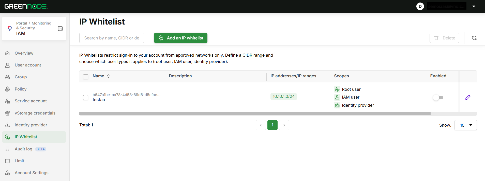
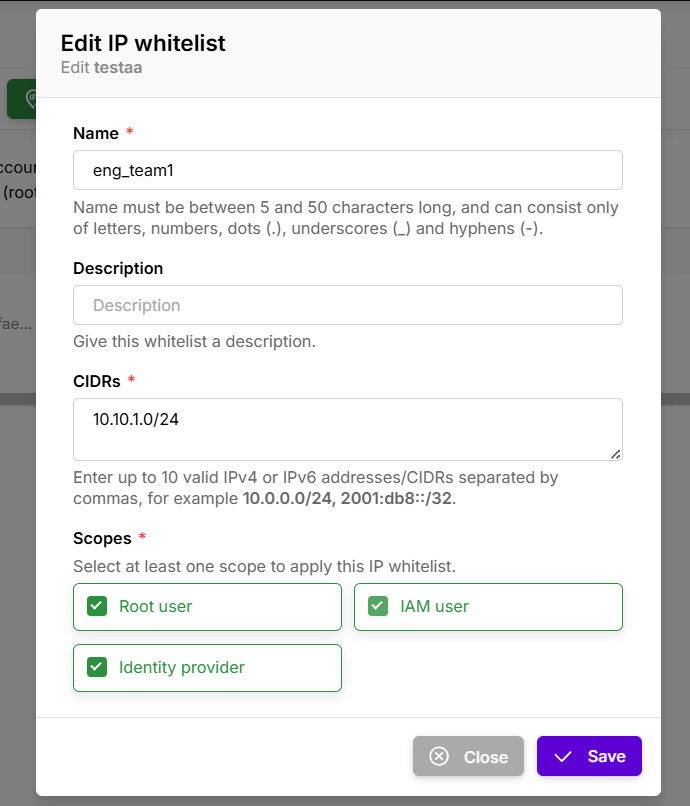

# Cấu hình IP Whitelist

> Hướng dẫn này giúp bạn giới hạn việc đăng nhập vào tài khoản GreenNode chỉ từ những dải mạng đã được duyệt, bằng tính năng **IP Whitelist** trong IAM.

---

## Tổng quan

**IP Whitelist** là lớp kiểm soát truy cập ở tầng đăng nhập: khi một whitelist đang bật, người dùng thuộc **Scope** tương ứng chỉ đăng nhập được nếu IP nguồn nằm trong danh sách đã khai báo.

Mỗi bản ghi whitelist gồm ba thành phần:

* một hoặc nhiều **địa chỉ IP / dải IP (CIDR)** được phép,
* một hoặc nhiều **Scope** — loại người dùng mà quy tắc này áp dụng,
* trạng thái **Enabled** — quy tắc đang có hiệu lực hay không.

### Các Scope được hỗ trợ

| Scope | Áp dụng cho |
|---|---|
| **Root user** | Tài khoản gốc (tài khoản đăng ký) |
| **IAM user** | Các IAM user thuộc tài khoản |
| **Identity provider** | Người dùng đăng nhập thông qua Identity Provider |


Service Account hiện **không** nằm trong danh sách Scope, nên IP Whitelist không ảnh hưởng đến việc xác thực bằng Service Account (API, Terraform, CLI).


---

## Điều kiện cần (Prerequisites)

* Đã có tài khoản GreenNode và đăng nhập được vào IAM Console.
* Đăng nhập bằng **Root user**, hoặc bằng IAM user đã được gắn Policy có quyền quản lý IP Whitelist.
* Đã xác định **IP public hiện tại** của bạn và các dải mạng cần cho phép (văn phòng, VPN công ty, NAT gateway…).

---

## Truy cập trang IP Whitelist

1. Đăng nhập [IAM Console](https://iam.console.greennode.ai/).
2. Chọn **IP Whitelist** trên menu bên trái (đường dẫn [https://iam.console.greennode.ai/ip-whitelists](https://iam.console.greennode.ai/ip-whitelists)).

<figure><figcaption><p>Danh sách IP Whitelist trong IAM Console</p></figcaption></figure>

### Các cột trong bảng

| Cột | Ý nghĩa |
|---|---|
| **Name** | Tên whitelist, hiển thị kèm resource ID (bấm vào ID để copy) |
| **Description** | Mô tả; di chuột để xem đầy đủ nếu nội dung bị cắt |
| **IP addresses/IP ranges** | Danh sách IP/CIDR; hiển thị tối đa 5 mục, bấm **View all (n)** để xem hết |
| **Scopes** | Các loại người dùng mà quy tắc áp dụng |
| **Enabled** | Công tắc bật/tắt nhanh quy tắc |
| **Created at** | Thời điểm tạo, định dạng `dd/MM/yyyy HH:mm:ss` |

Bạn có thể sắp xếp theo **Name** và **Created at** (mặc định mới nhất lên trước). Danh sách được phân trang; đổi số dòng mỗi trang tại ô **Show** ở cuối bảng.

### Thanh công cụ

| Thành phần | Công dụng |
|---|---|
| Ô tìm kiếm | Lọc theo tên, IP/CIDR hoặc mô tả — không phân biệt hoa thường, khớp theo chuỗi con |
| **Add an IP whitelist** | Mở form tạo whitelist mới |
| **Delete** | Chỉ bật khi đã chọn ít nhất một dòng |
| Biểu tượng reload | Xóa từ khóa tìm kiếm, quay về trang 1 (10 dòng/trang) và tải lại dữ liệu |

Bộ lọc và phân trang được lưu trên URL (`?whitelist-ip=...&pageNumber=...&pageSize=...`), nên bạn có thể copy link để chia sẻ đúng trạng thái đang xem.

Khi tài khoản chưa có whitelist nào, trang hiển thị màn hình giới thiệu kèm nút **Add an IP whitelist**.

---

## Tạo một IP whitelist

**Bước 1: Mở form tạo mới**

1. Nhấn **Add an IP whitelist** trên thanh công cụ.

<figure><figcaption><p>Form Add an IP whitelist</p></figcaption></figure>

**Bước 2: Điền thông tin whitelist**

1. Nhập **Name** — tên định danh cho quy tắc.
2. Nhập **Description** (tùy chọn) để ghi rõ mục đích sử dụng.
3. Nhập danh sách IP vào ô **IP addresses & IP ranges**, phân tách bằng dấu phẩy.
4. Tick ít nhất một mục trong **Scopes**.
5. Giữ hoặc bỏ tick **Enabled immediately** tùy theo thời điểm bạn muốn quy tắc có hiệu lực.

| Trường | Bắt buộc | Quy tắc nhập liệu |
|---|---|---|
| **Name** | Có | 5–50 ký tự; chỉ gồm chữ, số, dấu chấm (`.`), gạch dưới (`_`), gạch nối (`-`) |
| **Description** | Không | Tối đa 300 ký tự; chỉ gồm chữ, số, `_`, `-`, `.`, `,` và khoảng trắng |
| **IP addresses & IP ranges** | Có | Tối đa 10 mục IPv4/IPv6 phân tách bằng dấu phẩy; mỗi mục là IP đơn (`10.0.0.1`) hoặc CIDR (`10.0.0.0/24`, `2001:db8::/32`) |
| **Scopes** | Có | Chọn ít nhất một trong **Root user**, **IAM user**, **Identity provider** |
| **Enabled immediately** | Không | Mặc định được tick — quy tắc có hiệu lực ngay sau khi tạo. Bỏ tick nếu muốn tạo trước, kích hoạt sau |

Ví dụ giá trị hợp lệ cho ô **IP addresses & IP ranges**:

```text
203.0.113.10, 10.0.0.0/24, 2001:db8::/32
```

**Bước 3: Lưu quy tắc**

1. Nhấn **Save**.

Nút **Save** chỉ sáng khi form hợp lệ và đã chọn ít nhất một Scope. Dòng gợi ý dưới mỗi ô chuyển sang màu đỏ khi giá trị nhập không hợp lệ.


Nếu bạn giữ **Enabled immediately** và danh sách IP không chứa IP hiện tại của bạn, quy tắc có hiệu lực ngay và bạn có thể bị chặn ở lần đăng nhập kế tiếp. Xem [Triển khai an toàn](#trien-khai-an-toan-tranh-tu-khoa-tai-khoan) trước khi bật.


---

## Bật hoặc tắt một IP whitelist

1. Gạt công tắc ở cột **Enabled** trên dòng tương ứng.
2. Xác nhận trong hộp thoại hiện ra.

Whitelist ở trạng thái tắt vẫn được lưu nhưng **không có hiệu lực** với việc đăng nhập. Đây là cách an toàn để tạm gỡ một quy tắc mà không cần xóa cấu hình.

---

## Chỉnh sửa một IP whitelist

1. Nhấn biểu tượng **bút chì** ở cuối dòng cần sửa.
2. Cập nhật **Name**, **Description**, **CIDRs** hoặc **Scopes**.
3. Nhấn **Save**.

<figure><figcaption><p>Form Edit IP whitelist</p></figcaption></figure>

Lưu ý khi chỉnh sửa:

* Trạng thái **Enabled** không sửa được trong form này — dùng công tắc ở cột **Enabled** của bảng.
* Nút **Save** chỉ sáng khi bạn thực sự thay đổi một giá trị và form vẫn hợp lệ.
* Danh sách IP được **ghi đè toàn bộ**, không phải thêm dồn. Muốn bổ sung một dải, hãy giữ nguyên các dải cũ trong ô và thêm dải mới sau dấu phẩy.

---

## Xóa một IP whitelist

1. Tick chọn một hoặc nhiều dòng ở cột checkbox (tick ô trên header để chọn toàn bộ trang hiện tại).
2. Nhấn **Delete** trên thanh công cụ.
3. Đối chiếu danh sách tên whitelist trong hộp thoại, sau đó nhấn **Delete** để xác nhận.

Các mục được xóa song song và mỗi mục có thông báo kết quả riêng, nên nếu một mục lỗi thì các mục còn lại vẫn được xóa.


Thao tác xóa **không thể hoàn tác**. Nếu chỉ muốn tạm ngưng một quy tắc, hãy tắt công tắc **Enabled** thay vì xóa.


---

## Triển khai an toàn — tránh tự khóa tài khoản

Bật một whitelist không chứa IP hiện tại của bạn có thể khiến bạn — và cả Root user — không đăng nhập lại được. Quy trình dưới đây giúp bạn kiểm soát rủi ro đó:

1. Xác định **IP public hiện tại** của bạn trước khi tạo quy tắc.
2. Tạo whitelist với **Enabled immediately** ở trạng thái **bỏ tick**, sau đó kiểm tra lại danh sách IP và Scope.
3. Bổ sung sẵn các dải mạng dự phòng (VPN công ty, văn phòng thứ hai) vào cùng một whitelist.
4. Bật whitelist, rồi mở một trình duyệt hoặc phiên ẩn danh khác để thử đăng nhập **trước khi** đóng phiên đang có.
5. Với IP động của nhà mạng, dùng CIDR đủ rộng thay vì IP đơn để tránh bị chặn khi IP thay đổi.


Nếu tất cả người dùng đã bị chặn, không còn cách tự khôi phục trên Portal — hãy liên hệ đội hỗ trợ 24/7 của GreenNode để được xử lý.


---

## Xử lý sự cố

| Hiện tượng | Nguyên nhân thường gặp | Cách xử lý |
|---|---|---|
| Nút **Save** không sáng | Form còn trường không hợp lệ, chưa chọn Scope nào, hoặc (khi sửa) chưa thay đổi gì | Kiểm tra dòng gợi ý màu đỏ dưới từng ô và tick ít nhất một Scope |
| Dòng gợi ý ô IP chuyển đỏ | Có mục sai định dạng | Kiểm tra dấu phẩy và prefix CIDR (IPv4: 0–32, IPv6: 0–128); tối đa 10 mục |
| Thông báo *Failed* khi lưu | Lỗi trả về từ API (trùng tên, thiếu quyền, mất kết nối) | Đọc nội dung lỗi trong thông báo và thử lại |
| Tìm kiếm không ra kết quả | Từ khóa chỉ khớp trên tên, IP/CIDR và mô tả | Nhấn biểu tượng reload để xóa bộ lọc |
| Bảng danh sách trống dù tài khoản có whitelist | IAM user chưa được cấp quyền xem | Kiểm tra Policy đang gắn cho user hoặc group của bạn |
| Không đăng nhập được sau khi bật | IP hiện tại không nằm trong whitelist đang bật | Nhờ người còn truy cập được tắt quy tắc, hoặc liên hệ hỗ trợ 24/7 |

---

## Kết quả

Sau khi hoàn thành, tài khoản của bạn chỉ chấp nhận đăng nhập từ các dải mạng đã khai báo, theo đúng nhóm người dùng bạn chọn. Bạn có thể bật, tắt hoặc điều chỉnh danh sách IP bất cứ lúc nào mà không ảnh hưởng đến các cấu hình IAM khác.

| Tôi muốn tiếp theo... | Đi đến |
|---|---|
| Siết thêm chính sách mật khẩu và thời gian phiên làm việc | [Chính sách mật khẩu & thời gian phiên làm việc](chinh-sach-mat-khau-and-thoi-gian-phien-lam-viec.md) |
| Xem lại các khuyến nghị bảo mật cho IAM | [Security for IAM](security-for-iam.md) |
| Kiểm tra ai đã thay đổi cấu hình IP Whitelist | [Quản lý Audit Logs](quan-ly-audit-logs.md) |
| Phân quyền cho IAM user quản lý IP Whitelist | [Quản lý truy cập qua Policy](quan-ly-truy-cap-iam/quan-ly-truy-cap-qua-policy/) |
