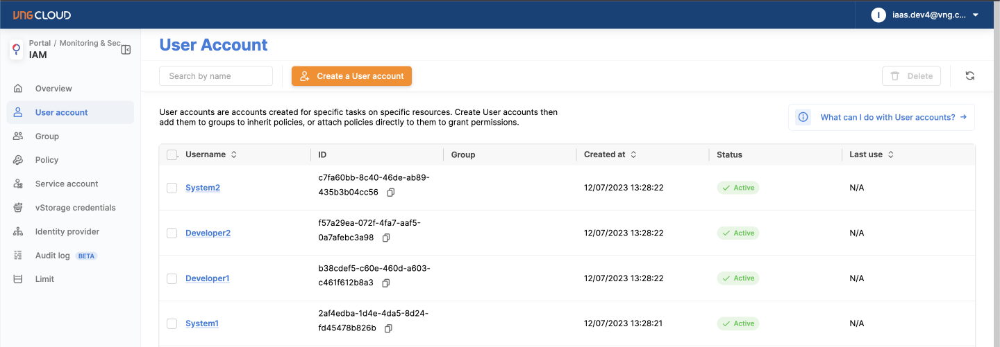
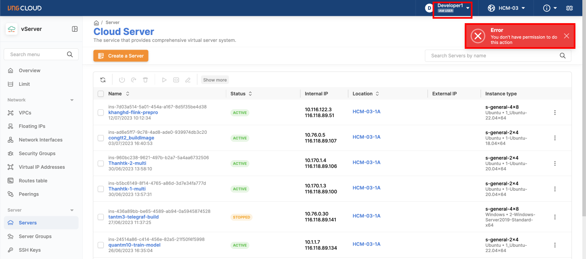

# Phân quyền truy cập theo chức năng công việc

Khi phân quyền truy cập các tài nguyên, các công ty thường sẽ phân quyền dựa trên chức năng công việc của các thành viên, sẽ có 2 loại chức năng công việc chính trong một công ty IT là **System Administrator**, và **Developer**. Tài liệu hướng dẫn này sẽ hướng dẫn cách để bạn phân quyền cho 2 nhóm chức năng công việc được quyền truy cập các sản phẩm vServer, vStorage như thế nào.

Trước tiên về quyền truy cập của 2 nhóm chức năng công việc trên, sẽ được định nghĩa như sau:

* **System Administrator**: chịu trách nhiệm quản lý toàn bộ tài nguyên trên Cloud, nên được cấp đẩy đủ quyền của vServer, vStorage sẽ tương ứng với các managed policy đã được VNG Cloud tạo sẵn: vServerFullAccess, vStorageFullAccess
* **Developer**: chỉ cần xem được các tài nguyên trên Cloud, nên chỉ cần cấp quyền read-only của vServer, vStorage sẽ tương ứng với các managed policy đã được VNG Cloud tạo sẵn: vServerReadOnlyAccess, vStorageReadOnlyAccess.

Để quản lý việc phân quyền cho nhiều thành viên trong công ty dễ dàng hơn, chúng ta sẽ tổ chức thêm **2 User Groups với tên là: SystemAdmin và Developer**, với những thành viên có chức năng công việc giống nhau thì sẽ được gắn vào User Groups tương ứng để được hưởng quyền đã cấp cho User Groups. Với việc quản lý bằng User Groups sẽ giúp bạn linh động thay đổi quyền khi cần thiết, hay khi có các thành viên thay đổi chức năng công việc.tr

Với cách tổ chức như trên chúng ta sẽ có bảng thống kê chi tiết như sau:

| **Chức năng công việc** | **User Group** | **Permission**                                            | **Mô tả**                                |
| ----------------------- | -------------- | --------------------------------------------------------- | ---------------------------------------- |
| System Administrator    | SystemAdmin    | 
vServerFullAccess

vStorageFullAccess
         | Đầy đủ quyền trên vServer, vStorage      |
| Developer               | Developer      | 
vServerReadOnlyAccess

vStorageReadOnlyAccess
 | Chỉ xem thông tin trên vServer, vStorage |

Tương ứng ta sẽ có mô hình tổ chức như bên dưới:

<figure><figcaption></figcaption></figure>

Để thiết lập IAM theo mô hình trên chúng ta sẽ có các bước như sau:

**Bước 1**: Tạo User Groups (SystemAdmin, Developer) và gắn các managed policy tương ứng

**Bước 2**: Tạo User Account (System1, System2, Developer1, Developer2) và gắn vào các User Group tương ứng

**Bước 3**: Đăng nhập các User Accounts để kiểm tra quyền

Chi tiết hướng dẫn các bước

**Bước 1: Tạo User Groups (SystemAdmin, Developer) và gắn các managed policy tương ứng**

Truy cập vào tab Group ở trang quản lý IAM tại [đây](https://hcm-3.console.vngcloud.vn/iam/user-groups), nhấn "**Create a Group**" và điền thông tin tên group là SystemAdmin, nhấn **Next step** để tới bước gắn Policy

<figure><figcaption></figcaption></figure>

Tìm kiếm và gắn 2 managed policy là vServerFullAccess và vStorageFullAccess cho group: SystemAdmin, sau đó nhấn **Create Group** để tạo

<figure><figcaption></figcaption></figure>

Làm tương tự các bước ở trên khi tạo group: Developer, chọn managed policy là vServerReadOnlyAccess và vStorageReadOnlyAccess

<figure><figcaption></figcaption></figure>

Như vậy bạn đã hoàn thành việc tạo 2 User Groups: SystemAdmin và Developer có đầy đủ quyền như đã định nghĩa

<figure><figcaption></figcaption></figure>

**Bước 2: Tạo User Account (System1, System2, Developer1, Developer2) và gắn vào các User Group tương ứng**

Tiến hành tạo các User Account bằng cách truy cập vào tab User Account ở trang quản lý IAM tại [đây](https://hcm-3.console.vngcloud.vn/iam/user-accounts), nhấn **Create a User Account,** điền thông tin Username và Password, sau đó nhấn **Create User Account** (lưu ý để hướng dẫn ngắn gọn ở đây chúng tôi tạo 4 user account cùng chung 1 password, khuyến cáo bạn nên tạo các user account riêng lẻ và  có password khác nhau, hoặc đổi password khi sử dụng):

<figure><figcaption></figcaption></figure>

Sau khi tạo thành công các User Accounts, sẽ được liệt kê ở trang User Account như bên dưới

<figure><figcaption></figcaption></figure>

Để thêm các User: System1, System2, Developer1, Developer2  vào Group: SystemAdmin, Developer bạn có thể thực hiện ở từng User Account hoặc Group, ở đây chúng tôi sẽ hướng dẫn thêm User Account ở Group, bạn qua tab Group nhấn vào **tên của Group** để vào chi tiết của Group, như ở đây là Group: SystemAdmin

<figure><figcaption></figcaption></figure>

Chọn tab **User**

<figure><figcaption></figcaption></figure>

Nhấn A**dd Users**, một popup sẽ hiển thị lên, bạn chọn User: System1, System2 và nhấn **Add:**

<figure><figcaption></figcaption></figure>

Để thêm User: Developer1, Developer2 vào Group: Developer, bạn làm tương tự các bước như trên:

<figure><figcaption></figcaption></figure>

Vậy là bạn đã hoàn thành việc tạo các User Accounts và thêm chúng vào Group tương ứng, lúc này các User Accounts sẽ được thừa kế đầy đủ các quyền mà Group đang có.

**Bước 3: Đăng nhập các User Accounts để kiểm tra quyền**

Lúc này bạn có thể đăng nhập vào các User Accounts để kiểm tra quyền, tại đây chúng tôi sẽ thử đăng nhập vào 2 User: System1, Developer1 để thực hiện một số thao tác trên vServer để kiểm tra quyền

Truy cập vào vServer tại [đây](https://hcm-3.console.vngcloud.vn/vserver/v-server/cloud-server), khi chưa đăng nhập bất kì tài khoản nào bạn sẽ được chuyển hướng sang trang sign-in chọn "**Sign-in With IAM User Account**"

<figure><figcaption></figcaption></figure>

Điền thông tin root user account email mà IAM user trước đó đã được tạo, thông tin IAM username và password, nhấn **Sign-in with IAM User Account**

<figure><figcaption></figcaption></figure>

Lúc này bạn sẽ thấy User: System1 có toàn quyền trên vServer, bạn có thể thực hiện việc tạo mới Server hay thay đổi thông tin Server để kiểm tra quyền, ví dụ bên dưới là User: System1 đang khởi động 1 Server thành công

<figure><figcaption></figcaption></figure>

Làm các bước tương tự trên để đăng nhập vào User: Developer1, lúc này bạn sẽ thấy User: Developer1 chỉ có quyền xem thông tin vServer, không thể tương tác thay đổi Server, ví dụ bên dưới là User: Developer1 đang muốn khởi động 1 Server nhưng bị từ chối thực hiện

<figure><figcaption></figcaption></figure>

Như vậy bạn đã hoàn thành việc phân quyền truy cập theo các chức năng công việc, lúc này việc cấp quyền cho các thành viên mới, bạn chỉ cần tạo User Account và thêm vào Group, để thay đổi quyền bạn chỉ cần thay đổi Policy tại các Group giúp việc quản lý truy cập tài nguyên trên VNG Cloud trở nên dễ dàng hơn.

\
