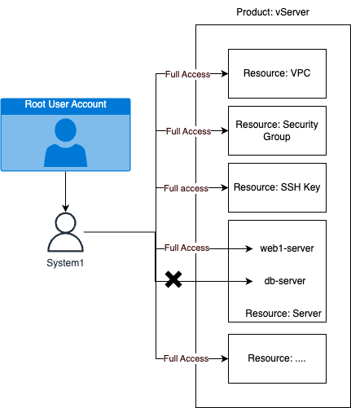
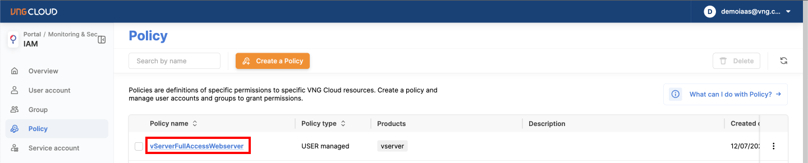
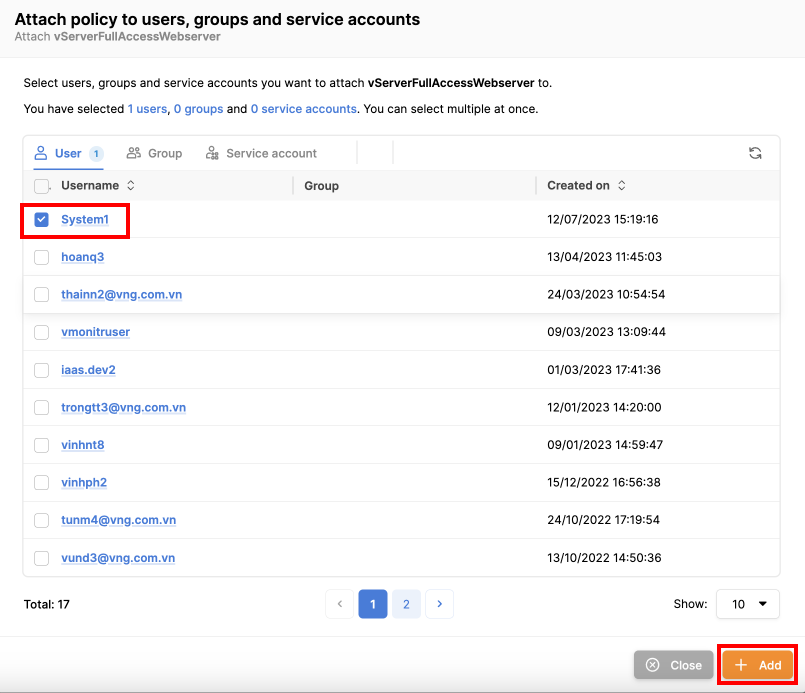
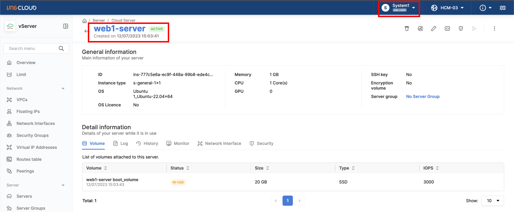
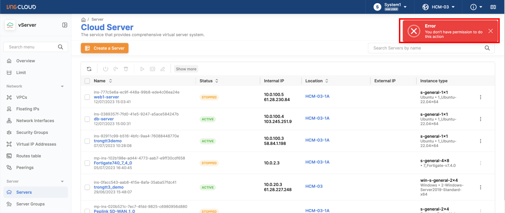

# Phân quyền truy cập vào tài nguyên cụ thể

Khi có nhu cầu phân quyền cụ thể trên từng tài nguyên, bạn cần tạo Policy và chỉ định chính xác Resource . Ở hướng dẫn này chúng tôi sẽ hướng dẫn bạn phân quyền trên từng server của vServer, ví dụ khi bạn có 2 servers là: web1-server, db-server, **và bạn muốn User: System1 đầy đủ quyền trên tất cả Resources của vServer, nhưng chỉ đầy đủ quyền trên Resource:server là web1-server, không cho phép thao tác vào server quan trọng là db-server**. Mô hình sẽ như bên dưới:

<figure><figcaption></figcaption></figure>

Để thiết lập IAM theo mô hình trên chúng ta sẽ có các bước như sau:

**Bước 1**: Tạo User: System1 nếu chưa có User Account (lưu ý rằng nếu đã có sẵn User: System1, cần đảo bảo User: System1 không có quyền gì hoặc không có các quyền chồng lấn với hướng dẫn)

**Bước 2**: Lấy thông tin ID của server web1-server

**Bước 3**: Tạo Policy với tên vServerFullAccessWebServers cho phép truy cập toàn bộ Resource của vServer, nhưng chỉ đầy đủ quyền trên web1-server

**Bước 4**: Gắn Policy: vServerFullAccessWebServers cho User: System1

**Bước 5**: Đăng nhập và kiểm tra quyền của User: System1

Chi tiết các bước như sau

**Bước 1: Tạo User: System1 nếu chưa có User Account (lưu ý rằng nếu đã có sẵn User: System1, cần đảo bảo User: System1 không có quyền gì hoặc không có các quyền chồng lấn với hướng dẫn)**

Tiến hành tạo User Account bằng cách truy cập vào tab User Account ở trang quản lý IAM tại [đây](https://iam.console.vngcloud.vn/user-accounts), nhấn **Create a User Account,** điền thông tin Username và Password, sau đó nhấn **Create User Account**

Sau khi tạo thành công User Account, sẽ được liệt kê ở trang User Account.

**Bước 2: Lấy thông tin ID của server web1-server**

Truy cập vào trang quản lý server tại [đây](https://hcm-3.console.vngcloud.vn/vserver/v-server/cloud-server) để lấy thông tin server ID, nhấn **Copy ID** tại server web1-server để lấy ID, lưu lại để sử dụng cho các bước tiếp theo

<figure><figcaption></figcaption></figure>

**Bước 3: Tạo Policy với tên vServerFullAccessWebServers cho phép truy cập toàn bộ Resource của vServer, nhưng chỉ đầy đủ quyền trên web1-server**

Để tạo Policy bạn qua tab Policy ở trang IAM tại [đây](https://iam.console.vngcloud.vn/policies), nhấn **Create a Policy**, **đặt tên** cho Policy: vServerFullAccessWebServers và nhấn **Next step**

<figure><figcaption></figcaption></figure>

Chọn **Product**: **vserver** và **Actions**: **All vserver actions** để chọn tất cả cả actions của vServer

<figure><figcaption></figcaption></figure>

Sau đó tại mục **Resource,** nhấn vào **mũi tên chỗ Resource** để chọn thông tin Resource, bạn chọn **Any** cho các loại Resource khác, còn **Resource: server** bạn nhấn **Add a server** để thêm cụ thể server nào được phép thao tác

<figure><figcaption></figcaption></figure>

Popup hiển thị bạn **điền thông tin server ID của web1-server**, nhấn **Add** để thêm.

<figure><figcaption></figcaption></figure>

Lúc này bạn sẽ thấy thông tin Resouce: server đã có server ID của web1-server, nếu muốn thêm nhiều server ID khác bạn tiếp tục nhấn Add a server để thêm. Sau đó nhấn **Create Policy** để tạo Policy

<figure><figcaption></figcaption></figure>

**Bước 4: Gắn Policy: vServerFullAccessWebServers cho User: System1**

Sau khi tạo thành công Policy: vServerFullAccessWebServers, bạn tiến hành gắn Policy này cho User: System1, bạn có thể thực hiện ở User Account hoặc Policy, ở đây chúng tôi sẽ hướng dẫn ở Policy, **nhấn vào tên của Policy** để vào trang chi tiết Policy:

<figure><figcaption></figcaption></figure>

**Chọn tab Policy usage** và **nhấn Attach** để thêm User: System1

<figure><figcaption></figcaption></figure>

**Chọn User: System1** và **nhấn Add**

<figure><figcaption></figcaption></figure>

Sau khi thêm User: System1 vào Policy: vServerFullAccessWebServer, bạn sẽ thấy thông tin như bên dưới

<figure><figcaption></figcaption></figure>

**Bước 5**: Đăng nhập và kiểm tra quyền của User: System1

Lúc này bạn có thể đăng nhập vào User: System1 để kiểm tra quyền

Truy cập vào vServer tại [đây](https://hcm-3.console.vngcloud.vn/vserver/v-server/cloud-server), khi chưa đăng nhập bất kì tài khoản nào bạn sẽ được chuyển hướng sang trang sign-in chọn "**Sign-in With IAM User Account**"

<figure><figcaption></figcaption></figure>

Điền thông tin root user account email mà User: System1 trước đó đã được tạo, thông tin IAM username và password của User: System1, nhấn **Sign-in with IAM User Account**

<figure><figcaption></figcaption></figure>

Lúc này bạn sẽ thấy User: System1 sẽ có toàn quyền trên server web1-server và các Resource khác của vServer.

Truy cập trang chi tiết của web1-server thành công

<figure><figcaption></figcaption></figure>

Thực hiện tắt server web1-server thành công:

<figure><figcaption></figcaption></figure>

Truy cập trang chi tiết của db-server không thành công:

<figure><figcaption></figcaption></figure>

Thực hiện tắt server db-server không thành công:

<figure><figcaption></figcaption></figure>

Như vậy là bạn đã hoàn thành việc phân quyền cho User: System1 đầy đủ quyền trên tất cả Resources của vServer, nhưng chỉ đẩy đủ quyền trên Resource:server là: web1-server, không cho phép thao tác vào server quan trọng là db-server

\\

\\
