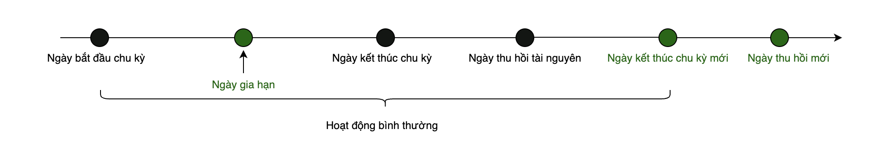

# Gia hạn tài nguyên đã hết hạn

Khi các tài nguyên theo gói của bạn sắp hết hạn, hãy gia hạn kịp thời để tránh gián đoạn dịch vụ do tài nguyên bị tạm ngưng, thu hồi hoặc bị xóa vĩnh viễn. Để đảm bảo dịch vụ không bị gián đoạn, hãy duy trì số dư tài khoản đầy đủ.

#### Tính năng gia hạn tài nguyên áp dụng đối với: 

* **Đối tượng:** Người dùng trả trước
* **Nguồn tiền:** Ví GreenNode hoặc các nguồn khác (thực hiện qua cổng thanh toán)
* **Tài nguyên:** Tất cả tài nguyên thuộc các sản phẩm GreenNode cho phép gia hạn

### Thay đổi trạng thái sau khi tài nguyên hết hạn

Nếu bạn không gia hạn tài nguyên sau khi hết hạn, dịch vụ có thể bị tạm ngưng hoặc hạn chế. Sau một khoảng thời gian, hệ thống sẽ tự động thu hồi tài nguyên. Khi tài nguyên bị thu hồi, toàn bộ dữ liệu sẽ bị xóa vĩnh viễn và không thể khôi phục.

Sau khi hết hạn, các sản phẩm sẽ trải qua ba giai đoạn: **Thời gian ân hạn**, **Tạm ngưng** và **Thu hồi và xóa.**

### Các giai đoạn sau khi hết hạn

**Thời gian ân hạn:**\
Từ ngày 1 đến ngày 15 kể từ thời điểm kết thúc chu kỳ trước. Trong giai đoạn này, tài nguyên vẫn hoạt động bình thường.

**Tạm ngưng:**\
Từ ngày 15 đến ngày 30 kể từ thời điểm kết thúc chu kỳ trước. Dịch vụ bị dừng, nhưng tài nguyên và dữ liệu vẫn được giữ lại.

**Thu hồi và xóa:**\
Sau 30 ngày kể từ thời điểm kết thúc chu kỳ trước. Hệ thống tự động thu hồi tài nguyên và xóa vĩnh viễn toàn bộ dữ liệu.

### Bảng tóm tắt vòng đời

<figure><figcaption></figcaption></figure>

| Giai đoạn             | Trạng thái | Dịch vụ         | Trạng thái dữ liệu | Có thể gia hạn |
| --------------------- | ---------- | --------------- | ------------------ | -------------- |
| Hoạt động bình thường | Hoạt động  | Đầy đủ          | An toàn            | Có             |
| Thời gian ân hạn      | Hạn chế    | Giới hạn        | Giữ                | Có             |
| Tạm ngưng             | Tạm dừng   | Không hoạt động | Giữ                | Có             |
| Thu hồi và xóa        | Đã xóa     | Không tồn tại   | Mất                | Không          |

### Giám sát thông báo hết hạn và gia hạn

Tại thời điểm **T − 7 ngày**, hệ thống bắt đầu gửi email nhắc nhở gia hạn theo lịch định kỳ.

Sau thời điểm **T (ngày hết hạn)**, hệ thống tiếp tục gửi email nhắc nhở cho đến khi:

* Tài nguyên được gia hạn, hoặc
* Tài nguyên bị thu hồi/xóa khỏi hệ thống.

### Gia hạn tài nguyên

Bạn có thể gia hạn tài nguyên bất cứ lúc nào trước khi tài nguyên được giải phóng.\
Thời gian dịch vụ mới sẽ bắt đầu ngay sau khi gói đăng ký trước đó kết thúc.

* **Gia hạn tài nguyên trước khi hết hạn:** hỗ trợ phương thức **thủ công (manual)** và **tự động (auto)**
* **Gia hạn tài nguyên sau khi hết hạn:** chỉ hỗ trợ phương thức **thủ công (manual)**

**Gia hạn tài nguyên trước khi hết hạn**

<figure><figcaption></figcaption></figure>

**Gia hạn tài nguyên sau khi hết hạn**

<figure><figcaption></figcaption></figure>

### Phương thức gia hạn

| Phương thức gia hạn | Thời gian gia hạn                                                                      | Cách hoạt động                                                                                                                                                                                                                                                                                                                                                                                                     |
| ------------------- | -------------------------------------------------------------------------------------- | ------------------------------------------------------------------------------------------------------------------------------------------------------------------------------------------------------------------------------------------------------------------------------------------------------------------------------------------------------------------------------------------------------------------ |
| Gia hạn thủ công    | Trước khi tài nguyên được giải phóng                                                   | Bạn khởi tạo gia hạn thủ công. Thời hạn hiệu lực của tài nguyên được kéo dài ngay sau khi thanh toán thành công.                                                                                                                                                                                                                                                                                                   |
| Gia hạn tự động     | Phải được bật trước khi hết hạn và trước thời điểm hệ thống thực hiện tự động gia hạn. | 
• Bạn thiết lập trước gia hạn tự động. • Hệ thống tự động cố gắng thanh toán vào các mốc quan trọng: 7 ngày, 4 ngày, 1 ngày trước khi hết hạn và vào ngày hết hạn. • Nếu tất cả các lần thử đều thất bại vào ngày hết hạn, gia hạn tự động sẽ dừng. Sau đó, bạn cần gia hạn thủ công (nếu vẫn còn trong thời gian gia hạn cho phép của sản phẩm). • Bạn có thể hủy gia hạn tự động bất cứ lúc nào.
 |
