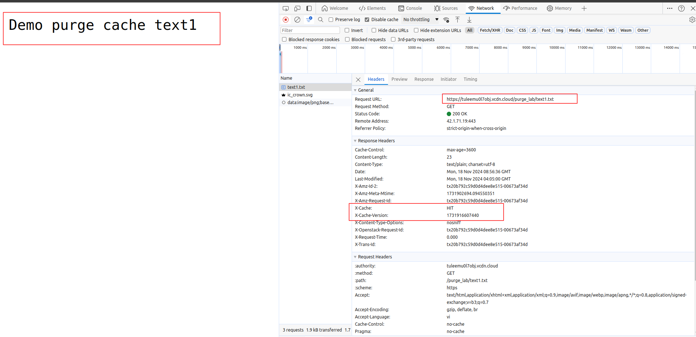
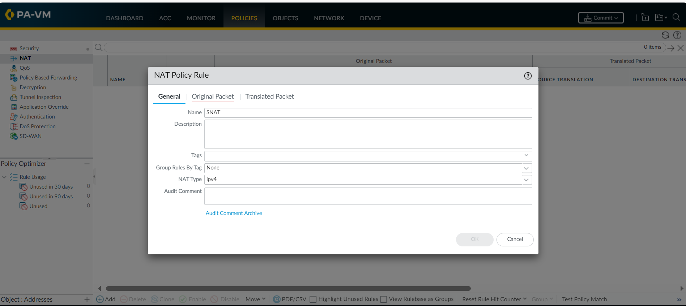

# CDN Purge Cache

## Tổng quan

**CDN Purge Cache** được sử dụng trong các trường hợp cần làm mới hoặc xóa bỏ các nội dung đã được cache trên hệ thống CDN.&#x20;

Sau đây là mô tả chi tiết các bước thực hiện Purge Cache trên CDN:

* **Bước 1:** Đầu tiên, bạn đã khởi tạo một **Object Download** trên hệ thống vCDN. Chi tiết các bước vui lòng tham khảo tại [đây](../loai-hinh-dich-vu/object-download.md). Giả sử, bên dưới tôi đã khởi tạo 1 Object Download _tuongtk3-download_ ( vCDN Domain: _tuleemu0l7obj.vcdn. cloud_) và liên kết với S3 Origin. Trên S3 Origin, tôi đã tạo các file demo1.txt ... demo5.txt, text1.txt ... text5.txt.
* **Bước 2:** Thực hiện test Purge Cache By (ALL, BEGIN, END, CONTAIN, URI(s) ). Trong đó:&#x20;
  * **ALL**: Xóa toàn bộ cache.
  * **BEGIN**: Xóa cache cho các URL bắt đầu bằng một chuỗi nhất định.
  * **END**: Xóa cache cho các URL kết thúc bằng một chuỗi nhất định.
  * **CONTAIN**: Xóa cache cho các URL chứa một chuỗi cụ thể.
  * **URI(s)**: Xóa cache cho một hoặc nhiều URI cụ thể.
* **Bước 3:** Gọi đến các link để CDN lưu cache&#x20;
  * Với vCDN Domain: _tuleemu0l7obj.vcdn. cloud_, bạn có thể thực hiện gọi đến các link để CDN lưu cache như sau:&#x20;
    * [https://tuleemu0l7obj.vcdn.cloud/purge\_lab/text1.txt](https://tuleemu0l7obj.vcdn.cloud/purge_lab/text1.txt)
    * [https://tuleemu0l7obj.vcdn.cloud/purge\_lab/demo1.txt\
      ](https://tuleemu0l7obj.vcdn.cloud/purge_lab/demo1.txt)
    * ....

<figure><figcaption></figcaption></figure>

* Khi CDN đã lưu cache ta sẽ thấy header  `X-Cache: HIT`  và `X-Cache-Version: $Thời_gian_timestamp_lưu_cache` ở CDN

<figure><figcaption></figcaption></figure>

* Đối với những file chưa được lưu cache ở CDN header sẽ có dạng  `X-Cache: MISS` và `X-Cache-Version: $Thời_gian_ timestamp_lưu_cache` ở CDN

<figure><figcaption></figcaption></figure>

&#x20;Chi tiết mỗi loại bạn vui lòng tham khảo hướng dẫn bên dưới:

## Chi tiết

### 1.    Purge Cache By ALL.

Purge by ALL: sẽ xóa hết tất cả link (tất cả Cache của resources trên CDN).

<figure><figcaption></figcaption></figure>

* Trước khi Purge Cache các file đã được Cache ở CDN

<figure><figcaption></figcaption></figure>

* Thay đổi nội dung của các file, sau đó refresh trình duyệt. Do các file đã được Cache ở CDN nên khi thay đổi ở Origin các file ở CDN chưa được thay đổi theo.

<figure><figcaption></figcaption></figure>

* Tiến hành Purge Cache: Chọn **Service** và **CDN** tương ứng và **Purge by ALL**

<figure><figcaption></figcaption></figure>

* Sau khi Purge cache CDN đã gọi về Origin để lấy nội dung mới nhất.

&#x20;

<figure><figcaption></figcaption></figure>

### 2.    Purge Cache By BEGIN

Purge by BEGIN: Sẽ xóa hết các resource đang được Cache ở CDN bắt đầu bằng ký tự nhập vào.

<figure><figcaption></figcaption></figure>

* Tương tự như Purge by ALL, trước khi Purge Cache các file đã được Cache ở CDN. Tiến hành Purge Cache: Chọn **Service** và **CDN** tương ứng và **Purge by BEGIN**. Tại URI nhập: `/purge_lab/text*` (xóa cache tất cả các file text\* ở vCDN).

<figure><figcaption></figcaption></figure>

* Sau khi Purge kiểm tra file `/purge_lab/text*` đã được gọi về Origin để lấy nội dung mới nhất.

<figure><figcaption></figcaption></figure>

* Do các file `/purge_lab/demo*` không được Purge nên nội dung vẫn được lấy từ Cache ở CDN.

&#x20;

<figure><figcaption></figcaption></figure>

&#x20;

### 3.    Purge Cache By CONTAIN

Purge by CONTAIN: Sẽ xóa hết các resource đang được Cache ở CDN có chuỗi ký tự nhập vào.

<figure><figcaption></figcaption></figure>

* Tương tự như Purge by ALL, trước khi Purge Cache các file đã được Cache ở CDN. Tiến hành Purge Cache: Chọn **Service** và **CDN** tương ứng và **Purge by CONTAIN**. Tại URI nhập: `/*demo*`  (xóa cache tất cả các file \*demo\* đang được cache ở vCDN).

<figure><figcaption></figcaption></figure>

* Sau khi Purge Cache các file `/purge_lab/demo1.txt` ... Đã được gọi về Origin để lấy nội dung mới.

<figure><figcaption></figcaption></figure>

* Các file `/purge_lab/text1.txt` ... Vẫn lấy nội dung từ Cache ở CDN

&#x20;

<figure><figcaption></figcaption></figure>

### 4.    Purge Cache By END.

Purge by END: Sẽ xóa hết các resource đang được Cache ở vCDN kết thúc chuỗi ký tự nhập vào.

<figure><figcaption></figcaption></figure>

* Tương tự như Purge by ALL, trước khi Purge Cache các file đã được Cache ở CDN. Tiến hành Purge Cache: Chọn **Service** và **CDN** tương ứng và **Purge by END**. Tại URI nhập: `/*1.txt`  (xóa cache tất cả các file  \*1.txt đang được cache ở CDN).

<figure><figcaption></figcaption></figure>

* Sau khi Purge Cache các file `/*1.txt` ... Đã được gọi về Origin để lấy nội dung mới.

<figure><figcaption></figcaption></figure>

* Các file `/purge_lab/text1.txt` ... Vẫn lấy nội dung từ Cache ở CDN.

<figure><figcaption></figcaption></figure>

### 5.    Purge Cache By URI(s).

Purge by URI(s): Sẽ xóa đúng với link được chỉ định.

<figure><figcaption></figcaption></figure>

* Tương tự như Purge by ALL, trước khi Purge Cache các file đã được Cache ở CDN. Tiến hành Purge Cache: Chọn **Service** và **CDN** tương ứng và **Purge by URI(s)**. Tại URI nhập: `/purge_lab/demo1.txt` , `/purge_lab/demo2.txt` ... (xóa cache các link chỉ định đang được cache ở vCDN).

<figure><figcaption></figcaption></figure>

* Sau khi Purge Cache các file `/purge_lab/demo1.txt` ... Đã được gọi về Origin để lấy nội dung mới.

<figure><figcaption></figcaption></figure>

* Các file khác không được chỉ định Purge Cache ... Vẫn lấy nội dung từ Cache ở CDN.

<figure><figcaption></figcaption></figure>
