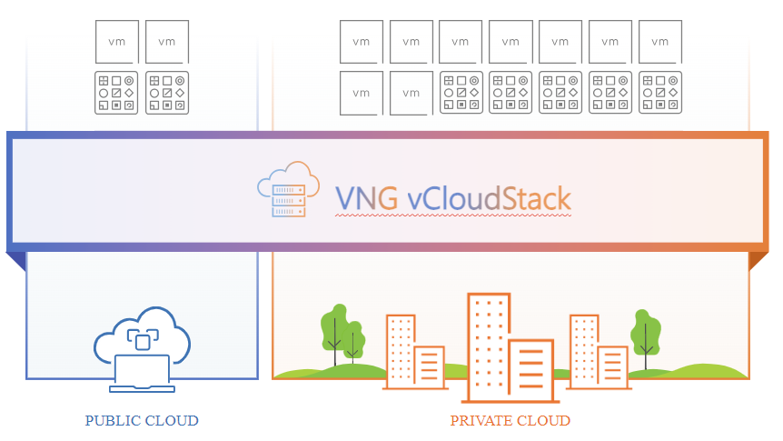

# vCloudStack

## Tổng quan

vCloudStack là giải pháp được quản lý, cung cấp cơ sở hạ tầng và dịch vụ GreenNode đến hầu như mọi vị trí tại chỗ. Giải pháp vCloudStack cho phép bạn mở rộng triển khai cơ sở hạ tầng và chạy các dịch vụ GreenNode tại chỗ (on-premise).

Do đó, giải pháp này rất phù hợp với các doanh nghiệp đã sở hữu những cơ sở hạ tầng sẵn có và quen với việc sử dụng dịch vụ điện toán đám mây, thì có thể tái sử dụng để ảo hóa các thiết bị hạ tầng với vCloudstack.

Với vCloudStack, bạn có thể chạy một số dịch vụ GreenNode cục bộ và kết nối với nhiều dịch vụ sẵn có trong những khu vực GreenNode cung cấp. Đây là một môi trường kết hợp , cung cấp tính linh hoạt cao, đồng thời duy trì kiểm soát và bảo mật dữ liệu nhạy cảm.

<figure><figcaption>
Giải pháp vCloudStack
</figcaption></figure>

***

## Lợi ích&#x20;

**Chạy dịch vụ GreenNode tại chỗ**

vCloudStack cho phép doanh nghiệp phát triển và quản lý ứng dụng với các dịch vụ GreenNode ngay tại cơ sở cục bộ của khách hàng. Giúp doanh nghiệp có thể chạy các ứng dụng trong môi trường hybrid, tận dụng tài nguyên đám mây và cục bộ, đặc biệt hữu ích cho các tính hướng cần xử lý dữ liệu tại chỗ.

**Cơ sở hạ tầng được quản lý đầy đủ**

Do vCloudStack được triển khai tại cơ sở cục bộ của khách hàng, nên cơ sở hạ tầng mang đến trải nghiệm quản lý đầy đủ, từ đó giảm thời gian vận hành và ngừng hoạt động để bảo trì.

**Trải nghiệm kết hợp thực sự nhất quán**

vCloudStack cung cấp môi trường nhất quán, cho phép khách hàng doanh nghiệp phát triển sử dụng cùng tool, API và dịch vụ để triển khai trên đám mây hoặc cục bộ.

**Tuân thủ bảo mật dữ liệu**

Giúp doanh nghiệp tuân thủ được các yêu cầu bảo mật và quy định tại địa phương khi cần lưu giữ các dữ liệu trong biên giới quốc gia hoặc vùng lãnh thổ nhất định.
