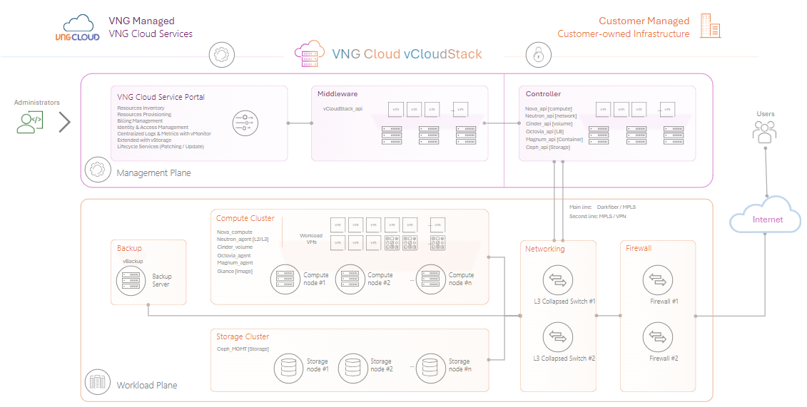

# Bắt đầu với vCloudStack

Sử dụng hướng dẫn này để bắt đầu với **vCloudStack**. Bạn sẽ biết các thành phần cơ bản và phạm vi quản trị vận hành mà dịch vụ vCloudStack của GreenNode cung cấp cho bạn, từ đó bạn sẽ hiểu và vận hành tốt hơn hệ thống của doanh nghiệp mình.

## Cấu trúc hạ tầng 

<figure><figcaption>
Cấu trúc hạ tầng triển khai vCloudStack
</figcaption></figure>

Như giới thiệu, vCloudStack cung cấp dịch vụ điện toán đám mây ngay tại cơ sở cục bộ của khách hàng, nên đa phần các thành phần sẽ được đặt và quản lý tại cơ sở của khách hàng như:

* Thiết bị mạng như **Firewalls** và bộ định tuyến **(Switches**);
* Thiết bị để ảo hóa và lưu trữ như các **Compute Nodes/Storage Nodes/Backup Nodes**.

Các thành phần mà vCloudStack sẽ trực tiếp vận hành và quản lý tại GreenNode, các thành phần gồm:

* Giao diện (**Portal**) thao tác ảo hóa và vận hành máy ảo nội bộ, hoàn toàn nhất quán với giao diện chung của GreenNode;
* Bộ quản lý trung gian (**Middleware**);
* Bộ xử lý và kiểm soát máy ảo (**Controller**).

## Giao diện quản trị và vận hành 

Từ việc cơ sở hạ tầng lắp đặt tại cơ sở nội bộ của doanh nghiệp, vCloudStack mang đến những giao diện quản trị vận hành với những chức năng cần thiết để người quản trị hệ thống cũng như người vận hành dễ dàng thao tác.

### 1/ vCloudStack Admin Site 

Người quản trị hệ thống thường là những nhân viên cấp cao (admin) có vai trò quản trị cần nắm bắt tất cả thông tin mà hệ thống mạng đang vận hành, đặc biệt là các thông tin về hạ tầng vật lý và thông tin ảo hóa, cũng như quản trị nhân sự truy cập vận hành hệ thống máy ảo. Do đó vCloudstack cung cấp riêng cho doanh nghiệp một giao diện quản trị toàn diện cho người dùng là người quản trị cấp hệ thống, đó là vCloudstack Admin Site, giao diện này cung cấp các tính năng chính:

* <mark style="color:blue;">**Dashboard:**</mark> Quản trị tài nguyên vật lý;
* <mark style="color:blue;">**User Managerment:**</mark> Quản lý, phân quyền và giới hạn sự dụng cho nhân sự vận hành;
* <mark style="color:blue;">**Infrastructure:**</mark> Theo dõi thông tin tài nguyên ảo hóa (compute/storage/network/backup);
* <mark style="color:blue;">**User Resource:**</mark> Theo dõi việc nhân viên vận hành quản lý tài nguyên ảo hóa (Server/Volume).

<figure><figcaption>
Giao diện quản trị Admin Site
</figcaption></figure>

### 2/ vCloudStack User Site 

Để vận hành được hệ thống mạng hybrid thì vCloudStack cung cấp giao diện vận hành quản lý ảo hóa máy chủ gọi là vCloudStack User Site, giao diện này cho phép thực hiện các chức năng ảo hóa máy chủ như:

* <mark style="color:blue;">**Server:**</mark> Ảo hóa máy chủ và vận hành máy chủ;
* <mark style="color:blue;">**Blockstore**</mark>: Tạo nơi lưu trữ, sao lưu, snapshot cho máy chủ ảo;l
* <mark style="color:blue;">**Network:**</mark> Quản trị phần mạng cho máy chủ và phân bổ lưu lượng với LoadBalancer;

<figure><figcaption>
Giao diện vận hành User Site
</figcaption></figure>

