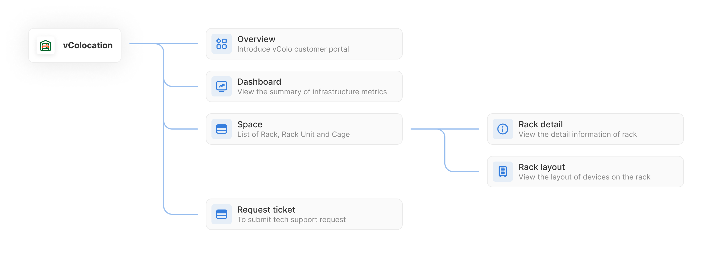

# vColocation

### Giới thiệu vColo customer portal 

***

Vcolo Customer Portal là một nền tảng tự động hóa quản lý dịch vụ cho thuê không gian trung tâm dữ liệu được cung cấp bởi VNG Cloud. Nó cung cấp giao diện trực quan và tiện lợi để khách hàng quản lý và giám sát các tài nguyên của mình bao gồm tình trạng sử dụng điện, thông số môi trường, sơ đồ bố trí thiết bị, danh sách thiết bị, tài sản…

<figure><figcaption></figcaption></figure>

### Site map 

***

<figure><figcaption></figcaption></figure>

### Danh sách tính năng 

***

<table data-header-hidden><thead><tr><th></th><th width="403"></th><th></th><th></th></tr></thead><tbody><tr><td><strong>Tên tính năng</strong></td><td><strong>Chú thích</strong></td><td><strong>Trạng thái</strong></td><td><strong>Thời gian phát hành/dự kiến phát hành</strong></td></tr><tr><td>OVERVIEW</td><td>Giới thiệu về vColo customer portal</td><td><strong>ĐÃ PHÁT HÀNH</strong></td><td>06/2023</td></tr><tr><td><a href="https://vngctech.atlassian.net/wiki/spaces/VCPUG/pages/878673926">DASHBOARD</a></td><td>Thống kê số liệu, hiện trạng hệ thống, bao gồm các thông số: công suất điện, nhiệt độ, độ ẩm, tình trạng sử dụng không gian tủ rack và các thống kê khác</td><td><strong>ĐÃ PHÁT HÀNH</strong></td><td>06/2023</td></tr><tr><td><a href="https://vngctech.atlassian.net/wiki/spaces/VCPUG/pages/878477322">SPACE LIST</a></td><td>Danh sách không gian thuê, bao gồm danh sách tủ rack, rack unit, lồng (cage) mà người dùng đang thuê</td><td><strong>ĐÃ PHÁT HÀNH</strong></td><td>06/2023</td></tr><tr><td><a href="https://vngctech.atlassian.net/wiki/spaces/VCPUG/pages/878542922">RACK DETAIL</a></td><td>Thông tin chi tiết của tủ rack, thể hiện các thông tin về lịch sử biến động của công suất điện, nhiệt độ, độ ẩm, thông tin chi tiết kỹ thuật của tủ rack</td><td><strong>ĐÃ PHÁT HÀNH</strong></td><td>06/2023</td></tr><tr><td><a href="https://vngctech.atlassian.net/wiki/spaces/VCPUG/pages/879001601">RACK LAYOUT</a></td><td>Sô đồ bố trí thiết bị trên tủ rack, cho phép xem vị trí lắp đặt của các thiết bị trên tủ rack, có thể xem một số thông tin tổng quan về tủ rack như: số lượng thiết bị đang lắp đặt trên rack, thống kê cân nặng của thiết bị, mức công suất hoạt động của tủ</td><td><strong>ĐÃ PHÁT HÀNH</strong></td><td>06/2023</td></tr><tr><td><a href="https://vngctech.atlassian.net/wiki/spaces/VCPUG/pages/882147377">TICKET REQUEST</a></td><td>Đây là link để chuyển hướng đến hệ thống quản lý yêu cầu của khách hàng</td><td><strong>ĐÃ PHÁT HÀNH</strong></td><td>06/2023</td></tr><tr><td>CONNECTION CIRCUIT</td><td>Danh mục các kênh kết nối mạng</td><td><strong>ĐANG PHÁT TRIỂN</strong></td><td>12/2023</td></tr><tr><td>REPORTING</td><td>Báo cáo tình trạng hệ thống: công suất, nhiệt độ, độ ẩm, tình trạng sử dụng Rack và Rack Unit, Network connection bandwidth</td><td><strong>ĐANG PHÁT TRIỂN</strong></td><td>12/2023</td></tr></tbody></table>
