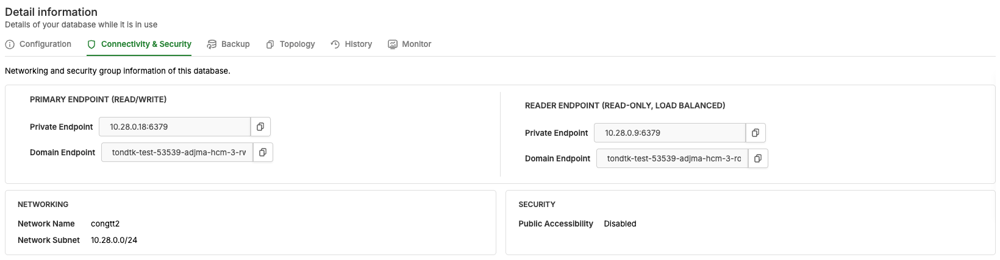
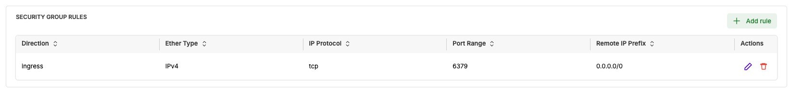

# Kết nối Redis Cluster

Hướng dẫn này mô tả các bước kết nối tới Redis Cluster Instance trên vDB bằng redis-cli, thông qua IP hoặc Domain, sử dụng ACL user để xác thực.

---

## Điều kiện tiên quyết

* Đã tạo Redis Cluster Instance trên vDB. Xem [Khởi tạo Redis Cluster](khoi-tao-redis-cluster.md).
* Đã cài **redis-cli** trên máy dùng để kết nối (hoặc một redis client tương đương).
* Máy kết nối nằm chung Network với Instance, hoặc thuộc Network có mở ACL tới Endpoint Private của Instance.

---

## Cài đặt redis-cli

Nếu chưa có redis-cli, trên Linux bạn tải source và build như sau:

```bash
wget http://download.redis.io/redis-stable.tar.gz
tar xvzf redis-stable.tar.gz
cd redis-stable
make distclean  # Ubuntu systems only
make
sudo make install
```

---

## Bước 1 - Xác định thông tin Endpoint & xác thực

1. Mở giao diện quản lý Database, chọn Redis Cluster Instance cần kết nối.
2. Chọn tab **Connectivity & Security**, xem mục **Endpoint & Port**.
3. Ghi lại **IP** hoặc **Domain** của Instance và **Port** (mặc định `6379`).
4. Lấy thông tin xác thực: ACL user và password của Instance.




Redis Cluster cho phép kết nối qua **IP** hoặc **Domain** — dùng giá trị nào cũng được.


## Bước 2 - Tùy chỉnh Security Group Rules (tùy chọn)

1. Mở tab **Connectivity & Security**, tại mục **Security Group Rules**, chọn **EDIT**.
2. Điền **Remote IP** tin cậy theo chuẩn CIDR, hoặc nhấn **ADD RULE** để thêm rule mới.
3. Nhấn **Save** và chờ thay đổi được lưu lại.




Mặc định Instance cho phép truy cập từ mọi nơi (`0.0.0.0/0`). GreenNode khuyến nghị giới hạn chỉ những Remote IP tin cậy được truy cập vào Instance.


## Bước 3 - Kết nối bằng redis-cli

Kết nối qua **IP**:

```bash
redis-cli -h <IP> -p <PORT> --user <ACL_USER> --pass '<PASSWORD>'
```

Kết nối qua **Domain**:

```bash
redis-cli -h <DOMAIN> -p <PORT> --user <ACL_USER> --pass '<PASSWORD>'
```

Ví dụ kết nối qua IP với ACL user mặc định `master-user`:

```bash
redis-cli -h <IP> -p 6379 --user master-user --pass '<PASSWORD>'
```

Ví dụ kết nối qua Domain:

```bash
redis-cli -h <cluster-name>.vdb-redis.vngcloud.vn -p 6379 --user master-user --pass '<PASSWORD>'
```


Đối với long-time query, cấu hình **tcp_keepalive** hoặc **healthcheck_interval** để tránh gián đoạn kết nối. Xem thêm [Lưu ý & hạn chế](../../announcements/luu-y-and-han-che.md#e.-long-time-query).


---

## Kết quả

Sau khi kết nối thành công, bạn nhận được prompt của redis-cli:

```bash
<IP>:6379>
```

Bạn đã có thể chạy các lệnh Redis lên Redis Cluster Instance.

| Tôi muốn tiếp theo... | Đi đến |
|---|---|
| Quản lý topology, backup, xóa cluster | [Quản lý Redis Cluster](quan-ly-redis-cluster.md) |
| Xem giới hạn và hạn chế | [Giới hạn và hạn chế](gioi-han-va-han-che.md) |
