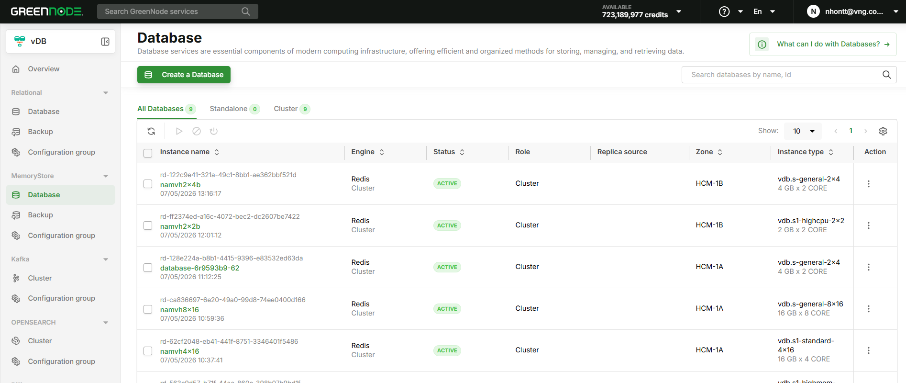

# Khởi tạo Redis Cluster

Hướng dẫn này mô tả các bước tạo mới một Redis Cluster trên vDB, bao gồm cấu hình cluster, thiết lập backup và tùy chọn khôi phục từ backup có sẵn.

---

## Điều kiện tiên quyết

* Tài khoản vDB đã được kích hoạt.
* Đã cấu hình ít nhất 1 Backup Policy và 1 Backup Location (status Available, Product = vDB) trong Backup Center.
* (Tùy chọn - nếu khôi phục từ backup) Đã có ít nhất 1 backup trong Backup Center với restore point ở trạng thái Completed.

---

## Bước 1- Truy cập trang tạo mới Database

1. Truy cập [https://vdb.console.vngcloud.vn](https://vdb.console.vngcloud.vn/).
2. Tại menu bên trái, chọn Memory Store.
3. Chọn Create Database.

---

## Bước 2 - Cấu hình cơ bản

Điền các thông tin chung cho database:

* Engine: Chọn Redis.
* Cluster Name: Tên cluster, từ 3–63 ký tự, chỉ gồm chữ thường, số và dấu gạch ngang.
* Engine Version: Chọn phiên bản Redis phù hợp.
* Instance Type: Chọn cấu hình CPU/RAM theo nhu cầu.
* Storage Size: Dung lượng lưu trữ (GB).

---

## Bước 3 - Cấu hình Cluster

Tại section Cluster configuration, chọn Cluster mode:

| Option       | Mô tả                                                                                   |
| ------------ | ----------------------------------------------------------------------------------------- |
| Single-node  | 1 Master node với replica tùy chọn. Phù hợp cho workload nhỏ và môi trường dev. |
| Cluster Mode | Replication trên nhiều node với tự động failover. Phù hợp cho production và HA.  |

Chọn Cluster Mode để tiếp tục tạo Redis Cluster.

 Khi bật Cluster Mode, hệ thống hỗ trợ High Availability với tự động failover. Một số lệnh Redis không khả dụng ở chế độ này. 

### Cấu hình số Node

Sau khi chọn Cluster Mode, cấu hình trường Number of nodes (2–10):

* Tổng số node bao gồm 1 Primary (Writer) và các Replica (Reader) còn lại.
* Ví dụ: chọn 4 nodes = 1 Primary + 3 Replicas.

Cluster topology preview hiển thị sơ đồ trực quan với số Master, Replica và tổng số nodes theo cấu hình đã chọn.

---

## Bước 4 — Khôi phục từ Backup (tùy chọn)

Nếu bạn muốn tạo cluster từ một backup có sẵn thay vì database trống, thực hiện tại section Backup Image:

1. Danh sách backup từ Backup Center được hiển thị trực tiếp dạng bảng (bao gồm cả Auto và Manual Backup). Chỉ hiển thị các backup có ít nhất 1 restore point ở trạng thái Completed.
2. Tìm backup cần dùng, nhấn biểu tượng expand để xem danh sách restore points.
3. Chọn radio button của restore point muốn khôi phục.

Khi chọn restore point, hệ thống tự động điền các cài đặt instance (instance type, storage size...) từ thông tin backup — bạn không cần nhập lại.

 Storage Size của cluster mới phải lớn hơn hoặc bằng Min.Restore Size (GB) của restore point đã chọn. Nếu không, hệ thống sẽ báo lỗi và không cho phép tạo cluster. 

Nếu không chọn restore point nào, cluster sẽ được tạo mới với database trống.

---

## Bước 5 — Cấu hình Backup Setting

Tại step Backup Settings, cấu hình bảo vệ dữ liệu cho cluster:

| Trường        | Bắt buộc | Mô tả                                                                                                 |
| --------------- | ---------- | ------------------------------------------------------------------------------------------------------- |
| Backup Policy   | Có        | Chọn policy quy định lịch backup và thời gian lưu trữ từ Backup Center.                        |
| Backup Location | Có        | Chọn location lưu trữ backup (chỉ hiển thị các location có status Available và Product = vDB). |



* Cả 2 trường đều bắt buộc — không thể bỏ qua bước này khi tạo Cluster Mode.
* Sau khi cluster được tạo, không thể thay đổi Backup Location.
* Nếu không có Backup Location nào khả dụng, hãy tạo mới tại Backup Center trước khi tiếp tục. 

Sử dụng biểu tượng refresh bên cạnh mỗi dropdown để tải lại danh sách mới nhất từ Backup Center.

---

## Bước 6 — Xem lại và tạo

Kiểm tra lại toàn bộ cấu hình tại trang Review, sau đó chọn Create Database.

Hệ thống sẽ khởi tạo cluster với:

* 1 Master node + số Replica đã chọn.
* Auto Backup chạy theo lịch của Backup Policy đã cấu hình.
* Data từ restore point (nếu có chọn ở Bước 4).

Sau khi tạo thành công, bạn sẽ được chuyển đến trang chi tiết của cluster.

---

## Tiếp theo

* [Xem Topology và thay đổi số Replica](https://loop.cloud.microsoft/p/quan-ly-redis-cluster.md)
* [Tạo Manual Backup hoặc theo dõi lịch sử backup](https://loop.cloud.microsoft/p/quan-ly-redis-cluster.md)
* [Xem các giới hạn và hạn chế khi dùng Redis Cluster](https://loop.cloud.microsoft/p/gioi-han-redis-cluster.md)
