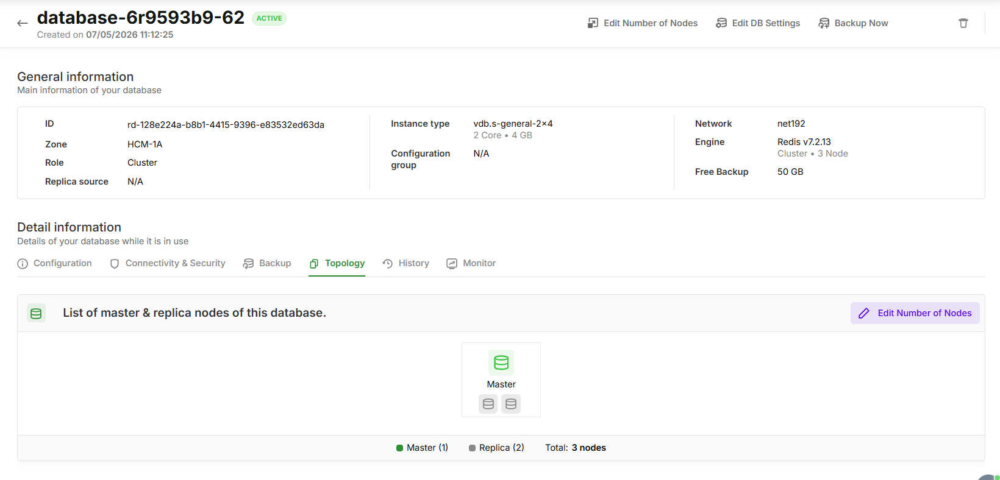
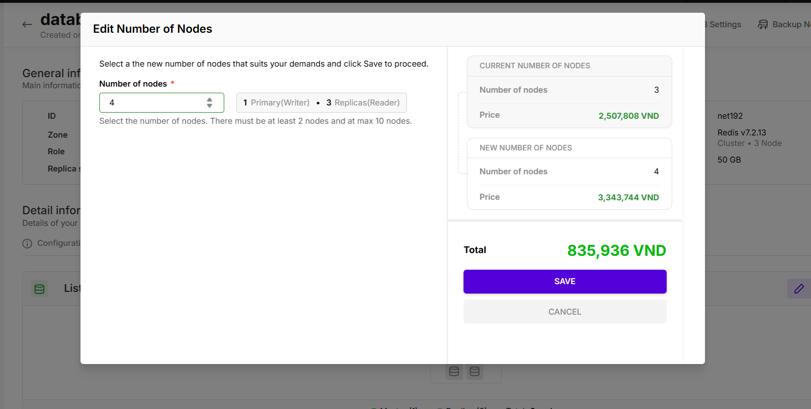
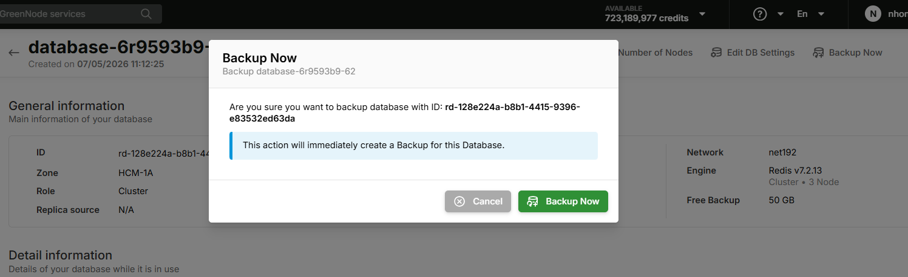

# Quản lý Redis Cluster

Sau khi tạo Redis Cluster, bạn có thể quản lý topology, thay đổi số replica, thực hiện backup thủ công và xóa cluster trực tiếp từ trang chi tiết.

---

## Điều kiện tiên quyết

* Đã có ít nhất 1 Redis Cluster ở trạng thái Available.
* Quyền quản lý database trên tài khoản vDB.

---

## Lọc danh sách Database

Trang danh sách Database hỗ trợ lọc nhanh theo loại deployment bằng các tab ở đầu trang:

| Tab           | Hiển thị                                  |
| ------------- | ------------------------------------------- |
| All Databases | Tất cả database (Single-node và Cluster) |
| Single-node   | Chỉ Single-node database                   |
| Cluster       | Chỉ Cluster database                       |

Số lượng database hiển thị dạng badge bên cạnh mỗi tên tab. Quick filter kết hợp với tính năng tìm kiếm: khi đang ở tab Cluster, kết quả tìm kiếm chỉ trả về Cluster databases.

---

## Xem Topology

Tab Topology trong trang chi tiết cluster hiển thị toàn bộ cấu trúc master–replica của cluster.

Để xem Topology:

1. Truy cập trang chi tiết Redis Cluster.
2. Chọn tab Topology.

Tab này hiển thị:

* Master node: Icon database màu xanh lá với nhãn "Master".
* Replica nodes: Các icon bên dưới, hiển thị tối đa 2, phần còn lại được gộp thành "+N".
* Summary: Số lượng Master, Replica và tổng số nodes.

---

## Thay đổi số Replica (Edit Nodes)

Bạn có thể scale up hoặc scale down số Replica của cluster sau khi tạo mà không gây downtime.

Để thay đổi số Replica:

1. Tại trang chi tiết cluster, chọn tab Topology.
2. Chọn Edit nodes.
3. Trong dialog Edit Cluster, chọn Number of nodes mới — UI chỉ hiển thị 2 lựa chọn: current−1 hoặc current+1.
4. Kiểm tra phần Cost Summary bên phải để xem chi phí thay đổi:
   * CURRENT CONFIGURATION: Cấu hình và giá hiện tại.
   * NEW CONFIGURATION: Cấu hình và giá mới.
   * Total: Chênh lệch chi phí (xanh = tăng, đỏ = giảm).
5. Chọn SAVE để áp dụng.

 Mỗi lần edit chỉ được thay đổi ±1 node. Để đạt số node mong muốn, lưu và lặp lại thao tác. Cơ chế này đảm bảo sync hoàn tất trước mỗi bước, tránh lỗi replication. 

---

## Backup thủ công (Back up now)

Nút Back up now nằm trực tiếp trên header trang chi tiết cluster, cho phép tạo Full Snapshot ngay lập tức mà không cần vào submenu.

Để tạo Manual Backup:

1. Tại header trang chi tiết cluster, chọn Back up now.
2. Xác nhận trong dialog
3. Chọn Back up now.

Hệ thống sẽ hiển thị thông báo và backup mới xuất hiện trong tab Backup .



* Nút Back up now bị vô hiệu hóa khi đang có backup job đang chạy (Auto hoặc Manual). Tooltip sẽ hiển thị: "A backup job is currently in progress".
* Khi tài khoản hết quota, hệ thống trả lỗi `QuotaExceeded` và không tự động retry.
* Chỉ hỗ trợ Full Snapshot — không hỗ trợ Incremental backup thủ công. 

---

## Xem thông tin Backup

Tab Backup trong trang chi tiết cluster cho phép bạn theo dõi trạng thái backup và lịch sử backup.

Để xem thông tin Backup:

1. Tại trang chi tiết cluster, chọn tab Backup.

Tab này hiển thị:

* Backup Information: Description, Created Date, Latest Record, Backup Size, Backup Policy, Backup Location.
* Backup List: Danh sách các bản backup với các cột: Backup DB Point ID, Backup Size (GB), Backup Type, Schedule Type, Backup Location, Backup Point, Status, Action.

Chọn View full backup details → để mở trang chi tiết backup của cluster này trong Backup Center (mở tab mới).

---

## Quản lý Backup tại Backup Center

Trang Backup của vDB (menu: Memory Store > Backup) hiển thị tổng quan danh sách backup. Để thực hiện các thao tác đầy đủ (Restore, Delete, quản lý Policy), bạn cần vào Backup Center.

| Trạng thái      | Hành động                                                      |
| ----------------- | ----------------------------------------------------------------- |
| Chưa có backup  | ChọnCreate a Backupđể chuyển đến Backup Center tạo mới.   |
| Đã có backup   | ChọnGo to vBackupđể mở Backup Center (filter theo Vault vDB). |
| Click tên backup | Mở trang chi tiết backup trong Backup Center (tab mới).        |

---

## Xóa Redis Cluster

 Thao tác xóa cluster không thể hoàn tác. Toàn bộ dữ liệu sẽ bị xóa vĩnh viễn. 

Để xóa cluster:

1. Tại trang chi tiết cluster, chọn biểu tượng More Actions (⋮).
2. Chọn Delete.
3. Trong dialog xác nhận:
   * (Tùy chọn) Chọn Create final backup? để tạo snapshot cuối trước khi xóa (chỉ khả dụng nếu cluster còn Backup Database trong vBackup).
   * Chọn I acknowledge... để xác nhận mất quyền truy cập vào các bản backup.
   * Nhập chữ delete vào ô xác nhận.
4. Chọn Delete (màu đỏ) để hoàn tất.

 Nếu Backup Database của cluster đã bị xóa khỏi vBackup, checkbox Create final backup? sẽ bị vô hiệu hóa và hệ thống hiển thị ghi chú: "No backup database found. Final backup is unavailable." 

---

## Action Menu

Từ trang danh sách Database, chọn biểu tượng Action (⋮) bên cạnh một Redis Cluster để thực hiện nhanh:

| Action                   | Mô tả                                                     |
| ------------------------ | ----------------------------------------------------------- |
| Edit configuration group | Chỉnh sửa Redis configuration parameters.                 |
| Edit DB settings         | Chỉnh sửa tên, backup policy và các database settings. |
| Delete                   | Xóa cluster (có dialog xác nhận).                       |

---

## Tiếp theo

* [Xem giới hạn và hạn chế khi dùng Redis Cluster](https://loop.cloud.microsoft/p/gioi-han-redis-cluster.md)
* [Tìm hiểu kiến trúc và so sánh với Single-node](https://loop.cloud.microsoft/p/redis-cluster.md)
