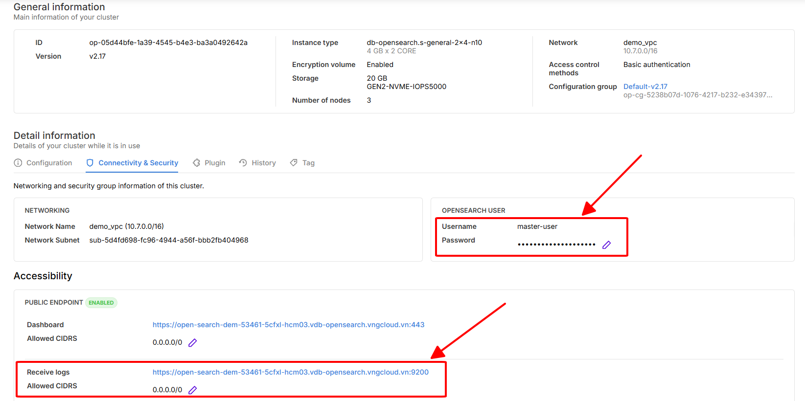

# Đẩy dữ liệu hoặc event logs từ Logstash vào một OpenSearch Cluster đã khởi tạo

## Điều kiện cần

Giả sử, bạn đã khởi tạo thành công một OpenSearch Cluster với thông số như sau:&#x20;

<figure><figcaption></figcaption></figure>

Tiếp theo, hãy thực hiện đẩy dữ liệu mẫu vào OpenSearch Dashboards hoặc đẩy event logs từ Logstash vào OpenSearch.

## **Đẩy dữ liệu mẫu vào OpenSearch Dashboards**

Dữ liệu mẫu sẽ giúp bạn làm quen với OpenSearch Dashboards và kiểm tra khả năng hiển thị dữ liệu.

#### **Bước 1: Tải dữ liệu mẫu**

Chạy lệnh sau để tải dữ liệu mẫu:

```bash
curl -O https://raw.githubusercontent.com/opensearch-project/documentation-website/2.19/assets/examples/ecommerce-field_mappings.json
curl -O https://raw.githubusercontent.com/opensearch-project/documentation-website/2.19/assets/examples/ecommerce.ndjson
```

#### **Bước 2: Tạo index và đẩy dữ liệu vào OpenSearch**

Chạy lệnh sau để tạo index và đẩy dữ liệu OpenSearch:

```bash
# 2. Create index and data.
curl -H "Content-Type: application/json" -X PUT "https://<<OpenSearch_ReceiveLogs_Endpoint>>/ecommerce" -k -H "Authorization: Basic $(echo -n 'master-user:<<Master_User_Password>>' | base64)" --data-binary "@ecommerce-field_mappings.json"
curl -H "Content-Type: application/json" -X PUT "https://<<OpenSearch_ReceiveLogs_Endpoint>>/ecommerce/_bulk" -k -H "Authorization: Basic $(echo -n 'master-user:<<Master_User_Password>>' | base64)" --data-binary "@ecommerce.ndjson"
```

Bạn có thể lấy thông tin `OpenSearch_ReceiveLogs_Endpoint` trên vDB Portal và `<<Master_User_Password>>` bằng mật khẩu tài khoản master mà bạn đã khởi tạo trước đó.

Ví dụ:&#x20;

```bash
# 2. Create index and data.
curl -H "Content-Type: application/json" -X PUT "https://open-search-dem-53461-5cfxl-hcm03.vdb-opensearch.vngcloud.vn:9200/ecommerce" -k -H "Authorization: Basic $(echo -n 'master-user:123456789aA@' | base64)" --data-binary "@ecommerce-field_mappings.json"
curl -H "Content-Type: application/json" -X PUT "https://open-search-dem-53461-5cfxl-hcm03.vdb-opensearch.vngcloud.vn:9200/ecommerce/_bulk" -k -H "Authorization: Basic $(echo -n 'master-user:123456789aA@' | base64)" --data-binary "@ecommerce.ndjson"
```

[\
](https://liemnt5-cidr-11430-2ue3z-hcm03.vdb-opensearch.vngcloud.tech)Kết quả sẽ hiển thị như sau:&#x20;

```bash
curl -H "Content-Type: application/json" -X PUT "https://open-search-dem-53461-5cfxl-hcm03.vdb-opensearch.vngcloud.vn:9200/ecommerce" -k -H "Authorization: Basic $(echo -n 'master-user:123456789aA@' | base64)" --data-binary "@ecommerce-field_mappings.json"
{"acknowledged":true,"shards_acknowledged":true,"index":"ecommerce"}

curl -H "Content-Type: application/json" -X PUT "https://open-search-dem-53461-5cfxl-hcm03.vdb-opensearch.vngcloud.vn:9200/ecommerce/_bulk" -k -H "Authorization: Basic $(echo -n 'master-user:123456789aA@' | base64)" --data-binary "@ecommerce.ndjson"
{"took":4579,"errors":false,"items":[{"index":{"_index":"ecommerce","_id":"0","_version":1,"result":"created","_shards":{"total":2,"successful":2,"failed":0},"_seq_no":0,"_primary_term":1,"status":201}},{"index":{"_index":"ecommerce","_id":"1","_version":1,"result":"created","_shards":{"total":2,"successful":2,"failed":0},"_seq_no":1,"_primary_term":1,"status":201}},{"index":{"_index":"ecommerce","_id":"2","_version":1,"result":"created","_shards":{"total":2,"successful":2,"failed":0},"_seq_no":2,"_primary_term":1,"status":201}},{"index":{"_index":"ecommerce","_id":"3","_version":1,"result":"created","_shards":{"total":2,"successful":2,"failed":0},"_seq_no":3,"_primary_term":1,"status":201}},{"index":{"_index":"ecommerce","_id":"4","_version":1,"result":"created","_shards":{"total":2,"successful":2,"failed":0},"_seq_no":4,"_primary_term":1,"status":201}},{"index":{"_index":"ecommerce","_id":"5","_version":1,"result":"created","_shards":{"total":2,"successful":2,"failed":0},"_seq_no":5,"_primary_term":1,"status":201}},{"index":{"_index":"ecommerce","_id":"6","_version":1,"result":"created","_shards":{"total":2,"successful":2,"failed":0},"_seq_no":6,"_primary_term":1,"status":201}},{"index":{"_index":"ecommerce","_id":"7","_version":1,"result":"created","_shards":{"total":2,"successful":2,"failed":0},"_seq_no":7,"_primary_term":1,"status":201}},{"index":{"_index":"ecommerce","_id":"8","_version":1,"result":"created","_shards":{"total":2,"successful":2,"failed":0},"_seq_no":8,"_primary_term":1,"status":2...
....
```

**Bước 3: Kiểm tra dữ liệu trên OpenSearch Dashboards**

1. Truy cập và đăng nhập vào **OpenSearch Dashboards**
2. Vào mục **Management**, chọn **Dashboard Management**&#x20;

<figure><figcaption></figcaption></figure>

3. Chọn mục **Index patterns**, tiếp tục chọn **Create index pattern**

<figure><figcaption></figcaption></figure>

4. Nhập **Index pattern name**, ví dụ `ecommerce*` sau đó chọn **Next step**

<figure><figcaption></figcaption></figure>

5. Truy cập **Discover** để xem dữ liệu mẫu.

<figure><figcaption></figcaption></figure>

## **Đẩy event logs từ Logstash vào OpenSearch**

Nếu bạn muốn thu thập và đẩy event logs từ Logstash vào OpenSearch, hãy làm theo các bước sau:

#### **Bước 1: Cài đặt Logstash (nếu chưa có)**

Trên Ubuntu/Debian:

```bash
sudo apt update && sudo apt install logstash
```

Trên CentOS/RHEL:

```bash
sudo yum install logstash
```

#### **Bước 2: Cấu hình Logstash để gửi logs đến OpenSearch**

Tạo một file cấu hình cho Logstash, ví dụ:

```bash
sudo nano /etc/logstash/conf.d/logstash.conf
```

Thêm nội dung sau:

```editorconfig
input {
    file {
        path => "/var/log/syslog"
        start_position => "beginning"
        sincedb_path => "/dev/null"
    }
}

filter {
    mutate {
        add_field => { "host" => "%{host}" }
    }
}

output {
    opensearch {
        hosts => ["OpenSearch_ReceiveLogs_Endpoint"]
        index => "logstash-logs"
        user => "master-user"  
        password => "Your_MasterUser_Password"  
        ssl => false 
    }
}
```

Thay thế:

* `OpenSearch_ReceiveLogs_Endpoint` bằng OpenSearch Receive Logs Endpoint của bạn lấy từ vDB Portal.
* `Your_MasterUser_Password` bằng mật khẩu tài khoản master bạn đã khởi tạo trước đó.

#### **Bước 3: Khởi động Logstash**

Sau khi cấu hình xong, khởi động Logstash để bắt đầu gửi logs:

```bash
sudo systemctl start logstash
```

#### **Bước 4: Kiểm tra dữ liệu trong OpenSearch**

Bạn có thể kiểm tra logs bằng API OpenSearch:

```bash
curl -X GET "https://OpenSearch_ReceiveLogs_Endpoint/logstash-logs/_search?pretty" -k -H "Authorization: Basic $(echo -n 'master-user:Your_MasterUser_Password' | base64)"
```

Ví dụ:

```bash
curl -X GET "https://open-search-dem-53461-5cfxl-hcm03.vdb-opensearch.vngcloud.vn:9200/logstash-logs/_search?pretty" -k -H "Authorization: Basic $(echo -n 'master-user:123456789aA@' | base64)"
```

Nếu logs xuất hiện, có nghĩa là Logstash đã gửi dữ liệu thành công vào OpenSearch.

#### **Bước 5: Xem logs trên OpenSearch Dashboards**

1. Truy cập và đăng nhập vào **OpenSearch Dashboards**
2. Vào mục **Management**, chọn **Dashboard Management**&#x20;

<figure><figcaption></figcaption></figure>

3. Chọn mục **Index patterns**, tiếp tục chọn **Create index pattern**

<figure><figcaption></figcaption></figure>

4. Nhập **Index pattern name**, ví dụ `logstash-logs*` sau đó chọn **Next step**

<figure><figcaption></figcaption></figure>

5. Cuối cùng, bạn hãy truy cập vào mục **Discover** để xem logs.
