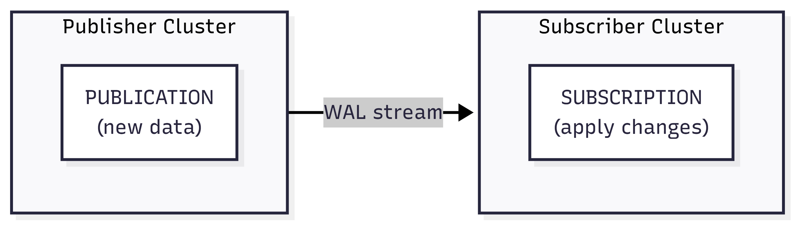

# Cấu hình Logical Replication cho PostgreSQL Cluster

> Hướng dẫn này giúp bạn thiết lập **PostgreSQL Logical Replication** — sao chép thay đổi dữ liệu theo thời gian thực từ cluster nguồn (Publisher) sang cluster đích (Subscriber). Một hoặc cả hai cluster có thể nằm trên GreenNode vDB.

---

## Điều kiện cần (Prerequisites)

- Ít nhất một trong hai cluster (Publisher hoặc Subscriber) phải là PostgreSQL Cluster trên GreenNode vDB (**phiên bản 16 hoặc 17**).
- Cả hai cluster phải dùng **cùng phiên bản major** PostgreSQL.
- Người dùng thực hiện các lệnh SQL phải có quyền **owner** trên các bảng cần replicate (để tạo Publication).


GreenNode vDB hỗ trợ Logical Replication cho **PostgreSQL 16 và 17**.


---

## Logical Replication hoạt động như thế nào?



- **Publisher**: cluster nguồn, chứa dữ liệu gốc. Bạn tạo `PUBLICATION` để chỉ định bảng nào được phép replicate.
- **Subscriber**: cluster đích, nhận và áp dụng thay đổi. Bạn tạo `SUBSCRIPTION` để kết nối đến Publisher và kéo dữ liệu về.

**Quá trình đồng bộ gồm hai giai đoạn:**

1. **Initial sync (đồng bộ ban đầu)**: Ngay khi bạn tạo Subscription, PostgreSQL tự động sao chép toàn bộ dữ liệu hiện có từ Publisher sang Subscriber — bạn không cần dump và restore dữ liệu thủ công. Quá trình này có thể mất vài phút đến vài giờ tuỳ theo kích thước dữ liệu.
2. **Streaming (streaming thay đổi liên tục)**: Sau khi initial sync hoàn tất, chỉ các thay đổi phát sinh mới (INSERT, UPDATE, DELETE) được đồng bộ theo thời gian thực.


Bạn **không cần dump dữ liệu** — Logical Replication tự xử lý phần đó. Tuy nhiên bạn **phải tạo sẵn cấu trúc bảng (schema)** trên Subscriber trước khi tạo Subscription, vì PostgreSQL không tự replicate DDL. Xem hướng dẫn tại [Bước B.3](#bước-b3-tạo-bảng-trên-subscriber).


---

## Phần A: vDB PostgreSQL Cluster là Publisher

> Thực hiện các bước trong phần này nếu cluster GreenNode vDB của bạn là **nguồn dữ liệu** (Publisher).

### Bước A.1: Yêu cầu kích hoạt 

Liên hệ **GreenNode Support** để yêu cầu kích hoạt tính năng Logical Replication trên cluster của bạn. GreenNode Support sẽ cấu hình và cung cấp **username** và **password** của user replication — thông tin này sẽ được dùng trong connection string khi Subscriber tạo Subscription.

Để đổi password của replication user, chạy lệnh sau trên cluster:

```sql
ALTER USER <username> PASSWORD '<new_password>';
```


Khi quản lý Subscription, không xóa hoặc chỉnh sửa các replication slot không thuộc sở hữu của bạn. Các slot này có thể thuộc về hệ thống — xóa nhầm có thể gây ảnh hưởng đến hệ thống.


### Bước A.2: Cấu hình tham số PostgreSQL

Logical Replication yêu cầu ba tham số PostgreSQL được cấu hình đúng trên **Publisher cluster**.

| Tham số | Giá trị yêu cầu | Mô tả |
|---|---|---|
| `wal_level` | `logical` | Bắt buộc — mặc định là `replica`, không đủ để chạy logical replication |
| `max_replication_slots` | ≥ số slot cần dùng | Tổng số replication slot cho tất cả replica, subscription và CDC connector |
| `max_wal_senders` | ≥ số sender cần dùng | Tổng số WAL sender process (thường bằng `max_replication_slots`) |

**Cách tính `max_replication_slots` và `max_wal_senders`:**

| Thành phần | Slot + sender cần |
|---|---|
| Mỗi replica node trong cluster | 1 + 1 |
| Mỗi Subscription (logical replication) | 1 + 1 |
| Mỗi CDC connector (Debezium) | 1 + 1 |

**Ví dụ:** cluster 3 node (2 replica) + 1 subscription → `max_replication_slots = 3`, `max_wal_senders = 3`.


Thay đổi `wal_level`, `max_replication_slots` và `max_wal_senders` yêu cầu **khởi động lại cluster**. Nên cập nhật cả ba tham số cùng một lần để chỉ gây một lần restart. Xem hướng dẫn tại [Cấu hình tham số cho Cluster](cau-hinh-tham-so-cho-cluster.md).


### Bước A.3: Tạo Publication

1. Kết nối đến **Publisher cluster** bằng tài khoản có quyền **owner** trên các bảng cần replicate.
2. Tạo Publication cho các bảng cần replicate:

```sql
-- Replicate các bảng cụ thể
CREATE PUBLICATION <publication_name> FOR TABLE orders, products;
```


Nếu bạn cần tạo publication `FOR ALL TABLES`, liên hệ **GreenNode Support** để được hỗ trợ.


3. Kiểm tra Publication đã được tạo:

```sql
SELECT pubname, puballtables, pubinsert, pubupdate, pubdelete
FROM pg_publication;
```

---

## Phần B: vDB PostgreSQL Cluster là Subscriber

> Thực hiện các bước trong phần này nếu cluster GreenNode vDB của bạn là **đích nhận dữ liệu** (Subscriber).

### Bước B.1: Yêu cầu kích hoạt tính năng Logical Replication

Liên hệ **GreenNode Support** để yêu cầu kích hoạt tính năng Logical Replication trên cluster của bạn. GreenNode Support sẽ cấu hình và cung cấp **username** và **password** của user replication — thông tin này sẽ được dùng trong connection string khi Subscriber tạo Subscription.

Để đổi password của replication user, chạy lệnh sau trên cluster:

```sql
ALTER USER <username> PASSWORD '<new_password>';
```


Khi quản lý Subscription, không xóa hoặc chỉnh sửa các replication slot không thuộc sở hữu của bạn. Các slot này có thể thuộc về hệ thống — xóa nhầm có thể gây ảnh hưởng đến hệ thống.


### Bước B.2: Cấp quyền CREATE trên schema và database đích

Kết nối đến **Subscriber cluster** bằng tài khoản **owner** của schema và database đích, sau đó chạy các lệnh sau:

```sql
-- Cấp quyền CREATE trên database (bắt buộc để chạy CREATE SUBSCRIPTION)
GRANT CREATE ON DATABASE <tên_database> TO <username>;

-- Cấp quyền USAGE và CREATE trên schema
GRANT USAGE ON SCHEMA <tên_schema> TO <username>;
GRANT CREATE ON SCHEMA <tên_schema> TO <username>;
```


`<username>` ở đây là tài khoản dùng để chạy `CREATE TABLE` (Bước B.3) và `CREATE SUBSCRIPTION` (Bước B.4) — không phải replication user trong CONNECTION string (được GreenNode cung cấp ở Bước B.1).


### Bước B.3: Tạo bảng trên Subscriber

Logical Replication **không tự tạo bảng** trên Subscriber. Trước khi tạo Subscription, bạn phải tạo schema và bảng tương ứng trên Subscriber.


**Gợi ý:** Thay vì viết lại thủ công, bạn có thể dùng `pg_dump --schema-only` để dump cấu trúc bảng từ Publisher, kiểm tra file, rồi áp dụng lên Subscriber bằng `psql -f`.


```bash
# Bước 1: dump schema từ Publisher ra file
pg_dump \
  --schema-only \
  --table=<tên_bảng> \
  -h <publisher_hostname> \
  -U <username> \
  -d <tên_database> \
  -f schema.sql

# Bước 2: kiểm tra nội dung file trước khi apply

# Bước 3: áp dụng lên Subscriber
psql \
  -h <subscriber_hostname> \
  -U <username> \
  -d <tên_database> \
  -f schema.sql
```

Nếu muốn dump nhiều bảng, thêm `--table` cho từng bảng. Bỏ flag `--table` để dump toàn bộ schema.

**Hoặc tạo bảng thủ công:**

```sql
-- Ví dụ: tạo bảng orders trên Subscriber
CREATE TABLE orders (
    id      serial PRIMARY KEY,
    product text   NOT NULL,
    qty     int    NOT NULL,
    ts      timestamptz DEFAULT now()
);
```


Schema và kiểu dữ liệu của bảng trên Subscriber phải **khớp hoàn toàn** với Publisher. Nếu không khớp, Subscription có thể sẽ báo lỗi.


### Bước B.4: Tạo Subscription

1. Kết nối đến **Subscriber cluster** bằng tài khoản GreenNode cung cấp.

2. Tạo Subscription:

```sql
CREATE SUBSCRIPTION my_subscription
    CONNECTION 'host=<publisher_hostname> port=5432 dbname=<tên_database> user=<username> password=<password> sslmode=require'
    PUBLICATION <publication_name>;
```

| Tham số | Mô tả |
|---|---|
| `host` | Hostname của Publisher |
| `port` | Port kết nối PostgreSQL |
| `dbname` | Tên database nguồn trên Publisher |
| `user` | Username có quyền replication trên Publisher |
| `password` | Password có quyền replication trên Publisher |
| `sslmode` | Chế độ mã hóa SSL |
| `publication_name` | Tên publication trên Publisher |


Sau khi tạo Subscription, PostgreSQL sẽ thực hiện **initial sync** — sao chép toàn bộ dữ liệu hiện có từ Publisher sang Subscriber. Quá trình này có thể mất vài phút đến vài giờ tuỳ theo kích thước dữ liệu.


---

## Kiểm tra trạng thái Replication

**Trên Publisher** — xem Subscription đang kết nối:

```sql
SELECT application_name, state, sent_lsn, write_lsn, flush_lsn, replay_lsn
FROM pg_stat_replication;
```

**Trên Subscriber** — xem trạng thái Subscription:

```sql
SELECT subname, pid, received_lsn, last_msg_receipt_time
FROM pg_stat_subscription;
```

Khi `state = streaming` trên Publisher, và trên Subscriber `pid` khác `NULL` cùng `received_lsn` tăng dần, replication đang hoạt động bình thường.

---

## Kết quả

Sau khi hoàn thành, dữ liệu từ các bảng trong Publication trên Publisher sẽ được tự động đồng bộ sang Subscriber theo thời gian thực. Mọi thay đổi (INSERT, UPDATE, DELETE) đều được áp dụng.

| Tôi muốn tiếp theo... | Đi đến |
|---|---|
| Thiết lập CDC với Debezium | [Thiết lập CDC với Debezium](thiet-lap-cdc-voi-debezium.md) |
| Xem các tham số cấu hình Cluster | [Cấu hình tham số cho Cluster](cau-hinh-tham-so-cho-cluster.md) |