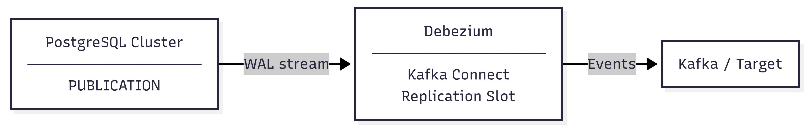

# Thiết lập CDC với Debezium

> Hướng dẫn này giúp bạn cấu hình **Change Data Capture (CDC)** từ PostgreSQL Cluster vDB sang external systems — Kafka, data pipeline, search index — sử dụng **Debezium PostgreSQL Connector**.

---

## Điều kiện cần (Prerequisites)

- Đã có PostgreSQL Cluster trên vDB (**phiên bản 16 hoặc 17**).
- Người dùng thực hiện tạo Publication phải là owner của bảng hoặc liên hệ GreenNode Support để tạo `FOR ALL TABLES`.

---

## CDC là gì và khác gì Logical Replication?

CDC capture toàn bộ thay đổi dữ liệu (INSERT, UPDATE, DELETE) từ PostgreSQL và đẩy ra external systems theo thời gian thực.



| | Logical Replication | CDC (Debezium) |
|---|---|---|
| Đích nhận dữ liệu | PostgreSQL khác | Kafka, data pipeline, v.v. |
| Ai tạo Replication Slot? | PostgreSQL tự động | Debezium tạo khi khởi động |
| Cleanup Slot khi dừng | PostgreSQL tự động | **Phải xóa thủ công** |

---

## Bước 1: Yêu cầu kích hoạt CDC và nhận thông tin đăng nhập

Liên hệ **GreenNode Support** để yêu cầu kích hoạt tính năng CDC trên cluster của bạn. GreenNode Support sẽ tạo user chuyên dụng và cung cấp lại cho bạn **username** và **password** để cấu hình Debezium connector.

Để đổi password của replication user, chạy lệnh sau trên cluster:

```sql
ALTER USER <username> PASSWORD '<new_password>';
```


Trong quá trình quản lý replication slot, không xóa hoặc chỉnh sửa các replication slot không thuộc sở hữu của bạn. Các slot này có thể thuộc về hệ thống — xóa nhầm có thể gây ảnh hưởng đến hệ thống.


---

## Bước 2: Kiểm tra và cấu hình tham số PostgreSQL

CDC yêu cầu ba tham số PostgreSQL được cấu hình đúng trên cluster nguồn. Nếu chưa được cấu hình, Debezium sẽ không thể kết nối và việc thêm replica mới trên portal cũng có thể thất bại.

| Tham số | Giá trị yêu cầu | Mô tả |
|---|---|---|
| `wal_level` | `logical` | Bắt buộc — mặc định là `replica`, không đủ để chạy CDC |
| `max_replication_slots` | ≥ số slot cần dùng | Tổng số replication slot cho tất cả replica, subscription và CDC connector |
| `max_wal_senders` | ≥ số sender cần dùng | Tổng số WAL sender process (thường bằng `max_replication_slots`) |

**Cách tính `max_replication_slots` và `max_wal_senders`:**

| Thành phần | Slot + sender cần |
|---|---|
| Mỗi replica node trong cluster | 1 + 1 |
| Mỗi Subscription (logical replication) | 1 + 1 |
| Mỗi CDC connector (Debezium) | 1 + 1 |

**Ví dụ:** cluster 3 node (2 replica) + 1 CDC connector → `max_replication_slots = 3`, `max_wal_senders = 3`.


Thay đổi `wal_level`, `max_replication_slots` và `max_wal_senders` yêu cầu **khởi động lại cluster**. Nên cập nhật cả ba tham số cùng một lần để chỉ gây một lần restart. Xem hướng dẫn tại [Cấu hình tham số cho Cluster](cau-hinh-tham-so-cho-cluster.md).


---

## Bước 3: Tạo Publication

**Publication** định nghĩa tập hợp bảng mà Debezium sẽ theo dõi. Bạn cần tạo Publication trước khi cấu hình connector.

1. Kết nối đến PostgreSQL Cluster bằng tài khoản có quyền owner trên các bảng cần capture.
2. Tạo Publication cho các bảng cần capture:

```sql
CREATE PUBLICATION my_cdc_pub FOR TABLE public.orders, public.products;
```


Nếu cần `FOR ALL TABLES`, liên hệ **GreenNode Support** để được hỗ trợ — tính năng này yêu cầu quyền superuser trên cluster.


3. Kiểm tra Publication:

```sql
SELECT pubname, puballtables, pubinsert, pubupdate, pubdelete
FROM pg_publication;
```

---

## Bước 4: Cấu hình Debezium Connector

**Kafka Connect** là framework (đi kèm Kafka) dùng để chạy các *connector* — tiến trình di chuyển dữ liệu giữa Kafka và hệ thống bên ngoài. Connector được nạp vào Kafka Connect dưới dạng cấu hình JSON và quản lý qua **REST API**.

**Debezium PostgreSQL Connector** chạy như một *source connector* bên trong Kafka Connect: nó giữ kết nối tới cluster nguồn, theo dõi dữ liệu trong database và đẩy mỗi thay đổi thành event vào Kafka topic tương ứng.

Sử dụng **username và password do GreenNode cung cấp** (user replication) để cấu hình Debezium PostgreSQL Connector:

```json
{
  "name": "<tên_connector>",
  "config": {
    "connector.class": "io.debezium.connector.postgresql.PostgresConnector",
    "database.hostname": "<cluster_hostname>",
    "database.port": "5432",
    "database.user": "<username>",
    "database.password": "<mật_khẩu>",
    "database.dbname": "<tên_database>",
    "topic.prefix": "<prefix_cho_kafka_topic>",
    "plugin.name": "pgoutput",
    "publication.name": "my_cdc_pub",
    "slot.name": "<tên_slot>",
    "table.include.list": "public.orders,public.products",
    "snapshot.mode": "initial"
  }
}
```

| Tham số | Mô tả |
|---|---|
| `database.hostname` | Hostname do GreenNode cung cấp |
| `database.port` | Port kết nối PostgreSQL |
| `database.user` | Username do GreenNode cung cấp |
| `database.password` | Password do GreenNode cung cấp |
| `database.dbname` | Tên database nguồn |
| `topic.prefix` | Tiền tố cho tên Kafka topic. Mỗi bảng sẽ được publish vào topic `<prefix>.<schema>.<table>` — ví dụ: prefix `pg-cdc` → topic `pg-cdc.public.orders` |
| `plugin.name` | Plugin logical decoding (built-in từ PG 10, không cần cài thêm) |
| `publication.name` | Tên Publication đã tạo ở Bước 3 |
| `slot.name` | Tên replication slot — đặt tên có ý nghĩa để dễ quản lý |
| `table.include.list` | Danh sách bảng cần capture (format: `schema.table`) |
| `snapshot.mode` | Chế độ snapshot khi connector khởi động (xem bảng bên dưới). Trong ví dụ, mode `initial` dùng để snapshot toàn bộ dữ liệu hiện có khi khởi động lần đầu, sau đó chuyển sang streaming WAL  |

Xem đầy đủ các tùy chọn tại [Debezium PostgreSQL Connector — Snapshot properties](https://debezium.io/documentation/reference/stable/connectors/postgresql.html#postgresql-connector-snapshot-properties).


`plugin.name: pgoutput` là plugin tích hợp sẵn trong PostgreSQL từ phiên bản 10. Bạn không cần cài thêm extension nào.


---

## Bước 5: Đăng ký connector qua Kafka Connect REST API

Đăng ký connector bằng lệnh:

```bash
curl -X POST http://<kafka-connect-host>:8083/connectors \
  -H "Content-Type: application/json" \
  -d @connector-config.json
```

Kiểm tra trạng thái connector:

```bash
curl -s http://<kafka-connect-host>:8083/connectors/<tên_connector>/status
```

Connector đang hoạt động bình thường khi `state` của connector và task đều là `RUNNING`.

---

## Bước 6: Monitor Replication Slot


Khác với Logical Replication, **Debezium không tự xóa Replication Slot khi dừng**. Nếu connector crash hoặc bị xóa mà không cleanup slot, slot sẽ tiếp tục giữ WAL → disk đầy → cluster crash.


Định kỳ kiểm tra trạng thái Replication Slot bằng cách kết nối vào PostgreSQL Cluster và chạy:

```sql
SELECT
    slot_name,
    active,
    pg_size_pretty(pg_wal_lsn_diff(pg_current_wal_lsn(), restart_lsn)) AS wal_lag
FROM pg_replication_slots;
```

Khi không còn dùng connector, **dừng hoặc xóa connector trước** (để slot chuyển sang trạng thái inactive), **sau đó mới drop slot** — không thể drop một slot đang active:

```sql
SELECT pg_drop_replication_slot('<tên_slot>');
```

---

## Những điều cần lưu ý


Các hành động dưới đây có thể gây ảnh hưởng đến hệ thống hoặc làm gián đoạn CDC pipeline.


| Hành động | Rủi ro |
|---|---|
| Xóa connector mà không xóa Replication Slot trước | Slot inactive → WAL tích lũy → disk đầy → cluster crash |
| Chạy `pg_drop_replication_slot()` trên slot không phải của bạn | Có thể xóa slot của hệ thống → có thể gây ảnh hưởng đến hệ thống|

---

## Kết quả

Sau khi hoàn thành, Debezium sẽ capture toàn bộ thay đổi từ các bảng trong Publication và đẩy ra Kafka topic theo format:

```
<topic.prefix>.<schema>.<table>
```

Ví dụ: `my-cdc.public.orders`

Kiểm tra message trên Kafka bằng `kafka-console-consumer`:

```bash
kafka-console-consumer \
  --bootstrap-server <kafka-host>:9092 \
  --topic my-cdc.public.orders \
  --from-beginning
```

| Tôi muốn tiếp theo... | Đi đến |
|---|---|
| Cấu hình Logical Replication giữa hai Cluster | [Cấu hình Logical Replication](cau-hinh-logical-replication.md) |
| Xem các tham số cấu hình Cluster | [Cấu hình tham số cho Cluster](cau-hinh-tham-so-cho-cluster.md) |
