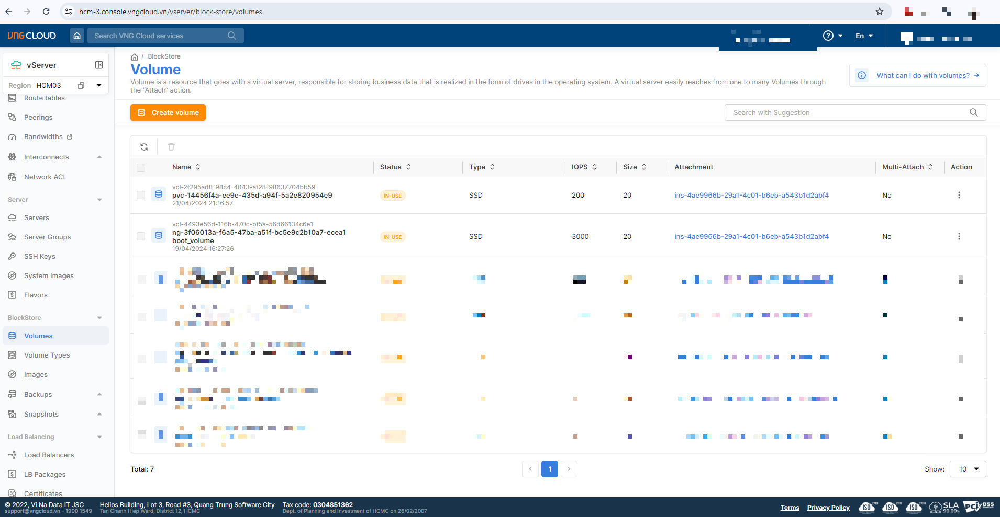
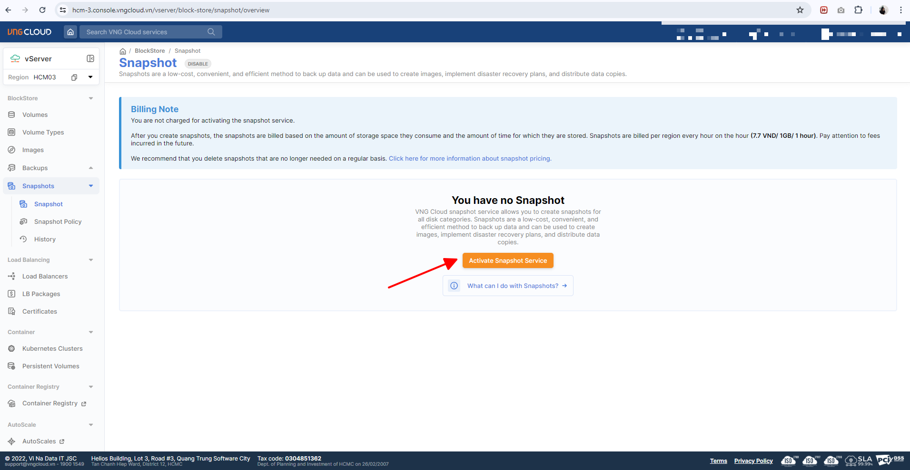

# Integrate with Container Storage Interface (CSI)

### Điều kiện cần <a href="#exposemotservicethongquavlblayer7-dieukiencan" id="exposemotservicethongquavlblayer7-dieukiencan"></a>

Để có thể khởi tạo một **Cluster** và **Deploy** một **Workload**, bạn cần:

* Có ít nhất 1 **VPC** và 1 **Subnet** đang ở trạng thái **ACTIVE**. Nếu bạn chưa có VPC, Subnet nào, vui lòng khởi tạo VPC, Subnet theo hướng dẫn tại [đây.](../../vserver/compute-hcm03-1a/network/virtual-private-cloud-vpc/)
* Có ít nhất 1 **SSH** key đang ở trạng thái **ACTIVE**. Nếu bạn chưa có SSH key nào, vui lòng khởi tạo SSH key theo hướng dẫn tại [đây.](../../vserver/compute-hcm03-1a/network/virtual-private-cloud-vpc/)
* Đã cài đặt và cấu hình **kubectl** trên thiết bị của bạn. vui lòng tham khảo tại [đây](https://kubernetes.io/vi/docs/tasks/tools/install-kubectl/) nếu bạn chưa rõ cách cài đặt và sử dụng kuberctl. Ngoài ra, bạn không nên sử dụng phiên bản kubectl quá cũ, chúng tôi khuyến cáo bạn nên sử dụng phiên bản kubectl sai lệch không quá một phiên bản với version của cluster.

***

### Khởi tạo Cluster <a href="#exposemotservicethongquavlblayer7-khoitaocluster" id="exposemotservicethongquavlblayer7-khoitaocluster"></a>

**Cluster trong Kubernetes** là một tập hợp gồm một hoặc nhiều máy ảo (VM) được kết nối lại với nhau để chạy các ứng dụng được đóng gói dạng container. Cluster cung cấp một môi trường thống nhất để triển khai, quản lý và vận hành các container trên quy mô lớn.

Để khởi tạo một Cluster, hãy làm theo các bước bên dưới:

**Bước 1:** Truy cập vào [https://vks.console.vngcloud.vn/overview](https://vks.console-dev.vngcloud.tech/overview)

**Bước 2:** Tại màn hình **Overview**, chọn **Activate.**

**Bước 3:** Chờ đợi tới khi chúng tôi khởi tạo thành công tài khoản VKS của bạn. Sau khi Activate thành công, bạn hãy chọn **Create a Cluster**

**Bước 4:** Tại màn hình khởi tạo Cluster, chúng tôi đã thiết lập thông tin cho Cluster và một **Default Node Group** cho bạn, bạn có thể giữ các giá trị mặc định này hoặc điều chỉnh các thông số mong muốn cho Cluster và Node Group của bạn tại Cluster Configuration, Default Node Group Configuration, Plugin. Khi bạn chọn bật option **Enable vLB Native Integration Driver**, mặc định chúng tôi sẽ cài sẵn plugin này vào Cluster của bạn.

**Bước 5:** Chọn **Create Kubernetes cluster.** Hãy chờ vài phút để chúng tôi khởi tạo Cluster của bạn, trạng thái của Cluster lúc này là **Creating**.

**Bước 6:** Khi trạng thái **Cluster** là **Active**, bạn có thể xem thông tin Cluster, thông tin Node Group bằng cách chọn vào Cluster Name tại cột **Name**.

***

### Kết nối và kiểm tra thông tin Cluster vừa tạo <a href="#exposemotservicethongquavlblayer7-ketnoivakiemtrathongtinclustervuatao" id="exposemotservicethongquavlblayer7-ketnoivakiemtrathongtinclustervuatao"></a>

Sau khi Cluster được khởi tạo thành công, bạn có thể thực hiện kết nối và kiểm tra thông tin Cluster vừa tạo theo các bước:

**Bước 1:** Truy cập vào [https://vks.console.vngcloud.vn/k8s-cluster](https://vks.console-dev.vngcloud.tech/overview)

**Bước 2:** Danh sách Cluster được hiển thị, chọn **Download Config File** để thực hiện tải xuống file kubeconfig. File này sẽ giúp bạn có toàn quyền truy cập vào Cluster của bạn.

**Bước 3**: Đổi tên file này thành config và lưu nó vào thư mục **\~/.kube/config**

**Bước 4:** Thực hiện kiểm tra Cluster thông qua lệnh:

* Chạy câu lệnh sau đây để kiểm tra **node**

```bash
kubectl get nodes
```

* Nếu kết quả trả về như bên dưới tức là bạn Cluster của bạn được khởi tạo thành công với 3 node như bên dưới.

```bash
NAME                                            STATUS     ROLES    AGE   VERSION
ng-0e10592c-e70e-404d-a4e8-5e3b80f805e4-834b7   Ready      <none>   50m   v1.28.8
ng-0e10592c-e70e-404d-a4e8-5e3b80f805e4-cf652   Ready      <none>   23m   v1.28.8
ng-0f4ed631-1252-49f7-8dfc-386fa0b2d29b-a8ef0   Ready      <none>   28m   v1.28.8
```

***

### Khởi tạo Service Account và cài đặt VNGCloud BlockStorage CSI Driver <a href="#exposemotservicethongquavlblayer7-khoitaoserviceaccountvacaidatvngcloudingresscontroller" id="exposemotservicethongquavlblayer7-khoitaoserviceaccountvacaidatvngcloudingresscontroller"></a>


**Chú ý:**

* Khi bạn thực hiện khởi tạo Cluster theo hướng dẫn bên trên, nếu bạn chưa bật option **Enable BlockStore Persistent Disk CSI Driver**, mặc định chúng tôi sẽ không cài sẵn plugin này vào Cluster của bạn. Bạn cần tự thực hiện Khởi tạo Service Account và cài đặt VNGCloud BlockStorage CSI Driver theo hướng dẫn bên dưới. Nếu bạn đã bật option **Enable BlockStore Persistent Disk CSI Driver**, thì chúng tôi đã cài sẵn plugin này vào Cluster của bạn, hãy bỏ qua bước Khởi tạo Service Account, cài đặt VNGCloud BlockStorage CSI Driver và tiếp tục thực hiện theo hướng dẫn kể từ Deploy một Workload.
* <mark style="color:red;">**VNGCloud BlockStorage CSI Driver**</mark> <mark style="color:red;">chỉ hỗ trợ attach volume với một node (VM) duy nhất trong suốt vòng đời của volume đó. Nếu bạn có nhu cầu ReadWriteMany, bạn có thể cân nhắc sử dụng NFS CSI Driver, vì nó cho phép nhiều nodes có thể Read và Write trên cùng một volume cùng một lúc. Điều này rất hữu ích cho các ứng dụng cần chia sẻ dữ liệu giữa nhiều pods hoặc services trong Kubernetes.</mark>


<details>

<summary>Khởi tạo Service Account và cài đặt VNGCloud BlockStorage CSI Driver</summary>

**Khởi tạo Service Account**

* Khởi tạo hoặc sử dụng một **service account** đã tạo trên IAM và gắn policy: **vServerFullAccess**. Để tạo service account bạn truy cập tại [đây](https://iam.console.vngcloud.vn/service-accounts) và thực hiện theo các bước sau:
  * Chọn "**Create a Service Account**", điền tên cho Service Account và nhấn **Next Step** để gắn quyền cho Service Account
  * Tìm và chọn **Policy:** **vServerFullAccess**, sau đó nhấn "**Create a Service Account**" để tạo Service Account, Policy: vLBFullAccess vàPolicy: vServerFullAccess do VNG Cloud tạo ra, bạn không thể xóa các policy này.
  * Sau khi tạo thành công bạn cần phải lưu lại **Client\_ID** và **Secret\_Key** của Service Account để thực hiện bước tiếp theo.

**Cài đặt VNGCloud BlockStorage CSI Driver**

* Cài đặt Helm phiên bản từ 3.0 trở lên. Tham khảo tại [https://helm.sh/docs/intro/install/](https://helm.sh/docs/intro/install/) để biết cách cài đặt.
* Thêm repo này vào cluster của bạn qua lệnh:

```bash
helm repo add vks-helm-charts https://vngcloud.github.io/vks-helm-charts
helm repo update
```

* Thay thế thông tin ClientID, Client Secret và ClusterID của cụm K8S của bạn và tiếp tục chạy:

```bash
helm install vngcloud-blockstorage-csi-driver vks-helm-charts/vngcloud-blockstorage-csi-driver \
  --replace --namespace kube-system \
  --set vngcloudAccessSecret.keyId=${VNGCLOUD_CLIENT_ID} \
  --set vngcloudAccessSecret.accessKey=${VNGCLOUD_CLIENT_SECRET} \
  --set vngcloudAccessSecret.vksClusterId=${VNGCLOUD_VKS_CLUSTER_ID}  # Optional
```

* Sau khi việc cài đặt hoàn tất, thực hiện kiểm tra trạng thái của vngcloud-blockstorage-csi-driver pods:

```bash
kubectl get pods -n kube-system | grep vngcloud-csi-controller
```

Ví dụ như ảnh bên dưới là bạn đã cài đặt thành công vngcloud-controller-manager:

```bash
NAME                                           READY   STATUS    RESTARTS       AGE
vngcloud-csi-controller-56bd7b85f-ctpns        7/7     Running   6 (2d4h ago)   2d4h
vngcloud-csi-controller-56bd7b85f-npp9n        7/7     Running   2 (2d4h ago)   2d4h
vngcloud-csi-node-c8r2w                        3/3     Running   0              2d4h
```

</details>

***

### **Tạo Storage Class**

Storage Class (hay còn được gọi tắt là SC) là **một mẫu** để tạo ổ đĩa (PersistentVolume) tự động theo nhu cầu. Trên VNGCloud, SC định nghĩa loại ổ đĩa, tốc độ, ... (ví dụ: SSD, HDD, IOPS 50000,...).

* Tạo file **storage-class.yaml** với nội dung sau:

```yaml
apiVersion: storage.k8s.io/v1
kind: StorageClass
metadata:
  name: my-expansion-storage-class                    # Tên Storage Class
provisioner: bs.csi.vngcloud.vn                       
parameters:
  type: ssd-iops3000                                  # Tên loại ổ đĩa và IOPS mà bạn mong muốn
allowVolumeExpansion: true                      
volumeBindingMode: WaitForFirstConsumer 
```

Thông tin vtype bạn vui lòng tham khảo trên trang chủ của VKS tại mục Volume Type hoặc tại [đây](../tham-khao-them/danh-sach-volume-type-dang-ho-tro/).

**Lưu ý quan trọng khi sử dụng Storage Class:**

Nếu bạn đang sử dụng Storage Class đã được khởi tạo trước đây với định dạng sau:

```yaml
apiVersion: storage.k8s.io/v1
kind: StorageClass
metadata:
  name: my-expansion-storage-class                    
provisioner: bs.csi.vngcloud.vn                       
parameters:
  type: vtype-61c3fc5b-f4e9-45b4-8957-8aa7b6029018    
allowVolumeExpansion: true                            
```

thay vì dạng chuẩn mới:

```yaml
apiVersion: storage.k8s.io/v1
kind: StorageClass
metadata:
  name: my-expansion-storage-class                    # Tên Storage Class
provisioner: bs.csi.vngcloud.vn                       
parameters:
  type: ssd-iops3000                                  # Tên loại ổ đĩa và IOPS mà bạn mong muốn
allowVolumeExpansion: true                      
volumeBindingMode: WaitForFirstConsumer 
```

thì:

* **Trường hợp 1:** Nếu toàn bộ Cluster của bạn chỉ sử dụng Node Group thuộc Availability Zone **HCM01A**, bạn **có thể tiếp tục sử dụng Storage Class cũ** này mà không gây ảnh hưởng tới hoạt động.
* **Trường hợp 2:** Nếu bạn khởi tạo Node Group mới thuộc các Availability Zone khác **HCM01A**, chúng tôi **khuyến cáo nên xóa Storage Class cũ** và tạo lại Storage Class mới (vẫn dùng tên Storage Class cũ), nhưng đổi tham số vtype sang định dạng chuẩn mới:

```
vtype=ssd-iops3000
```

* **Ngoài ra,** bạn nên cấu hình Storage Class với thông số sau đây để đảm bảo volume chỉ được provision tại AZ phù hợp với pod consumer, tránh lỗi khi triển khai nhiều zone:

```yaml
volumeBindingMode: WaitForFirstConsumer
```

* Chạy câu lệnh sau đây để triển khai tạo storage class:

```
kubectl apply -f storage-class.yaml
```

***

### **Tạo Persistent Volume Claim**

PersistentVolumeClaim (hay còn gọi là PVC) là **yêu cầu người dùng gửi ra** để xin một ổ đĩa lưu trữ có kích thước cụ thể. Khi bạn tạo một PVC, Kubernetes sẽ dùng SC để tạo hoặc chọn một ổ đĩa phù hợp.

* Tạo file **persistent-volume-claim.yaml** với nội dung sau:

```
apiVersion: v1
kind: PersistentVolumeClaim
metadata:
  name: my-expansion-pvc                           # [2] The PVC name, CAN be changed
spec:
  accessModes:
    - ReadWriteOnce
  resources:
    requests:
      storage: 20Gi                                # [3] The PVC size, CAN be changed, this value MUST be in the valid range of the proper volume type
  storageClassName: my-expansion-storage-class     # [4] The StorageClass name, MUST be the same as [1]
```

* Chạy câu lệnh sau đây để triển khai tạo pvc:

```
kubectl apply -f persistent-volume-claim.yaml
```

***

### Tạo pod dùng PVC

* Tạo file **podnginx-pvc.yaml** với nội dung sau:

```
apiVersion: v1
kind: Pod
metadata:
  name: nginx                                      # [5] The Pod name, CAN be changed
spec:
  containers:
    - image: nginx
      imagePullPolicy: IfNotPresent
      name: nginx
      ports:
        - containerPort: 80
          protocol: TCP
      volumeMounts:
        - mountPath: /var/lib/www/html
          name: my-volume-name                     # MUST be the same as [6]
  volumes:
    - name: my-volume-name                         # [6] The volume name, CAN be changed
      persistentVolumeClaim:
        claimName: my-expansion-pvc                # MUST be the same as [2]
        readOnly: false
```

* Chạy câu lệnh sau đây để triển khai tạo pod:

```
kubectl apply -f podnginx-pvc.yaml
```

Lúc này, hệ thống vServer sẽ tự động tạo một Volume tương ứng với file yaml bên trên, volume này sẽ được attach vào node chứa pod dùng PVC đang chạy, ví dụ:

<figure><figcaption></figcaption></figure>

***

### **Tạo Snapshot**

Snapshot là phương pháp sao lưu giữ liệu với chi phí thấp, thuận tiện và hiệu quả và có thể được sử dụng để tạo image, phục hồi dữ liệu và phân phối các bản sao dữ liệu. Nếu bạn là người dùng mới chưa từng sử dụng dịch vụ Snapshot, bạn cần thực hiện Activate Snapshot Service (Kích hoạt dịch vụ Snapshot) trước khi có thể tạo Snapshot cho Persistent Volume của bạn.

#### **Activate Snapshot Service**

Để có thể tạo Snapshot, bạn cần thực hiện Activate Snapshot Service. Bạn sẽ không bị tính phí khi kích hoạt dịch vụ snapshot. Sau khi bạn tạo snapshot, chi phí sẽ được tính dựa trên dung lượng lưu trữ và thời gian lưu trữ của các bản snapshot này. Thực hiện theo các bước sau đây để kích hoạt dịch vụ Snapshot:

**Bước 1:** Truy cập vào [https://hcm-3.console.vngcloud.vn/vserver/block-store/snapshot/overview](https://hcm-3.console.vngcloud.vn/vserver/block-store/snapshot/overview)

**Bước 2:** Chọn **Activate Snapshot Service**.

Ví dụ:

<figure><figcaption></figcaption></figure>

#### **Cài đặt VNGCloud Snapshot Controller**

* Cài đặt Helm phiên bản từ 3.0 trở lên. Tham khảo tại [https://helm.sh/docs/intro/install/](https://helm.sh/docs/intro/install/) để biết cách cài đặt.
* Thêm repo này vào cluster của bạn qua lệnh:

```
helm repo add vks-helm-charts https://vngcloud.github.io/vks-helm-charts
helm repo update
```

* Tiếp tục chạy:

```
helm install vngcloud-snapshot-controller vks-helm-charts/vngcloud-snapshot-controller \
  --replace --namespace kube-system
```

* Sau khi việc cài đặt hoàn tất, thực hiện kiểm tra trạng thái của vngcloud-blockstorage-csi-driver pods:

```
kubectl get pods -n kube-system
```

Ví dụ như ảnh bên dưới là bạn đã cài đặt thành công vngcloud-controller-manager:

```
NAME                                           READY   STATUS              RESTARTS       AGE

snapshot-controller-7fdd984f89-745tg           0/1     ContainerCreating   0              3s
snapshot-controller-7fdd984f89-k94wq           0/1     ContainerCreating   0              3s
```

#### Tạo file **snapshot.yaml** với nội dung sau:

```
apiVersion: snapshot.storage.k8s.io/v1
kind: VolumeSnapshotClass
metadata:
  name: my-snapshot-storage-class  # [2] The name of the volume snapshot class, CAN be changed
driver: bs.csi.vngcloud.vn
deletionPolicy: Delete
parameters:
  force-create: "false"
---

apiVersion: snapshot.storage.k8s.io/v1
kind: VolumeSnapshot
metadata:
  name: my-snapshot-pvc  # [4] The name of the snapshot, CAN be changed
spec:
  volumeSnapshotClassName: my-snapshot-storage-class  # MUST match with [2]
  source:
    persistentVolumeClaimName: my-expansion-pvc  # MUST match with [3]
```

* Chạy câu lệnh sau đây để triển khai Ingress

```
kubectl apply -f snapshot.yaml
```

***

### **Kiểm tra PVC và Snapshot vừa tạo**

* Sau khi apply tập tin thành công, bạn có thể kiểm tra danh sách service, pvc thông qua:

```
kubectl get sc,pvc,pod -owide
```

```
NAME                                                       PROVISIONER          RECLAIMPOLICY   VOLUMEBINDINGMODE   ALLOWVOLUMEEXPANSION   AGE
storageclass.storage.k8s.io/my-expansion-storage-class     bs.csi.vngcloud.vn   Delete          Immediate           true                   10m
storageclass.storage.k8s.io/sc-iops-200-retain (default)   bs.csi.vngcloud.vn   Retain          Immediate           false                  2d4h

NAME                                     STATUS   VOLUME                                     CAPACITY   ACCESS MODES   STORAGECLASS                 AGE   VOLUMEMODE
persistentvolumeclaim/my-expansion-pvc   Bound    pvc-14456f4a-ee9e-435d-a94f-5a2e820954e9   20Gi       RWO            my-expansion-storage-class   10m   Filesystem

NAME                             READY   STATUS    RESTARTS   AGE   IP              NODE                                            NOMINATED NODE   READINESS GATES
pod/nginx                        1/1     Running   0          10m   172.16.24.203   ng-3f06013a-f6a5-47ba-a51f-bc5e9c2b10a7-ecea1   <none>           <none>
pod/nginx-app-7f45b65946-t7d7k   1/1     Running   0          94m   172.16.24.202   ng-3f06013a-f6a5-47ba-a51f-bc5e9c2b10a7-ecea1   <none>           <none>
```

***

### Thay đổi thông số IOPS của Persistent Volume vừa tạo

\
Để thay đổi thông số IOPS của Persistent Volume vừa tạo, hãy thực hiện theo các bước sau đây:

**Bước 1:** Chạy lệnh bên dưới để liệt kê các PVC trong Cluster của bạn

```
kubectl get persistentvolumes
```

**Bước 2:** Chỉnh sửa tệp tin YAML của PVC theo lệnh

```
kubectl edit pvc my-expansion-pvc
```

* Nếu bạn chưa chỉnh sửa IOPS của Persistent Volume lần nào trước đó, khi bạn chạy lệnh trên, bạn hãy thêm 1 annotation bs.csi.vngcloud.vn/volume-type: "volume-type-id" . Ví dụ: bên dưới tôi đang thay đổi IOPS của Persistent Volume từ 200 (Volume type id = vtype-61c3fc5b-f4e9-45b4-8957-8aa7b6029018) lên 1000 (Volume type id = vtype-85b39362-a360-4bbb-9afa-a36a40cea748)

```
apiVersion: v1
kind: PersistentVolumeClaim
metadata:
  annotations:
    bs.csi.vngcloud.vn/volume-type: "vtype-85b39362-a360-4bbb-9afa-a36a40cea748"
    kubectl.kubernetes.io/last-applied-configuration: |
      {"apiVersion":"v1","kind":"PersistentVolumeClaim","metadata":{"annotations":{},"name":"my-expansion-pvc","namespace":"default"},"spec":{"accessModes":["ReadWriteOnce"],"resources":{"requests":{"storage":"20Gi"}},"storageClassName":"my-expansion-storage-class"}}
    pv.kubernetes.io/bind-completed: "yes"
    pv.kubernetes.io/bound-by-controller: "yes"
    volume.beta.kubernetes.io/storage-provisioner: bs.csi.vngcloud.vn
    volume.kubernetes.io/storage-provisioner: bs.csi.vngcloud.vn
  creationTimestamp: "2024-04-21T14:16:53Z"
  finalizers:
  - kubernetes.io/pvc-protection
  name: my-expansion-pvc
  namespace: default
  resourceVersion: "11041591"
  uid: 14456f4a-ee9e-435d-a94f-5a2e820954e9
spec:
  accessModes:
  - ReadWriteOnce
  resources:
    requests:
      storage: 20Gi
  storageClassName: my-expansion-storage-class
  volumeMode: Filesystem
  volumeName: pvc-14456f4a-ee9e-435d-a94f-5a2e820954e9
status:
  accessModes:
  - ReadWriteOnce
  capacity:
    storage: 20Gi
  phase: Bound
```

* Nếu bạn đã chỉnh sửa IOPS của Persistent Volume lần nào trước đó, khi bạn chạy lệnh trên, tệp tin yaml của bạn đã có sẵn annotation bs.csi.vngcloud.vn/volume-type: "volume-type-id" . Lúc này, hãy chỉnh sửa annotation này về Volume type id có IOPS mà bạn mong muốn.

### Thay đổi Disk Volume của Persistent Volume vừa tạo

\
Để thay đổi Disk Volume của Persistent Volume vừa tạo, hãy thực hiện chạy lệnh sau:

Ví dụ: ban đầu PVC được tạo có kích cỡ 20 Gi, hiện tại tôi sẽ tăng nó lên 30Gi

```
kubectl patch pvc my-expansion-pvc -p '{"spec":{"resources":{"requests":{"storage":"30Gi"}}}}'
```


Chú ý:

* Bạn chỉ có thể thực hiện tăng Disk Volume mà không thể thực hiện giảm kích thước Disk Volume này.


### Restore Persistent Volume từ Snapshot

Để khôi phục Persistent Volume từ Snapshot, bạn hãy thực hiện theo các bước sau:

* Tạo file **restore-volume.yaml** với nội dung sau:

```
apiVersion: v1
kind: PersistentVolumeClaim
metadata:
  name: my-restore-pvc  # The name of the PVC, CAN be changed
spec:
  storageClassName: my-expansion-storage-class  
  dataSource:
    name: my-snapshot-pvc # MUST match with [4] from the section 5.2
    kind: VolumeSnapshot
    apiGroup: snapshot.storage.k8s.io
  accessModes:
    - ReadWriteOnce
  resources:
    requests:
      storage: 20Gi
```
