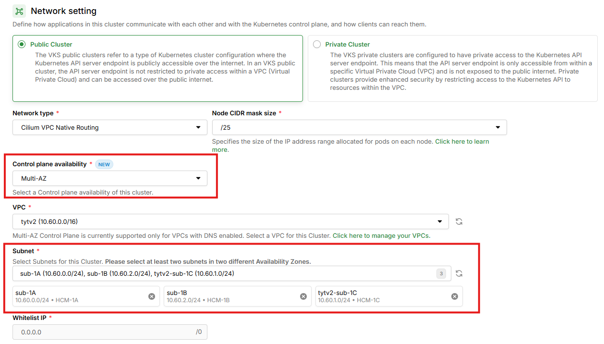
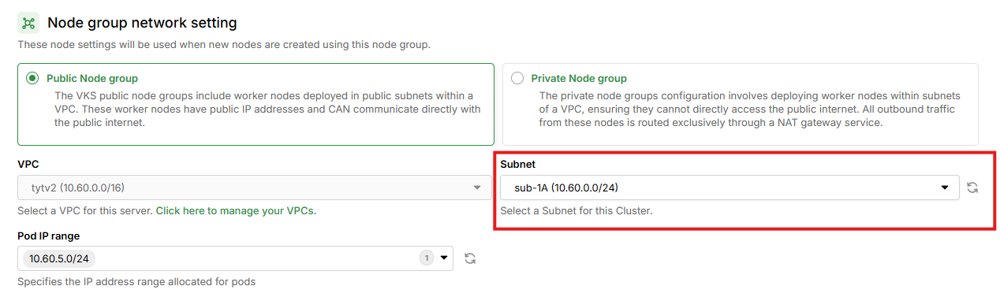

# Khởi tạo một Multi-AZ Cluster

Multi-AZ Cluster cho phép triển khai Control Plane trên nhiều Availability Zones, đảm bảo **High Availability** cho cluster của bạn. Khi một AZ gặp sự cố, Control Plane vẫn hoạt động bình thường từ các AZ còn lại mà không cần can thiệp thủ công.

Để tìm hiểu thêm về khái niệm, kiến trúc và so sánh giữa Single-AZ và Multi-AZ, vui lòng tham khảo tại [Multi-AZ Control Plane](../clusters/multi-az-control-plane.md).

***

## Điều kiện cần

Để khởi tạo một Multi-AZ Cluster, bạn cần đảm bảo các điều kiện sau:

### 1. VPC phải bật DNS


**Quan trọng:**

Multi-AZ Control Plane **chỉ hỗ trợ VPC đã bật DNS**. Nếu VPC chưa bật DNS, VPC đó sẽ **không hiển thị** trong dropdown khi tạo Multi-AZ Cluster.


Để bật DNS cho VPC, vui lòng thực hiện tại portal vServer theo hướng dẫn tại [đây](../../vserver/compute-hcm03-1a/network/virtual-private-cloud-vpc/).

### 2. Chuẩn bị Subnets

* **Tối thiểu 2 subnets** từ **2 Availability Zone khác nhau**
* Tất cả subnets phải thuộc **cùng một VPC**
* Các subnets phải ở trạng thái **ACTIVE**

Ví dụ cấu hình subnets hợp lệ:

| Subnet Name | AZ | CIDR | Hợp lệ? |
| --- | --- | --- | --- |
| sub-1A | HCM-1A | 10.60.0.0/24 | ✅ |
| sub-1B | HCM-1B | 10.60.1.0/24 | ✅ |

Ví dụ cấu hình subnets **không** hợp lệ:

| Subnet Name | AZ | CIDR | Lý do không hợp lệ |
| --- | --- | --- | --- |
| sub-1A | HCM-1A | 10.60.0.0/24 | ❌ Cùng AZ |
| sub-2A | HCM-1A | 10.60.3.0/24 | ❌ Cùng AZ |

### 3. Các điều kiện khác

* Có ít nhất 1 **VPC** và 1 **Subnet** đang ở trạng thái **ACTIVE**. Nếu bạn chưa có VPC, Subnet nào, vui lòng khởi tạo VPC, Subnet theo hướng dẫn tại [đây.](../../vserver/compute-hcm03-1a/network/virtual-private-cloud-vpc/)
* Có ít nhất 1 **SSH key** đang ở trạng thái **ACTIVE**. Nếu bạn chưa có SSH key, vui lòng khởi tạo theo hướng dẫn tại [đây.](../../vserver/compute-hcm03-1a/security/ssh-key-bo-khoa.md)
* Đã cài đặt và cấu hình **kubectl** trên thiết bị của bạn. Vui lòng tham khảo tại [đây](https://kubernetes.io/vi/docs/tasks/tools/install-kubectl/) nếu bạn chưa rõ cách cài đặt và sử dụng kubectl. Ngoài ra, bạn không nên sử dụng phiên bản kubectl quá cũ, chúng tôi khuyến cáo bạn nên sử dụng phiên bản kubectl sai lệch không quá một phiên bản với version của cluster.

***

## Khởi tạo Cluster

Để khởi tạo một Multi-AZ Cluster, hãy làm theo các bước bên dưới:

**Bước 1:** Truy cập vào [https://vks.console.vngcloud.vn/overview](https://vks.console.vngcloud.vn/overview)

**Bước 2:** Tại màn hình **Overview**, chọn **Activate.**

**Bước 3:** Chờ đợi tới khi chúng tôi khởi tạo thành công tài khoản VKS của bạn. Sau khi Activate thành công, bạn hãy chọn **Create a Cluster.**

**Bước 4:** Tại màn hình khởi tạo Cluster, cấu hình thông tin cho **Cluster Configuration**:

* Cluster Information:
  * **Cluster Name:** Tên cho Cluster của bạn. Tên chỉ có thể chứa các ký tự chữ và số (a-z, A-Z, 0-9, '\_', '-'). Độ dài dữ liệu đầu vào của bạn phải từ 5 đến 50. Tên phải là duy nhất trong Khu vực và tài khoản GreenNode mà bạn đang tạo Cluster.
  * **Kubernetes Version:** Phiên bản Kubernetes sẽ sử dụng cho Cluster của bạn. Chúng tôi khuyên bạn nên chọn phiên bản mới nhất, trừ khi bạn cần phiên bản cũ hơn.
  * **Description:** Nhập vào thông tin bạn muốn ghi chú cho Cluster nhằm tạo dấu hiệu riêng cho việc quản lý chúng dễ dàng hơn trong tương lai.

<figure><figcaption><p>Cluster Information</p></figcaption></figure>

**Bước 5:** Cấu hình **Network Setting** — đây là bước quan trọng nhất để tạo Multi-AZ Cluster:

* **Control Plane Availability:** Chọn **Multi-AZ** để triển khai Control Plane trên nhiều Availability Zone.

<figure><figcaption><p>Control Plane Availability selection</p></figcaption></figure>

  Có 2 lựa chọn:

  | Option | Mô tả |
  | --- | --- |
  | **Single-AZ** (mặc định) | Triển khai cluster trong một Availability Zone. Phù hợp cho môi trường development và testing. |
  | **Multi-AZ** | Triển khai cluster trên nhiều Availability Zones để đảm bảo High Availability. Khuyến nghị cho production. |

* **Network type:** Lựa chọn loại network mà bạn mong muốn sử dụng cho Cluster. Hiện tại, VKS cung cấp cho bạn chọn sử dụng 1 trong 3 loại network Calico Overlay, Cilium Overlay, Cilium VPC Native Routing.
  * Đối với loại network **Calico Overlay, Cilium Overlay**: Encapsulation Mode được tự chọn mặc định bởi hệ thống và bạn không thể thay đổi. Bạn có thể nhập lại thông số **CIDR** (dải mạng ảo mà các pod sẽ sử dụng).
  * Đối với loại network **Cilium VPC Native Routing**: Khi chọn loại network này, trường **Node CIDR mask size** sẽ xuất hiện ngay tại phần Network Setting. Thông số này cho biết kích thước CIDR dành cho mỗi node, quyết định số lượng địa chỉ IP từ dải Pod IP range có thể cấp phát cho node đó. Bạn cần lựa chọn một giá trị phù hợp với nhu cầu của bạn.

<figure><figcaption><p>Network Setting khi chọn Cilium VPC Native Routing: Node CIDR mask size xuất hiện</p></figcaption></figure>


**Lưu ý về Cilium VPC Native Routing và Multi-AZ:**

Khi chọn **Cilium VPC Native Routing** kết hợp với **Multi-AZ**, trường **Pod IP range** (Default Pod IP range) sẽ **không nằm** ở phần Network Setting mà được chuyển xuống phần **Node Group Network Setting** (Bước 7). Điều này cho phép mỗi Node Group tại mỗi AZ có thể cấu hình Pod IP range riêng.


* **VPC:** Chọn VPC đã **bật DNS** từ dropdown. Lưu ý: khi chọn Multi-AZ, **chỉ các VPC đã bật DNS mới hiển thị**. Nếu bạn không thấy VPC nào trong danh sách, vui lòng bật DNS cho VPC tại portal vServer.

* **Subnets:** Khi chọn **Multi-AZ**, trường Subnet thay đổi thành dạng **multi-select dropdown**, cho phép bạn chọn nhiều subnets:

  * Hệ thống sẽ **tự động chọn sẵn 1 subnet đầu tiên của mỗi AZ** có trong VPC. Ví dụ: Nếu VPC có subnets ở HCM-1A, HCM-1B, HCM-1C → Mặc định chọn sẵn 3 subnets (1 subnet/zone).
  * Các subnet đã chọn hiển thị dạng **chip/tag**. Click nút **(x)** trên chip để xóa subnet khỏi danh sách đã chọn.
  * Bạn có thể thêm/bớt subnet nhưng phải đảm bảo **tối thiểu 2 subnets từ 2 AZ khác nhau**.

<figure><figcaption><p>Network Setting cho Multi-AZ Cluster: VPC, Subnets multi-select và subnet chips</p></figcaption></figure>


**Validation Rules:**

* Tối thiểu **2 subnets** phải được chọn
* Các subnets phải thuộc **ít nhất 2 AZ khác nhau**
* Nếu chọn 2 subnet cùng AZ, hệ thống sẽ hiển thị lỗi: *"Các subnet phải thuộc ít nhất 2 Availability Zone khác nhau"*


**Bước 6:** Cấu hình **Default Node Group Configuration**:

* Node Group Information:
  * **Node Group Name**: Tên gợi nhớ cho Node Group của bạn.
  * **Number of nodes:** Nhập vào số lượng Worker node cho Cluster của bạn, lưu ý số lượng node cần lớn hơn hoặc bằng 1 và nhỏ hơn hoặc bằng 100.
* Node Group Automation Setting:
  * **Auto Healing:** Mặc định chúng tôi sẽ bật tính năng HA trong Cluster của bạn.
  * **Auto Scaling:** Bật tính năng tự động mở rộng trong Cluster của bạn.
    * **Minimum node**: số node tối thiểu mà Cluster cần có.
    * **Maximum node**: số node tối đa mà Cluster có thể scale tới.
  * **Node Group upgrade strategy:** Chiến lược upgrade Node Group thông qua phương thức **Surge upgrade**.
    * **Max surge:** giới hạn số lượng node được nâng cấp đồng thời. Mặc định **Max surge = 1**.
    * **Max unavailable**: giới hạn số lượng node không thể truy cập trong quá trình nâng cấp. Mặc định **Max unavailable = 0**.
* Node Group Setting:
  * **Image**: mặc định chúng tôi cung cấp 1 loại Image là Ubuntu with containerd.
  * **Instance type**: chọn loại phiên bản cấu hình phù hợp cho Worker node theo nhu cầu sử dụng của bạn.
* Node Group Volume Setting: **Cấu hình Boot Volume** – Các thông số được cài đặt mặc định bởi hệ thống giúp tối ưu cho Cluster của bạn.

**Bước 7:** Cấu hình **Node Group Network Setting** — đây là phần khác biệt so với Single-AZ Cluster:

<figure><figcaption><p>Node Group Network Setting for Multi-AZ Cluster</p></figcaption></figure>

* Bạn có thể lựa chọn **Public Node Group** hoặc **Private Node Group** tùy theo nhu cầu sử dụng Cluster của bạn.
* **VPC:** Kế thừa từ Network Configuration (read-only, không thể thay đổi).
* **Subnet:** Dropdown single-select, **chỉ hiển thị các subnets đã chọn cho cluster ở Bước 5**. Mỗi Node Group chỉ được chọn **1 subnet** (tương ứng với 1 AZ).
* **Pod IP range** *(chỉ hiển thị khi Network type = Cilium VPC Native Routing)*: Dải địa chỉ IP thứ cấp (Secondary IP range) được sử dụng để cấp phát IP cho các pod trên Node Group này. Bạn cần lựa chọn ít nhất 1 dải Secondary IP range đã tạo từ vServer.

<figure><figcaption><p>Node Group Network Setting khi chọn Cilium VPC Native Routing: Pod IP range xuất hiện</p></figcaption></figure>


**Lưu ý:**

* AZ của Node Group được xác định tự động dựa trên subnet đã chọn.
* Bạn có thể tạo thêm Node Group ở các AZ khác sau khi cluster được tạo.
* Để đảm bảo High Availability cho workloads, bạn nên tạo nhiều Node Group ở các AZ khác nhau. Điều này giúp phân bổ worker nodes trên nhiều AZ, tăng khả năng chịu lỗi cho ứng dụng.
* Khi sử dụng **Cilium VPC Native Routing**, mỗi Node Group có thể chọn **Pod IP range riêng**, phù hợp với việc phân bổ tài nguyên mạng theo từng AZ.


* Node Group Security Setting: Bạn có thể chọn **Security Group và SSH Key** cho Node Group của bạn.
* Node Group Metadata Setting: Bạn có thể nhập **Metadata** tương ứng cho Node Group.

**Bước 8:** Cấu hình **Plugin**:

* **Enable BlockStore Persistent Disk CSI Driver**: bật để chúng tôi tự động cài đặt CSI Controller trên Cluster của bạn.
* **Enable vLB Native Integration Driver**: bật để chúng tôi tự động cài đặt LB Controller trên Cluster của bạn.

**Bước 9:** Chọn **Create Kubernetes cluster.** Hãy chờ vài phút để chúng tôi khởi tạo Cluster của bạn, trạng thái của Cluster lúc này là **Creating**.

<figure><figcaption><p>Cluster đang được khởi tạo</p></figcaption></figure>

**Bước 10:** Khi trạng thái **Cluster** là **Active**, bạn có thể xem thông tin Cluster, thông tin Node Group bằng cách chọn vào Cluster Name tại cột **Name**. Tại cột **Control Plane Availability**, bạn sẽ thấy badge **Multi-AZ** xác nhận cluster đã được tạo đúng cấu hình.

<figure><figcaption><p>Cluster Active với badge Multi-AZ</p></figcaption></figure>

***

## Private Service Endpoint

Multi-AZ Cluster hoạt động trên **luồng private**. Khi bạn tạo Multi-AZ Cluster, hệ thống sẽ tự động tạo **4 Private Service Endpoints** giúp các nodes trong cluster kết nối private tới các dịch vụ khác trên GreenNode:

| Endpoint | Dịch vụ kết nối | Mục đích |
| --- | --- | --- |
| **vks-iam-endpoint-...** | IAM | Xác thực và phân quyền |
| **vks-vcr-endpoint-...** | vContainer Registry (vCR) | Pull/push container images |
| **vks-vserver-endpoint-...** | vServer | Quản lý compute resources |
| **vks-vstorage-endpoint-...** | vStorage | Kết nối tới object storage |

Bạn có thể xem thông tin 4 private service endpoint thông qua portal vServer theo đường dẫn tại [đây](https://hcm-3.console.vngcloud.vn/vserver/vnetwork/endpoint/list).


**Lưu ý quan trọng về Private Service Endpoint:**

* **Không xóa Private Service Endpoint**: Để đảm bảo hoạt động ổn định của cluster, bạn không nên xóa 4 service endpoint đã được tạo sẵn. Nếu vô tình xóa hoặc chỉnh sửa 4 endpoint này, trong vòng tối đa 5 phút, hệ thống sẽ tự động tạo lại nhưng có thể gây gián đoạn đến các dịch vụ đang chạy. Lúc này, do service endpoint tạo lại có thể đã thay đổi Endpoint IP so với ban đầu nên để cluster hoạt động được, bạn cần thực hiện thêm Endpoint IP một cách thủ công cho những server đang chạy trước đó thông qua câu lệnh:

    ```
    vks-bootstraper add-host -i <IP> -d <DOMAIN>
    ```

    Ví dụ,

    *   Nếu bạn xóa private service endpoint tại **Region HCM** thì bạn cần add host qua lệnh:

        ```
        vks-boostraper add-host -i 192.168.1.9 -d vcr.vngcloud.vn
        vks-boostraper add-host -i 192.168.1.8 -d hcm-3.api.vngcloud.vn
        vks-boostraper add-host -i 192.168.1.5 -d iamapis.vngcloud.vn
        vks-boostraper add-host -i 192.168.1.7 -d hcm03.vstorage.vngcloud.vn
        ```
    *   Nếu bạn xóa private service endpoint tại **Region HAN** thì bạn cần add host qua lệnh:

        ```
        vks-boostraper add-host -i 192.168.1.9 -d vcr-han.vngcloud.vn
        vks-boostraper add-host -i 192.168.1.8 -d han-1.api.vngcloud.vn
        vks-boostraper add-host -i 192.168.1.5 -d iamapis.vngcloud.vn
        vks-boostraper add-host -i 192.168.1.7 -d han02.vstorage.vngcloud.vn
        ```

* **Tái sử dụng Private Service Endpoint:** Các service endpoint có thể được nhiều private cluster / Multi-AZ cluster cùng sử dụng. Khi các cluster chung VPC thì chúng tôi sẽ tái sử dụng chúng.
* **Xóa Private Service Endpoint tự động:** Khi bạn xóa cluster, nếu không còn cluster nào tái sử dụng các service endpoint này, hệ thống sẽ tự động xóa chúng.
* **Chi phí Multi-AZ Control Plane:** Trong giai đoạn đầu release, tính năng Multi-AZ Control Plane được cung cấp **miễn phí**. Chi phí chính thức sẽ được cập nhật trong thời gian tới. Lưu ý: việc sử dụng Multi-AZ Cluster sẽ phát sinh thêm chi phí cho 4 Private Service Endpoints.


***

## Container Registry (vCR)

Do Multi-AZ Cluster hoạt động trên luồng private, các nodes trong cluster **chỉ có thể kết nối private** tới hệ thống vContainer Registry (vCR) và **không thể kết nối** ra các Container Registry khác ngoài internet (Docker Hub, ghcr.io, quay.io...).

Bạn cần pull/push image về vCR để sử dụng. Tham khảo hướng dẫn chi tiết tại phần [Sử dụng Docker để Pull/Push image](khoi-tao-mot-private-cluster.md#khoitaomotpublicclustervoiprivatenodegroup-deploymotworkload) trong tài liệu Private Cluster.


**Lưu ý:**

Trên VKS, tại mỗi Region HCM hay HAN, domain của vCR để pull/push image khác nhau:
* **Với Region HCM**: dùng domain `vcr.vngcloud.vn`
* **Với Region HAN**: dùng domain `vcr-han.vngcloud.vn`


***

## Kết nối và kiểm tra thông tin Cluster vừa tạo


**Quan trọng:**

Do Multi-AZ Cluster hoạt động trên luồng private, để truy cập vào **kube-api** của Control Plane, bạn cần **đứng trong VPC** mà bạn đã chọn sử dụng cho Cluster. Nếu bạn không đứng trong VPC, bạn sẽ không thể kết nối tới kube-api và nhận được lỗi `Unable to connect to the server`.


Sau khi Cluster được khởi tạo thành công, bạn có thể thực hiện kết nối và kiểm tra thông tin Cluster vừa tạo theo các bước:

**Bước 1:** Truy cập vào [https://vks.console.vngcloud.vn/k8s-cluster](https://vks.console.vngcloud.vn/k8s-cluster)

**Bước 2:** Danh sách Cluster được hiển thị, chọn biểu tượng **Download** và chọn **Download config file** để thực hiện tải xuống file kubeconfig. File này sẽ giúp bạn có toàn quyền truy cập vào Cluster của bạn.

**Bước 3:** Đổi tên file này thành config và lưu nó vào thư mục **\~/.kube/config**

**Bước 4:** Thực hiện kiểm tra Cluster thông qua lệnh:

* Chạy câu lệnh sau đây để kiểm tra **node**

```
kubectl get nodes -o wide
```

* Nếu kết quả trả về tương tự bên dưới tức là Cluster của bạn đã được khởi tạo thành công:

```
NAME                                            STATUS   ROLES    AGE     VERSION   INTERNAL-IP   EXTERNAL-IP
vks-multi-az-cluster-nodegroup-1a-abc123        Ready    <none>   5m      v1.30.1   10.60.0.10    <none>
```

* Chạy câu lệnh sau đây để kiểm tra **service**

```
kubectl get svc
```

* Kết quả trả về tương tự sau:

```
NAME         TYPE        CLUSTER-IP   EXTERNAL-IP   PORT(S)   AGE
kubernetes   ClusterIP   10.96.0.1    <none>        443/TCP   10m
```


**Bước tiếp theo:**

* Để đảm bảo High Availability cho workloads, bạn nên **tạo thêm Node Group ở các AZ khác**. Tham khảo hướng dẫn quản lý Node Group tại [đây](../node-groups/).
* Để tìm hiểu thêm về quản lý, upgrade và xóa Multi-AZ Cluster, vui lòng tham khảo tại [Multi-AZ Control Plane](../clusters/multi-az-control-plane.md).

