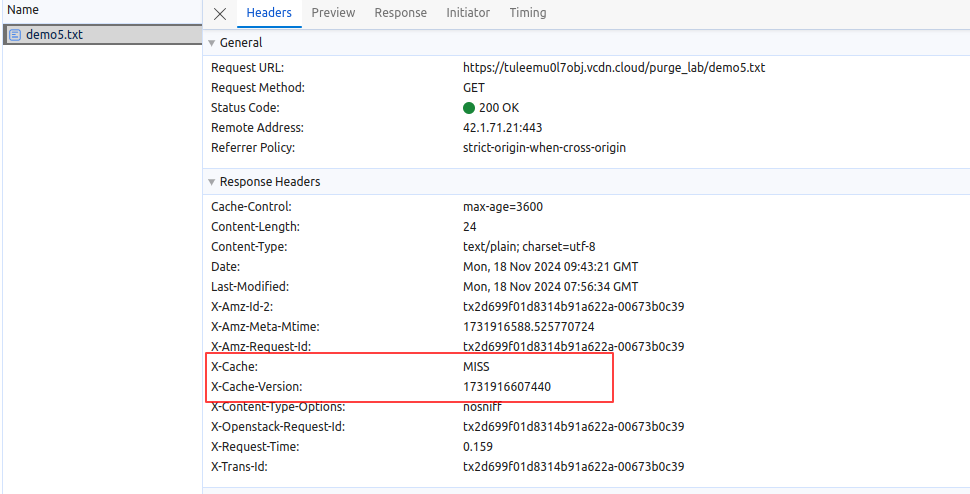
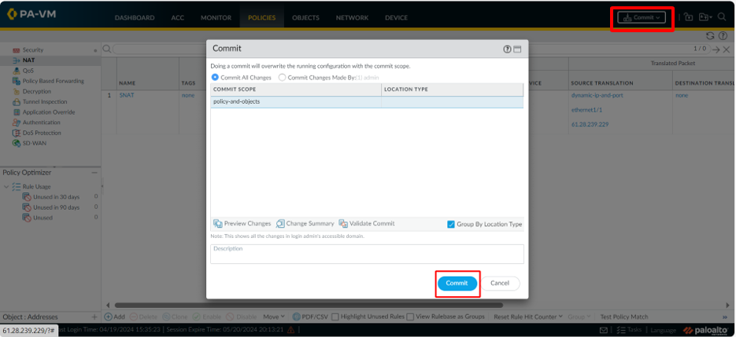
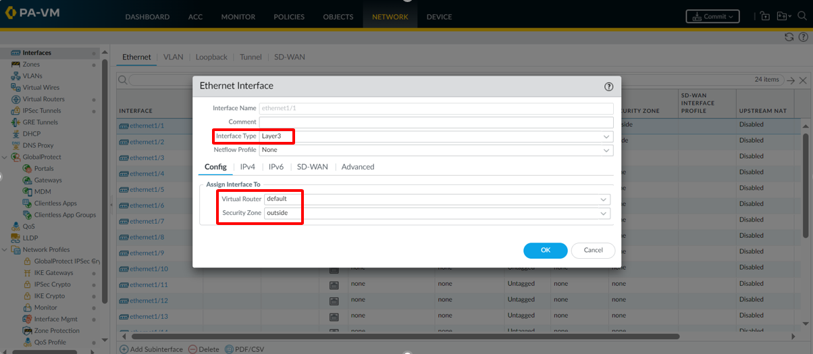
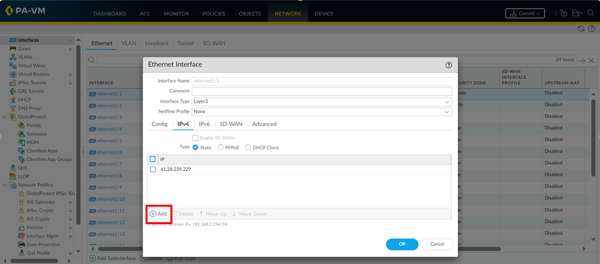
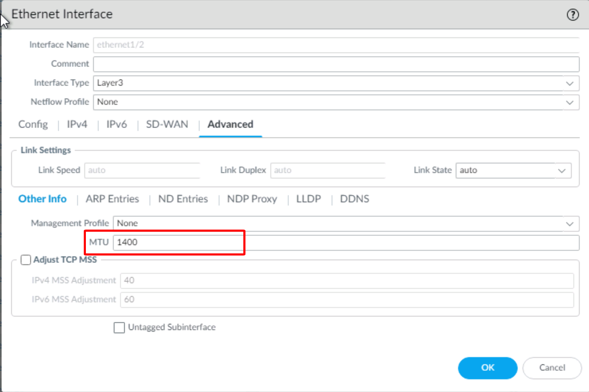
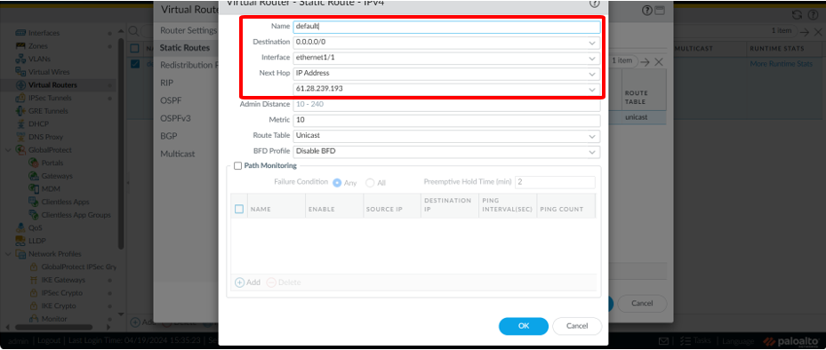
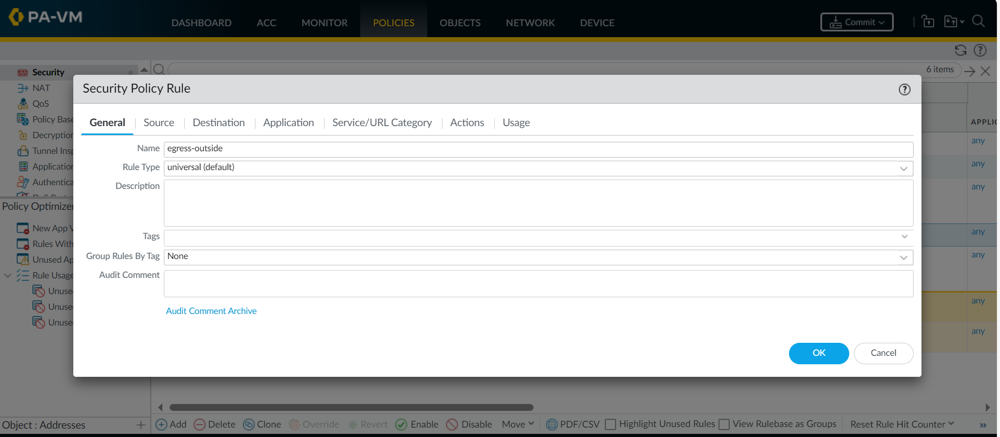

# Palo Alto as a NAT Gateway

Để làm việc với Private Node group, bạn có thể chọn sử dụng Palo Alto hoặc Pfsense làm NAT Gateway .Cụ thể:

## Khởi tạo Palo Alto trên vMarketplace 

**Bước 1:** Truy cập vào [https://marketplace.console.vngcloud.vn/](https://marketplace.console.vngcloud.vn/)

**Bước 2:** Tại màn hình chính, thực hiện tìm kiếm **Palo Alto**, tại dịch vụ **Palo Alto**, chọn **Launch**.

**Bước 3:** Lúc này, bạn cần thiết lập cấu hình cho **Palo Alto.** Cụ thể, bạn có thể chọn **Volume, IOPS, Network, Security Group** mong muốn. **Bạn cần lựa chọn VPC và Subnet giống với VPC và Subnet mà bạn lựa chọn sử dụng cho Cluster của bạn.** Ngoài ra bạn cũng cần chọn Một Server Group đã tồn tại hoặc chọn **Dedicated SOFT ANTI AFFINITY group** để chúng tôi tự động tạo một server group mới.

**Bước 4:** Tiến hành thanh toán như các tài nguyên bình thường trên VNG Cloud.&#x20;

***

## Truy cập vào GUI Palo Alto 

**Bước 1:** Sau khi khởi tạo Palo Alto từ vMarketPlace theo hướng dẫn bên trên, bạn có thể truy cập vào giao diện vServer tại [đây](https://hcm-3.console.vngcloud.vn/vserver/v-server/cloud-server) để kiểm tra server chạy Palo Alto đã được khởi tạo xong chưa.

**Bước 2: Sau khi server chạy Palo Alto được khởi tạo thành công, bạn cần truy cập vào** . Để vào GUI của Palo Alto khách hàng cần có 1 vServer chạy Windows. Sau đó khách hàng truy cập vào bằng IP Internal Interface với tên đăng nhập và mật khẩu mặc định là: admin/admin

Lưu ý: Về phần Network của vServer Windows để truy cập vào GUI của Palo Alto. Khách hàng cần tạo cùng VPC và sử dụng subnet khác với subnet có priority là 1 khi khởi tạo Palo Alto

**Bước 3**: Sau khi đăng nhập xong, bạn cần thực hiện thay đổi mật khẩu lần đầu. Hãy nhập mật khẩu mới theo mong muốn của bạn.

**Bước 4:** Bạn cần tiến hành khởi tạo 1 Zone Inside và 1 Zone Outside theo hướng dẫn bên dưới:

* Chọn bút **Add**

* Đặt tên cho **Zone**: **Inside** sau đó chọn **OK**

* Làm tương tự đối với **Zone Outside**

**Bước 5**: Cấu hình cho **External Interface**

* Interface Type: **Layer 3**
* Virtual Router: **default**
* Security Zone: **Outside**

* Chuyển sang **Tab IPv4** và chọn **Add** để nhập **Static IP** cho **External Interface**

* Để lấy thông tin IP này khách hàng vào phần **Network Interface** của **Palo Alto** để xem thông tin

* Chuyển sang tab **Advanced**, ở phần **MTU** bạn cần chỉnh thành **1400**

**Bước 6:** Thực hiện cấu hình tương tự cho các **Internal Interface**

* Tại tab **IPv4:** khách hàng tiến hành thiết lập **Static IP**

* Chuyển sang tab **Advanced**, ở phần **MTU** bạn chỉnh thành 1400

**Bước 7:** Tạo static route

* Vào phần Network -> Virtual Routers-> Chọn default-> Chuyển sang mục Static Routes

* Thực hiện tạo 1 route như hình bên dưới

Bước 8: Tạo Security Policy Rule

* Vào phần Policies -> Security ->Add
* Tại tab General, khách hàng cần đặt tên cho rule

* Tại tab Source, thiết lập các thông tin như Source Zone, Source Address, Source User, Source Device

* Tại tab Destination, thiết lập các thông tin như Destination Zone, Destination Address, Destination Device

* Tại tab Application, thiết lập các thông tin như Application, Depend On

* Tại tab **Service/URL Category**, thiết lập các thông tin như Service, URL Category

* Tại tab **Actions**, thiết lập các thông tin như Action, Log, Profile, Other Settings

Bước 9: Tạo rule NAT để các vServer có thể đi ra Internet

* Vào phần Policies -> NAT -> Add
* Tại tab General đặt tên cho NAT rule
* Tại tab Original Packet chọn Source Zone, Destination Zone, Destination Interface, Service, Source Address, Destination Address
* Tạo tab Translated Packet thực hiện cấu hình như hình bên dưới

Lưu ý: Cần thay đổi IP Address thành địa chỉ Static IP mà khách hàng đã cấu hình ở bước 5

Bước 10: Tiến hành Commit

Bước 11: Cấu hình Route Table trên portal VNG Cloud

Bước 12: Tiến hành ping 8.8.8.8 hoặc google.com

### &#x20;
