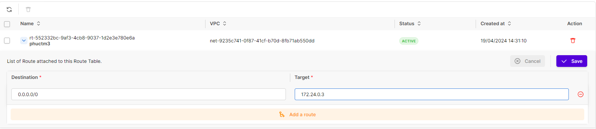

# Pfsense as a NAT Gateway

Sử dụng hướng dẫn bên dưới dể làm việc với Private Node group thông qua Pfsense

## Điều kiện cần

Để có thể sử dụng Pfsense làm NAT Gateway cho Cluster trên hệ thống VKS, bạn cần có:

* Một **server (VM) Pfsense** được khởi tạo trên hệ thống **vMarketPlace** theo hướng dẫn bên dưới với cấu hình như sau:

| Item                 | Cấu hình     |
| -------------------- | ------------ |
| Flavor               | 2x4          |
| Volume               | 80 GB        |
| VPC                  | 10.3.0.0/16  |
| Network Interface 1  | 10.3.0.3     |

***

## Khởi tạo Pfsense

**Bước 1:** Truy cập vào [https://marketplace.console.vngcloud.vn/](https://marketplace.console.vngcloud.vn/)

**Bước 2:** Tại màn hình chính, thực hiện tìm kiếm **Pfsense**, tại dịch vụ **Pfsense**, chọn **Launch**.

**Bước 3:** Lúc này, bạn cần thiết lập cấu hình cho **Pfsense.** Cụ thể, bạn có thể chọn **Volume, IOPS, Network, Security Group** mong muốn. **Bạn cần lựa chọn VPC và Subnet giống với VPC và Subnet mà bạn lựa chọn sử dụng cho Cluster của bạn.** Ngoài ra bạn cũng cần chọn Một Server Group đã tồn tại hoặc chọn **Dedicated SOFT ANTI AFFINITY group** để chúng tôi tự động tạo một server group mới.

**Bước 4:** Tiến hành thanh toán như các tài nguyên bình thường trên VNG Cloud.&#x20;

***

## Cấu hình thông số cho Pfsense 

**Bước 1:** Sau khi khởi tạo Pfsense từ vMarketPlace theo hướng dẫn bên trên, bạn có thể truy cập vào giao diện vServer tại [đây](https://hcm-3.console.vngcloud.vn/vserver/v-server/cloud-server) để kiểm tra server chạy Pfsense đã được khởi tạo xong chưa. <mark style="color:red;">**Tiếp theo, bạn mở rule Any trên Security Group cho server Pfsense vừa tạo. Việc mở rule Any trên Security Group sẽ cho phép tất cả lưu lượng truy cập đến server Pfsense.**</mark>

<figure><figcaption></figcaption></figure>

**Bước 2: Sau khi server chạy Pfsense được khởi tạo thành công**. Để vào GUI của Pfsense, bạn cần sử dụng địa chỉ IP của External Interface đăng nhập với Tên đăng nhập và mật khẩu mặc định là **admin/pfsense.**&#x20;

<figure><figcaption></figcaption></figure>

* Để lấy thông tin IP này, bạn vào phần **Network Interface** của **Pfsense** để xem thông tin

<figure><figcaption></figcaption></figure>

**Bước 3**: Mở **rule** trên **firewall**

* Tiến hành **Add rule**

<figure><figcaption></figcaption></figure>

* Bạn có thể mở rule như bên dưới để truy cập vào GUI bằng **External Interface**.


**Chú ý:**

* Bạn nên giới hạn lại Range IP được phép kết nối tới GUI Pfsense để hạn chế user được phép truy cập vào GUI Pfsense


<figure><figcaption></figcaption></figure>

* Chọn **Save**
* Sau đó chọn **Apply change**

**Bước 4**: Tiến hành **General Setup**, bạn vui lòng thực hiện như bên dưới

<figure><figcaption></figcaption></figure>

<figure><figcaption></figcaption></figure>

<figure><figcaption></figcaption></figure>

<figure><figcaption></figcaption></figure>

* Cấu hình cho **WAN Interface**

<figure><figcaption></figcaption></figure>

* Thay đổi **password** vào **GUI**

<figure><figcaption></figcaption></figure>

* Tiến hành **reload**

<figure><figcaption></figcaption></figure>

* Đã hoàn thành **General Setup**

<figure><figcaption></figcaption></figure>

**Bước 5:** Cấu hình **Interface LAN**

* Vào phần **Interfaces** -> **Assignments** để gắn thêm **Interface LAN**

<figure><figcaption></figcaption></figure>

* Nhấn vào **Add**

<figure><figcaption></figcaption></figure>

* Sau đó nhấn vào **Save**

<figure><figcaption></figcaption></figure>

* Vào phần **Interfaces** -> **Assignments** để tiến hành **enable LAN Interface**

<figure><figcaption></figcaption></figure>

* Bạn thực hiện cấu hình như bên dưới

<figure><figcaption></figcaption></figure>

* Cấu hình **IP** cho **LAN**

<figure><figcaption></figcaption></figure>

* Sau đó tiến hành **Add a new gateway:** tiến hành nhập **Gateway cho LAN Interface**

<figure><figcaption></figcaption></figure>

* Để lấy thông tin IP này, bạn vào mục **Network Interface** của server Pfsense để xem thông tin:

<figure><figcaption></figcaption></figure>

* Tiến hành **Save** lại

<figure><figcaption></figcaption></figure>

**Bước 6**: Xem lại thông tin cấu hình

<figure><figcaption></figcaption></figure>

**Bước 7**: Mở rule đi ra **Internet** cho **interface LAN**

<figure><figcaption></figcaption></figure>

* Tại source bạn chọn dải **IP** được phép đi ra **Internet**

<figure><figcaption></figcaption></figure>

**Bước 8:** Cấu hình **NAT** để các **vServer** có thể đi ra được **Internet**

* Vào mục **Firewall** -> **NAT**

<figure><figcaption></figcaption></figure>

* Chọn mode **NAT** sau đó tiến hành cấu hình **NAT**

<figure><figcaption></figcaption></figure>

* Nhấn vào **Add** để thêm **rule**

<figure><figcaption></figcaption></figure>

* Chọn **source**, **destination NAT**

<figure><figcaption></figcaption></figure>

***

## Khởi tạo Route Table 

Sau khi Pfsense được khởi tạo và cấu hình thành công, bạn cần tạo một Route table để kết nối tới các mạng khác nhau. Cụ thể thực hiện theo các bước sau để tạo Route table:

**Bước 1:** Truy cập vào [https://hcm-3.console.vngcloud.vn/vserver/network/route-table](https://hcm-3.console.vngcloud.vn/vserver/network/route-table)

**Bước 2:** Tại thanh menu điều hướng, chọn **Tab Network/ Route table.**

**Bước 3:** Chọn **Create Route table.**&#x20;

**Bước 4:** Nhập tên mô tả cho Route table. Tên Route table có thể bao gồm các chữ cái (a-z, A-Z, 0-9, '\_', '-'). Độ dài dữ liệu đầu vào nằm trong khoảng từ 5 đến 50. Nó không được bao gồm khoảng trắng ở đầu hoặc ở cuối.

**Bước 5:** Chọn **VPC** cho Route table của bạn, nếu chưa có VPC cần tạo mới một VPC theo hướng dẫn tại [Trang VPC](https://docs.vngcloud.vn/pages/viewpage.action?pageId=49648039). **VPC sử dụng để thiết lập Route table phải là VPC được chọn sử dụng cho Pfsense và Cluster của bạn.**

**Bước 6**: Chọn **Create** để tạo mới Route table.

**Bước 7:** Chọn tại Route table vừa tạo sau đó chọn **Edit Routes.**

**Bước 8:** Tại phần thêm mới **Route** hãy nhập vào các thông tin:&#x20;

* Đối với Destination, hãy nhập **Destination CIDR là 0.0.0.0/0**
* Đối với Target, hãy nhập **Target CIDR là địa chỉ IP Network Interface 2 của Pfsense.**

Ví dụ:

<figure><figcaption></figcaption></figure>

***

## **Kiểm tra kết nối**

Tiến hành ping google.com hoặc 8.8.8.8 để kiểm tra

* Trước khi **Enable NAT** server không ra được internet

<figure><figcaption></figcaption></figure>

* Sau khi **cấu hình NAT** tiến hành ping 8.8.8.8 để kiểm tra

<figure><figcaption></figcaption></figure>
