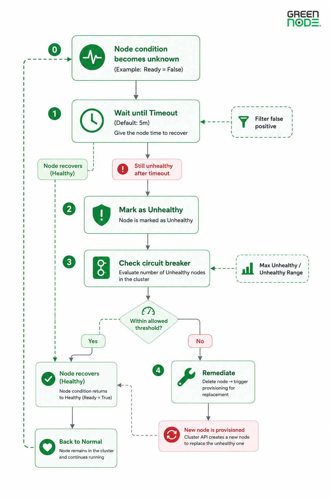
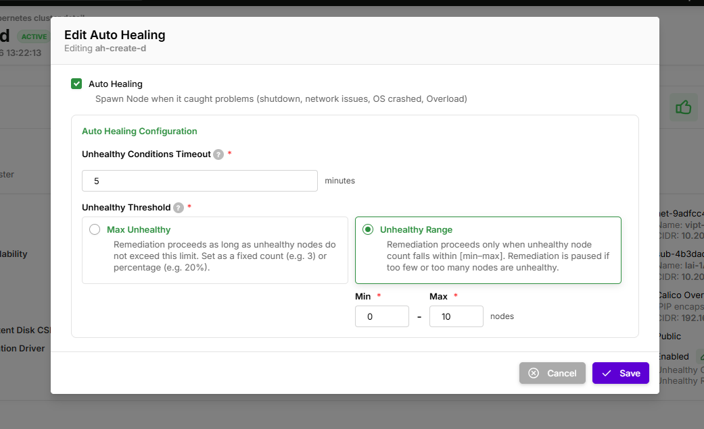

# Auto Healing

---

## 1. Tổng quan

**Auto Healing** là tính năng tự động theo dõi tình trạng các worker node trong cluster. Khi một node rơi vào trạng thái **unhealthy** (mất kết nối, node bị treo, không phản hồi, NotReady kéo dài...), hệ thống sẽ tự động **xóa node lỗi và tạo node mới thay thế** — toàn bộ quy trình không cần thao tác thủ công.

VKS cho phép người dùng tùy chỉnh một số thông số Auto Healing qua Portal: bật/tắt, ngưỡng phát hiện node lỗi, và giới hạn an toàn để bảo vệ cluster.


**Lưu ý cho account IAM-user:**

Trước khi thao tác cấu hình Auto Healing, account IAM-user cần được cấp đầy đủ quyền dưới đây (admin nên cấp một lần trước khi sử dụng):


| Quyền                      | Mục đích                          | Dùng tại bước                                          |
| -------------------------- | --------------------------------- | ------------------------------------------------------ |
| `UpdateAutoHealingConfig`  | Cập nhật cấu hình Auto Healing    | Tạo cluster mới / Cập nhật cluster đang hoạt động      |

---

## 2. Điểm nổi bật

- **Hoạt động 24/7, không cần can thiệp thủ công.** Node lỗi được tự động phát hiện và thay thế kể cả ngoài giờ làm việc.
- **Bật/tắt linh hoạt.** Có thể tạm tắt khi đang bảo trì hoặc kiểm tra node thủ công, tránh xung đột với thao tác của bạn.
- **Cơ chế bảo vệ cluster.** Khi quá nhiều node lỗi cùng lúc — thường là dấu hiệu sự cố hạ tầng diện rộng — hệ thống tự dừng việc thay thế để tránh xóa hàng loạt và mất sạch capacity.
- **Tránh báo lỗi nhầm.** Node phải duy trì trạng thái lỗi liên tục đủ thời gian (Timeout) mới bị xem là unhealthy, không bị kích hoạt oan khi node chỉ gặp sự cố thoáng qua (mạng chập chờn, dừng tạm thời do thu hồi bộ nhớ...).
- **Hỗ trợ cả node đang khởi động và node đang chạy.** Node mới có mặc định 30 phút (`nodeStartupTimeout`) để sẵn sàng — nếu quá thời gian vẫn chưa lên cũng được xem là cần thay thế.
- **Cấu hình đơn giản, phù hợp mọi quy mô.** Hỗ trợ cả giá trị tuyệt đối (`2`) và phần trăm (`30%`), dùng được từ cluster nhỏ đến production lớn.

---

## 3. Cách hoạt động

<figure><figcaption></figcaption></figure>

---

## 4. Các thông số hỗ trợ cấu hình

VKS cho phép cấu hình 4 thông số sau qua Portal:

### 4.1. Bật/Tắt Auto Healing

**Ý nghĩa:** Công tắc tổng cho toàn bộ tính năng. Khi tắt, hệ thống vẫn theo dõi tình trạng node nhưng **không** tự động thay thế.

**Khi nào nên bật:** Mặc định khuyến nghị cho production và mọi cluster cần độ sẵn sàng cao.

**Khi nào nên tắt:**

- Đang kiểm tra/debug node thủ công, không muốn hệ thống can thiệp.
- Đang trong thời gian bảo trì có kế hoạch: cập nhật node theo cách riêng, đổi cấu hình node, di chuyển workload.
- Môi trường thử nghiệm ngắn hạn, không cần đảm bảo sẵn sàng.


Khi tắt Auto Healing, node lỗi sẽ tồn tại đến khi có người xử lý thủ công. Nhớ bật lại ngay sau khi xong bảo trì — đây là lớp bảo vệ quan trọng nhất cho cluster.


---

### 4.2. Timeout

**Ý nghĩa:** Thời gian một node phải duy trì trạng thái lỗi **liên tục** trước khi bị đánh dấu để thay thế. Cơ chế này lọc các sự cố thoáng qua như mạng chập chờn, mất kết nối ngắn, tạm dừng do thu hồi bộ nhớ, hoặc CPU bị giới hạn tạm thời.

**Khi nào tăng:** Hạ tầng mạng không ổn định, node thường có mất kết nối ngắn rồi tự khôi phục. Tăng Timeout để cho node thêm thời gian tự phục hồi.

**Khi nào giảm:** Cluster production cần phản ứng nhanh với sự cố, chấp nhận rủi ro thay thế node sớm để khôi phục capacity nhanh.

**Khuyến nghị:**

| Trường hợp               | Giá trị                       |
| --------------------------- | ------------------------------- |
| Production tiêu chuẩn     | **5 phút** (mặc định) |
| Hạ tầng không ổn định | 10–15 phút                    |


Khuyến nghị cấu hình thấp nhất 5 phút. Nếu thấp hơn, node có thể chuyển trạng thái lên-xuống (NotReady ↔ Ready trong vài chục giây) vì nhiều lý do hợp lệ — không phải lúc nào cũng là sự cố thực sự. Timeout quá thấp dẫn đến thay thế node không cần thiết, tốn tài nguyên và gây gián đoạn workload.


---

### 4.3. Max Unhealthy

**Ý nghĩa:** Giới hạn số node unhealthy tối đa mà hệ thống vẫn cho phép tự thay thế. Đây là **cơ chế bảo vệ** — khi số node lỗi vượt ngưỡng, việc thay thế sẽ dừng cho toàn bộ cluster.

Lý do: Nhiều node hỏng cùng lúc thường là dấu hiệu sự cố hạ tầng diện rộng (mất mạng toàn cluster, lỗi storage, lỗi cloud provider). Lúc đó việc thay thế hàng loạt không giúp khắc phục nguyên nhân, ngược lại còn làm cluster mất sạch capacity và gián đoạn lâu hơn.

**Khi nào tăng:** Cluster lớn (> 20 node), workload chịu được mất nhiều node cùng lúc.

**Khi nào giảm:** Cluster production quan trọng, mỗi lần thay thế đều có rủi ro gián đoạn ngắn cho pod đang chạy trên node bị xóa.

**Khuyến nghị:**

| Trường hợp                | Giá trị                                             |
| ---------------------------- | ----------------------------------------------------- |
| Cluster nhỏ (≤ 3 node)     | **1**                                           |
| Production tiêu chuẩn      | **40%**                                         |
| Cluster lớn, tự co giãn   | **30%** (phần trăm tự co giãn theo cluster) |
| Cluster ưu tiên ổn định | **1** (thay thế lần lượt từng node)        |

**Ví dụ:**

- Cluster 10 node, `Max Unhealthy = 2`: 1–2 node lỗi → thay thế bình thường. ≥ 3 node lỗi → dừng thay thế, có sự kiện `RemediationRestricted`.
- Cluster 50 node, `Max Unhealthy = 40%`: cho phép thay thế khi ≤ 20 node lỗi.

---

### 4.4. Unhealthy Range

**Ý nghĩa:** Tương tự `Max Unhealthy` nhưng cho phép cấu hình **cả ngưỡng dưới và ngưỡng trên**. Việc thay thế chỉ diễn ra khi số node unhealthy nằm trong khoảng `[min – max]`.

**Điểm khác biệt so với `Max Unhealthy`:**

- **Ngưỡng trên** (`max`): Giống Max Unhealthy — dừng thay thế khi quá nhiều node hỏng.
- **Ngưỡng dưới** (`min`): Bỏ qua việc thay thế khi số node lỗi quá ít — tránh phản ứng quá đà với sự cố lẻ tẻ.

**Khi nào dùng:** Cluster hay có node nhấp nháy lên-xuống, hoặc workload yêu cầu chỉ thay thế khi nhiều node cùng lỗi (1 node lỗi đơn lẻ có thể tự phục hồi).

**Ví dụ:**

Cluster 20 node, `Unhealthy Range = [2-5]`:

- 1 node lỗi → **không** thay thế (có thể chỉ là tạm thời, để node tự khôi phục hoặc kiểm tra thủ công).
- 2–5 node lỗi → thay thế bình thường.
- ≥ 6 node lỗi → dừng thay thế (nghi ngờ sự cố hạ tầng).

**So sánh:**

| Số node unhealthy | `Max Unhealthy = 3`          | `Unhealthy Range = [2-5]`             |
| ------------------ | ------------------------------ | --------------------------------------- |
| 1                  | Thay thế                      | **Bỏ qua** (dưới ngưỡng min) |
| 3                  | Thay thế                      | Thay thế                               |
| 5                  | **Bỏ qua** (vượt max) | Thay thế                               |
| 6                  | Bỏ qua                        | Bỏ qua (vượt max)                    |

---

### Tổng kết các thông số

| Thông số      | Định dạng    | Mặc định | Vai trò                                                     |
| --------------- | --------------- | ----------- | ------------------------------------------------------------ |
| Bật / Tắt     | bật/tắt       | Bật        | Công tắc tổng cho Auto Healing                            |
| Timeout         | phút           | `5 phút` | Lọc báo lỗi nhầm trước khi đánh dấu unhealthy       |
| Max Unhealthy   | số hoặc `%` | `100%`    | Ngưỡng trên — cơ chế bảo vệ cho việc thay thế      |
| Unhealthy Range | `[min-max]`   | —          | Ngưỡng dưới và trên (ưu tiên cao hơn Max Unhealthy) |

---

## 5. Cấu hình khuyến nghị theo loại cluster

| Loại cluster                                                                          | Auto Healing   | Timeout      | Max Unhealthy | Unhealthy Range                       |
| -------------------------------------------------------------------------------------- | -------------- | ------------ | ------------- | ------------------------------------- |
| **Dev / Test** (1–3 node)                                                       | Bật           | `5 phút`  | `1`         | —                                    |
| **Production nhỏ** (3–10 node)                                                 | Bật           | `5 phút`  | `40%`       | —                                    |
| **Production trung bình** (10–20 node)                                         | Bật           | `5 phút`  | `30%`       | hoặc `[2-6]`                       |
| **Production lớn** (> 20 node)                                                  | Bật           | `5 phút`  | `30%`       | hoặc `[2-N]` (N ≈ 30% tổng node) |
| **Ưu tiên ổn định** (database, workload trạng thái, workload quan trọng) | Bật           | `10 phút` | `1`         | —                                    |
| **Đang bảo trì**                                                              | **Tắt** | —           | —            | —                                    |

**Giải thích cách chọn giá trị:**

- **Cluster nhỏ:** Đặt `Max Unhealthy = 1` để thay thế lần lượt từng node, tránh xóa đồng thời gây mất sạch capacity.
- **Cluster lớn:** Dùng phần trăm để ngưỡng tự co giãn khi cluster mở rộng/thu hẹp.
- **Workload nhạy cảm:** Tăng Timeout lên 10 phút để có thời gian đệm cao hơn, giảm rủi ro thay thế node trong sự cố thoáng qua mà node có thể tự phục hồi.

---

## 6. Hướng dẫn cấu hình

### 6.1. Cấu hình khi tạo Cluster mới

**Bước 1: Truy cập trang tạo Cluster**

1. Đăng nhập vào [VNG Cloud Console](https://console.vngcloud.vn)
2. Chọn **VKS** → **Clusters** → **Create Cluster**

**Bước 2: Cấu hình Auto Healing**

1. Tìm mục **Auto Healing** trong form tạo Cluster
2. Bật **Enable Auto Healing** (mặc định đã bật)
3. Điền các tham số theo nhu cầu:

| Trường | Giá trị ví dụ | Ghi chú |
| --- | --- | --- |
| **Max Unhealthy** | `40%` | Tối đa 40% Node unhealthy trước khi dừng thay thế |
| **Timeout** | `5` | Chờ 5 phút trước khi coi Node là unhealthy |

<figure><figcaption></figcaption></figure>

4. Nhấn **Create** để tạo cluster


Nếu bỏ qua mục Auto Healing, hệ thống tự động bật với cấu hình mặc định: `Max Unhealthy = 100%`, `Timeout = 5 phút`.


---

### 6.2. Cập nhật cấu hình cho Cluster đang hoạt động

**Bước 1: Mở trang chi tiết Cluster**

1. Chọn **VKS** → **Clusters**
2. Nhấn vào tên cluster cần cập nhật

<figure><figcaption></figcaption></figure>

**Bước 2: Chỉnh sửa cấu hình Auto Healing**

> _Account **IAM-user** cần quyền `UpdateAutoHealingConfig` — xem **Lưu ý cho account IAM-user** ở đầu trang._

1. Tìm mục **Auto Healing** trong trang chi tiết Cluster → nhấn **Edit**
2. Cập nhật các tham số theo nhu cầu

<figure><figcaption></figcaption></figure>

3. Nhấn **Save** để lưu thay đổi


Thay đổi cấu hình có hiệu lực ngay — không cần khởi động lại cluster hay node.


---

## 7. Danh sách sự kiện (Events) của Auto Healing

Trong quá trình hoạt động, Auto Healing phát ra một số sự kiện (Kubernetes Events) trên cluster để báo trạng thái. Bạn có thể quan sát các sự kiện này qua Portal hoặc khi xem chi tiết node/cluster.

| Sự kiện                  | Loại                | Ý nghĩa                                                                                                                                                                                                                                                     |
| -------------------------- | -------------------- | ------------------------------------------------------------------------------------------------------------------------------------------------------------------------------------------------------------------------------------------------------------- |
| `DetectedUnhealthy`      | Cảnh báo (Warning) | Node bắt đầu có dấu hiệu lỗi (mất kết nối, NotReady...), hệ thống đang đợi đủ Timeout để xác nhận. Đây là cảnh báo sớm — chưa thay thế, node vẫn có thể tự phục hồi.                                                      |
| `MachineMarkedUnhealthy` | Cảnh báo (Warning) | Node đã duy trì trạng thái lỗi đủ Timeout và được đánh dấu chính thức là unhealthy. Hệ thống chuẩn bị xóa node và tạo node mới thay thế.                                                                                           |
| `RemediationRestricted`  | Cảnh báo (Warning) | Số node lỗi vượt ngưỡng `Max Unhealthy` hoặc nằm ngoài `Unhealthy Range`. Hệ thống tạm dừng thay thế cho toàn bộ cluster để tránh xóa hàng loạt — thường là dấu hiệu sự cố hạ tầng diện rộng cần kiểm tra thủ công. |

---

## 8. Một số lưu ý quan trọng

1. **Cluster tự dừng thay thế là hành vi đúng, không phải lỗi.** Khi số node lỗi vượt ngưỡng cấu hình, hệ thống chủ ý dừng thay thế và chờ người vận hành can thiệp thay vì xóa hàng loạt node.
2. **`nodeStartupTimeout` mặc định 30 phút.** Node mới có 30 phút để khởi động và tham gia cluster. Quá thời gian này vẫn chưa sẵn sàng → được xem là lỗi và sẽ bị thay thế. Giá trị này do hệ thống quản lý, không cấu hình được qua Portal.
3. **Auto Healing không giữ dữ liệu của Pod.** Khi node bị thay thế, các pod chạy trên đó cũng bị xóa theo. Workload cần lưu dữ liệu phải dùng `PersistentVolume`; workload cần độ sẵn sàng cao phải có nhiều replica trải trên nhiều node.
4. **Cấu hình thay đổi có hiệu lực ngay** — không cần khởi động lại cluster hay node.
5. **Auto Healing không thay thế cho hệ thống giám sát.** Đây là cơ chế tự khắc phục ở mức node; bạn vẫn cần các công cụ giám sát (metrics, logs, alerts) để phát hiện các vấn đề ở tầng ứng dụng hoặc tầng hạ tầng mà trạng thái node không phản ánh được.
6. Khi node bị lỗi, hệ thống sẽ tạo node mới thay thế. Bạn cần đảm bảo có đủ credit và resource quota để có thể tạo node mới thay thế.

---

## 9. Câu hỏi thường gặp

**Khi nào nên tắt Auto Healing?**

Khi bạn đang chủ động can thiệp vào node thủ công: kiểm tra/debug, bảo trì có kế hoạch, kiểm tra hạ tầng. Sau khi hoàn tất, nên bật lại ngay để cluster tiếp tục được bảo vệ — tắt lâu sẽ làm cluster mất khả năng tự khắc phục.

**Node của tôi unhealthy mà sao không thấy thay thế?**

Có 3 nguyên nhân phổ biến:

1. **Chưa đủ Timeout** — node phải duy trì trạng thái lỗi liên tục đủ Timeout (mặc định 5 phút) mới được đánh dấu. Đợi thêm.
2. **Vượt ngưỡng an toàn** — số node unhealthy vượt `Max Unhealthy` hoặc nằm ngoài `Unhealthy Range`. Hệ thống đã tạm dừng thay thế, kiểm tra cấu hình ngưỡng và sự kiện `RemediationRestricted`.
3. **Auto Healing đang tắt** — kiểm tra công tắc trên Portal.

**Node bị thay thế thì dữ liệu trên Pod có mất không?**

Pod chạy trực tiếp trên node sẽ bị xóa cùng node. Để giữ dữ liệu, dùng `PersistentVolume` (lưu trữ tách rời khỏi vòng đời node). Để duy trì hoạt động, triển khai workload với nhiều replica để khi 1 replica mất, các replica khác vẫn phục vụ được.

**Cấu hình nào phù hợp cho cluster của tôi?**

Tham khảo bảng khuyến nghị ở [mục 5](#5-cấu-hình-khuyến-nghị-theo-loại-cluster). Chọn dòng phù hợp với quy mô và tính chất workload của cluster, sau đó tinh chỉnh theo trải nghiệm thực tế.

**Tại sao Portal hiển thị số node "healthy" ít hơn tổng số node mà cluster vẫn hoạt động bình thường?**

Node đang trong giai đoạn khởi tạo (chưa quá `nodeStartupTimeout`) chưa được tính là "healthy" nhưng cũng chưa bị xem là "unhealthy" — đang ở **trạng thái trung gian**. Hệ thống chờ node khởi động xong; chỉ khi sau 30 phút node vẫn chưa sẵn sàng thì mới đánh dấu unhealthy và thay thế. Đây là hành vi bình thường, không phải lỗi.
