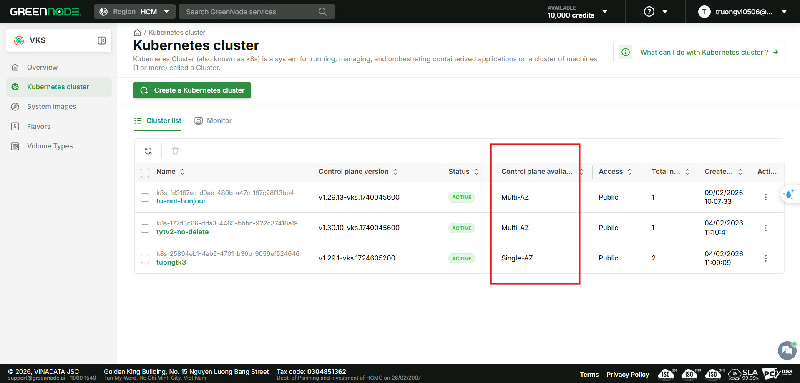

# Multi-AZ Control Plane

## Tổng quan

**Multi-AZ Control Plane** là tính năng cho phép triển khai Kubernetes Cluster với Control Plane được phân bổ trên nhiều Availability Zones (AZ) khác nhau, đảm bảo **High Availability** (HA) cho cluster của bạn.

### Multi-AZ Control Plane là gì?

Trong mô hình Multi-AZ, các thành phần của Control Plane (API Server, Controller Manager, Scheduler, etcd) được triển khai trên nhiều AZ. Điều này đảm bảo rằng:

* Nếu một AZ gặp sự cố, Control Plane vẫn hoạt động bình thường từ các AZ còn lại
* Tự động failover mà không cần can thiệp thủ công
* Đáp ứng yêu cầu compliance về disaster recovery

Để khởi tạo một Multi-AZ Cluster, vui lòng tham khảo hướng dẫn tại [đây](../bat-dau-voi-vks/khoi-tao-mot-multi-az-cluster.md).

### So sánh Single-AZ và Multi-AZ Cluster

| Đặc điểm | Single-AZ | Multi-AZ |
| --- | --- | --- |
| **Control Plane Availability** | 99.9% | 99.99% |
| **Khả năng chịu lỗi** | Single point of failure tại AZ level | Chịu được lỗi ở cấp độ AZ |
| **Chi phí** | Thấp hơn | Miễn phí trong giai đoạn đầu release (có phát sinh chi phí Private Service Endpoints) |
| **Độ trễ (Latency)** | Thấp (cùng AZ) | Cao hơn một chút (cross-AZ cho Control Plane) |
| **Private DNS (VPC)** | Tùy chọn | Bắt buộc (prerequisite) |
| **Use Case** | Development, Testing | Production, Mission-critical |
| **Yêu cầu Subnet** | 1 subnet | Tối thiểu 2 subnets từ 2 AZ khác nhau |
| **Node Group** | 1 AZ (1 subnet) | 1 AZ per Node Group (chọn 1 subnet từ danh sách subnets của cluster) |

### Khi nào nên sử dụng Multi-AZ Cluster?

* **Production workloads**: Các ứng dụng yêu cầu uptime cao và không chấp nhận downtime
* **Mission-critical applications**: Hệ thống thanh toán, giao dịch, dữ liệu quan trọng
* **Enterprise requirements**: Tuân thủ các yêu cầu compliance về disaster recovery
* **High Availability**: Khi cần đảm bảo cluster vẫn hoạt động ngay cả khi một AZ gặp sự cố


**Lưu ý:**

* **Single-AZ Cluster** phù hợp cho môi trường **development** và **testing** do chi phí thấp hơn
* **Multi-AZ Cluster** được khuyến nghị cho môi trường **production**


***

## Kiến trúc Multi-AZ Control Plane

Sơ đồ dưới đây minh họa kiến trúc của Multi-AZ Cluster:

<figure><figcaption><p>Kiến trúc Multi-AZ Control Plane</p></figcaption></figure>

**Các thành phần chính:**

* **Control Plane**: Được phân bổ trên nhiều AZ, bao gồm API Server, Controller Manager, Scheduler, etcd
* **etcd cluster**: Được replicate across AZs để đảm bảo data consistency
* **vLB Multi-AZ**: Load Balancer phân phối traffic đến Control Plane nodes trên các AZ
* **Node Groups**: Mỗi Node Group chỉ triển khai trong 1 subnet (1 AZ), người dùng có thể tạo nhiều Node Group ở các AZ khác nhau

***

## Quản lý Multi-AZ Cluster

### Xem thông tin Cluster trên trang danh sách

Tại trang danh sách Kubernetes Cluster, bạn có thể nhận biết Multi-AZ Cluster thông qua cột **Control Plane Availability**:

<figure><figcaption><p>Cluster List Page với cột Control Plane Availability</p></figcaption></figure>

| Badge | Ý nghĩa |
| --- | --- |
| **Single-AZ** (badge màu xám) | Control Plane nằm trong 1 AZ |
| **Multi-AZ** (badge màu xanh đậm) | Control Plane phân bổ trên nhiều AZ |

### Xem chi tiết Cluster

Khi truy cập vào trang chi tiết của Multi-AZ Cluster:

**1. General Information**

Hiển thị thêm trường **Control Plane Availability** với giá trị **Multi-AZ** (badge màu xanh đậm)

<figure><figcaption><p>General Information với Control Plane Availability</p></figcaption></figure>

**2. Network Section**

Hiển thị danh sách **Subnets** đang sử dụng với thông tin chi tiết:

```
Subnets (2)
├── sub-85ba01f6-02ec-4dfc-8884-ee0036c68a5b
│   Name: sub-1A (10.60.0.0/24) | AZ: HCM-1A
└── sub-12345678-abcd-efgh-ijkl-mnopqrstuvwx
    Name: sub-1B (10.60.1.0/24) | AZ: HCM-1B
```

* Click vào icon **copy** bên cạnh Subnet ID để copy vào clipboard

<figure><figcaption><p>Network section với danh sách Subnets</p></figcaption></figure>

**3. Node Group Tab**

Thông tin chi tiết Node Group hiển thị **Subnet** kèm theo **AZ** tương ứng, giúp bạn xác định Node Group đang triển khai ở AZ nào.

### Upgrade Control Plane

Quy trình upgrade Control Plane cho Multi-AZ Cluster **không khác biệt** so với Single-AZ Cluster:

1. Truy cập vào trang chi tiết cluster
2. Thực hiện upgrade Control Plane lên version mới theo hướng dẫn tại [đây](upgrading-control-plane-version.md)


**Đặc điểm upgrade Multi-AZ Cluster:**

* Hệ thống thực hiện **rolling upgrade** trên tất cả các AZ
* Cluster vẫn **available** trong quá trình upgrade
* Các workload hiện có **không bị gián đoạn**
* Nếu upgrade thất bại, hệ thống tự động **rollback** về version trước đó


### Xóa Cluster

Quy trình xóa Multi-AZ Cluster **tương tự** như Single-AZ Cluster:

1. Truy cập vào [https://vks.console.vngcloud.vn/k8s-cluster](https://vks.console.vngcloud.vn/k8s-cluster)
2. Chọn cluster muốn xóa và chọn **Delete**
3. Xác nhận xóa


**Lưu ý khi xóa Multi-AZ Cluster:**

Khi xóa cluster, hệ thống sẽ:
* Xóa tất cả **Control Plane components** trên **mọi AZ**
* Xóa tất cả **Node Groups** và **Worker Nodes**
* Giải phóng **network resources** (subnets vẫn còn trong VPC)
* Xóa **Security Group** mặc định của cluster
* Xóa **Load Balancer** mặc định của cluster

Các tài nguyên sau **có thể không bị xóa tự động**:
* Load Balancer được integrate vào cluster bởi bạn
* Persistent Volume được integrate vào cluster bởi bạn


***

## Giới hạn và Lưu ý

### Giới hạn hiện tại

| Giới hạn | Mô tả |
| --- | --- |
| **Không thể chuyển đổi** | Không thể chuyển đổi cluster từ Single-AZ sang Multi-AZ (hoặc ngược lại) sau khi đã tạo |
| **Không thể thay đổi subnets** | Không thể thêm/bớt subnet sau khi đã tạo Multi-AZ cluster |
| **Node Group vẫn Single-AZ** | Mỗi Node Group chỉ hỗ trợ triển khai trong 1 subnet (1 AZ) |
| **VPC DNS bắt buộc** | VPC phải bật DNS để tạo Multi-AZ Cluster |

### Lưu ý quan trọng


**Về chi phí:**

Trong giai đoạn đầu release, tính năng Multi-AZ Control Plane được cung cấp **miễn phí**. Chi phí chính thức sẽ được cập nhật trong thời gian tới. Vui lòng theo dõi trang [Thông báo và Cập nhật](../thong-bao-va-cap-nhat/) để nắm thông tin mới nhất.

Lưu ý: Multi-AZ Cluster hoạt động trên luồng private nên sẽ phát sinh chi phí cho **4 Private Service Endpoints** (IAM, vCR, vServer, vStorage).



**Về Private Service Endpoint:**

* Multi-AZ Cluster hoạt động trên **luồng private**, hệ thống tự động tạo 4 Private Service Endpoints khi cluster được tạo
* **Không xóa** các endpoint này để tránh gián đoạn dịch vụ
* Các nodes trong cluster **không thể kết nối ra internet** để pull image — phải sử dụng **vContainer Registry (vCR)**
* Để truy cập **kube-api**, bạn cần **đứng trong VPC** mà cluster sử dụng
* Chi tiết tham khảo tại [Khởi tạo một Multi-AZ Cluster](../bat-dau-voi-vks/khoi-tao-mot-multi-az-cluster.md)



**Về Node Group:**

* Khi tạo cluster, Node Group đầu tiên chỉ có thể chọn 1 subnet từ danh sách subnets đã cấu hình cho cluster
* Để đảm bảo HA cho workloads, bạn nên tạo thêm Node Group ở các AZ khác sau khi cluster được tạo



**Về cross-AZ latency:**

Traffic giữa các AZ có thể có độ trễ cao hơn một chút so với traffic trong cùng AZ. Điều này là bình thường và được chấp nhận để đổi lấy khả năng High Availability.


***

## FAQ

### 1. Tôi có thể chuyển cluster từ Single-AZ sang Multi-AZ không?

**Không.** Hiện tại VKS không hỗ trợ chuyển đổi Control Plane Availability sau khi cluster đã được tạo. Bạn cần tạo mới cluster với cấu hình Multi-AZ.

### 2. Node Group của tôi có tự động phân bổ trên nhiều AZ không?

**Không.** Mỗi Node Group chỉ triển khai trong 1 AZ (1 subnet). Để phân bổ workloads trên nhiều AZ, bạn cần tạo nhiều Node Group ở các AZ khác nhau.

### 3. Điều gì xảy ra khi một AZ gặp sự cố?

Khi 1 AZ gặp sự cố:
* **Control Plane** vẫn hoạt động bình thường từ các AZ còn lại
* **Node Groups** ở AZ đó sẽ không available
* Kubernetes sẽ tự động reschedule các pods sang các nodes ở AZ khác (nếu có Node Group ở các AZ khác)

### 4. Tại sao VPC của tôi không hiển thị khi tạo Multi-AZ Cluster?

VPC của bạn chưa bật **DNS**. Vui lòng bật DNS cho VPC tại portal vServer trước khi tạo Multi-AZ Cluster.

### 5. Tôi có thể chọn nhiều subnet cùng AZ cho Multi-AZ Cluster không?

Bạn có thể chọn nhiều subnet, nhưng phải đảm bảo các subnet thuộc **ít nhất 2 AZ khác nhau**. Nếu tất cả subnet đều thuộc cùng 1 AZ, hệ thống sẽ báo lỗi validation.

### 6. Chi phí Multi-AZ Cluster như thế nào?

Trong giai đoạn đầu release, tính năng Multi-AZ Control Plane được cung cấp **miễn phí**. Chi phí chính thức sẽ được cập nhật trong thời gian tới. Lưu ý rằng Multi-AZ Cluster hoạt động trên luồng private nên sẽ phát sinh chi phí cho 4 Private Service Endpoints. Vui lòng tham khảo trang [Cách tính giá](../cach-tinh-gia.md) và [Thông báo và Cập nhật](../thong-bao-va-cap-nhat/) để biết chi tiết.
