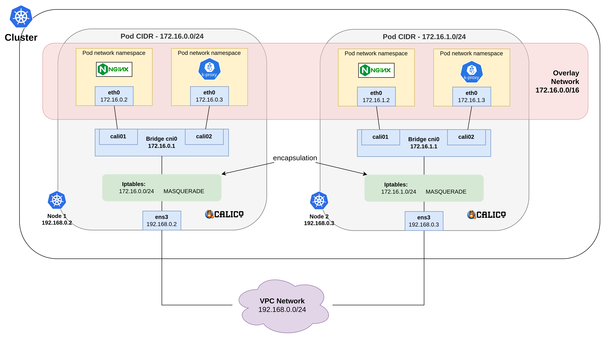

# Sử dụng CNI Calico Overlay

## Tổng quan

**CNI Calico Overlay** trong VKS là một loại **overlay network** sử dụng giao thức **IP-in-IP encapsulation** tạo ra một mạng overlay. Điều này cho phép các pod giao tiếp với nhau mà không cần thay đổi cấu hình mạng vật lý bên dưới. Các pod sẽ nhận địa chỉ IP từ dải địa chỉ IP được cấu hình cho Calico, thường là khác với địa chỉ IP của VPC hoặc subnet của bạn.&#x20;

***

## Model

Trên VKS, **Calico Overlay** hoạt động theo mô hình sau:

<figure><figcaption></figcaption></figure>

**Trong đó:**

* **Các pod** trên mỗi node giao tiếp với nhau thông qua **cali interface** và **bridge cni0**.
* Khi các pod cần giao tiếp với các pod trên các node khác, gói tin sẽ được gói (encapsulated) vào trong gói overlay và gửi qua **mạng vật lý (VPC Network)**.
* **Calico** trên mỗi node chịu trách nhiệm thực hiện gói hóa (encapsulation) và giải gói (decapsulation) để các pod có thể liên lạc xuyên qua các node khác nhau.

***

## Điều kiện cần

Để có thể khởi tạo một **Cluster** và **Deploy** một **Workload**, bạn cần:

* Có ít nhất 1 **VPC** và 1 **Subnet** đang ở trạng thái **ACTIVE**. Nếu bạn chưa có VPC, Subnet nào, vui lòng khởi tạo VPC, Subnet theo hướng dẫn tại [đây.](https://docs.vngcloud.vn/vng-cloud-document/v/vn/vserver/compute-hcm03-1a/network/virtual-private-cloud-vpc)&#x20;
* Có ít nhất 1 **SSH** key đang ở trạng thái **ACTIVE**. Nếu bạn chưa có SSH key nào, vui lòng khởi tạo SSH key theo hướng dẫn tại [đây.](https://docs.vngcloud.vn/vng-cloud-document/v/vn/vserver/compute-hcm03-1a/security/ssh-key-bo-khoa)
* Đã cài đặt và cấu hình **kubectl** trên thiết bị của bạn. vui lòng tham khảo tại [đây](https://kubernetes.io/vi/docs/tasks/tools/install-kubectl/) nếu bạn chưa rõ cách cài đặt và sử dụng kuberctl. Ngoài ra, bạn không nên sử dụng phiên bản kubectl quá cũ, chúng tôi khuyến cáo bạn nên sử dụng phiên bản kubectl sai lệch không quá một phiên bản với version của cluster.

***

## **Khởi tạo một Cluster sử dụng Calico Overlay**

Để khởi tạo một Cluster, hãy làm theo các bước bên dưới:

**Bước 1:** Truy cập vào [https://vks.console.vngcloud.vn/overview](https://vks.console.vngcloud.vn/overview)

**Bước 2:** Tại màn hình **Overview**, chọn **Activate.**

**Bước 3:** Chờ đợi tới khi chúng tôi khởi tạo thành công tài khoản VKS của bạn. Sau khi Activate thành công, bạn hãy chọn **Create a Cluster.**

**Bước 4:** Tại màn hình khởi tạo Cluster, chúng tôi đã thiết lập thông tin cho Cluster và một **Default Node Group** cho bạn. Để sử dụng **Calico Overlay** cho **Cluster** của bạn, vui lòng chọn:&#x20;

* **Network type**: **Calico Overlay**

<table><thead><tr><th width="117">Field</th><th width="375">Ý nghĩa</th><th>Ví dụ minh họa</th></tr></thead><tbody><tr><td><strong>VPC</strong></td><td>Dải địa chỉ IP mà các node của Cluster sẽ sử dụng để giao tiếp.</td><td>Trong hình, chúng tôi lựa chọn VPC có IP range là <strong>10.111.0.0/16</strong>, tương ứng với <strong>65536 IP</strong></td></tr><tr><td><strong>Subnet</strong></td><td>Dải địa chỉ IP nhỏ hơn thuộc VPC. Mỗi node trong Cluster sẽ được gán một IP từ Subnet này. Subnet phải nằm trong dải IP của VPC đã chọn.</td><td>Trong hình, chúng tôi lựa chọn Subnet có <strong>Primary IP range</strong> là <strong>10.111.0.0/24</strong>, tương ứng với <strong>256 IP</strong></td></tr><tr><td><strong>IP-IP encapsulation mode</strong></td><td>Chế độ IP-IP encapsulation trong VKS là Always</td><td>Trong hình, chúng tôi lựa chọn chế độ <strong>Always</strong> để luôn encapsulate các gói tin.</td></tr><tr><td><strong>CIDR</strong></td><td>Dải mạng ảo mà các pod sẽ sử dụng</td><td>Trong hình, chúng tôi lựa chọn dải mạng ảo là <code>172.16.0.0/16</code>. Các pod sẽ lấy IP từ dải IP này.</td></tr></tbody></table>

<figure><figcaption></figcaption></figure>


**Chú ý:**&#x20;

* **Chỉ một loại networktype:** Trong một cluster, bạn chỉ có thể sử dụng một trong ba loại networktype: Calico Overlay, Cilium Overlay, hoặc Cilium VPC Native Routing
* **Multiple subnet cho một cluster:** VKS hỗ trợ việc sử dụng nhiều subnet cho một cluster. Điều này cho phép bạn cấu hình mỗi node group trong cluster nằm ở các subnet khác nhau trong cùng một VPC, giúp tối ưu hóa việc phân bổ tài nguyên và quản lý mạng.


**Bước 5:** Chọn **Create Kubernetes cluster.** Hãy chờ vài phút để chúng tôi khởi tạo Cluster của bạn, trạng thái của Cluster lúc này là **Creating**.

**Bước 6:** Khi trạng thái **Cluster** là **Active**, bạn có thể xem thông tin Cluster, thông tin Node Group bằng cách chọn vào Cluster Name tại cột **Name**.

***

## Deploy một Workload

Bên dưới là hướng dẫn triển khai một deployment nginx và kiểm tra việc phân chia IP cho các pod được triển khai trong cluster của bạn.

**Bước 1:** Truy cập vào [https://vks.console.vngcloud.vn/k8s-cluster](https://vks.console-dev.vngcloud.tech/overview)

**Bước 2:** Danh sách Cluster được hiển thị, chọn biểu tượng **Download** và chọn **Download Config File** để thực hiện tải xuống file kubeconfig. File này sẽ giúp bạn có toàn quyền truy cập vào Cluster của bạn.

**Bước 3**: Đổi tên file này thành config và lưu nó vào thư mục **\~/.kube/config**

**Bước 4:** Thực hiện kiểm tra Cluster thông qua lệnh:

* Chạy câu lệnh sau đây để kiểm tra **node**

```bash
kubectl get nodes
```

* Nếu kết quả trả về như bên dưới tức là bạn Cluster của bạn được khởi tạo thành công với 5 node:

```bash
NAME                                  STATUS   ROLES    AGE   VERSION
vks-cluster01-nodegroup-536d9-452f1   Ready    <none>   15h   v1.28.8
vks-cluster01-nodegroup-998b1-14f64   Ready    <none>   16h   v1.28.8
vks-cluster01-nodegroup01-22e98       Ready    <none>   19h   v1.28.8
vks-cluster01-nodegroup01-36911       Ready    <none>   19h   v1.28.8
vks-cluster01-nodegroup01-9102e       Ready    <none>   19h   v1.28.8
```

* Tiếp tục thực hiện chạy lệnh sau đây để kiểm tra các **pod** đã được triển khai trên namespace kube-system của bạn:&#x20;

```
kubectl get pods -A
```

* Nếu kết quả trả về như bên dưới tức là các **pods** hỗ trợ chạy **Calico Overlay** đã running:

```bash
NAMESPACE     NAME                                           READY   STATUS    RESTARTS   AGE
kube-system   calico-kube-controllers-868b574465-wbxlx       1/1     Running   0          19h
kube-system   calico-node-65ql2                              1/1     Running   0          16h
kube-system   calico-node-d9hc7                              1/1     Running   0          19h
kube-system   calico-node-gp2s7                              1/1     Running   0          19h
kube-system   calico-node-hgk86                              1/1     Running   0          19h
kube-system   calico-node-vj9ts                              1/1     Running   0          15h
kube-system   calico-typha-74d79bf5f6-zzdn9                  1/1     Running   0          19h
kube-system   coredns-1727334072-86776977c9-l9tcp            1/1     Running   0          19h
kube-system   coredns-1727334072-86776977c9-xqcn9            1/1     Running   0          19h
kube-system   konnectivity-agent-bj7wc                       1/1     Running   0          15h
kube-system   konnectivity-agent-fnm7j                       1/1     Running   0          16h
kube-system   konnectivity-agent-gvnbl                       1/1     Running   0          19h
kube-system   konnectivity-agent-jj764                       1/1     Running   0          19h
kube-system   konnectivity-agent-vgmwf                       1/1     Running   0          19h
kube-system   kube-proxy-8r85m                               1/1     Running   0          15h
kube-system   kube-proxy-bddf5                               1/1     Running   0          19h
kube-system   kube-proxy-kwskl                               1/1     Running   0          16h
kube-system   kube-proxy-zv6m4                               1/1     Running   0          19h
kube-system   kube-proxy-zw65v                               1/1     Running   0          19h
kube-system   vngcloud-controller-manager-67cf7f868c-jc66k   1/1     Running   0          19h
kube-system   vngcloud-csi-controller-746b67bcb8-dn5d7       7/7     Running   0          19h
kube-system   vngcloud-csi-controller-746b67bcb8-hqm24       7/7     Running   0          19h
kube-system   vngcloud-csi-node-24nlb                        3/3     Running   0          15h
kube-system   vngcloud-csi-node-fgxpg                        3/3     Running   0          19h
kube-system   vngcloud-csi-node-q9npf                        3/3     Running   0          19h
kube-system   vngcloud-csi-node-tw5sv                        3/3     Running   0          19h
kube-system   vngcloud-csi-node-z2sk9                        3/3     Running   0          16h
kube-system   vngcloud-ingress-controller-0                  1/1     Running   0          19h

```

**Bước 2: Triển khai nginx trên cluster vừa khởi tạo:**&#x20;

* Thực hiện khởi tạo tệp tin **nginx-deployment.yaml** với nội dung tương tự bên dưới:&#x20;

```bash
apiVersion: apps/v1
kind: Deployment
metadata:
  name: nginx-app
spec:
  selector:
    matchLabels:
      app: nginx
  replicas: 20
  template:
    metadata:
      labels:
        app: nginx
    spec:
      containers:
      - name: nginx
        image: nginx:latest
        ports:
        - containerPort: 80
```

* Thực hiện triển khai deployment này qua lệnh:&#x20;

```bash
kubectl apply -f nginx-deployment.yaml
```

**Bước 3: Kiểm tra các pod nginx đã được triển khai và địa chỉ IP được gán cho mỗi pod**

* Thực hiện kiểm tra các **pod** qua lệnh:&#x20;

```bash
kubectl get pods -o wide
```

* Bạn có thể quan sát bên dưới, các **pod nginx** được gán các IP 172.16.x.x thỏa mãn điều kiện **Calico CIDR 172.16.0.0/16** mà chúng tôi đã chỉ định bên trên:

```bash
NAME                         READY   STATUS    RESTARTS   AGE   IP               NODE                                  NOMINATED NODE   READINESS GATES
nginx-app-7c79c4bf97-2xbwd   1/1     Running   0          49s   172.16.197.136   vks-cluster01-nodegroup01-22e98       <none>           <none>
nginx-app-7c79c4bf97-5hcds   1/1     Running   0          49s   172.16.197.137   vks-cluster01-nodegroup01-22e98       <none>           <none>
nginx-app-7c79c4bf97-5hgwp   1/1     Running   0          49s   172.16.197.138   vks-cluster01-nodegroup01-22e98       <none>           <none>
nginx-app-7c79c4bf97-5l79h   1/1     Running   0          49s   172.16.83.4      vks-cluster01-nodegroup01-36911       <none>           <none>
nginx-app-7c79c4bf97-5q2f4   1/1     Running   0          49s   172.16.226.196   vks-cluster01-nodegroup01-9102e       <none>           <none>
nginx-app-7c79c4bf97-5szc6   1/1     Running   0          49s   172.16.83.6      vks-cluster01-nodegroup01-36911       <none>           <none>
nginx-app-7c79c4bf97-9272q   1/1     Running   0          49s   172.16.167.71    vks-cluster01-nodegroup-998b1-14f64   <none>           <none>
nginx-app-7c79c4bf97-cgwrj   1/1     Running   0          49s   172.16.67.195    vks-cluster01-nodegroup-536d9-452f1   <none>           <none>
nginx-app-7c79c4bf97-fhlg4   1/1     Running   0          49s   172.16.167.70    vks-cluster01-nodegroup-998b1-14f64   <none>           <none>
nginx-app-7c79c4bf97-fj865   1/1     Running   0          49s   172.16.83.3      vks-cluster01-nodegroup01-36911       <none>           <none>
nginx-app-7c79c4bf97-gh6hj   1/1     Running   0          49s   172.16.167.69    vks-cluster01-nodegroup-998b1-14f64   <none>           <none>
nginx-app-7c79c4bf97-hx2rn   1/1     Running   0          49s   172.16.83.5      vks-cluster01-nodegroup01-36911       <none>           <none>
nginx-app-7c79c4bf97-jv26j   1/1     Running   0          49s   172.16.167.68    vks-cluster01-nodegroup-998b1-14f64   <none>           <none>
nginx-app-7c79c4bf97-km7p4   1/1     Running   0          49s   172.16.226.198   vks-cluster01-nodegroup01-9102e       <none>           <none>
nginx-app-7c79c4bf97-lrh2r   1/1     Running   0          49s   172.16.167.67    vks-cluster01-nodegroup-998b1-14f64   <none>           <none>
nginx-app-7c79c4bf97-lvj6g   1/1     Running   0          49s   172.16.67.196    vks-cluster01-nodegroup-536d9-452f1   <none>           <none>
nginx-app-7c79c4bf97-nhhdk   1/1     Running   0          49s   172.16.226.197   vks-cluster01-nodegroup01-9102e       <none>           <none>
nginx-app-7c79c4bf97-qr2lm   1/1     Running   0          49s   172.16.67.198    vks-cluster01-nodegroup-536d9-452f1   <none>           <none>
nginx-app-7c79c4bf97-x4ztb   1/1     Running   0          49s   172.16.226.195   vks-cluster01-nodegroup01-9102e       <none>           <none>
nginx-app-7c79c4bf97-xrqwx   1/1     Running   0          49s   172.16.67.197    vks-cluster01-nodegroup-536d9-452f1   <none>           <none>
```

* Bạn cũng có thể thực hiện xem mô tả chi tiết mỗi pod để kiểm tra thông tin pod này qua lệnh:&#x20;

```bash
kubectl describe pod nginx-app-7c79c4bf97-2xbwd
```
