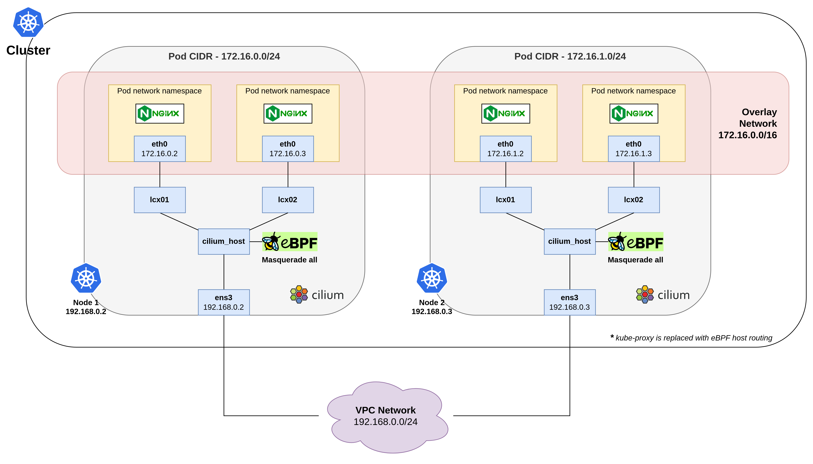

# Sử dụng CNI Cilium Overlay

## Tổng quan

**CNI Cilium Overlay** trong VKS là một loại **overlay network** sử dụng **eBPF (extended Berkeley Packet Filter)** để tăng cường hiệu suất và bảo mật mạng. Nếu so sánh với các giải pháp như **Calico Overlay**, Cilium mang lại hiệu suất cao hơn nhờ khả năng xử lý lưu lượng trực tiếp trong kernel bằng eBPF. Ngoài ra, với Calico thường sử dụng **iptables** để quản lý lưu lượng, trong khi Cilium với eBPF có thể xử lý các chính sách mạng và các hành vi ứng dụng cụ thể (Layer 7).

***

## Model

Trên VKS, **Cilium Overlay** hoạt động theo mô hình sau:

<figure><figcaption></figcaption></figure>

**Trong đó:**

* **Pod (eth0)** -> **lxc01/lxc02**: Các Pod giao tiếp thông qua mạng ảo được tạo bởi Cilium.
* **lxc01/lxc02** -> **cilium\_host**: Các gói tin từ các Pod được chuyển đến `cilium_host`, là lớp trung gian giữa mạng của Pod và mạng vật lý.
* **cilium\_host** -> **ens3**: Sau khi được xử lý bởi Cilium (và eBPF), các gói tin được gửi đến mạng vật lý thông qua `ens3`.
* **ens3** -> **VPC Network**: Cuối cùng, các gói tin được truyền qua mạng vật lý để đến các node khác hoặc ra khỏi cluster.

***

## Điều kiện cần

Để có thể khởi tạo một **Cluster** và **Deploy** một **Workload**, bạn cần:

* Có ít nhất 1 **VPC** và 1 **Subnet** đang ở trạng thái **ACTIVE**. Nếu bạn chưa có VPC, Subnet nào, vui lòng khởi tạo VPC, Subnet theo hướng dẫn tại [đây.](https://docs.vngcloud.vn/vng-cloud-document/v/vn/vserver/compute-hcm03-1a/network/virtual-private-cloud-vpc)&#x20;
* Có ít nhất 1 **SSH** key đang ở trạng thái **ACTIVE**. Nếu bạn chưa có SSH key nào, vui lòng khởi tạo SSH key theo hướng dẫn tại [đây.](https://docs.vngcloud.vn/vng-cloud-document/v/vn/vserver/compute-hcm03-1a/security/ssh-key-bo-khoa)
* Đã cài đặt và cấu hình **kubectl** trên thiết bị của bạn. vui lòng tham khảo tại [đây](https://kubernetes.io/vi/docs/tasks/tools/install-kubectl/) nếu bạn chưa rõ cách cài đặt và sử dụng kuberctl. Ngoài ra, bạn không nên sử dụng phiên bản kubectl quá cũ, chúng tôi khuyến cáo bạn nên sử dụng phiên bản kubectl sai lệch không quá một phiên bản với version của cluster.

***

## **Khởi tạo một Cluster sử dụng Cilium Overlay**

Để khởi tạo một Cluster, hãy làm theo các bước bên dưới:

**Bước 1:** Truy cập vào [https://vks.console.vngcloud.vn/overview](https://vks.console.vngcloud.vn/overview)

**Bước 2:** Tại màn hình **Overview**, chọn **Activate.**

**Bước 3:** Chờ đợi tới khi chúng tôi khởi tạo thành công tài khoản VKS của bạn. Sau khi Activate thành công, bạn hãy chọn **Create a Cluster.**

**Bước 4:** Tại màn hình khởi tạo Cluster, chúng tôi đã thiết lập thông tin cho Cluster và một **Default Node Group** cho bạn. Để sử dụng **Cilium Overlay** cho **Cluster** của bạn, vui lòng chọn:&#x20;

* **Network type**: Cilium Overlay

<table><thead><tr><th width="117">Field</th><th width="375">Ý nghĩa</th><th>Ví dụ minh họa</th></tr></thead><tbody><tr><td><strong>VPC</strong></td><td>Dải địa chỉ IP mà các node của Cluster sẽ sử dụng để giao tiếp.</td><td>Trong hình, chúng tôi lựa chọn VPC có IP range là <strong>10.111.0.0/16</strong>, tương ứng với <strong>65536 IP</strong></td></tr><tr><td><strong>Subnet</strong></td><td>Dải địa chỉ IP nhỏ hơn thuộc VPC. Mỗi node trong Cluster sẽ được gán một IP từ Subnet này. Subnet phải nằm trong dải IP của VPC đã chọn.</td><td>Trong hình, chúng tôi lựa chọn Subnet có <strong>Primary IP range</strong> là <strong>10.111.0.0/24</strong>, tương ứng với <strong>256 IP</strong></td></tr><tr><td><strong>IP-IP encapsulation mode</strong></td><td>Chế độ IP-IP encapsulation trong VKS là Always</td><td>Trong hình, chúng tôi lựa chọn chế độ <strong>Always</strong> để luôn encapsulate các gói tin.</td></tr><tr><td><strong>CIDR</strong></td><td>Dải mạng ảo mà các pod sẽ sử dụng</td><td>Trong hình, chúng tôi lựa chọn dải mạng ảo là <code>172.16.0.0/16</code>. Các pod sẽ lấy IP từ dải IP này.</td></tr></tbody></table>

<figure><figcaption></figcaption></figure>


**Chú ý:**&#x20;

* **Chỉ một loại networktype:** Trong một cluster, bạn chỉ có thể sử dụng một trong ba loại networktype: Calico Overlay, Cilium Overlay, hoặc Cilium VPC Native Routing
* **Multiple subnet cho một cluster:** VKS hỗ trợ việc sử dụng nhiều subnet cho một cluster. Điều này cho phép bạn cấu hình mỗi node group trong cluster nằm ở các subnet khác nhau trong cùng một VPC, giúp tối ưu hóa việc phân bổ tài nguyên và quản lý mạng.


**Bước 5:** Chọn **Create Kubernetes cluster.** Hãy chờ vài phút để chúng tôi khởi tạo Cluster của bạn, trạng thái của Cluster lúc này là **Creating**.

**Bước 6:** Khi trạng thái **Cluster** là **Active**, bạn có thể xem thông tin Cluster, thông tin Node Group bằng cách chọn vào Cluster Name tại cột **Name**.

***

## Deploy một Workload

Bên dưới là hướng dẫn triển khai một deployment nginx và kiểm tra việc phân chia IP cho các pod được triển khai trong cluster của bạn.

**Bước 1:** Truy cập vào [https://vks.console.vngcloud.vn/k8s-cluster](https://vks.console-dev.vngcloud.tech/overview)

**Bước 2:** Danh sách Cluster được hiển thị, chọn biểu tượng **Download** và chọn **Download Config File** để thực hiện tải xuống file kubeconfig. File này sẽ giúp bạn có toàn quyền truy cập vào Cluster của bạn.

**Bước 3**: Đổi tên file này thành config và lưu nó vào thư mục **\~/.kube/config**

**Bước 4:** Thực hiện kiểm tra Cluster thông qua lệnh:

* Chạy câu lệnh sau đây để kiểm tra **node**

```bash
kubectl get nodes
```

* Nếu kết quả trả về như bên dưới tức là bạn Cluster của bạn được khởi tạo thành công với 3 node:

```bash
NAME                                   STATUS   ROLES    AGE     VERSION
vks-cluster-02-nodegroup-7fb09-3a594   Ready    <none>   5m48s   v1.29.1
vks-cluster-02-nodegroup-7fb09-3cb67   Ready    <none>   5m34s   v1.29.1
vks-cluster-02-nodegroup-7fb09-430aa   Ready    <none>   5m52s   v1.29.1
```

* Tiếp tục thực hiện chạy lệnh sau đây để kiểm tra các **pod** đã được triển khai trên namespace kube-system của bạn:&#x20;

```bash
kubectl get pods -A
```

* Nếu kết quả trả về như bên dưới tức là các **pods** hỗ trợ chạy **Cilium Overlay** đã được running:

```bash
NAMESPACE     NAME                                           READY   STATUS    RESTARTS        AGE
kube-system   cilium-8xtwz                                   1/1     Running   1 (5m36s ago)   6m7s
kube-system   cilium-cpxvv                                   1/1     Running   0               5m53s
kube-system   cilium-envoy-b95pg                             1/1     Running   0               6m7s
kube-system   cilium-envoy-dx8qg                             1/1     Running   0               6m11s
kube-system   cilium-envoy-sqdn8                             1/1     Running   0               5m53s
kube-system   cilium-operator-75b8c6f6d4-7x4f6               1/1     Running   0               9m19s
kube-system   cilium-operator-75b8c6f6d4-k7j45               1/1     Running   0               9m19s
kube-system   cilium-zs2cm                                   1/1     Running   1 (5m35s ago)   6m11s
kube-system   coredns-1727408780-5fcf89468-7hmvp             1/1     Running   0               9m24s
kube-system   coredns-1727408780-5fcf89468-v9nbd             1/1     Running   0               9m24s
kube-system   hubble-relay-8899f8cdc-976zf                   1/1     Running   1 (4m3s ago)    9m20s
kube-system   hubble-ui-574c5bb99b-gg7jx                     2/2     Running   0               9m20s
kube-system   konnectivity-agent-46nvd                       1/1     Running   0               5m27s
kube-system   konnectivity-agent-qhq4m                       1/1     Running   0               5m24s
kube-system   konnectivity-agent-xs7bq                       1/1     Running   0               5m21s
kube-system   vngcloud-controller-manager-7c47d64584-z8827   1/1     Running   0               9m21s
kube-system   vngcloud-csi-controller-848f68f46-2hkxl        7/7     Running   2 (4m58s ago)   9m23s
kube-system   vngcloud-csi-controller-848f68f46-bkvkg        7/7     Running   2 (4m56s ago)   9m23s
kube-system   vngcloud-csi-node-8rxbx                        3/3     Running   2 (5m1s ago)    6m7s
kube-system   vngcloud-csi-node-mxknq                        3/3     Running   3 (4m54s ago)   5m53s
kube-system   vngcloud-csi-node-tfrsp                        3/3     Running   2 (5m2s ago)    6m11s
kube-system   vngcloud-ingress-controller-0                  1/1     Running   1 (5m16s ago)   9m7s
```

**Bước 2: Triển khai nginx trên cluster vừa khởi tạo:**&#x20;

* Thực hiện khởi tạo tệp tin **nginx-deployment.yaml** với nội dung tương tự bên dưới:&#x20;

```bash
apiVersion: apps/v1
kind: Deployment
metadata:
  name: nginx-app
spec:
  selector:
    matchLabels:
      app: nginx
  replicas: 20
  template:
    metadata:
      labels:
        app: nginx
    spec:
      containers:
      - name: nginx
        image: nginx:latest
        ports:
        - containerPort: 80
```

* Thực hiện triển khai deployment này qua lệnh:&#x20;

```bash
kubectl apply -f nginx-deployment.yaml
```

**Bước 3: Kiểm tra các pod nginx đã được triển khai và địa chỉ IP được gán cho mỗi pod**

* Thực hiện kiểm tra các pod qua lệnh:&#x20;

```bash
kubectl get pods -o wide
```

* Bạn có thể quan sát bên dưới, các **pod nginx** được gán các IP 172.16.x.x thỏa mãn điều kiện **Cilium CIDR 172.16.0.0/16** mà chúng tôi đã chỉ định bên trên:

```bash
NAME                         READY   STATUS    RESTARTS   AGE   IP             NODE                                   NOMINATED NODE   READINESS GATES
nginx-app-7c79c4bf97-4lcbn   1/1     Running   0          83s   172.16.0.6     vks-cluster-02-nodegroup-7fb09-430aa   <none>           <none>
nginx-app-7c79c4bf97-669z9   1/1     Running   0          83s   172.16.1.115   vks-cluster-02-nodegroup-7fb09-3a594   <none>           <none>
nginx-app-7c79c4bf97-7hqp5   1/1     Running   0          83s   172.16.1.32    vks-cluster-02-nodegroup-7fb09-3a594   <none>           <none>
nginx-app-7c79c4bf97-8fjhm   1/1     Running   0          83s   172.16.2.51    vks-cluster-02-nodegroup-7fb09-3cb67   <none>           <none>
nginx-app-7c79c4bf97-8xmfm   1/1     Running   0          83s   172.16.0.100   vks-cluster-02-nodegroup-7fb09-430aa   <none>           <none>
nginx-app-7c79c4bf97-9b4px   1/1     Running   0          83s   172.16.2.19    vks-cluster-02-nodegroup-7fb09-3cb67   <none>           <none>
nginx-app-7c79c4bf97-b7vlg   1/1     Running   0          83s   172.16.1.128   vks-cluster-02-nodegroup-7fb09-3a594   <none>           <none>
nginx-app-7c79c4bf97-bc6r4   1/1     Running   0          83s   172.16.0.160   vks-cluster-02-nodegroup-7fb09-430aa   <none>           <none>
nginx-app-7c79c4bf97-flkz5   1/1     Running   0          83s   172.16.2.253   vks-cluster-02-nodegroup-7fb09-3cb67   <none>           <none>
nginx-app-7c79c4bf97-k55j6   1/1     Running   0          83s   172.16.2.76    vks-cluster-02-nodegroup-7fb09-3cb67   <none>           <none>
nginx-app-7c79c4bf97-l9p8p   1/1     Running   0          83s   172.16.2.187   vks-cluster-02-nodegroup-7fb09-3cb67   <none>           <none>
nginx-app-7c79c4bf97-llnfq   1/1     Running   0          83s   172.16.1.30    vks-cluster-02-nodegroup-7fb09-3a594   <none>           <none>
nginx-app-7c79c4bf97-mg9t8   1/1     Running   0          83s   172.16.0.221   vks-cluster-02-nodegroup-7fb09-430aa   <none>           <none>
nginx-app-7c79c4bf97-mlh7g   1/1     Running   0          83s   172.16.2.191   vks-cluster-02-nodegroup-7fb09-3cb67   <none>           <none>
nginx-app-7c79c4bf97-n946h   1/1     Running   0          83s   172.16.1.82    vks-cluster-02-nodegroup-7fb09-3a594   <none>           <none>
nginx-app-7c79c4bf97-p9k42   1/1     Running   0          83s   172.16.0.112   vks-cluster-02-nodegroup-7fb09-430aa   <none>           <none>
nginx-app-7c79c4bf97-sl4b8   1/1     Running   0          83s   172.16.1.22    vks-cluster-02-nodegroup-7fb09-3a594   <none>           <none>
nginx-app-7c79c4bf97-tdtjc   1/1     Running   0          83s   172.16.2.109   vks-cluster-02-nodegroup-7fb09-3cb67   <none>           <none>
nginx-app-7c79c4bf97-zwxps   1/1     Running   0          83s   172.16.2.209   vks-cluster-02-nodegroup-7fb09-3cb67   <none>           <none>
nginx-app-7c79c4bf97-zxx87   1/1     Running   0          83s   172.16.0.212   vks-cluster-02-nodegroup-7fb09-430aa   <none>           <none>
```

* Bạn cũng có thể thực hiện xem mô tả chi tiết mỗi pod để kiểm tra thông tin pod này qua lệnh:&#x20;

```bash
kubectl describe pod nginx-app-7c79c4bf97-4lcbn
```
