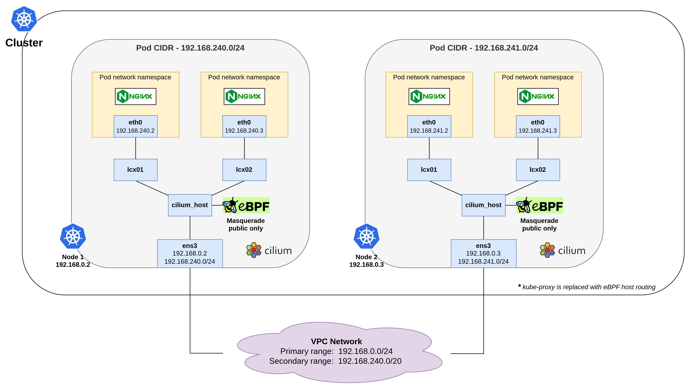

# Sử dụng CNI Cilium VPC Native Routing

## Tổng quan

**CNI (Container Network Interface) Cilium VPC Native Routing** là một cơ chế giúp Kubernetes quản lý mạng mà không cần sử dụng overlay networks. Thay vì dùng các lớp mạng ảo, **CNI Cilium VPC Native Routing** tận dụng khả năng routing trực tiếp từ VPC (Virtual Private Cloud) của các nhà cung cấp dịch vụ đám mây để tối ưu hóa việc truyền dữ liệu giữa các node và pod trong cụm Kubernetes.&#x20;

***

## Model

Trên VKS, **CNI (Container Network Interface) Cilium VPC Native Routing** hoạt động theo mô hình sau:

<figure><figcaption></figcaption></figure>

**Trong đó:**

* Mỗi **Node** có một dải địa chỉ IP riêng cho các pod (Pod CIDR). Các pod trong mỗi node sử dụng địa chỉ từ CIDR này và giao tiếp qua mạng ảo.
* **Cilium** và **eBPF** thực hiện quản lý mạng cho tất cả các pod trên mỗi node, bao gồm việc xử lý lưu lượng đi từ pod này đến pod khác, hoặc từ node này sang node khác. Khi cần, eBPF thực hiện **masquerading** để ẩn địa chỉ IP nội bộ của pod khi giao tiếp với mạng ngoài.
* **Cilium** đảm bảo rằng các pod có thể giao tiếp với nhau cả bên trong cùng node và giữa các node khác nhau.

***

## Điều kiện cần

Để có thể khởi tạo một **Cluster** và **Deploy** một **Workload**, bạn cần:

* Có ít nhất 1 **VPC** và 1 **Subnet** đang ở trạng thái **ACTIVE**. Nếu bạn chưa có VPC, Subnet nào, vui lòng khởi tạo VPC, Subnet theo hướng dẫn bên dưới:&#x20;
  * **Bước 1:** Truy cập vào trang chủ vServer tại link [https://hcm-3.console.vngcloud.vn/vserver](https://hcm-3.console.vngcloud.vn/vserver)
  * **Bước 2**: Chọn menu **VPCs** ở menu bên trái màn hình.
  * **Bước 3:** Tại đây, nếu bạn chưa có VPC nào, vui lòng chọn **Create VPC** bằng cách nhập VPC name và định nghĩa dãy **CIDR/16** mong muốn.
  * **Bước 4**: Sau khi đã có ít nhất 1 VPC, để tạo subnet, bạn cần chọn **View Detail** để mở rộng bảng điều khiển ở phía dưới, trong đó có mục **Subnet**.
  * **Bước 5:** Tại mục **Subnet**, chọn **Add Subnet.** Lúc này, bạn cần nhập:
    * **Subnet name**: tên gợi nhớ của subnet
    * **Primary CIDR**: :Đây là dải địa chỉ IP chính của subnet. Mọi địa chỉ IP nội bộ của các máy ảo (VM) trong subnet này sẽ được lấy từ dải địa chỉ này. Giả sử, nếu bạn đặt Primary CIDR là 10.1.0.0/16, các địa chỉ IP của các VM sẽ nằm trong khoảng từ 10.1.0.1 đến 10.1.255.254.
    * **Secondary CIDR**: Đây là dải địa chỉ IP phụ, được sử dụng để cung cấp thêm địa chỉ IP cho các mục đích cụ thể như alias IP ranges hoặc để phân chia các dịch vụ khác nhau trong cùng một subnet. Giả sử bạn có thể thêm một Secondary CIDR là 10.2.0.0/20 để sử dụng cho các dịch vụ hoặc ứng dụng khác nhau mà không cần tạo thêm subnet mới.

<figure><figcaption></figcaption></figure>

<figure><figcaption></figcaption></figure>


**Chú ý:**

* Các dải địa chỉ IP của **Primary CIDR** và **Secondary CIDR** không được trùng lặp. Điều này có nghĩa là dải địa chỉ của **Secondary CIDR** phải nằm ngoài phạm vi của **Primary CIDR** và ngược lại. Giả sử, nếu Primary CIDR là 10.1.0.0/16, thì Secondary CIDR không thể là 10.1.0.0/20 vì nó nằm trong phạm vi của Primary CIDR. Thay vào đó, bạn có thể sử dụng một dải địa chỉ khác như 10.2.0.0/20.


* Có ít nhất 1 **SSH** key đang ở trạng thái **ACTIVE**. Nếu bạn chưa có SSH key nào, vui lòng khởi tạo SSH key theo hướng dẫn tại [đây.](https://docs.vngcloud.vn/vng-cloud-document/v/vn/vserver/compute-hcm03-1a/security/ssh-key-bo-khoa)
* Đã cài đặt và cấu hình **kubectl** trên thiết bị của bạn. vui lòng tham khảo tại [đây](https://kubernetes.io/vi/docs/tasks/tools/install-kubectl/) nếu bạn chưa rõ cách cài đặt và sử dụng kuberctl. Ngoài ra, bạn không nên sử dụng phiên bản kubectl quá cũ, chúng tôi khuyến cáo bạn nên sử dụng phiên bản kubectl sai lệch không quá một phiên bản với version của cluster.

***

## **Khởi tạo một Cluster sử dụng CNI Cilium VPC Native Routing**

Để khởi tạo một Cluster, hãy làm theo các bước bên dưới:

**Bước 1:** Truy cập vào [https://vks.console.vngcloud.vn/overview](https://vks.console.vngcloud.vn/overview)

**Bước 2:** Tại màn hình **Overview**, chọn **Activate.**

**Bước 3:** Chờ đợi tới khi chúng tôi khởi tạo thành công tài khoản VKS của bạn. Sau khi Activate thành công, bạn hãy chọn **Create a Cluster.**

**Bước 4:** Tại màn hình khởi tạo Cluster, chúng tôi đã thiết lập thông tin cho Cluster và một **Default Node Group** cho bạn. Để sử dụng **CNI Cilium VPC Native Routing** cho **Cluster** của bạn, vui lòng chọn:&#x20;

* **Network type**: Cilium VPC Native Routing và các thông số khác như sau:

<table><thead><tr><th width="117">Field</th><th width="404">Ý nghĩa</th><th>Ví dụ minh họa</th></tr></thead><tbody><tr><td><strong>VPC</strong></td><td>Dải địa chỉ IP mà các node của Cluster sẽ sử dụng để giao tiếp.</td><td>Trong hình, chúng tôi lựa chọn VPC có IP range là <strong>10.111.0.0/16</strong>, tương ứng với <strong>65536 IP</strong></td></tr><tr><td><strong>Subnet</strong></td><td>Dải địa chỉ IP nhỏ hơn thuộc VPC. Mỗi node trong Cluster sẽ được gán một IP từ Subnet này. Subnet phải nằm trong dải IP của VPC đã chọn.</td><td>Trong hình, chúng tôi lựa chọn Subnet có <strong>Primary IP range</strong> là <strong>10.111.0.0/24</strong>, tương ứng với <strong>256 IP</strong></td></tr><tr><td><strong>Default Pod IP range</strong></td><td>Đây là dải địa chỉ IP thứ cấp được sử dụng cho các pod. Nó được gọi là <strong>Secondary IP range</strong> vì nó không trùng với dải IP chính của node (Primary IP range). Các pod trong Cluster sẽ được gán IP từ dải này.</td><td>Trong hình, chúng tôi lựa chọn <strong>Secondary IP range</strong> là <strong>10.111.160.0/20</strong> - Tương ứng với <strong>4096 IP</strong> cho các pod</td></tr><tr><td><strong>Node CIDR mask size</strong></td><td>Kích thước của CIDR dành cho các node. Thông số này cho biết mỗi node sẽ được gán bao nhiêu địa chỉ IP từ dải pod IP range. Kích thước này cần được chọn sao cho đảm bảo có đủ địa chỉ IP cho tất cả các pod trên mỗi node. Bạn có thể tham khảo bảng bên dưới để hiểu các tính số lượng IP có thể sử dụng để cấp phát cho node, pod trong cluster của bạn.</td><td>Trong hình, chúng tooi lựa chọn <strong>Node CIDR mask size</strong> là <strong>/25</strong> - Mỗi node sẽ có <strong>128 địa chỉ IP</strong>, phù hợp với số lượng pod bạn mong muốn chạy trên một node. </td></tr></tbody></table>

### **Các tính toán số lượng IP cho pod và node:**

<figure><figcaption></figcaption></figure>

Giả sử, khi khởi tạo cluster, tôi lựa chọn:&#x20;

* **VPC**: 10.111.0.0/16
* **Subnet:**&#x20;
  * **Primary IP Range:** 10.111.0.0/24
  * **Secondary IP Range:**10.111.160.0/20
* **Node CIDR mask size:** Các giá trị có thể chọn từ **/20** đến **/26**.

<table data-full-width="true"><thead><tr><th>Node CIDR mask size</th><th>Số lượng IP cho mỗi node</th><th>Số lượng node có thể tạo trong dải /20 (4096 IP)</th><th>Số lượng IP phân bổ cho pod trên mỗi node</th><th>Số lượng pod thực tế có thể tạo</th></tr></thead><tbody><tr><td><strong>/20</strong></td><td>4096</td><td>1</td><td>4096 </td><td>2048</td></tr><tr><td><strong>/21</strong></td><td>2048</td><td>2</td><td>2048</td><td>1024</td></tr><tr><td><strong>/22</strong></td><td>1024</td><td>4</td><td>1024</td><td>512</td></tr><tr><td><strong>/23</strong></td><td>512</td><td>8</td><td>512</td><td>256</td></tr><tr><td><strong>/24</strong></td><td>256</td><td>16</td><td>256 </td><td>128</td></tr><tr><td><strong>/25</strong></td><td>128</td><td>32</td><td>128</td><td>64</td></tr><tr><td><strong>/26</strong></td><td>64</td><td>64</td><td>64</td><td>32</td></tr></tbody></table>

Do đó:&#x20;

* **Node CIDR mask size** càng lớn (ví dụ **/20**, **/21**), bạn sẽ có ít node nhưng mỗi node sẽ có nhiều IP hơn cho các pod.
* **Node CIDR mask size** nhỏ hơn (ví dụ **/24**, **/25**), bạn có thể tạo nhiều node hơn nhưng mỗi node sẽ có ít địa chỉ IP hơn cho pod.

<figure><figcaption></figcaption></figure>


**Chú ý:**&#x20;

* **Chỉ một loại networktype:** Trong một cluster, bạn chỉ có thể sử dụng một trong ba loại networktype: Calico Overlay, Cilium Overlay, hoặc Cilium VPC Native Routing
* **Multiple subnet cho một cluster:** VKS hỗ trợ việc sử dụng nhiều subnet cho một cluster. Điều này cho phép bạn cấu hình mỗi node group trong cluster nằm ở các subnet khác nhau trong cùng một VPC, giúp tối ưu hóa việc phân bổ tài nguyên và quản lý mạng.
* **Cilium VPC Native Routing và Secondary IP Range**: Khi sử dụng Cilium VPC Native Routing cho một cluster, bạn có thể sử dụng nhiều Secondary IP Range. Tuy nhiên, mỗi Secondary IP Range chỉ có thể được sử dụng bởi một cluster duy nhất. Điều này giúp tránh xung đột địa chỉ IP và đảm bảo tính nhất quán trong quản lý mạng.
* Khi không đủ địa chỉ IP trong **Node CIDR range** hoặc **Secondary IP range** để tạo thêm node, cụ thể:
  * Nếu bạn **không thể sử dụng Node mới do** hết dải địa chỉ IP trong **Secondary IP range**. Lúc này, các node mới vẫn sẽ được tạo và được join vào cụm nhưng bạn không thể sử dụng chúng. Các pod được yêu cầu khởi chạy trên node mới này sẽ bị kẹt trong trạng thái "**ContainerCreating**" do không thể tìm thấy node phù hợp để triển khai. **Giải pháp**: Bạn cần mở rộng dải **Secondary IP range** (nếu hạ tầng mạng của bạn cho phép) hoặc điều chỉnh cấu hình của cluster (tăng số node CIDR).
  * **Không đủ địa chỉ IP cho Pod**: Nếu một node được khởi tạo nhưng không còn đủ địa chỉ IP để cấp phát cho các pod mới, các pod sẽ không thể khởi chạy trên node đó. VKS sẽ **không** phân bổ thêm pod cho node đó, và pod sẽ rơi vào trạng thái "**ContainerCreating**" cho đến khi có tài nguyên hoặc IP khả dụng.**Giải pháp**: Bạn có thể:
    * **Tăng số lượng node** để giảm tải và tăng lượng IP cho các pod.
    * **Tối ưu lại Node CIDR mask size** để mỗi node có nhiều IP hơn.


**Bước 5:** Chọn **Create Kubernetes cluster.** Hãy chờ vài phút để chúng tôi khởi tạo Cluster của bạn, trạng thái của Cluster lúc này là **Creating**.

**Bước 6:** Khi trạng thái **Cluster** là **Active**, bạn có thể xem thông tin Cluster, thông tin Node Group bằng cách chọn vào Cluster Name tại cột **Name**.

***

## Deploy một Workload

Bên dưới là hướng dẫn triển khai một deployment nginx và kiểm tra việc phân chia IP cho các pod được triển khai trong cluster của bạn.

**Bước 1:** Truy cập vào [https://vks.console.vngcloud.vn/k8s-cluster](https://vks.console-dev.vngcloud.tech/overview)

**Bước 2:** Danh sách Cluster được hiển thị, chọn biểu tượng  và chọn **Download Config File** để thực hiện tải xuống file kubeconfig. File này sẽ giúp bạn có toàn quyền truy cập vào Cluster của bạn.

**Bước 3**: Đổi tên file này thành config và lưu nó vào thư mục **\~/.kube/config**

**Bước 4:** Thực hiện kiểm tra Cluster thông qua lệnh:

* Chạy câu lệnh sau đây để kiểm tra **node**

```bash
kubectl get nodes
```

* Nếu kết quả trả về như bên dưới tức là bạn Cluster của bạn được khởi tạo thành công với 3 node:

```bash
NAME                                           STATUS   ROLES    AGE     VERSION
vks-cluster-democilium-nodegroup-558f4-39206   Ready    <none>   5m35s   v1.28.8
vks-cluster-democilium-nodegroup-558f4-63344   Ready    <none>   5m45s   v1.28.8
vks-cluster-democilium-nodegroup-558f4-e6e4d   Ready    <none>   6m24s   v1.28.8
```

* Tiếp tục thCtyực hiện chạy lệnh sau đây để kiểm tra các **pod** đã được triển khai trên namespace kube-system của bạn:&#x20;

```bash
k get pods -A
```

* Nếu kết quả trả về như bên dưới tức là các **pods** hỗ trợ chạy Cilium VPC Native đã được chạy thành công:

```bash
NAMESPACE     NAME                                          READY   STATUS    RESTARTS        AGE
kube-system   cilium-envoy-2g22l                            1/1     Running   0               6m41s
kube-system   cilium-envoy-h9mjb                            1/1     Running   0               5m53s
kube-system   cilium-envoy-ngz89                            1/1     Running   0               6m3s
kube-system   cilium-ft98g                                  1/1     Running   1 (5m33s ago)   6m2s
kube-system   cilium-operator-5fc5c56c4c-66l6d              1/1     Running   0               10m
kube-system   cilium-operator-5fc5c56c4c-qfnw2              1/1     Running   0               10m
kube-system   cilium-rfrr7                                  1/1     Running   1 (6m10s ago)   6m41s
kube-system   cilium-xmlq5                                  1/1     Running   1 (5m24s ago)   5m53s
kube-system   coredns-1727334052-85db76748b-fpmfr           1/1     Running   0               6m22s
kube-system   coredns-1727334052-85db76748b-jqv79           1/1     Running   0               6m22s
kube-system   hubble-relay-8578649fdb-bgzzz                 1/1     Running   1 (4m35s ago)   10m
kube-system   hubble-ui-574c5bb99b-g7l6c                    2/2     Running   0               10m
kube-system   konnectivity-agent-hmf2x                      1/1     Running   0               5m24s
kube-system   konnectivity-agent-q69n2                      1/1     Running   0               6m15s
kube-system   konnectivity-agent-wgqbw                      1/1     Running   0               5m14s
kube-system   vngcloud-controller-manager-d4d4f7b84-m65nb   1/1     Running   0               11m
kube-system   vngcloud-csi-controller-565c55dbcc-88pt4      7/7     Running   8 (4m59s ago)   11m
kube-system   vngcloud-csi-controller-565c55dbcc-v22q4      7/7     Running   8 (4m59s ago)   11m
kube-system   vngcloud-csi-node-665r2                       3/3     Running   3 (5m15s ago)   6m41s
kube-system   vngcloud-csi-node-8x542                       3/3     Running   3 (52s ago)     6m3s
kube-system   vngcloud-csi-node-gx7zd                       3/3     Running   2 (83s ago)     5m53s
kube-system   vngcloud-ingress-controller-0                 1/1     Running   1 (5m55s ago)   11m
```

**Bước 2: Triển khai nginx trên cluster vừa khởi tạo:**&#x20;

* Thực hiện khởi tạo tệp tin **nginx-deployment.yaml** với nội dung tương tự bên dưới:&#x20;

```bash
apiVersion: apps/v1
kind: Deployment
metadata:
  name: nginx-app
spec:
  selector:
    matchLabels:
      app: nginx
  replicas: 20
  template:
    metadata:
      labels:
        app: nginx
    spec:
      containers:
      - name: nginx
        image: nginx:latest
        ports:
        - containerPort: 80
```

* Thực hiện triển khai deployment này qua lệnh:&#x20;

```bash
kubectl apply -f nginx-deployment.yaml
```

**Bước 3: Kiểm tra các pod nginx đã được triển khai và địa chỉ IP được gán cho mỗi pod**

* Thực hiện kiểm tra các pod qua lệnh:&#x20;

```bash
kubectl get pods -o wide
```

* Bạn có thể quan sát bên dưới, các **pod nginx** được gán các IP 10.111.16x.x thỏa mãn điều kiện **Secondary IP range và Node CIDR mask size** mà chúng tôi đã chỉ định bên trên:

```bash
NAME                         READY   STATUS    RESTARTS   AGE   IP               NODE                                           
nginx-app-7c79c4bf97-6v88s   1/1     Running   0          31s   10.111.161.53    vks-cluster-democilium-nodegroup-558f4-39206   
nginx-app-7c79c4bf97-754m7   1/1     Running   0          31s   10.111.161.1     vks-cluster-democilium-nodegroup-558f4-39206   
nginx-app-7c79c4bf97-9tjw7   1/1     Running   0          31s   10.111.160.212   vks-cluster-democilium-nodegroup-558f4-63344   
nginx-app-7c79c4bf97-c6vx7   1/1     Running   0          31s   10.111.160.46    vks-cluster-democilium-nodegroup-558f4-e6e4d   
nginx-app-7c79c4bf97-c7nch   1/1     Running   0          31s   10.111.161.3     vks-cluster-democilium-nodegroup-558f4-39206   
nginx-app-7c79c4bf97-cggfq   1/1     Running   0          31s   10.111.161.74    vks-cluster-democilium-nodegroup-558f4-39206   
nginx-app-7c79c4bf97-cz4xc   1/1     Running   0          31s   10.111.160.115   vks-cluster-democilium-nodegroup-558f4-e6e4d   
nginx-app-7c79c4bf97-d84rb   1/1     Running   0          31s   10.111.160.152   vks-cluster-democilium-nodegroup-558f4-63344   
nginx-app-7c79c4bf97-dbmt7   1/1     Running   0          31s   10.111.160.184   vks-cluster-democilium-nodegroup-558f4-63344   
nginx-app-7c79c4bf97-gtx8b   1/1     Running   0          31s   10.111.161.57    vks-cluster-democilium-nodegroup-558f4-39206   
nginx-app-7c79c4bf97-km7tx   1/1     Running   0          31s   10.111.160.94    vks-cluster-democilium-nodegroup-558f4-e6e4d   
nginx-app-7c79c4bf97-lmk7c   1/1     Running   0          31s   10.111.161.26    vks-cluster-democilium-nodegroup-558f4-39206   
nginx-app-7c79c4bf97-mc24h   1/1     Running   0          31s   10.111.160.98    vks-cluster-democilium-nodegroup-558f4-e6e4d   
nginx-app-7c79c4bf97-n4zvf   1/1     Running   0          31s   10.111.160.204   vks-cluster-democilium-nodegroup-558f4-63344   
nginx-app-7c79c4bf97-n84tc   1/1     Running   0          31s   10.111.161.106   vks-cluster-democilium-nodegroup-558f4-39206   
nginx-app-7c79c4bf97-qtjjx   1/1     Running   0          31s   10.111.160.32    vks-cluster-democilium-nodegroup-558f4-e6e4d   
nginx-app-7c79c4bf97-rp4bt   1/1     Running   0          31s   10.111.160.202   vks-cluster-democilium-nodegroup-558f4-63344   
nginx-app-7c79c4bf97-sk7tf   1/1     Running   0          31s   10.111.160.196   vks-cluster-democilium-nodegroup-558f4-63344   
nginx-app-7c79c4bf97-x8jxm   1/1     Running   0          31s   10.111.160.135   vks-cluster-democilium-nodegroup-558f4-63344   
nginx-app-7c79c4bf97-zlstg   1/1     Running   0          31s   10.111.160.121   vks-cluster-democilium-nodegroup-558f4-e6e4d 
```

* Bạn cũng có thể thực hiện xem mô tả chi tiết mỗi pod để kiểm tra thông tin pod này qua lệnh:&#x20;

```bash
kubectl describe pod nginx-app-7c79c4bf97-6v88s
```

**Bước 4: Bạn có thể thực hiện một vài bước để kiểm tra chuyên sâu việc hoạt động của Cilium. Cụ thể:**

* Đầu tiên, bạn cần cài đặt Cilium CLI theo hướng dẫn tại [đây](https://docs.cilium.io/en/stable/gettingstarted/k8s-install-default/#install-the-cilium-cli).
* Sau khi cài đặt Cilium CLS, thực hiện kiểm tra **trạng thái** của Cilium trong cluster của bạn qua lệnh:

```bash
cilium status wait
```

* Nếu kết quả hiển thị như bên dưới tức là **Cilium** đang **hoạt động đúng và đầy đủ**:

```bash
    /¯¯\
 /¯¯\__/¯¯\    Cilium:             OK
 \__/¯¯\__/    Operator:           OK
 /¯¯\__/¯¯\    Envoy DaemonSet:    OK
 \__/¯¯\__/    Hubble Relay:       OK
    \__/       ClusterMesh:        disabled

DaemonSet              cilium-envoy       Desired: 3, Ready: 3/3, Available: 3/3
Deployment             hubble-relay       Desired: 1, Ready: 1/1, Available: 1/1
Deployment             hubble-ui          Desired: 1, Ready: 1/1, Available: 1/1
Deployment             cilium-operator    Desired: 2, Ready: 2/2, Available: 2/2
DaemonSet              cilium             Desired: 3, Ready: 3/3, Available: 3/3
Containers:            hubble-ui          Running: 1
                       cilium-operator    Running: 2
                       cilium             Running: 3
                       cilium-envoy       Running: 3
                       hubble-relay       Running: 1
Cluster Pods:          32/32 managed by Cilium
Helm chart version:
Image versions         cilium             vcr.vngcloud.vn/81-vks-public/cilium/cilium:v1.16.1: 3
                       cilium-envoy       vcr.vngcloud.vn/81-vks-public/cilium/cilium-envoy:v1.29.7-39a2a56bbd5b3a591f69dbca51d3e30ef97e0e51: 3
                       hubble-relay       vcr.vngcloud.vn/81-vks-public/cilium/hubble-relay:v1.16.1: 1
                       hubble-ui          vcr.vngcloud.vn/81-vks-public/cilium/hubble-ui-backend:v0.13.1: 1
                       hubble-ui          vcr.vngcloud.vn/81-vks-public/cilium/hubble-ui:v0.13.1: 1
                       cilium-operator    vcr.vngcloud.vn/81-vks-public/cilium/operator-generic:v1.16.1: 2
```

**Bước 5: Bạn có thể thực hiện healthy check kiểm tra Cilium trong cluster của bạn**

* Chạy lệnh sau để thực hiện healthy check

```bash
kubectl -n kube-system exec ds/cilium -- cilium-health status --probe
```

* Kết quả tham khảo

```bash
Probe time:   2024-09-26T07:11:57Z
Nodes:
  vks-cluster-democilium-nodegroup-558f4-e6e4d (localhost):
    Host connectivity to 10.111.0.8:
      ICMP to stack:   OK, RTT=306.523µs
      HTTP to agent:   OK, RTT=206.191µs
    Endpoint connectivity to 10.111.160.91:
      ICMP to stack:   OK, RTT=307.205µs
      HTTP to agent:   OK, RTT=365.113µs
  vks-cluster-democilium-nodegroup-558f4-39206:
    Host connectivity to 10.111.0.14:
      ICMP to stack:   OK, RTT=1.90859ms
      HTTP to agent:   OK, RTT=344.725µs
    Endpoint connectivity to 10.111.161.9:
      ICMP to stack:   OK, RTT=1.889682ms
      HTTP to agent:   OK, RTT=549.887µs
  vks-cluster-democilium-nodegroup-558f4-63344:
    Host connectivity to 10.111.0.9:
      ICMP to stack:   OK, RTT=1.920985ms
      HTTP to agent:   OK, RTT=706.376µs
    Endpoint connectivity to 10.111.160.223:
      ICMP to stack:   OK, RTT=1.919709ms
      HTTP to agent:   OK, RTT=1.090877ms
```

Ngoài ra, bạn cũng có thể thực hiện thêm các bài kiểm tra kết nối End-to-End hoặc kiểm tra Network performance theo hướng dẫn tại [End-To-End Connectivity Testing](https://docs.cilium.io/en/stable/contributing/testing/e2e/) hoặc [Network Performance Test](https://docs.cilium.io/en/stable/contributing/testing/e2e/#network-performance-test).

**Bước 6: Kiểm tra kết nối giữa các Pod**

* Thực hiện kiểm tra kết nối giữa các pod, đảm bảo rằng các **pod có thể giao tiếp qua địa chỉ IP của VPC mà không cần qua overlay networks**. Ví dụ bên dưới tôi thực hiện ping từ pod nginx-app-7c79c4bf97-6v88s có địa chỉ IP: 10.111.161.53 tới một server trong cùng VPC có địa chỉ IP: 10.111.0.10:&#x20;

```bash
kubectl exec -it nginx-app-7c79c4bf97-6v88s -- ping 10.111.0.10
```

* Nếu kết quả như sau tức là kết nối đã thông:&#x20;

```bash
PING 10.111.0.10 (10.111.0.10): 56 data bytes
64 bytes from 10.111.0.10: seq=0 ttl=62 time=3.327 ms
64 bytes from 10.111.0.10: seq=1 ttl=62 time=0.541 ms
64 bytes from 10.111.0.10: seq=2 ttl=62 time=0.472 ms
64 bytes from 10.111.0.10: seq=3 ttl=62 time=0.463 ms
--- 10.111.0.10 ping statistics ---
4 packets transmitted, 4 packets received, 0% packet loss
round-trip min/avg/max = 0.463/1.200/3.327 ms
```
