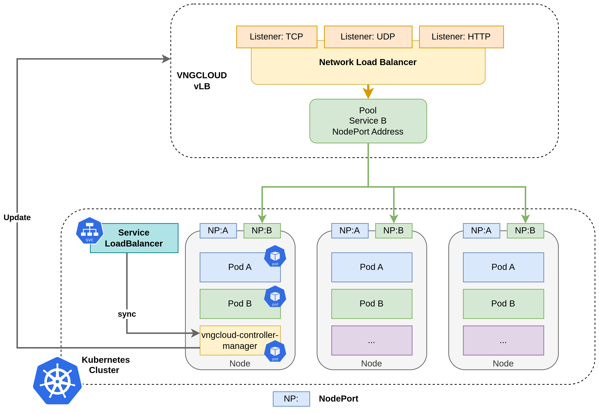

# Làm việc với Network load balancing (NLB)

### NLB là gì? 

* **Network Load Balancer (NLB)** là một bộ cân bằng tải được cung cấp bởi GreenNode giúp phân phối lưu lượng truy cập mạng đến nhiều máy chủ back-end (backend servers) trong một nhóm máy tính (instance group). NLB hoạt động ở layer 4 của mô hình OSI, giúp cân bằng tải dựa trên địa chỉ IP và cổng TCP/UDP. Để biết thêm thông tin chi tiết về NLB, vui lòng tham khảo tại \[How it works (NLB)]

#### Mô hình triển khai 

<figure><figcaption></figcaption></figure>

* **GreenNode LoadBalancer Controller**: GreenNode LoadBalancer Controller là một bộ điều khiển chạy trên các cụm Kubernetes được triển khai trên GreenNode. Nó chịu trách nhiệm cho việc quản lý các tài nguyên GreenNode cho các cụm Kubernetes, bao gồm:
  * **Tạo và quản lý Network Load Balancer (NLB)** cho các Service Kubernetes có service type = Load Balancer.
