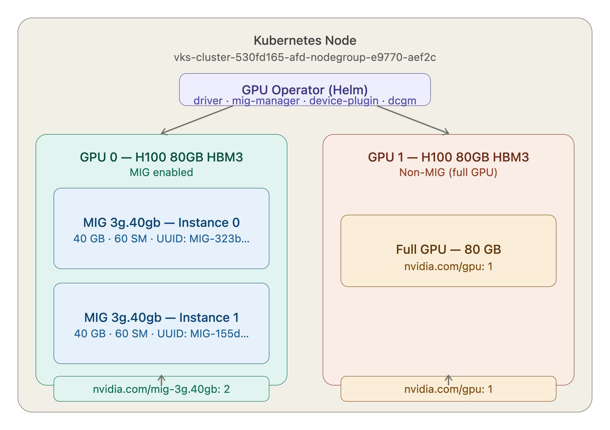
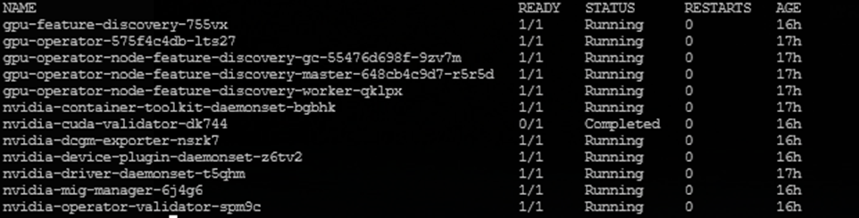
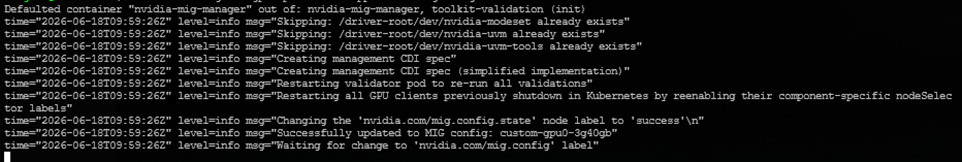

# Sử dụng Multi-Instance GPU (MIG) trên VKS

> Hướng dẫn này giúp bạn cấu hình **Multi-Instance GPU (MIG)** trên VKS để phân chia GPU NVIDIA H100 thành nhiều MIG instance độc lập — mỗi instance có VRAM và Streaming Multiprocessors riêng biệt, đảm bảo isolation hoàn toàn giữa các workload.

<figure><figcaption><p>Kiến trúc MIG trên VKS: GPU Operator quản lý cả GPU MIG (2x 3g.40gb) và non-MIG (full 80GB) trên cùng một node</p></figcaption></figure>

---

## Điều kiện cần (Prerequisites)

- Đã có VKS Cluster đang hoạt động với node group sử dụng GPU **NVIDIA H100** (hoặc Ampere/Hopper trở lên — MIG chỉ hỗ trợ từ kiến trúc Ampere).
- Đã cài đặt `kubectl` và `helm` trên máy local.
- Đã cài đặt `yq` version ≥ 4 để merge YAML an toàn (xem Bước 2).
- `kubectl` đã được kết nối đến cluster. Kiểm tra bằng `kubectl get nodes`.

---

## Bước 1: Cài GPU Operator với MIG Strategy `mixed`

MIG trên VKS yêu cầu NVIDIA GPU Operator. VKS node **không có** NVIDIA driver được cài sẵn nên bắt buộc bật `driver.enabled=true`.

**Chiến lược `mixed`** cho phép dùng cả GPU ở chế độ MIG và non-MIG trên cùng một node — ví dụ: GPU 0 phân mảnh thành MIG instances, GPU 1 giữ nguyên full GPU.

**Bước 1.1: Thêm Helm repo NVIDIA và cài GPU Operator**

```bash
helm repo add nvidia https://helm.ngc.nvidia.com/nvidia
helm repo update

helm install gpu-operator nvidia/gpu-operator \
  --namespace gpu-operator \
  --create-namespace \
  --set driver.enabled=true \
  --set mig.strategy=mixed \
  --set toolkit.enabled=true \
  --timeout=15m
```

**Bước 1.2: Kiểm tra trạng thái pods**

Đợi khoảng **5–10 phút** để GPU Operator deploy driver container vào node, sau đó chạy:

```bash
kubectl -n gpu-operator get pods -owide
```

Tất cả pods phải ở trạng thái `Running` hoặc `Completed`:

| Pod | Trạng thái kỳ vọng |
|---|---|
| `gpu-feature-discovery` | Running |
| `nvidia-container-toolkit` | Running |
| `nvidia-cuda-validator` | Completed |
| `nvidia-dcgm-exporter` | Running |
| `nvidia-device-plugin-daemonset` | Running |
| `nvidia-driver-daemonset` | Running |
| `nvidia-mig-manager` | Running |
| `nvidia-operator-validator` | Running |

<figure><figcaption><p>Tất cả GPU Operator pods ở trạng thái Running/Completed</p></figcaption></figure>


VKS node không có NVIDIA driver được cài sẵn. Nếu bỏ `driver.enabled=true`, pod `nvidia-device-plugin` sẽ không khởi động được và node sẽ không expose GPU resource nào.


---

## Bước 2: Tạo custom MIG ConfigMap

GPU Operator tự động overwrite `default-mig-parted-config` sau mỗi reconcile. Vì vậy bạn **phải tạo một ConfigMap mới với tên khác** và trỏ `migManager.config.name` vào đó.


Không dùng `cat >> heredoc` để thêm profile vào file YAML. Heredoc giữ nguyên literal whitespace, trong khi YAML rất nhạy cảm với indent — sai 1 dấu cách sẽ khiến MIG Manager báo lỗi `"selected mig-config not present"`. Dùng `yq` để merge chính xác.


**Bước 2.1: Cài `yq` nếu chưa có**

```bash
wget -qO /usr/local/bin/yq \
  https://github.com/mikefarah/yq/releases/latest/download/yq_linux_amd64
chmod +x /usr/local/bin/yq
```

**Bước 2.2: Lấy config gốc từ ConfigMap mặc định**

```bash
kubectl get configmap default-mig-parted-config -n gpu-operator \
  -o jsonpath='{.data.config\.yaml}' > /tmp/mig-base.yaml
```

**Bước 2.3: Merge profile mới vào file YAML bằng `yq`**

```bash
yq -i '.mig-configs.custom-gpu0-3g40gb = [
  {"devices": [0], "mig-enabled": true, "mig-devices": {"3g.40gb": 2}},
  {"devices": [1], "mig-enabled": false, "mig-devices": {}}
]' /tmp/mig-base.yaml
```

Trong ví dụ này:
- **GPU 0** được bật MIG với profile `3g.40gb` — chia thành 2 instances, mỗi instance có 40 GB VRAM và 60 Streaming Multiprocessors.
- **GPU 1** giữ nguyên non-MIG (full 80 GB).

**Bước 2.4: Kiểm tra cấu trúc YAML trước khi apply**

```bash
# Verify profile mới đã được thêm vào
yq '.mig-configs | keys' /tmp/mig-base.yaml

# Dry-run để kiểm tra format đúng
kubectl create configmap custom-mig-parted-config \
  -n gpu-operator \
  --from-file=config.yaml=/tmp/mig-base.yaml \
  --dry-run=client -o yaml | grep -A8 "custom-gpu0"
```

**Bước 2.5: Tạo ConfigMap và upgrade GPU Operator**

```bash
# Tạo ConfigMap mới
kubectl create configmap custom-mig-parted-config \
  -n gpu-operator \
  --from-file=config.yaml=/tmp/mig-base.yaml

# Upgrade GPU Operator để trỏ sang ConfigMap mới
helm upgrade gpu-operator nvidia/gpu-operator \
  --namespace gpu-operator \
  --set driver.enabled=true \
  --set mig.strategy=mixed \
  --set migManager.config.name=custom-mig-parted-config \
  --timeout=10m
```


Helm value `migManager.config.default` chỉ chấp nhận `"all-disabled"` hoặc `""`. Để trỏ sang ConfigMap tùy chỉnh, dùng `migManager.config.name`.


---

## Bước 3: Apply MIG config lên Node

Gán label `nvidia.com/mig.config` cho node để kích hoạt MIG profile:

```bash
kubectl label node <TEN_NODE> \
  nvidia.com/mig.config=custom-gpu0-3g40gb --overwrite
```

Theo dõi log của MIG Manager để xác nhận config được apply thành công:

```bash
kubectl logs -n gpu-operator -l app=nvidia-mig-manager -f
```

Kết quả thành công:

```
level=info msg="Updating to MIG config: custom-gpu0-3g40gb"
level=info msg="Successfully updated to MIG config: custom-gpu0-3g40gb"
level=info msg="Changing the 'nvidia.com/mig.config.state' node label to 'success'"
```

<figure><figcaption><p>MIG Manager xác nhận apply config thành công với trạng thái "success"</p></figcaption></figure>

---

## Bước 4: Verify node resources

Kiểm tra node đã expose đúng MIG resources:

```bash
kubectl get node <TEN_NODE> \
  -o json | jq '.status.capacity | with_entries(select(.key | contains("nvidia")))'
```

Kết quả kỳ vọng (với cấu hình 2x MIG `3g.40gb` + 1 full GPU):

```json
{
  "nvidia.com/gpu": "1",
  "nvidia.com/mig-3g.40gb": "2"
}
```

Kiểm tra các node labels do MIG Manager gán:

```bash
kubectl get node <TEN_NODE> -o json \
  | jq '.metadata.labels | with_entries(select(.key | contains("mig")))'
```

| Label | Giá trị ví dụ | Ý nghĩa |
|---|---|---|
| `nvidia.com/mig-3g.40gb.count` | `2` | Số MIG instance |
| `nvidia.com/mig-3g.40gb.memory` | `40448 MiB` | VRAM mỗi instance |
| `nvidia.com/mig-3g.40gb.multiprocessors` | `60` | Số Streaming Multiprocessors |
| `nvidia.com/mig.config.state` | `success` | Trạng thái apply config |
| `nvidia.com/mig.strategy` | `mixed` | Chiến lược MIG đang dùng |

<figure><figcaption><p>Node expose đúng 2 MIG instances (mig-3g.40gb: 2) và 1 full GPU (gpu: 1)</p></figcaption></figure>

---

## Bước 5: Deploy workload sử dụng MIG instance

Khai báo `nvidia.com/mig-3g.40gb` trong `resources.limits` — Kubernetes scheduler sẽ tự động phân phối MIG instance cho Pod mà không cần cấu hình thêm.

Deploy 2 pods song song để kiểm tra isolation:

```bash
kubectl apply -f - <<EOF
apiVersion: v1
kind: Pod
metadata:
  name: mig-test-0
spec:
  restartPolicy: Never
  containers:
  - name: cuda
    image: nvidia/cuda:12.1.0-base-ubuntu22.04
    command: ["nvidia-smi", "-L"]
    resources:
      limits:
        nvidia.com/mig-3g.40gb: "1"
---
apiVersion: v1
kind: Pod
metadata:
  name: mig-test-1
spec:
  restartPolicy: Never
  containers:
  - name: cuda
    image: nvidia/cuda:12.1.0-base-ubuntu22.04
    command: ["nvidia-smi", "-L"]
    resources:
      limits:
        nvidia.com/mig-3g.40gb: "1"
EOF

kubectl logs mig-test-0
kubectl logs mig-test-1
```

Mỗi Pod sẽ nhận một MIG UUID khác nhau — xác nhận isolation hoàn toàn:

```
# mig-test-0
MIG 3g.40gb Device 0: (UUID: MIG-323b277e-e3e9-519a-9042-c8552ea98ed9)

# mig-test-1
MIG 3g.40gb Device 0: (UUID: MIG-155d0cb1-2b7a-528c-8f8f-aeb1ab1e9d52)
```

<figure><figcaption><p>Mỗi Pod được assign MIG UUID riêng biệt — isolation hoàn toàn giữa các workload</p></figcaption></figure>

---

## (Tuỳ chọn) Bước 6: Dọn dẹp

```bash
# Xóa test pods
kubectl delete pod mig-test-0 mig-test-1

# Full cleanup GPU Operator (nếu muốn cài lại từ đầu)
helm uninstall gpu-operator -n gpu-operator --no-hooks
kubectl delete namespace gpu-operator --force --grace-period=0
kubectl label node <TEN_NODE> nvidia.com/mig.config- --overwrite
```

---

## Kết quả

Sau khi hoàn thành, node VKS của bạn expose đồng thời cả MIG instances và full GPU:

| Resource | K8s Resource Name | Capacity |
|---|---|---|
| GPU 0 — MIG (2x `3g.40gb`) | `nvidia.com/mig-3g.40gb` | 2 |
| GPU 1 — non-MIG (full 80 GB) | `nvidia.com/gpu` | 1 |

Mỗi MIG instance `3g.40gb` có: **40 GB VRAM · 60 SM · isolation hoàn toàn**.

| Tôi muốn tiếp theo... | Đi đến |
|---|---|
| Giám sát GPU resources | [Giám sát hoạt động GPU Resources](lam-viec-voi-nvidia-gpu-nodegroups.md#giam-sat-hoat-dong-gpu-resources) |
| Autoscale GPU Nodegroup | [Autoscaling GPU Resources](lam-viec-voi-nvidia-gpu-nodegroups.md#autoscaling-gpu-resources) |
| So sánh các GPU Sharing modes | [Thiết lập GPU Sharing](lam-viec-voi-nvidia-gpu-nodegroups.md#thiet-lap-gpu-sharing) |
