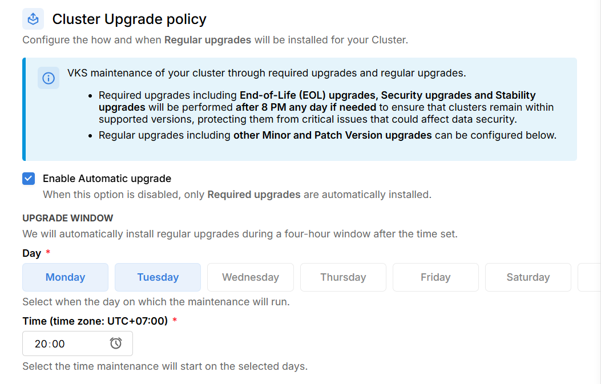

# Automatically Upgrade

## **Tổng quan**

**Automatically Upgrade Cluster trên VKS** là quá trình hệ thống VKS tự động nâng cấp cluster theo upgrade window mà bạn chỉ định, hoặc tự động nâng cấp nhằm cải thiện hiệu suất, bảo mật và khả năng tương thích của hệ thống. Hiện tại, VKS cung cấp 2 loại tự động nâng cấp bao gồm:

### **1. Required Upgrades (Nâng cấp bắt buộc)**

* **Mục đích**: Các nâng cấp bắt buộc nhằm bảo vệ cụm khỏi các rủi ro liên quan đến bảo mật, ổn định và việc sử dụng các phiên bản Kubernetes không còn được hỗ trợ.
* **Cụ thể**: hệ thống VKS sẽ thực hiện upgrade cluster trong các trường hợp:
  * **End-of-Life (EOL) Upgrades**: Cập nhật Cluster lên các phiên bản mới hơn khi phiên bản hiện tại của Cluster sắp hết hạn.
  * **Security Upgrades**: Vá các lỗ hổng bảo mật, đảm bảo an toàn dữ liệu.
  * **Stability Upgrades**: Sửa các lỗi nghiêm trọng ảnh hưởng đến sự ổn định của hệ thống.
* **Thời gian thực hiện**:
  * Các nâng cấp này sẽ được hệ thống VKS tự động thực hiện <mark style="color:red;">**sau 8 giờ tối vào bất kỳ ngày nào**</mark> nếu cần, nhằm giảm thiểu ảnh hưởng đến bạn. Chúng tôi sẽ thông báo cho bạn về các nâng cấp này trong thời gian sớm nhất.

### **2. Regular Upgrades (Nâng cấp thông thường)**

* **Mục đích**: Các nâng cấp định kỳ theo **upgrade window** mà bạn chỉ định nhằm giúp cluster của bạn luôn cập nhật với các phiên bản mới nhất, bao gồm cả **minor version** và **patch version**.
* **Cụ thể**:&#x20;
  * **Minor Version Upgrades**: Cập nhật các tính năng và API mới. Ví dụ, nếu cluster hiện tại đang sử dụng phiên bản 1.28.2, hệ thống sẽ tự động nâng cấp lên phiên bản 1.29.6.
  * **Patch Version Upgrades**: Vá lỗi nhỏ và cải thiện hiệu suất. Ví dụ, nếu cluster hiện tại đang sử dụng phiên bản 1.29.1, hệ thống sẽ tự động nâng cấp lên phiên bản 1.29.2.
*   **Thời gian thực hiện**:

    * Bạn có thể tự cấu hình lịch trình nâng cấp thông qua **VKS Portal** theo hướng dẫn dưới đây. Sau khi bạn chọn lịch auto-upgrade qua VKS Portal, hệ thống sẽ **bắt đầu thực hiện nâng cấp sau ít nhất&#x20;**<mark style="color:red;">**6 ngày**</mark> kể từ ngày hiện tại. Thời gian này giúp bạn có đủ thời gian để chuẩn bị và kiểm tra trước khi nâng cấp diễn ra.
    * Hệ thống sẽ **lặp lại cho các tuần kế tiếp** kể từ lần nâng cấp trước đó và tuân theo các ngày đã được bạn chọn.
    * **Trước mỗi lần nâng cấp**, hệ thống sẽ gửi một **email thông báo** cho bạn trước 6 ngày tính tới thời điểm chạy auto-upgrade thực tế. Trong email, chúng tôi sẽ nêu rõ thời gian cụ thể mà việc auto-upgrade sẽ diễn ra.
    * Nếu **chọn nhiều ngày trong tuần** (như Thứ Hai, Thứ Năm), hệ thống sẽ tính toán chu kỳ nâng cấp cho các ngày đã chọn, không ảnh hưởng đến các ngày khác.

    _Vui lòng tham khảo 2 ví dụ bên dưới để hiểu rõ cách hệ thống VKS thực hiện chạy Regular Upgrade._

Trường hợp 1: Bạn chọn lịch chạy là Thứ Ba hằng tuần vào lúc 08:00 PM

Giả sử _**Hôm nay là Thứ Hai (02/12/2024)**_

* _Bạn chọn auto-upgrade vào **Thứ Ba, 08:00 PM**._
* _Lịch trình hoạt động của hệ thống sẽ như sau:_
  * _**Ngày 04/12/2024 (Thứ Tư)**: Gửi email thông báo lịch nâng cấp **lần 1**._
  * _**Ngày 10/12/2024 (Thứ Ba, 08:00 PM)**: Thực hiện **auto-upgrade lần 1 thành công.**_
  * _**Ngày 11/12/2024 (Thứ Tư)**: Gửi email thông báo lịch nâng cấp **lần 2**._
  * _**Ngày 17/12/2024 (Thứ Ba, 08:00 PM)**: Thực hiện **auto-upgrade lần 2 thành công.**_
  * _**Ngày 18/12/2024 (Thứ Tư)**: Gửi email thông báo lịch nâng cấp **lần 3**._
  * _**Ngày 24/12/2024 (Thứ Ba, 08:00 PM)**: Thực hiện **auto-upgrade lần 3 thành công**, và tiếp tục lặp lại._

Trường hợp 2: Bạn chọn lịch chạy Auto-upgrade là Thứ Hai và Thứ Năm hằng tuần vào lúc 12:00 PM

_Giả sử **Hôm nay là Thứ Ba (03/12/2024)**_

* _Bạn chọn auto-upgrade vào **Thứ Hai và Thứ Năm, 12:00 PM**._
* _Lịch trình hoạt động của hệ thống sẽ như sau:_

_**Lịch Thứ Năm (12:00 PM)**:_

* _**Ngày 06/12/2024 (Thứ Sáu)**: Gửi email thông báo lịch nâng cấp **lần 1**._
* _**Ngày 12/12/2024 (Thứ Năm, 12:00 PM)**: Thực hiện **auto-upgrade lần 1 thành công.**._
* _**Ngày 13/12/2024 (Thứ Sáu)**: Gửi email thông báo lịch nâng cấp **lần 2**._
* _**Ngày 19/12/2024 (Thứ Năm, 12:00 PM)**: Thực hiện **auto-upgrade lần 2 thành công.**._
* _**Ngày 20/12/2024 (Thứ Sáu)**: Gửi email thông báo lịch nâng cấp **lần 3**._
* _**Ngày 26/12/2024 (Thứ Năm, 12:00 PM)**: Thực hiện **auto-upgrade lần 3 thành công,** và tiếp tục lặp lại._

_**Lịch Thứ Hai(12:00 PM)**:_

* _**Ngày 10/12/2024 (Thứ Ba)**: Gửi email thông báo lịch nâng cấp **lần 1**._
* _**Ngày 16/12/2024 (Thứ Hai, 12:00 PM)**: Thực hiện **auto-upgrade lần 1 thành công.**._
* _**Ngày 17/12/2024 (Thứ Ba)**: Gửi email thông báo lịch nâng cấp **lần 2**._
* _**Ngày 23/12/2024 (Thứ Hai, 12:00 PM)**: Thực hiện **auto-upgrade lần 2 thành công..**_
* _**Ngày 24/12/2024 (Thứ Ba)**: Gửi email thông báo lịch nâng cấp **lần 3**._
* _**Ngày 30/12/2024 (Thứ Hai, 12:00 PM)**: Thực hiện **auto-upgrade lần 3 thành công,** và tiếp tục lặp lại._


**Chú ý:**

* Hệ thống VKS **sẽ cố gắng thực hiện nâng cấp** theo lịch trình mà bạn đã cấu hình qua **VKS Portal**. Tuy nhiên, tùy thuộc vào tải của hệ thống, **một số lần nâng cấp có thể bị hoãn** hoặc không thực hiện đúng như lịch. Khi đó, hệ thống sẽ tự động chuyển lịch nâng cấp sang **thời điểm thích hợp tiếp theo**, chính là chu kỳ lặp lại trong tuần tiếp theo.


***

## **Các bước thực hiện**

Bên dưới là hướng dẫn thực hiện cập nhật Upgrade Policy trên hệ thống VKS:

**Bước 1:** Truy cập vào [https://vks.console.vngcloud.vn/overview](https://vks.console.vngcloud.vn/overview)

**Bước 2:** Chọn **Create a Cluster.**

**Bước 3:** Tại màn hình khởi tạo Cluster, chúng tôi đã thiết lập thông tin cho Cluster và một **Default Node Group.** Tại mục Cluster Upgrade policy, bạn có thể chọn **Enable/ Disable Automatic upgrade.** Trong đó:

* **Enable Automatic upgrade,** lúc này:
  * Các nâng cấp **Required Upgrades** sẽ được thực hiện tự động sau 8 PM bất kỳ ngày nào bởi hệ thống VKS khi cần.
  * Các nâng cấp **Regular Upgrades** sẽ được thực hiện theo lịch trình do bạn thiết lập.
* **Disable Automatic upgrade, lúc này**:
  * Chỉ các nâng cấp **Required Upgrades** mới được thực hiện tự động sau 8 PM bất kỳ ngày nào bởi hệ thống VKS khi cần.

**Bước 4:** Nếu bạn chọn **Enable Automatic upgrade**, vui lòng chọn thời gian hệ thống có thể thực hiện nâng cấp. Cụ thể, bạn cần:

* **Chọn một hoặc nhiều ngày** trong tuần mà hệ thống VKS có thể thực hiện auto-upgrade (ví dụ: Monday, Tuesday, ...).
* **Chọn một mốc thời gian** cụ thể mà bạn mong muốn hệ thống VKS thực hiện auto-upgrade (ví dụ: 20:00 (08:00 PM - theo múi giờ UTC+07:00)

<figure><figcaption></figcaption></figure>

**Bước 5:** Chọn **Create Kubernetes cluster/ Update Cluster.** Hãy chờ vài phút để chúng tôi khởi tạo/ chỉnh sửa Cluster của bạn, trạng thái của Cluster lúc này là **Creating/ Updating**.

**Bước 6:** Khi trạng thái **Cluster** là **Active**, tức là hệ thống VKS đã hoàn thành việc tạo/ chỉnh sửa cluster này.

***

## **Quy tắc hoạt động của hệ thống**

### Required Upgrade

Trên hệ thống VKS, required upgrades bao gồm **End-of-Life (EOL) Upgrades, Security Upgrades, Stability Upgrades**. Required Upgrades sẽ được thực hiện **sau 8:00 PM** vào bất kỳ ngày nào cần thiết. Những nâng cấp này không tuân theo lịch trình cố định mà được kích hoạt khi hệ thống phát hiện cần đảm bảo:

* Cluster đang sử dụng phiên bản Kubernetes vẫn nằm trong danh sách được hỗ trợ.
* Tránh các vấn đề nghiêm trọng có thể gây rủi ro đến bảo mật hoặc dữ liệu.

Trước khi thực hiện Required Upgrade, hệ thống sẽ gửi email thông báo chi tiết cho bạn, bao gồm:

* Thông tin Cluster/ Node Group dự kiến được nâng cấp.
* Phiên bản hiện tại và Phiên bản nâng cấp dự kiến.
* Ngày và giờ dự kiến thực hiện nâng cấp,...

Sau khi nâng cấp hoàn tất, hệ thống sẽ gửi email xác nhận tình trạng cluster và các thay đổi liên quan.

Riêng đối với trường hợp Force Upgrade, khi phát hiện ra Kubernetes version của bạn sắp hết hạn hỗ trợ. Chúng tôi sẽ gửi email thông báo cho bạn trước **60 ngày, 30 ngày, 7 ngày và 1 ngày**. Trong thời gian này, bạn có thể thực hiện nâng cấp thủ công phiên bản Kubernetes theo hướng dẫn tại [đây](https://apc01.safelinks.protection.outlook.com/?url=https%3A%2F%2Fu12870758.ct.sendgrid.net%2Fls%2Fclick%3Fupn%3Du001.vda61hAEHzraUZiFEAx2oFVwlFdN4LK9jzTWVipAv4Ks2IHGnkvYOFwnYGbrLakFycDoYbAVN5NzCOJfc8btlUf0C77d9kMqanNkpXeqyOed2Za4v-2B9srFvWJWYzR6wccSV5_dyDPiFevWkF3IFJSeHahtiBTRoMTaCXpghDa7DsTdVrJTPv7hvyDghooxcnmQyXMrLB4L-2B-2BRR3LAy-2Bz6SXuE-2BEmWbsFDbRxo0f-2FN4wIKearThhV4M6FLKHonBeu0NWgCtLmGYir0vP35-2BfHkuoCPFU4btgSBv-2FAq3VqaabRH3XftKYUfBwlBM0joi6BHgcDV-2FczRMF3Wi9RCszUWj5PYkw-3D-3D\&data=05%7C02%7Cthuyvt2%40vng.com.vn%7C84fe08d3a6524d2196c608dd08435432%7C7c112a6e10e24e09afc42e37bc60d821%7C0%7C0%7C638675807483573382%7CUnknown%7CTWFpbGZsb3d8eyJFbXB0eU1hcGkiOnRydWUsIlYiOiIwLjAuMDAwMCIsIlAiOiJXaW4zMiIsIkFOIjoiTWFpbCIsIldUIjoyfQ%3D%3D%7C0%7C%7C%7C\&sdata=O2rFFsH4CpQe54CPzNRB2IAidvE7jhn4j6tl3vjuNlA%3D\&reserved=0). Sau thời gian này, nếu bạn không thực hiện nâng cấp thủ công, chúng tôi sẽ tiến hành force upgrade lên phiên bản Kubernetes được hỗ trợ gần nhất. Tùy thuộc vào workload của bạn mà quá trình nâng cấp có thể gây gián đoạn dịch vụ trong khoảng thời gian khác nhau. Vui lòng tham khảo mục bên dưới để biết chi tiết.

***

### **Regular Upgrades**

Regular Upgrades bao gồm các nâng cấp **Minor** và **Patch** nhằm cải thiện hiệu năng, tính năng mới, và sửa các lỗi nhỏ trong hệ thống Kubernetes. Bạn có thể tự cấu hình lịch Regular Upgrades thông qua **VKS Portal**. Hệ thống sẽ cố gắng thực hiện nâng cấp trong cluster theo ngày, giờ mà bạn đã chỉ định.&#x20;

Trước khi thực hiện Regular Upgrade, hệ thống sẽ gửi email thông báo chi tiết cho bạn, bao gồm:

* Thông tin Cluster/ Node Group dự kiến được nâng cấp.
* Phiên bản hiện tại và Phiên bản nâng cấp dự kiến.
* Ngày và giờ dự kiến thực hiện nâng cấp,...

Sau khi nâng cấp hoàn tất, hệ thống sẽ gửi email xác nhận tình trạng cluster và các thay đổi liên quan.

Trước thời điểm hệ thống thực hiện tự động nâng cấp, nếu bạn thực hiện thay đổi Upgrade Window hoặc thực hiện nâng cấp thủ công, hệ thống sẽ bỏ qua lần nâng cấp tự động này. Trong trường hợp đó, bạn có thể bỏ qua email thông báo là chúng tôi gửi này.  ùy thuộc vào workload của bạn mà quá trình nâng cấp có thể gây gián đoạn dịch vụ trong khoảng thời gian khác nhau. Vui lòng tham khảo mục bên dưới để biết chi tiết.

***

## **Tối Ưu Hóa Quá Trình Upgrade và Giảm Thiểu Downtime Khi Upgrade Kubernetes Version**

Nâng cấp Kubernetes cluster là một bước quan trọng để duy trì tính ổn định, bảo mật và hiệu suất của hệ thống. Tuy nhiên, quá trình này có thể dẫn đến downtime nếu không được thực hiện đúng cách. Sau đây là chi tiết các nguyên nhân phổ biến gây gián đoạn, đồng thời cung cấp các giải pháp giúp bạn giảm thiểu rủi ro trong quá trình nâng cấp.

Khi nâng cấp cluster, hai thành phần chính được nâng cấp:

* **Control Plane (Kubernetes API Server)**: Thành phần này được thay thế bằng một phiên bản mới. Trong quá trình này, API server sẽ không khả dụng trong vài phút, nhưng workload sẽ không bị ảnh hưởng.
* **Worker Nodes**: Các node này được nâng cấp theo cơ chế **rolling update**, từng node một trong mỗi node group.

Quy trình nâng cấp node group:

* **Bước 1:** Hệ thống VKS thực hiện xác định các node cần nâng cấp.
* **Bước 2:** Hệ thống VKS thực hiện drain node, tức là di chuyển tất cả các pod đang chạy trên node cũ chưa nâng cấp này sang các node khác.&#x20;
* **Bước 3:** Hệ thống sẽ tạo lại node mới với cấu hình đã được thiết lập trên node group và thực hiện join node này vào cụm. Nếu sau khi khởi động lại, node vẫn báo cáo trạng thái "NotReady", hệ thống sẽ tiếp tục khởi động lại node cho đến khi node trở lại trạng thái hoạt động bình thường.

Nếu **surge upgrades** được kích hoạt, hệ thống sẽ tạo tối đa 10 node mới trước khi bắt đầu nâng cấp các node hiện tại. Điều này giúp đảm bảo workload có đủ tài nguyên chạy trong suốt quá trình nâng cấp.

### **Các Nguyên Nhân Gây Downtime Hoặc Việc Upgrade Không Thành Công và Cách Giải Quyết**

* **Pods Không Đủ Replicas Hoặc Không Được Triển Khai Qua Deployment/StatefulSet:** Nếu pod không có đủ replicas hoặc không được triển khai với Deployment/StatefulSet, khi node chứa pod này bị nâng cấp, dịch vụ sẽ ngừng hoạt động. **Giải pháp:**
  * Đảm bảo các pod quan trọng luôn có số lượng replicas >=2.
  * Sử dụng Deployment hoặc StatefulSet để tự động quản lý pods.
* **Pod Disruption Budget (PDB) Cấu Hình Quá Nhỏ:** PDB giới hạn số lượng pod có thể bị gián đoạn tại một thời điểm. Nếu cấu hình quá nhỏ, quá trình nâng cấp có thể bị treo. **Giải pháp:**
  * Cấu hình PDB phù hợp với yêu cầu của ứng dụng (ví dụ: cho phép ít nhất 1 pod luôn hoạt động).&#x20;
* **Persistent Volume (PV) Không Được Cấu Hình Với ReadWriteMany:** PV với chế độ `ReadWriteOnce` chỉ có thể được gắn vào một node duy nhất. Khi node này nâng cấp, PV cần được di chuyển, gây downtime. **Giải pháp:**
  * Sử dụng chế độ `ReadWriteMany` nếu ứng dụng yêu cầu dữ liệu khả dụng trên nhiều node.
* **Pods Thiếu Liveness và Readiness Probes:** Nếu không có probes, Kubernetes không thể xác định trạng thái của pod, dẫn đến routing sai hoặc downtime. **Giải pháp:**
  * Cấu hình **Liveness Probes** để kiểm tra pod có hoạt động đúng cách.
  * Cấu hình **Readiness Probes** để đảm bảo chỉ route traffic đến các pod đã sẵn sàng.
* **Workload Mất Cân Bằng (Affinity/Anti-Affinity):** Quy tắc Affinity/Anti-Affinity quá chặt chẽ có thể khiến Kubernetes không tìm được đủ node để khởi động lại pod. **Giải pháp:**
  * Điều chỉnh các quy tắc Affinity/Anti-Affinity sao cho hợp lý.
  * Kết hợp với **surge upgrades** để tăng thêm tài nguyên tạm thời. **Surge Upgrades** là một tính năng giúp tạo các node mới trước khi nâng cấp các node hiện tại. Điều này đảm bảo workload có tài nguyên dự phòng, giúp tăng tốc quá trình nâng cấp và hạn chế downtime.

Ngoài ra, để việc upgrade diễn ra thành công, bạn cũng cần xem xét tới 2 vấn đề sau:

* **Billing Problem:** Khi thực hiện upgrade, hệ thống VKS sẽ thực hiện drain node cũ, tạo node mới trước khi thực hiện xóa node cũ, do đó, tại thời điểm hệ thống thực hiện upgrade, chi phí của cluster sẽ tạm thời tăng. Nếu số dư credit không đủ, hệ thống không thể tạo node mới, khiến quá trình nâng cấp bị gián đoạn. **Giải pháp:**
  * Theo dõi thông báo lịch **upgrade qua email và chuẩn bị số dư credit** đủ để hệ thống thực hiện nâng cấp.
* **Resource Quota Problem:** Trong trường hợp số lượng node mà bạn có thể tạo do vượt quá quota hiện tại, việc nâng cấp Kubernetes có thể bị gián đoạn vì không thể tạo thêm node mới. Điều này đặc biệt quan trọng khi sử dụng **Surge Upgrade**, nơi hệ thống cần tạo thêm các node mới trước khi xóa các node cũ để đảm bảo tính liên tục của dịch vụ. **Giải pháp:**
  * Theo dõi thông báo lịch **upgrade qua email và thực hiện yêu cầu nâng cấp quota nếu có.**

Trong trường hợp bạn muốn chủ động kiểm soát việc nâng cấp Kubernetes Cluster (manually upgrade) và không muốn hệ thống tự động thực hiện nâng cấp, bạn có thể tắt tính năng **Regular Upgrade** bằng cách bỏ chọn **Enable Automatic Upgrade**.

<figure><figcaption></figcaption></figure>
