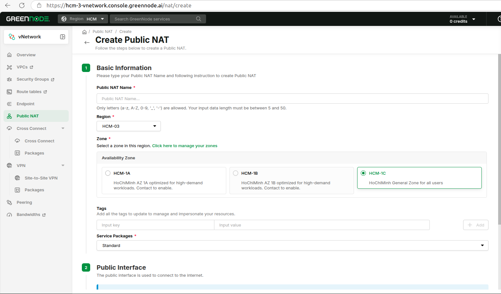
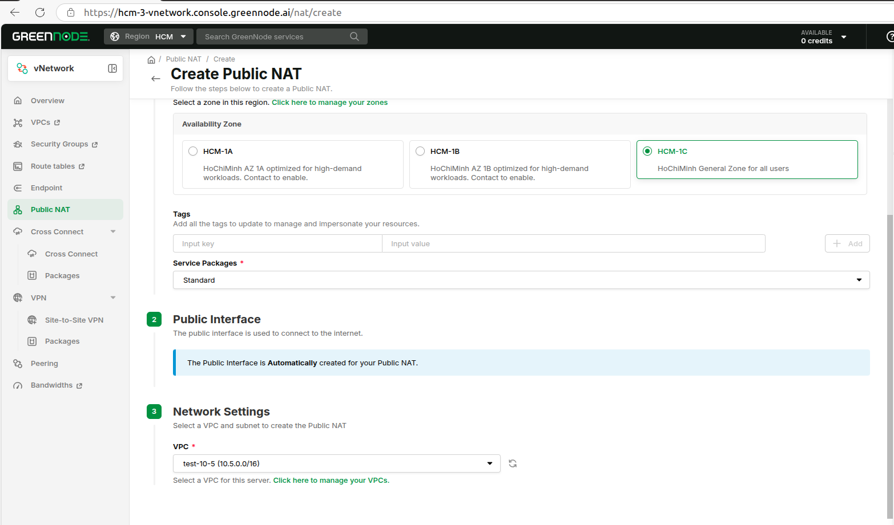

# Tạo mới Public NAT


**Quan trọng**

* Mọi máy ảo trong cùng VPC (toàn dải /16) đều ra internet qua NAT được — không bắt buộc nằm trên subnet của NAT. (Ở V1 máy ảo phải cùng subnet với NAT.)
* Interface public của NAT được tạo tự động khi NAT khởi tạo thành công. Bạn có thể thêm IP public vào gói [băng thông đã mua](https://docs.greennode.ai/vng-cloud-document/vserver/compute-hcm03-1a/vpc/bandwidth/datatransfers-bandwidth-service) (nếu có) để tăng băng thông cho NAT.
* Mặc định, NAT cho phép một số dịch vụ ra ngoài phổ biến từ VPC: DNS (UDP 53), HTTP (TCP 80), HTTPS (TCP 443) và ICMP (ping). Để mở thêm cổng/giao thức khác, hãy thêm inbound rule (xem [Thêm / Xóa cổng NAT](/broken/pages/b3417cbeb4fa126b1bfc86e92117b56bd6618017)).
* Với V2, route từ VPC ra internet qua NAT gateway được thêm tự động vào route table của VPC. Bạn không cần cấu hình route trên từng máy.


* Đăng nhập https://hcm-3-vnetwork.console.greennode.ai/nat/list với region HCM.
* Chọn menu "Public NAT", rồi chọn "Create a Public NAT".



## Bước 1 — Basic Information (Thông tin cơ bản)

* **Public NAT Name** (Tên NAT) — chỉ cho phép chữ (a–z, A–Z), số (0–9), `_` và `-`; độ dài 5–50 ký tự.
* **Region** — chọn region (ví dụ HCM-03).
* **Availability Zone** — chọn zone đặt NAT.
* **Tags** (tùy chọn) — thêm thẻ key/value để dễ quản lý tài nguyên.
* **Service Package** (Gói dịch vụ) — chọn gói (ví dụ Standard).

<figure><figcaption></figcaption></figure>



## Bước 2 — Public Interface

* Public interface dùng để kết nối ra internet. Nó được tạo tự động cho Public NAT — không cần nhập gì.



## Bước 3 — Network Settings (Cấu hình mạng)

* **VPC** — chọn VPC để tạo Public NAT (dải CIDR như 10.5.0.0/16 hiện bên cạnh tên).

<figure><figcaption></figcaption></figure>

Network Settings

* Kiểm tra giá ở khung "Summary" bên phải.
* Nhấn "CREATE A PUBLIC NAT".

Khi NAT tạo thành công, nó xuất hiện trong danh sách NAT. Mở NAT để xem chi tiết, gồm NAT Gateway IP và Public IP.



## Định tuyến (tự động)

Với V2 bạn không cần đăng nhập từng máy ảo để thêm route. Khi tạo NAT, GreenNode tự động thêm route mặc định (0.0.0.0/0) trỏ tới NAT gateway vào route table của VPC. Nhờ đó mọi máy ảo trong VPC ra internet qua NAT mà không cần cấu hình thêm.


**Nếu một máy ảo vẫn không ra được internet**

Kiểm tra xem máy ảo có route mặc định riêng trỏ tới gateway khác đè lên route của VPC không. Nếu có, hãy xóa nó để lưu lượng đi theo route NAT đã thêm vào route table VPC.

