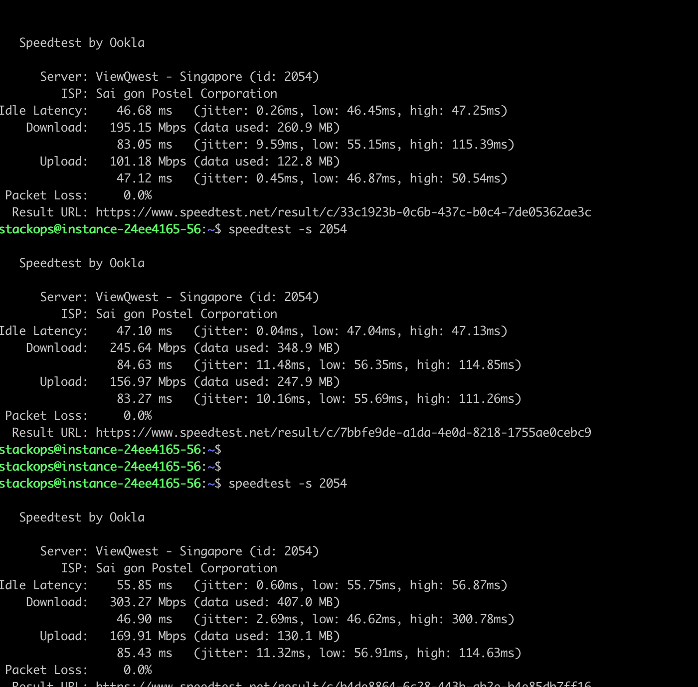
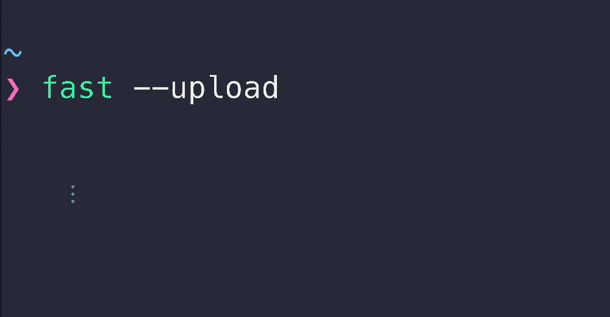

# Kiểm tra tốc độ Internet

Bạn có thể sử dụng ứng dụng Speedtest CLI trên hệ điều hành Linux, Ubuntu hoặc các phiên bản dựa trên Debian. Đây là một công cụ được cung cấp bởi Ookla để kiểm tra tốc độ Internet của bạn từ dòng lệnh. Lưu ý: Speedtest CLI cũng có sẵn trên nhiều hệ điều hành khác nhau, và lệnh cài đặt có thể khác nhau tùy thuộc vào hệ điều hành mà bạn đang sử dụng. Trong trường hợp bạn sử dụng hệ điều hành khác, hãy tham khảo tài liệu của [Speedtest CLI ](https://www.speedtest.net/apps/cli)để biết cách cài đặt và sử dụng cho hệ điều hành của bạn.

### **Kiểm tra tốc độ Internet bằng Speedtest CLI trên hệ điều hành Linux** 

Hãy làm theo các bước sau để cài đặt và sử dụng Speedtest CLI:

1. Mở cửa sổ terminal (dòng lệnh).
2.  Chạy lệnh sau để tải xuống và cài đặt :

    | `curl -s https://packagecloud.io/install/repositories/ookla/speedtest-cli/script.rpm.sh \| sudo bash` |
    | ----------------------------------------------------------------------------------------------------- |

    Lưu ý rằng lệnh này sẽ yêu cầu quyền quản trị, vì vậy bạn cần nhập mật khẩu quản trị để tiếp tục.
3.  Sau khi quá trình cài đặt hoàn tất, chạy lệnh sau để cài đặt Speedtest CLI: 

    | `sudo yum install speedtest` |
    | ---------------------------- |
4.  Khi quá trình cài đặt hoàn tất, bạn có thể thực hiện kiểm tra tốc độ Internet bằng cách chạy lệnh sau:

    | `speedtest` |
    | ----------- |

    Speedtest CLI sẽ tự động tìm máy chủ gần nhất để thực hiện kiểm tra và sau đó hiển thị kết quả tốc độ tải xuống và tải lên cũng như độ trễ. 

    <figure><figcaption></figcaption></figure>

    <figure><figcaption></figcaption></figure>
5.  Tuy nhiên sau 3 ngày, tốc độ sẽ giảm xuống **Download: 220.46 Mbps/s** và **Upload: 262.51 Mbps/s** như kết quả bên dưới: \
     

    <figure><figcaption></figcaption></figure>

    <figure><figcaption></figcaption></figure>

### **Kiểm tra tốc độ Internet bằng Speedtest CLI trên hệ điều hành Unbutu** 

Hãy làm theo các bước sau để cài đặt và sử dụng Speedtest CLI:

1. Mở cửa sổ terminal (dòng lệnh).
2.  Chạy lệnh sau để tải xuống và cài đặt :

    | `sudo apt-get install curlcurl -s https://packagecloud.io/install/repositories/ookla/speedtest-cli/script.deb.sh \| sudo bash` |
    | ------------------------------------------------------------------------------------------------------------------------------ |

    Lưu ý rằng lệnh này sẽ yêu cầu quyền quản trị, vì vậy bạn cần nhập mật khẩu quản trị để tiếp tục.
3.  Sau khi quá trình cài đặt hoàn tất, chạy lệnh sau để cài đặt Speedtest CLI: 

    | `sudo apt-get install speedtest` |
    | -------------------------------- |
4.  Khi quá trình cài đặt hoàn tất, bạn có thể thực hiện kiểm tra tốc độ Internet bằng cách chạy lệnh sau:

    | `speedtest` |
    | ----------- |

    Speedtest CLI sẽ tự động tìm máy chủ gần nhất để thực hiện kiểm tra và sau đó hiển thị kết quả tốc độ tải xuống và tải lên cũng như độ trễ.\
     

    <figure><figcaption></figcaption></figure>

### **Kiểm tra tốc độ Internet bằng Fast** 

Ngoài Speedtest CLI bạn cũng có thể sử dụng Fast, Fast là một tiện ích CLI mã nguồn mở được phát triển bởi dịch vụ [fast.com](http://fast.com/) của Netflix và bạn cũng có thể truy cập trực tiếp từ trình duyệt.

Fast là công cụ hoàn hảo cho những ai chỉ muốn kiểm tra tốc độ tải xuống một cách rất đơn giản.

1.  Để sử dụng nó thông qua dòng lệnh, bạn sẽ cần cài đặt npm đúng cách trên hệ thống của mình và sau đó chạy lệnh:

    | `sudo npm install --global fast-cli` |
    | ------------------------------------ |
2.  Bạn cũng có thể cài đặt nó bằng snap:

    | `sudo snap install fast` |
    | ------------------------ |
3.  Sau khi cài đặt, bạn có thể chạy qua dòng lệnh:

    | `fast` |
    | ------ |

    <figure><figcaption></figcaption></figure>

### **Giám sát tốc độ Internet bằng vMonitor trên bảng điều khiển** 

*   Bạn có thể truy cập vào trang chủ vMonitor tại: [https://hcm-3.console.vngcloud.vn/vmonitor/dashboard](https://hcm-3.console.vngcloud.vn/vmonitor/dashboard) để theo dõi tốc độ Internet của máy chủ:\
     

    <figure><figcaption></figcaption></figure>

### SpeedTest Quốc Tế

<table data-full-width="true"><thead><tr><th>Country</th><th>City</th><th>Provider</th><th>Host</th><th>ID</th><th>CLI</th><th>Status updated 30-Oct-2024</th></tr></thead><tbody><tr><td>Republic of Singapore</td><td>Singapore</td><td>MyRepublic</td><td>speedtest.myrepublic.com.sg:8080</td><td>5935</td><td>speedtest -s 5935</td><td>Activate</td></tr><tr><td>Republic of Singapore</td><td>Singapore</td><td>NewMedia Express</td><td><a href="https://www.speedtest.com.sg:8080">www.speedtest.com.sg:8080</a></td><td>367</td><td>speedtest -s 367</td><td>Activate</td></tr><tr><td>Republic of Singapore</td><td>Singapore</td><td>PT FirstMedia</td><td>sg-speedtest.fast.net.id:8080</td><td>7556</td><td>speedtest -s 7556</td><td>Activate</td></tr><tr><td>Republic of Singapore</td><td>Singapore</td><td>StarHub Mobile Pte Ltd</td><td>co2speedtest1.starhub.com:8080</td><td>4235</td><td>speedtest -s 4235</td><td>Activate</td></tr><tr><td>Singapore</td><td>Singapore</td><td>Singtel</td><td>speedtest.singnet.com.sg:8080</td><td>13623</td><td>speedtest -s 13623</td><td>Activate</td></tr><tr><td>Republic of Singapore</td><td>Singapore</td><td>Viewqwest Pte Ltd</td><td>speedtest10.vqbn.com:8080</td><td>2054</td><td>speedtest -s 2054</td><td>Activate</td></tr><tr><td><em>Republic of Singapore</em></td><td><em>Singapore</em></td><td><em>M1 Limited</em></td><td><em>m1speedtest1.m1net.com.sg:8080</em></td><td><em>7311</em></td><td><em>speedtest -s 7311</em></td><td><em>Activate</em></td></tr></tbody></table>

&#x20;
