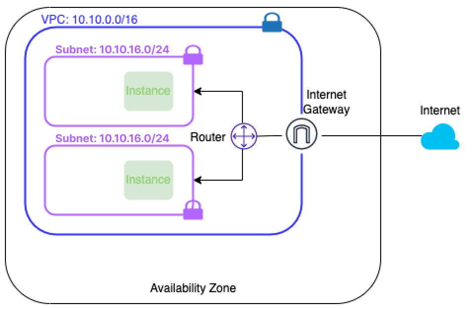

# Virtual Private Cloud (VPC)

Sự phát triển của công nghệ điện toán đám mây dẫn đến những tiêu chuẩn ngày càng cao hơn cho việc ảo hóa hạ tầng mạng, chẳng hạn như các đặc tính mở rộng, bảo mật, độ tin cậy cũng như quyền riêng tư. Nhiều công nghệ đã được sử dụng để tạo ra những môi trường mạng ảo tách biệt.

VPC là một môi trường mạng riêng ảo trên hạ tầng GreenNode, hoạt động độc lập với các mạng riêng ảo khác. Một VPC cung cấp cho người dùng đa dạng các dịch vụ mạng như DHCP, Route Table, Internet Gateway, Floating IP, External Interface, Load Balancing, VPN Gateway… Bạn có toàn quyền quản lý VPC, ví dụ bạn có thể định nghĩa ác subnet khác nhau và cấu hình route table cũng như các gateway.

Hơn thế, bạn có thể kết nối nhiều VPC hoặc giữa VPC và hạ tầng on-premise thông qua chứ năng VPC Peering và InterConnect để tạo ra môi trường mạng thông suốt giữa các hạ tầng. Bằng cách này bạn có thể di chuyển dễ dàng ứng dụng trên cloud hoặc ở các site khác nhau.

### **Kiến trúc VPC** 

<figure><figcaption></figcaption></figure>

VPC là tập hợp nhiều subnet có cùng không gian routing, mỗi VPC được định nghĩa bằng 1 không gian routing riêng biệt. Các Subnets được tách biệt với nhau bằng kỹ thuật tunneling.

* Gói tin truyền giữa các máy chủ ảo được đóng gói và truyền tải xuyên qua mạng vậy lý
* Gói tin giữa các máy chủ ảo thuộc các VPC khác nhau sẽ không thể giao tiếp với nhau do khác nhau về routing space.

GreenNode phát triển tính năng VPC dựa trên các công nghệ như tunneling và Software Defined Network (SDN)

### **VPC và Subnet CIDR blocks** 

Trong môi trường này, cần ít nhất 1 VPC và 1 subnet trong VCP để bắt đầu việc cấp phát các tài nguyên máy chủ ảo khác.

Mỗi VPC được định nghĩa bằng 1 dãy CIDR có subnet mask /16, trong đó chứa các subnet là các dãy CIDR/24 con của CIDR/16 của VPC. Bạn cần chọn các dãy CIDR thuộc các dãy sau đây để định nghĩa VPC cũng như Subnet.

| CIDR blocks                   | Mô tả                                                                                           |
| ----------------------------- | ----------------------------------------------------------------------------------------------- |
| 192.168.0.0/16                | Số lượng địa chỉ IP private sẵn sàng (trừ các IP dành riêng sẵn cho hệ thống): hơn 65K địa chỉ  |
| 172.16.0.0/16 - 172.24.0.0/16 | Số lượng địa chỉ IP private sẵn sàng (trừ các IP dành riêng sẵn cho hệ thống): hơn 500K địa chỉ |
| 10.0.0.0/16 - 10.255.0.0/16   | Số lượng địa chỉ IP private sẵn sàng (trừ các IP dành riêng sẵn cho hệ thống): hơn 16M địa chỉ  |

Một VPC chỉ nằm ở một Availability Zone trong Region. Để mở rộng môi trường mạng của bạn đến các AZ khác, bạn cần sử dụng tính năng VPC Peering. Xem thêm tại {Trang VPC Peering}

### **Bảng route** 

VPC của bạn ngầm định có sẵn một router với một bảng route chính. Tất cả subnet trong cùng VPC được tự động route đến lẫn nhau. Bạn chỉ sử dụng chức năng Route Table để điều khiển các **route tĩnh** nhằm thực hiện điều hướng đường đi trong mạng theo nhu cầu của bạn.

Khi bạn tạo một VPC, nó sẽ được gắn sẵn 1 bảng route chính. Mặc định bảng route này chứa nội dung rỗng và bạn được phép tùy chỉnh thêm các route tĩnh như mong muốn. Route tĩnh sẽ đc ưu tiên ghi đè lên các route học tự động trong trường hợp có sự trùng lắp về route. Xem thêm tại {Trang Route Table}

***

### **Làm việc với VPC** 

#### **Tạo VPC** 

Để tạo VPC, bạn cần thực hiện các bước sau:

1. Đi đến trang GreenNode console và trang quản lý VPC
2. Tạo VPC và định nghĩa dãy CIDR/16 mong muốn

#### **Xem chi tiết VPC và thực hiện tạo/xóa subnet thuộc VPC** 

Để làm việc với subnet thuộc VPC, bạn cần thực hiện các bước:

1. Đi đến trang GreenNode console và trang quản lý VPC
2. Chọn VPC cần thao tác, nhấn View Detail để mở rộng bảng điều khiển ở phía dưới, trong đó có mục quản lý Subnet
3. Chuyển sang mục Subnet để thao tác với Subnet
4. Bạn có thể tạo subnet với dãy CIDR/24 block thuộc dãy CIDR/16 VPC hoặc xóa subnet có sẵn (với điều kiện các tài nguyên sử dụng network liên quan đến subnet này đã được xóa hết)

#### **Xóa VPC** 

Trước khi thực hiện xóa VPC, bạn phải đảm bảo xóa tất cả tài nguyên được tạo liên quan đến VPC này ví dụng như máy chủ ảo, vLB, Internet Gateway…

Bên cạnh đó, hệ thống sẽ tự động thực hiện xóa các thành phần khác của VPC như:

* Network ACLs
* Route tables
* Subnets

Các bước thực hiện:

1. Đi đến trang GreenNode console và trang quản lý VPC
2. Xác định VPC cần xóa, nhấn nút Delete bên phải và xác nhận.
