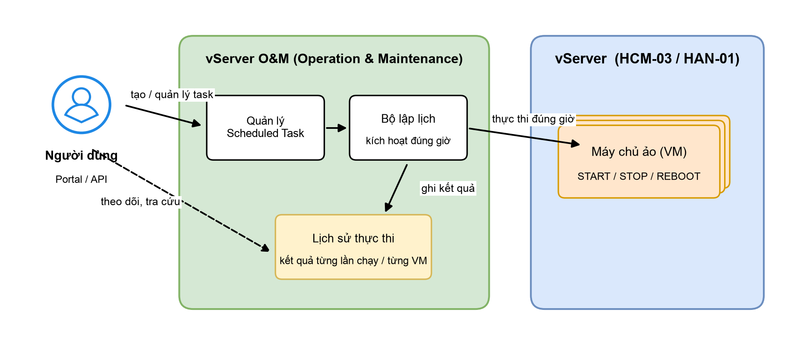

# Lập lịch vận hành (Scheduled O&M)

vServer **Operation and Maintenance (O&M) — Scheduled Task** là tính năng cho phép bạn lên lịch tự động các thao tác vận hành trên máy chủ ảo (VM), thay vì phải thao tác thủ công mỗi ngày. Bạn chỉ cần định nghĩa một lần: làm gì (Khởi động, Tắt hoặc Khởi động lại), trên những VM nào, vào khung giờ nào — hệ thống sẽ tự động thực hiện đúng lịch và ghi lại kết quả từng lần chạy.


**Chú ý:** Đây là phiên bản **Beta** dành cho khách hàng trải nghiệm sớm. Tính năng có thể được điều chỉnh, bổ sung dựa trên phản hồi của bạn trong quá trình sử dụng.


## Lợi ích

* **Tiết kiệm chi phí:** tự động tắt các VM môi trường dev/test ngoài giờ làm việc và bật lại vào sáng hôm sau.
* **Giảm thao tác thủ công:** không cần nhớ giờ, không cần trực để bật/tắt máy chủ hằng ngày.
* **Vận hành nhất quán:** khởi động lại định kỳ các VM chạy ứng dụng cần làm mới tài nguyên.
* **Minh bạch:** mọi lần thực thi đều có lịch sử chi tiết đến từng VM — thành công hay thất bại, lý do là gì.

## Tình huống sử dụng điển hình

| Tình huống                                    | Cách dùng Scheduled Task                                                                     |
| --------------------------------------------- | -------------------------------------------------------------------------------------------- |
| Môi trường dev/test chỉ dùng giờ hành chính   | Tạo 2 task: STOP lúc 19:00 và START lúc 07:00 hằng ngày cho nhóm VM gắn tag `env=dev`         |
| Ứng dụng cần khởi động lại định kỳ            | Tạo task REBOOT hằng ngày vào khung giờ thấp điểm (ví dụ 03:00)                               |
| Batch job chạy đêm trên VM riêng              | START VM lúc 22:00 để chạy job, STOP lúc 05:00 sau khi job kết thúc                           |

## Phạm vi phiên bản Beta

* Thao tác hỗ trợ: **START** (Khởi động), **STOP** (Tắt), **REBOOT** (Khởi động lại).
* Chu kỳ lịch: **hằng ngày (Daily)** theo giờ/phút bạn chọn.
* Khu vực triển khai: region **HCM-03** và **HAN-01**.

## Khái niệm và thuật ngữ

| Thuật ngữ           | Ý nghĩa                                                                                                                          |
| ------------------- | -------------------------------------------------------------------------------------------------------------------------------- |
| **Scheduled Task**  | Một "nhiệm vụ theo lịch": gồm loại thao tác, danh sách đối tượng (VM/tag), lịch chạy và khoảng thời gian hiệu lực.                |
| **Action**          | Hành động thực hiện trên VM: START / STOP / REBOOT.                                                                              |
| **Target**          | VM chịu tác động của task. Chọn trực tiếp theo VM hoặc gián tiếp theo tag.                                                        |
| **Tag**             | Nhãn key/value gắn trên VM (ví dụ `env=dev`). Task theo tag áp dụng cho mọi VM mang tag đó tại thời điểm thực thi.                |
| **Execution**       | Một lần task chạy (theo lịch hoặc thủ công), có trạng thái tổng hợp và kết quả chi tiết từng VM.                                  |
| **Trigger**         | Cách một execution được kích hoạt: **SCHEDULED** (đến giờ theo lịch) hoặc **MANUAL** (bạn bấm "Chạy ngay").                       |
| **Service Account** | Tài khoản dịch vụ hệ thống tự tạo riêng cho bạn khi kích hoạt, dùng để thực thi thao tác theo lịch một cách an toàn.              |
| **Quota**           | Số lượng Scheduled Task tối đa tài khoản của bạn được tạo.                                                                       |
| **Region**          | Khu vực hạ tầng nơi VM đang chạy (HCM-03, HAN-01). Mỗi task thuộc về một region.                                                  |

## Mô hình hoạt động

Bạn định nghĩa task trên Portal; bộ lập lịch của O&M theo dõi và kích hoạt đúng giờ; thao tác được thực hiện trên VM qua vServer; kết quả được ghi vào lịch sử thực thi để bạn tra cứu bất cứ lúc nào.

<figure><figcaption>
Mô hình hoạt động tổng quan của Scheduled O&#x26;M
</figcaption></figure>

Ba điểm đáng chú ý trong thiết kế:

* **Tách bạch giữa "định nghĩa" và "thực thi":** bạn có thể tạo/sửa task bất cứ lúc nào; việc thực thi do hệ thống tự đảm nhiệm đúng giờ đã hẹn.
* **Thực thi thay bạn, dưới danh nghĩa của bạn:** mọi thao tác dùng Service Account riêng của tài khoản bạn với quyền tối thiểu, không dùng tài khoản chung.
* **Mọi thứ đều được ghi lại:** mỗi lần chạy tạo một bản ghi lịch sử với kết quả chi tiết đến từng VM.

## Giới hạn của phiên bản Beta

| Hạng mục          | Hiện tại (Beta)                             | Kế hoạch                                          |
| ----------------- | ------------------------------------------- | ------------------------------------------------- |
| Chu kỳ lịch       | Hằng ngày (Daily)                           | Bổ sung theo giờ / theo tuần / theo tháng         |
| Thao tác          | START / STOP / REBOOT                       | Nghiên cứu bổ sung các thao tác vận hành khác     |
| Phạm vi region    | Mỗi task thuộc 1 region (HCM-03, HAN-01)    | Mở rộng region theo lộ trình sản phẩm             |
